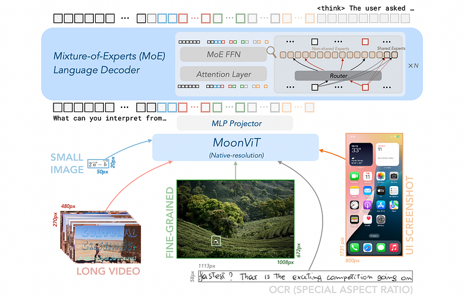
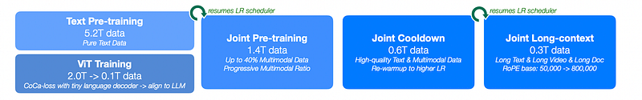
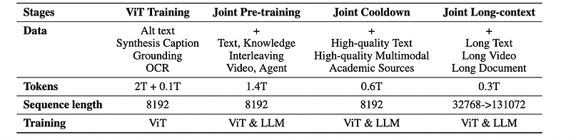
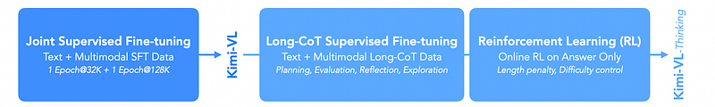
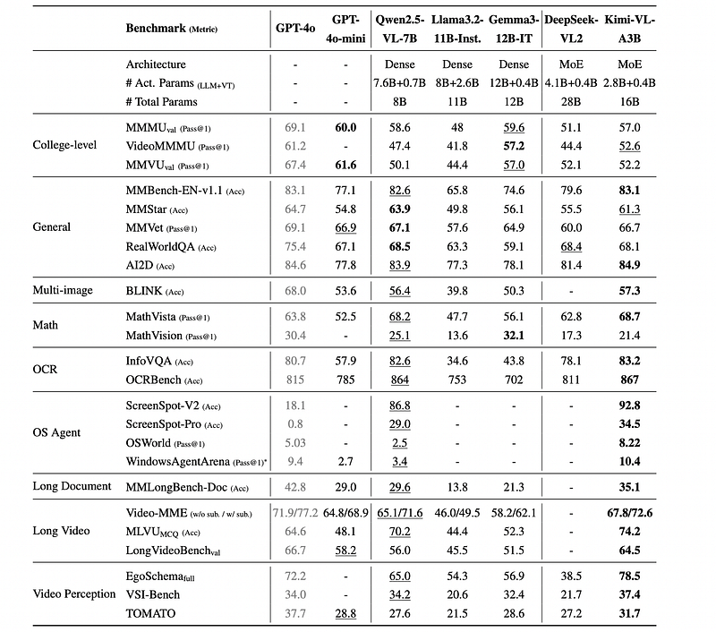
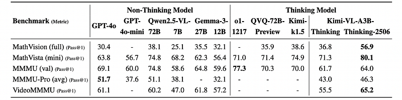
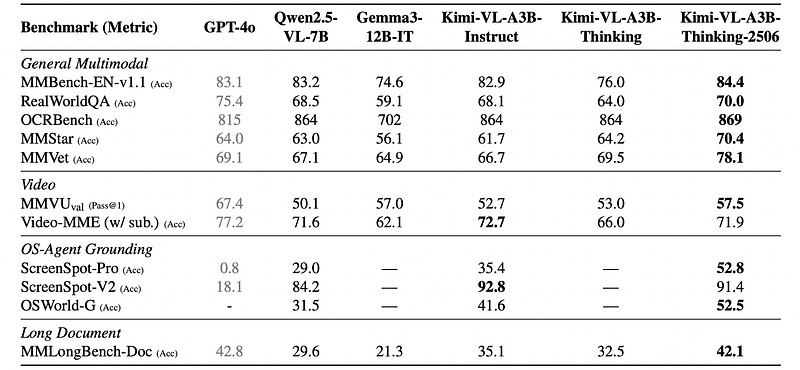

# Papers Explained 458 - Kimi-VL

The architecture of Kimi-VL consists of three parts: a native-resolution vision encoder (MoonViT), an MLP projector, and an MoE language model.

This page ingests the source article into the wiki and connects it to [[Papers Explained Corpus]], [[Large Language Models]], [[Reasoning Models]], [[Vision Language Models]], [[Mixture of Experts]], [[Synthetic Data]].

## Source Metadata

- Source file: `raw/2025-09-22_Papers-Explained-458--Kimi-VL-70c65b517f19.html`
- Source title: Papers Explained 458: Kimi-VL
- Published: 2025-09-22
- Canonical: [https://medium.com/@ritvik19/papers-explained-458-kimi-vl-70c65b517f19](https://medium.com/@ritvik19/papers-explained-458-kimi-vl-70c65b517f19)

## Key Ideas

- A two-layer MLP bridges the vision encoder (MoonViT) and the LLM. First, a pixel shuffle operation compresses the spatial dimension of the image features extracted by MoonViT, performing 2×2 downsampling in the spatial domain and correspondingly expanding the...
- The language model of Kimi-VL utilizes the Moonlight model. Moonlight is an MoE language model with 2.8B activated parameters, 16B total parameters, and an architecture similar to DeepSeek-V3.
- An enhanced Muon optimizer is used, adding weight decay and carefully adjusting the per-parameter update scale. A distributed implementation of Muon is also developed, following the ZeRO-1 optimization strategy.
- Kimi-VL’s pre-training comprises a total of 4 stages consuming 4.4T tokens overall: first, standalone ViT training to establish a robust native-resolution visual encoder, followed by three joint training stages (pre-training, cooldown, and long-context...
- The model is trained with a combination of pure text data and a variety of multimodal data. Training continues from the loaded LLM checkpoint using the same learning rate scheduler, consuming an additional 1.4T tokens.

## Notes

Kimi-VL is an efficient open-source Mixture-of-Experts vision-language model that offers multimodal reasoning, long-context understanding, and strong agent capabilities while activating only 2.8B parameters in its language decoder. Building upon Kimi-VL, Kimi-VL-Thinking-2506 is an advanced long-thinking variant. Developed through long chain-of-thought supervised fine-tuning and reinforcement learning (RL), the latest model exhibits strong long-horizon reasoning capabilities while obtaining robust general abilities.

## Architecture

The architecture of Kimi-VL consists of three parts: a native-resolution vision encoder (MoonViT), an MLP projector, and an MoE language model.

*Figure: The model architecture of Kimi-VL and Kimi-VL-Thinking.*

MoonViT

MoonViT, the vision encoder of Kimi-VL, is designed to natively process images at their varying resolutions, eliminating the need for complex sub-image splitting and splicing operations, as employed in LLaVA-OneVision. Images are divided into patches, flattened, and sequentially concatenated into 1D sequences, incorporating the packing method from NaViT. MoonViT is initialized from and continually pre-trained on SigLIP-SO-400M, which originally employs learnable fixed-size absolute positional embeddings to encode spatial information. While these original position embeddings are interpolated to better preserve SigLIP’s capabilities, they become increasingly inadequate as image resolution increases. To address this limitation, 2D rotary positional embedding (RoPE) is incorporated across the height and width dimensions, which improves the representation of fine-grained positional information, especially in high-resolution images. These two positional embedding approaches work together to encode spatial information for the model and seamlessly integrate with the flattening and packing procedures. This integration enables MoonViT to efficiently process images of varying resolutions within the same batch.

MLP Projector

A two-layer MLP bridges the vision encoder (MoonViT) and the LLM. First, a pixel shuffle operation compresses the spatial dimension of the image features extracted by MoonViT, performing 2×2 downsampling in the spatial domain and correspondingly expanding the channel dimension. The pixel-shuffled features are then fed into a two-layer MLP to project them into the dimension of LLM embeddings.

Mixture-of-Experts Language Model

The language model of Kimi-VL utilizes the Moonlight model. Moonlight is an MoE language model with 2.8B activated parameters, 16B total parameters, and an architecture similar to DeepSeek-V3.

### Muon Optimizer

An enhanced Muon optimizer is used, adding weight decay and carefully adjusting the per-parameter update scale. A distributed implementation of Muon is also developed, following the ZeRO-1 optimization strategy. This achieves optimal memory efficiency and reduced communication overhead while preserving the algorithm’s mathematical properties.

## Pre-Training Stages

*Figure: The pre-training stages of Kimi-VL.*

*Figure: Overview of training stages: data composition, token volumes, sequence lengths, and trainable components.*

Kimi-VL’s pre-training comprises a total of 4 stages consuming 4.4T tokens overall: first, standalone ViT training to establish a robust native-resolution visual encoder, followed by three joint training stages (pre-training, cooldown, and long-context activation) that simultaneously enhance the model’s language and multimodal capabilities.

### ViT Training Stages

The MoonViT is trained on image-text pairs, where the text components consist of a variety of targets: image alt texts, synthetic captions, grounding bboxes, and OCR texts. The training incorporates two objectives: a SigLIP loss Lsiglip (a variant of contrastive loss) and a cross-entropy loss Lcaption for caption generation conditioned on input images. the final loss function is formulated as L= Lsiglip+ λLcaption, where λ= 2. Specifically, the image and text encoders compute the contrastive loss, while the text decoder performs next-token prediction (NTP) conditioned on features from the image encoder. Both encoders are initialized with SigLIP SO-400M weights and a progressive resolution sampling strategy is implemented to gradually allow larger size; the text decoder is initialized from a tiny decoder-only language model. After training the ViT with 2T tokens, MoonViT is aligned to the MoE language model using another 0.1T tokens, where only MoonViT and MLP projector are updated. This alignment stage significantly reduces the initial perplexity of MoonViT embeddings in the language model, allowing a smoother joint pre-training stage.

### Joint Pre-training Stage

The model is trained with a combination of pure text data and a variety of multimodal data. Training continues from the loaded LLM checkpoint using the same learning rate scheduler, consuming an additional 1.4T tokens. The initial steps utilize solely language data, after which the proportion of multimodal data gradually increases.

### Joint Cooldown Stage

The model is continued trained with high-quality language and multimodal datasets to ensure superior performance. The incorporation of synthetic data during the cooling phase yields significant performance improvements, particularly in mathematical reasoning, knowledge-based tasks, and code generation. The general text components of the cooldown dataset are curated from high-fidelity subsets of the pre-training corpus. For math, knowledge, and code domains, a hybrid approach is employed: utilizing selected pre-training subsets while augmenting them with synthetically generated content. Specifically, existing mathematical knowledge and code corpora are used as source material to generate question-answer (QA) pairs through a proprietary language model, implementing rejection sampling techniques to maintain quality standards. These synthesized QA pairs undergo comprehensive validation before being integrated into the cooldown dataset. For the multimodal part, in addition to the two strategies as employed in text cooldown data preparation, i.e. question-answer synthesis and high-quality subset replay, to allow more comprehensive visual-centric perception and understanding, a variety of academic visual or vision-language data sources are filtered and rewritten to QA pairs.

### Joint Long-context Activation Stage

The context length of the model is extended from 8192 (8K) to 131072 (128K), with the inverse frequency of its RoPE embeddings reset from 50,000 to 800,000. The joint long-context stage is conducted in two sub-stages, where each one extends the model’s context length by four times. For data composition, the ratio of long data to 25% is filtered and upsampled in each sub-stage, while the remaining 75% tokens are used to replay shorter data in its previous stage. Similar to cooldown data, a small portion of QA pairs is synthesized to augment the learning efficiency of long-context activation.

## Post-Training Stages

*Figure: The post-training stages of Kimi-VL and Kimi-VL-Thinking.*

### Joint Supervised Fine-tuning (SFT)

The base model of Kimi-VL is fine-tuned with instruction-based fine-tuning to enhance its ability to follow instructions and engage in dialogue, culminating in the creation of the interactive Kimi-VL model. The language model, MLP projector, and vision encoder are optimized using a mixture of pure-text and vision-language SFT data. Supervision is applied only to answers and special tokens, with system and user prompts being masked. Additionally, to guarantee the model’s comprehensive proficiency in dialogue, a mix of multimodal data and pure text dialogue data used in Moonlight is incorporated, ensuring its versatility across various dialogue scenarios.

The model is first trained at the sequence length of 32k tokens for 1 epoch, followed by another epoch at the sequence length of 128k tokens. In the first stage (32K), the learning rate decays from 2 ×10−5 to 2 ×10−6, before it re-warmups to 1 ×10−5 in the second stage (128K) and finally decays to 1 ×10−6. To improve training efficiency, multiple training examples are packed into each single training sequence.

### Long-CoT Supervised Fine-Tuning

A refined RL prompt set is employed to construct a small yet high-quality long-CoT warmup dataset. This dataset contains accurately verified reasoning paths for both text and image inputs. This approach resembles rejection sampling but focuses on generating long-CoT reasoning paths through prompt engineering. The resulting warmup dataset is designed to encapsulate key cognitive processes that are fundamental to human-like reasoning, such as:

- planning: where the model systematically outlines steps before execution;

- evaluation, involving critical assessment of intermediate steps;

- reflection, enabling the model to reconsider and refine its approach;

- exploration, encouraging consideration of alternative solutions.

### Reinforcement Learning

A variant of online policy mirror descent is adopted as the RL algorithm, which iteratively refines the policy model πθ to improve its problem-solving accuracy. During the i-th training iteration, the current model is treated as a reference policy model and the following objective is optimized, regularized by relative entropy to stabilize policy updates:

where r is a reward model that justifies the correctness of the proposed answer y for the given problem x, by assigning a value r(x,y,y∗) ∈ {0,1}based on the ground truth y∗, and τ > 0 is a parameter controlling the degree of regularization.

To enhance RL training efficiency, a length-based reward is implemented to penalize excessively long responses, mitigating the overthinking problem where the model generates redundant reasoning chains. Besides, two sampling strategies including curriculum sampling and prioritized sampling are employed, which leverage difficulty labels and per-instance success rates to focus training effort on the most pedagogically valuable examples, thereby optimizing the learning trajectory and improving training efficiency.

## Data Construction

### Pre-Training Data

The multimodal pre-training corpus is built from high-quality data across six categories: caption, interleaving, OCR, knowledge, video, and agent, along with a dedicated text corpus. It employs multimodal data processing pipelines for filtering, synthesis, and deduplication to ensure quality, preserve language model capabilities, and align knowledge across diverse modalities.

Caption Data:

- Purpose: Provides fundamental modality alignment and broad world knowledge, enhancing learning efficiency.

- Sources: Integrates open-source (Chinese and English) and substantial in-house datasets.

- Quality Control: Strictly limits synthetic caption data to mitigate hallucination, uses a rigorous pipeline to avoid duplication, maintains high image-text correlation, and varies image resolution during training.

Image-text Interleaving Data:

- Benefits: Boosts multi-image comprehension, offers detailed image knowledge, enables longer multimodal context learning, and helps maintain language abilities.

- Sources: Includes open-source datasets and large-scale in-house data from textbooks, webpages, and tutorials.

- Synthesis: Synthesizing interleaving data improves multimodal LLM performance by preserving text knowledge.

- Quality Control: Undergoes standard filtering, deduping, quality control, and a data reordering procedure to ensure correct image and text sequence.

OCR Data:

- Purpose: Develops robust Optical Character Recognition capabilities for better alignment with human values.

- Sources: Diverse, ranging from open-source to in-house datasets, encompassing clean and augmented images, and single-page to multi-page inputs. In-house data covers multilingual text, dense layouts, web content, and handwritten samples.

- Capabilities: Equipped to handle various optical image types (figures, tables, geometry diagrams, mermaid plots, natural scene text) following OCR 2.0 principles.

- Augmentation: Extensive data augmentation (rotation, distortion, color adjustments, noise addition) enhances robustness.

- Multi-page OCR: Collects and converts large volumes of in-house multi-page OCR data to activate understanding of long documents (e.g., academic papers, scanned books).

Knowledge Data:

- Concept: A comprehensive repository of human knowledge from diverse sources, analogous to text pre-training data but multimodal.

- Examples: Includes carefully curated geometry data for visual reasoning.

- Structure: Adheres to a standardized taxonomy for balanced content diversity.

- Processing: Utilizes a layout parser and an OCR model to process content from textbooks, research papers, and academic materials, alongside filtered internet-based and external resources.

- Challenge/Solution: Addresses the issue of infographics causing models to focus solely on OCR-based information by developing an additional pipeline to capture purely textual information embedded within images.

Agent Data:

- Purpose: Significantly enhances the model’s grounding and planning capabilities for agent tasks.

- Sources: Publicly available data and an in-house platform for managing virtual machine environments.

- Collection: Employs heuristic methods to collect screenshots and corresponding action data within virtual environments.

- Processing: Data is processed into dense grounding and continuous trajectory formats.

- Action Space: Categorized by Desktop, Mobile, and Web environments.

- Enhancements: Collects icon data to strengthen understanding of GUI icons and human-annotated computer-use trajectories with synthesized Chain-of-Thought (Aguvis) for multi-step desktop tasks (Ubuntu and Windows).

Video Data:

- Purpose: Enables understanding of long-context image sequences (hour-long videos) and perception of fine-grained spatio-temporal correspondence in short video clips.

- Stages: Incorporated during pre-training, cooldown, and long-context activation stages.

- Sources: Diverse resources, including open-source datasets and in-house web-scale video data, spanning varying durations, scenes, and tasks (e.g., video description, video grounding).

- Long Videos: A pipeline is designed to produce dense captions for long videos.

- Quality Control: Strictly limits the proportion of synthetic dense video description data to reduce hallucination risk.

Text Data:

- Source: Directly utilizes data from Moonlight J. Liu et al. 2025a.

- Domains: Encompasses English, Chinese, Code, Mathematics & Reasoning, and Knowledge.

- Quality Control: Employs sophisticated filtering and quality control mechanisms for each domain, with rigorous individual validation for each data source.

- Sampling Strategy: Empirically determined through extensive experimentation, upsampling high-value subsets while maintaining a balanced representation of other document types for diversity and generalization.

### Instruction Data

This stage focuses on enhancing the model’s conversational abilities and instruction-following capabilities across diverse domains.

Non-reasoning Tasks: For tasks like chart interpretation, agent grounding, OCR, image-grounded conversations, question-answering, writing, and text processing:

- A seed dataset is initially constructed through human annotation to train a seed model.

- The seed model generates multiple responses to diverse prompts.

- Annotators rank and refine the top-ranked response to create the final version.

Reasoning Tasks: For tasks such as visual coding, visual reasoning, and math/science problems:

- Rejection sampling is used to expand the Supervised Fine-Tuning (SFT) dataset, leveraging rule-based and model-based verifications for accuracy and efficiency.

Composition: The complete vanilla SFT dataset comprises approximately a 1:1 ratio of text tokens to image tokens.

### Reasoning Data

Reasoning data is meticulously constructed to activate and enhance the model’s multimodal reasoning capabilities during both long-Chain-of-Thought (CoT) supervised fine-tuning and reinforcement learning stages. A generation pipeline resembling rejection sampling (RS) and prompt engineering is developed to collect and synthesize high-quality long-CoT data.

- A collection of QA data with ground truth annotations requiring multi-step reasoning (e.g., mathematical problem-solving, domain-specific VQA) is assembled.

- Multiple detailed reasoning trajectories are sampled for each question using a powerful long-CoT model, Kimi k1.5, with curated reasoning prompts.

- In rejection sampling, true labels and model predictions are fed into an off-the-shelf reward model for judgment. Wrong Chain-of-Thought responses are filtered out based on model evaluation and rule-based rewards to improve data quality.

## Evaluation

*Figure: Performance of Kimi-VL against proprietary and open-source efficient VLMs.*

- Kimi-VL demonstrates competitive or superior performance across multiple benchmarks despite having a more parameter-efficient architecture (2.8B+0.4B activated parameters) compared to larger models like GPT-4o, Llama-3.2–11B-Inst., and Gemma3–12B-IT.

- It outperforms DeepSeek-VL2 on most benchmarks with significantly fewer parameters (activated: 2.8B vs 4.5B; total: 16B vs 28B) and Qwen2.5-VL-7B on 19 out of 24 benchmarks with 2.59x fewer activated parameters.

College-level Academic Problems:

- Kimi-VL achieves 57.0% on MMMU validation, outperforming DeepSeek-VL2 and comparable to Qwen2.5-VL-7B and Gemma-3–12B-IT, demonstrating effective balance between parameter efficiency and academic reasoning.

- On video college-level problems, it significantly outperforms Qwen2.5-VL-7B and DeepSeek-VL2, showing reasonable university-level understanding.

General Visual Ability:

- Kimi-VL exhibits strong general visual understanding, achieving 83.1% on MMBench-EN-v1.1 (on par with GPT-4o) and 84.9% on AI2D (surpassing all compared models including GPT-4o).

- It shows promising multi-image reasoning capabilities with 57.3% on the BLINK benchmark, surpassing several competitors.

Mathematical Reasoning:

- Kimi-VL demonstrates strong mathematical reasoning, achieving 68.7% on MathVista, outperforming all compared models including GPT-4o and Qwen2.5-VL-7B.

Document Understanding and OCR:

- Kimi-VL excels in document understanding and OCR, achieving 83.2% on InfoVQA (outperforming GPT-4o) and 86.7% on OCRBench (surpassing all other models including GPT-4o-mini).

Agent Grounding and Multi-turn Agent Interaction:

- Kimi-VL shows strong single-step grounding (92.0% on ScreenSpot-V2, 34.5% on ScreenSpot-Pro) and multi-step agent interaction abilities (8.22% on OSWorld, 10.4% on WindowsAgentArena), outperforming GPT-4o in these areas.

Long Document and Long Video Understanding:

- Kimi-VL demonstrates competitive performance in long-form content understanding, achieving 35.1% on MMLongBench-Doc (outperforming GPT-4o-mini and Qwen2.5-VL-7B).

- It outperforms all efficient VLMs on Video-MME (especially without subtitles) and achieves state-of-the-art (SoTA) among open-source models on MLVU MCQ (74.2%), surpassing GPT-4o.

Egocentric and Fine-grained Video Perception:

- Kimi-VL shows strong performance in nuanced video perception tasks, significantly outperforming GPT-4o and Qwen2.5-VL-7B on EgoSchema full set (78.5%), VSI-Bench (37.4%), and TOMATO (31.7%).

A reasoning extension is conducted to empower Kimi-VL to reason with CoT and present a long-thinking version of the model, Kimi-VL-Thinking, through long-CoT activation and reinforcement learning.

*Figure: Performance of Kimi-VL-Thinking and Kimi-VL-Thinking-2506 on multimodal reasoning benchmarks.*

- Kimi-VL-Thinking significantly improves over the base Kimi-VL model, with gains of 2.6% on MathVista, 4.7% on MMMU, and 15.4% on MathVision, demonstrating its capability to leverage test-time computation for deeper reasoning.

- It achieves 71.3% on MathVista (outperforming GPT-4o), 61.7% on MMMU (surpassing GPT-4o-mini), and 36.8% on MathVision (exceeding GPT-4o and Gemma-3–27B-IT), accomplishing these results with only 3B activated parameters.

While Kimi-VL-A3B-Thinking shows excellent thinking abilities on hard reasoning tasks, Kimi-VL-A3B-Thinking-2506, a new reasoning variant is also provided that is not only smarter, but integrates key abilities of Kimi-VL-A3B-Instruct (perception, video, long-document, and OS-agent abilities) into this thinking model.

*Figure: Performance of Kimi-VL-A3B-Thinking-2506 on multimodal benchmarks that do not require extensive reasoning.*

- This variant significantly improves reasoning efficiency and reduces token consumption (e.g., ~20% reduction in output token length on MMMU-val and MathVision).

- It achieves substantial gains on reasoning benchmarks: 56.9% on MathVision (+20.1% over original Kimi-VL-Thinking), 80.1% on MathVista (+8.4%), 46.3% on MMMU-Pro (+3.2%), and 64.0% on MMMU (+2.1%).

- It demonstrates stronger visual perception capabilities, achieving competitive or superior results on general multimodal understanding benchmarks compared to the non-thinking variant (e.g., 84.4% on MMBench-EN-v1.1, 70.4% on MMStar).

- It establishes new SoTA among open-source models on VideoMMMU (65.2%, 4% better than GPT-4o) and matches GPT-4o on MMLongBench-Doc (42.1%), showing robust ability on broader long-form visual inputs.

- Continual training on MoonViT leads to substantial improvements on high-resolution perception and OS grounding benchmarks (e.g., 52.8% on ScreenSpot-Pro, 52.5% on OSWorld-G).

## Paper

Kimi-VL Technical Report [2504.07491](https://arxiv.org/abs/2504.07491)

## Figures

Figures from the Medium HTML export (`raw/2025-09-22_Papers-Explained-458--Kimi-VL-70c65b517f19.html`); local copies under `wiki/assets/papers-explained-458-kimi-vl/` when download succeeded.

| Figure | Caption |
|--------|---------|
|  | Title card: Kimi-VL. |
|  | The model architecture of Kimi-VL and Kimi-VL-Thinking. |
|  | The pre-training stages of Kimi-VL. |
|  | Overview of training stages: data composition, token volumes, sequence lengths, and trainable components. |
|  | The post-training stages of Kimi-VL and Kimi-VL-Thinking. |
|  | Mixture-of-Experts Language Model. |
|  | Performance of Kimi-VL against proprietary and open-source efficient VLMs. |
|  | Performance of Kimi-VL-Thinking and Kimi-VL-Thinking-2506 on multimodal reasoning benchmarks. |
|  | Performance of Kimi-VL-A3B-Thinking-2506 on multimodal benchmarks that do not require extensive reasoning. |
## Related

- [[Papers Explained Corpus]]
- [[Large Language Models]]
- [[Reasoning Models]]
- [[Vision Language Models]]
- [[Mixture of Experts]]
- [[Synthetic Data]]
- [[Papers Explained 457 - Hallucination Tax of Reinforcement Finetuning]]
- [[Papers Explained 459 - FineWeb2]]

#summary #topic
