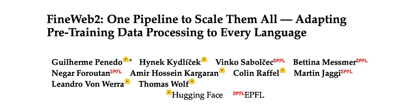
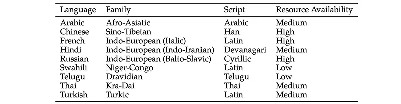
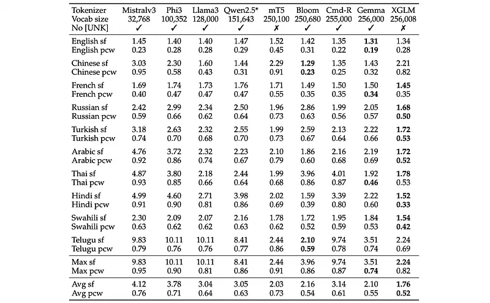
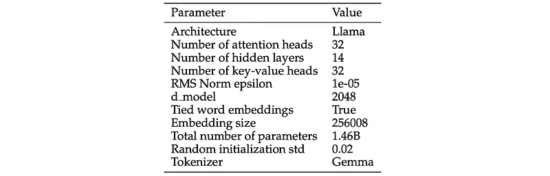
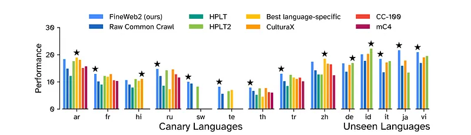

# Papers Explained 459 - FineWeb2

FineWeb2 is a new 20TB (5B document) multilingual dataset covering over 1000 languages. It was created using a new pre-training dataset curation pipeline based on FineWeb that can be automatically adapted to support any language.

This page ingests the source article into the wiki and connects it to [[Papers Explained Corpus]], [[Synthetic Data]], [[Multilingual Models]], [[Document AI]], [[Large Language Models]], [[Embedding and Retrieval]].

## Source Metadata

- Source file: `raw/2025-09-23_Papers-Explained-459--FineWeb2-d9126117600e.md`
- Source title: Papers Explained 459: FineWeb2
- Published: 2025-09-23
- Canonical: [https://medium.com/@ritvik19/papers-explained-459-fineweb2-d9126117600e](https://medium.com/@ritvik19/papers-explained-459-fineweb2-d9126117600e)

## Key Ideas

- The project is available on [GitHub](https://github.com/huggingface/fineweb-2/).
- Given that the experiments target different languages and, in particular, different scripts, the subword fertility and proportion of continued words of different existing open-source tokenizers from leading multilingual LLMs were evaluated on nine canary...
- Subword fertility (sf) is the average number of tokens per “real” text word, measuring how aggressively a tokenizer splits words. The theoretical minimum of 1 would mean the tokenizer vocabulary contains every single word from the reference text.
- Proportion of continued words (pcw) is the ratio of “real” text words encoded with 2 tokens or more, measuring how often a tokenizer splits words. A value of 0 means that the tokenizer never splits and 1 that it always splits.
- From the tokenizers that showed reasonable fertility on nine canary languages, the tokenizer used in Gemma was chosen.

## Notes

FineWeb2 is a new 20TB (5B document) multilingual dataset covering over 1000 languages. It was created using a new pre-training dataset curation pipeline based on FineWeb that can be automatically adapted to support any language. The pipeline includes steps for Language Identification, Deduplication, Filtering, and Dedup-informed upsampling (Rehydration), each of which improves performance. The dataset was created by processing almost 100 Common Crawl snapshots spanning from the summer of 2013 to April 2024.

The project is available on [GitHub](https://github.com/huggingface/fineweb-2/).

## Experimental setup

To assess data quality, training small models and evaluating them on “early-signal” benchmark tasks, i.e., tasks where models perform reasonably well after only a few tens of billions or hundreds of billions of training tokens, allows for confident establishment of comparisons between them. Experiments are conducted on a select set of nine canary languages (i.e., test languages): Arabic, Chinese, French, Hindi, Russian, Swahili, Telugu, Thai, and Turkish, allowing for the evaluation of the impact of each design decision across different language families, scripts, and levels of resource availability, while keeping computational requirements manageable.

*Figure: The 9 canary languages and their families, main script, and resource availability.*

### Tokenizer and model architecture

Given that the experiments target different languages and, in particular, different scripts, the subword fertility and proportion of continued words of different existing open-source tokenizers from leading multilingual LLMs were evaluated on nine canary languages.

- Subword fertility (sf) is the average number of tokens per “real” text word, measuring how aggressively a tokenizer splits words. The theoretical minimum of 1 would mean the tokenizer vocabulary contains every single word from the reference text.

- Proportion of continued words (pcw) is the ratio of “real” text words encoded with 2 tokens or more, measuring how often a tokenizer splits words. A value of 0 means that the tokenizer never splits and 1 that it always splits.

From the tokenizers that showed reasonable fertility on nine canary languages, the tokenizer used in Gemma was chosen.

*Figure: Multilingual Tokenizers Comparison on Wikipedia.*

A similar model architecture setup to FineWeb was used, with a reduced number of layers given the additional embedding parameters due to the larger vocabulary size. The Llama architecture is followed with 14 layers, 32 attention heads, length-2048 sequences, and tied embeddings, for a total of 1.46 billion parameters.

*Figure: Architecture configuration for all models.*

### Baseline datasets

For each language, one model is trained on language-specific data from each reference dataset: CC-100, mC4, CulturaX, and HPLT. Additionally, multiple models are trained on “raw” Common Crawl data (after text extraction and Language Identification, but without any additional filtering or deduplication).

### Selecting evaluation (Fine)tasks

To identify informative evaluation tasks, four key criteria for what are called early-signal tasks are established:

Monotonicity:

- Measures the correlation between evaluation steps and corresponding model scores.

- Calculated as the average Spearman rank correlation across all models.

- Average Monotonicity: ρ = (1 / |M|) * Σ (ρ([s0, s1, …, sn], [m(s0), m(s1), …, m(sn)])) for all m in M

- Spearman Correlation: ρ(x, y) = 1 — (6 * Σ di²) / (n * (n² — 1)), where di = rank(xi) — rank(yi) and n is the number of evaluation steps.

- Criterion: ρ ≥ 0.5

Signal-to-Noise Ratio (SNR):

- Estimates the robustness of a task to training noise.

- Computed using four models trained on unfiltered CommonCrawl data with different random seeds (seed-3, seed-4, seed-5, seed-6).

- The set of these four models is referred to as MC.

- Mean Score (Signal): µ*s = (1 / |MC|) * Σ m(s) for all m in MC

- Standard Deviation (Noise): σs = sqrt((1 / |MC|) * Σ (m(s) — µ*s)²) for all m in MC

- Overall Task SNR: SNR = (1 / n) * Σ (µ*s / σs) for all s from 0 to n

- Criterion: SNR ≥ 20, except for generative tasks, which are allowed a lower SNR due to their inherent noisiness.

Non-Random Performance:

- Assesses whether task results are not just due to random noise.

- Looks at the best score at the last evaluation step among models from M.

- Maximum Improvement over Random Baseline: maxd = max(m(n) — b) for all m in M

- Terminal Variance: σend = (1 / 5) * Σ σs for all s from n-4 to n

- Non-Randomness Score: non randomness = maxd / σend

- Criterion: non randomness ≥ 3

Ordering Consistency:

- Computes how consistently models are ordered as training progresses.

- Calculates the average Kendall Tau-a between model rankings at consecutive steps in the second half of training (ignoring the first 15 billion tokens).

- Kendall Tau-a: τa(x, y) = (C — D) / (n choose 2) where C and D are the number of concordant and discordant pairs between rankings x and y.

- Ordering Consistency: (1 / |P|) * Σ τa(r(si), r(si+1)) for all (si, si+1) in P, where P is the set of consecutive step pairs in the latter half of training, and r(s) is the ranking of model scores in step s.

- While considered for selection, a reliable threshold for this criterion could not be determined, so it was only used for observational reasons.

An in-depth analysis of existing evaluation tasks resulted in a final suite of 84 selected benchmarks out of 197 tested across nine canary languages.

## The FineWeb2 pipeline

The first few processing steps used in the creation of the English-only FineWeb dataset are applied: downloaded WARC (web archive) files from all available (almost 100) CommonCrawl snapshots, applied URL filtering using a blocklist to remove adult content, and used trafilatura to extract text content from the HTML in the WARC files.

The subsequent steps involved adapting FineWeb’s filtering and deduplication components, focusing on data excluded during FineWeb’s language filtering (which uses FastText with a 0.65 threshold for English).

### Language Identification (LID)

LID Tool Selection: Transformer-based LID classifiers are too slow for large-scale use. Common LID classifiers include CLD3, FT176, OpenLID, and GlotLID. GlotLID is preferred due to its support for a larger number of languages and its ability to separate different scripts of the same language. It also includes special labels for non-supported scripts and “noise” documents.

Performance Comparison: GlotLID outperforms FT176 on higher-resource languages but is slightly behind on lower-resource languages. The increased language coverage of GlotLID is considered more valuable.

Confidence Thresholds: Using a single confidence threshold for all languages is not ideal due to inherent differences in prediction confidence. The context describes a data-driven approach to determine appropriate thresholds per language by training models at different confidence thresholds and analyzing the results.

Language-Specific Thresholds: Some languages, like Arabic and Russian, prefer high thresholds, while others, like Swahili, perform best with lower thresholds.

Threshold Definition: Filtering thresholds are defined as one standard deviation below the median of the score distributions, clipped to the range [0.3, 0.9]. This formula selects values within the highest-performing threshold regions for most languages.

### Deduplication

The MinHash method is used to find clusters of similar documents that are then filtered to keep a single document per cluster. The same MinHash hyperparameters used for FineWeb (14 buckets of size 8, with 5-grams) are used and deduplicated globally per language. The number of documents that were in the cluster is recorded to explore duplication-aware upsampling schemes.

While improved performance is observed across languages, the impact of deduplication seems to vary significantly from language to language, without any discernable relationship to the language’s resource level.

### Filtering recipe

Standard filtering rules (e.g., based on word length, repetition, punctuation) are often designed for a single language like English and do not generalize well. For example, Chinese words have fewer characters on average than German words.

To this end, starting with the filtering rules from the FineWeb dataset, the thresholds are adapted for these rules for each language. To do this, language-specific statistics are collected from reference corpora (Wikipedia, Glotlid-Corpus ,Language-filtered data from Common Crawl) to understand the distribution of different metrics.

Stopword Filtering

The absence of common words (stopwords) in a document can indicate low-quality content like boilerplate text, gibberish, or text whose language was misidentified.

Instead of using a fixed number of top words, stopwords were defined as words that exceed a specific frequency threshold in reference datasets. This method better handles linguistic variations, such as German having three common words for “the” (der, die, das) where English has one.

Some high-frequency “words” were non-alphabetic and had to be manually excluded. For some languages, reference data (especially Wikipedia) was contaminated with English text, causing English words to be incorrectly identified as native stopwords.

Following the Gopher filters, each document is required to contain at least 2 words from its language’s stopword list to be kept.

Precision Filtering for Low-Resource Languages

Corpora for low-resource languages are often heavily contaminated with text from closely related, high-resource languages (e.g., over 90% contamination). This is due to low precision in language identification (LID).

For each language, a list of words was created that are common in that language but rare in others. Contamination was defined as the percentage of documents in a corpus that do not contain any of these high-affinity words.For languages with over 10% contamination, documents without any high-affinity words were removed.

To avoid being too strict (e.g., for English-based pidgins), a document removed by the wordlist filter was kept if its URL contained language-specific terms (like the language code, name, or country domain).

### Rehydration

Rehydration aims to counteract the potential negative effects of aggressive deduplication, which might remove unique but high-entropy and low-quality documents, or artificially upsample low-quality unique documents.

By saving the original size of duplicate clusters in metadata, specific documents can be selectively upsampled (“rehydrated”) to achieve more performant models. Uses results from the filtering stage as a proxy for cluster size quality.

- Calculates the global filtering rate (overall percentage of documents removed).

- Calculates individual filtering rates for each MinHash cluster size.

Weights are set based on removal rates, reflecting quality.

- A weight of 10 (repeat 10 times) is assigned to the cluster size with the smallest removal rate (highest quality).

- A weight of 1 is assigned to every cluster size whose removal rate is above the global removal rate (lower quality).

- For remaining cluster sizes, weights are determined by simple interpolation between these two endpoints.

## Validating and Applying the FineWeb2 Pipeline

The pipeline is applied to 96 Common Crawl snapshots, spanning the summer of 2013 to April 2024, to produce the FineWeb2 dataset, comprising 20 terabytes of text content covering a total of 1,868 language-script pairs, of which 1,226 have over 100 documents, 474 more than 1 thousand documents, and 203 at least 10 thousand documents. In addition to the filtered dataset, the preliminary version before filtering is also released to facilitate further research into alternative filtering methods. As FineWeb2 itself does not include English, for full language coverage it is recommended to complement it with FineWeb, whose pipeline inspired FineWeb2.

To confirm the benefit of FineWeb2’s adaptive pipeline approach, FineWeb2 is compared with other non-English multilingual datasets.

- Canary-language models were trained for 29 billion tokens.

- Unseen-language models were trained for 100 billion tokens.

- All evaluated models used the same architecture, hyperparameters.

*Figure: High-level performance comparison of FineWeb2 to other multilingual and language-specific datasets.*

- FineWeb2 produced more performant models than prior multilingual datasets on 11 out of 14 languages considered.

- In some cases, FineWeb2 performed worse than language-specific datasets, highlighting that hand-designed pipelines by language experts can still outperform the adaptive approach.

- These trends held for both canary and held-out datasets, supporting the utility of the 1,000+ language-specific datasets generated.

- Overall, results confirm the effectiveness and generalization of the consistent-but-adaptable cross-lingual curation pipeline.

## Paper

FineWeb2: One Pipeline to Scale Them All — Adapting Pre-Training Data Processing to Every Language [2506.20920](https://arxiv.org/abs/2506.20920)

## Figures

Figures from the Medium HTML export (`raw/2025-09-23_Papers-Explained-459--FineWeb2-d9126117600e.md`); local copies under `wiki/assets/papers-explained-459-fineweb2/` when download succeeded.

| Figure | Caption |
|--------|---------|
|  | Title card: FineWeb2. |
|  | The 9 canary languages and their families, main script, and resource availability. |
|  | Multilingual Tokenizers Comparison on Wikipedia. |
|  | Architecture configuration for all models. |
|  | High-level performance comparison of FineWeb2 to other multilingual and language-specific datasets. |
## Related

- [[Papers Explained Corpus]]
- [[Synthetic Data]]
- [[Multilingual Models]]
- [[Document AI]]
- [[Large Language Models]]
- [[Embedding and Retrieval]]
- [[Papers Explained 458 - Kimi-VL]]
- [[Papers Explained 460 - rStar2-Agent]]

#summary #topic
