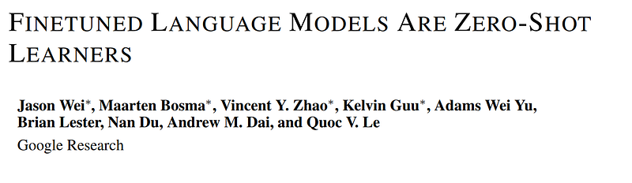
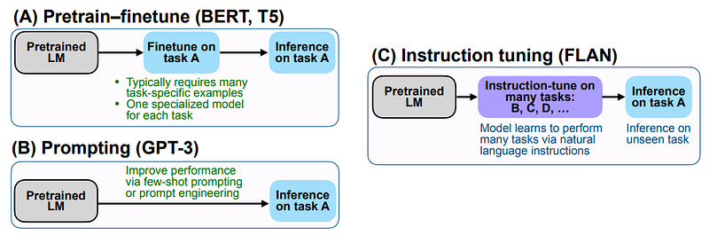
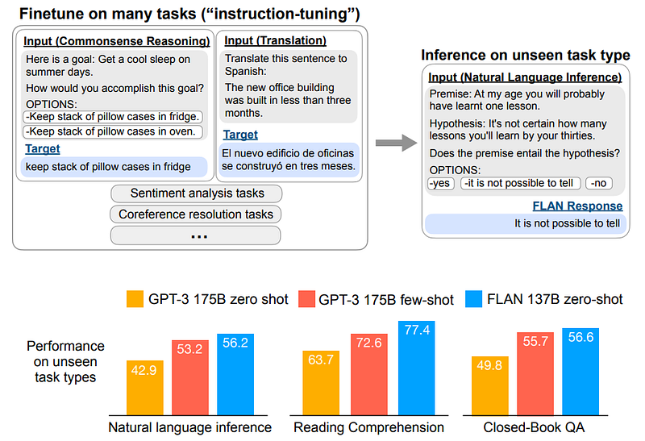
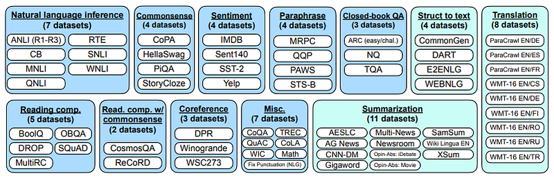
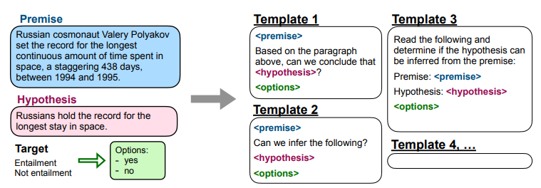
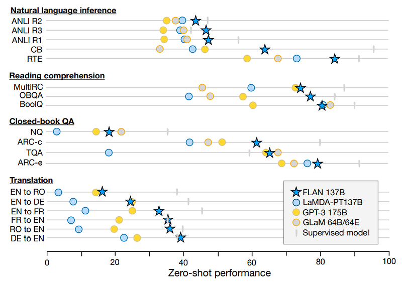
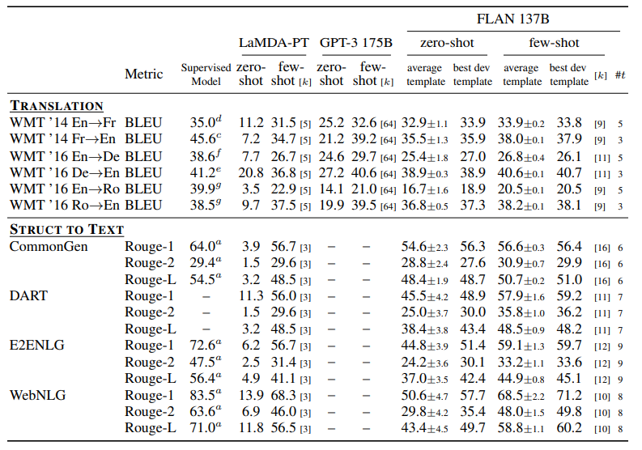
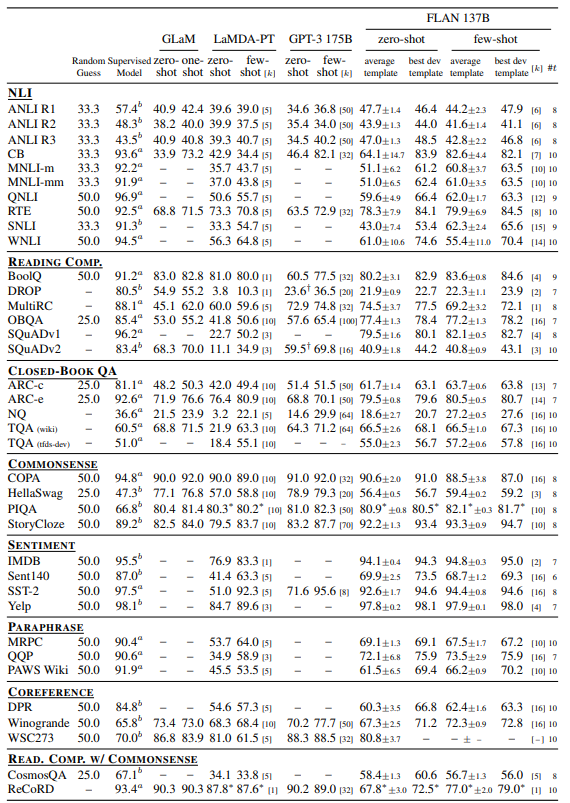

# Papers Explained 46 - FLAN

This paper explores a simple method for improving the zero-shot learning abilities of language models, and shows that instruction tuning (finetuning language models on a collection of datasets described via instructions) substantially improves zero-shot performance on unseen tasks.

This page ingests the source article into the wiki and connects it to [[Papers Explained Corpus]], [[Large Language Models]], [[Synthetic Data]], [[Reasoning Models]], [[Multilingual Models]], [[Evaluation and Benchmarks]], [[Supervised Fine-Tuning]].

## Source Metadata

- Source file: `raw/2023-07-03_Papers-Explained-46--FLAN-1c5e0d5db7c9.html`
- Source title: Papers Explained 46: FLAN
- Published: 2023-07-03
- Canonical: [https://medium.com/@ritvik19/papers-explained-46-flan-1c5e0d5db7c9](https://medium.com/@ritvik19/papers-explained-46-flan-1c5e0d5db7c9)

## Key Ideas

- This paper explores a simple method for improving the zero-shot learning abilities of language models, and shows that instruction tuning (finetuning language models on a collection of datasets described via instructions) substantially improves zero-shot...
- A 137B parameter pretrained language model is instruction tuned on over 60 NLP datasets verbalized via natural language instruction templates. This instruction-tuned model called FLAN, is then evaluated on unseen task types.
- The motivation for instruction tuning is to improve the ability of language models to respond to NLP instructions.
- We aggregate 62 text datasets that are publicly available, including both language understanding and language generation tasks, into a single mixture.
- For each dataset, we manually compose ten unique templates that use natural language instructions to describe the task for that dataset.

## Notes

This paper explores a simple method for improving the zero-shot learning abilities of language models, and shows that instruction tuning (finetuning language models on a collection of datasets described via instructions) substantially improves zero-shot performance on unseen tasks.

A 137B parameter pretrained language model is instruction tuned on over 60 NLP datasets verbalized via natural language instruction templates. This instruction-tuned model called FLAN, is then evaluated on unseen task types.

*Figure: Comparing instruction tuning with pretrain–finetune and prompting*

## Instruction Fine Tuning

*Figure: Top: an overview of instruction tuning and FLAN. Instruction tuning finetunes a pretrained language model on a mixture of tasks phrased as instructions. At inference time, we evaluate on an unseen task type; for instance, we could evaluate the model on natural language inference (NLI) when no NLI tasks were seen during instruction tuning. Bottom: performance of zero-shot FLAN, compared with zero-shot and few-shot GPT-3, on three unseen task types where instruction tuning improved performance substantially out of ten we evaluate. NLI datasets: ANLI R1–R3, CB, RTE. Reading comprehension datasets: BoolQ, MultiRC, OBQA. Closed-book QA datasets: ARC-easy, ARC-challenge, NQ, TriviaQA*

The motivation for instruction tuning is to improve the ability of language models to respond to NLP instructions. The idea is that by using supervision to teach an LM to perform tasks described via instructions, the LM will learn to follow instructions and do so even for unseen tasks. To evaluate performance on unseen tasks, we group datasets into clusters by task type and hold out each task cluster for evaluation while instruction tuning on all remaining clusters.

### Task and Templates

We aggregate 62 text datasets that are publicly available, including both language understanding and language generation tasks, into a single mixture. Each dataset is categorized into one of twelve task clusters, for which datasets in a given cluster are of the same task type.

*Figure: Datasets and task clusters used in this paper (NLU tasks in blue; NLG tasks in teal)*

For each dataset, we manually compose ten unique templates that use natural language instructions to describe the task for that dataset. While most of the ten templates describe the original task, to increase diversity, for each dataset we also include up to three templates that “turned the task around”.

*Figure: Multiple instruction templates describing a natural language inference task*

### Evaluation Splits

We use a more conservative definition that leverages the task clusters. In this work, we only consider dataset D unseen at evaluation time if no datasets from any task clusters that D belongs to were seen during instruction tuning. For instance, if D is an entailment task, then no entailment datasets appeared in instruction tuning, and we instruction-tuned on all other clusters.1 Hence, to evaluate zero-shot FLAN on c task clusters, we instruction tune c models, where each model holds out a different task cluster for evaluation.

## Training Details

### Model architecture and pretraining

In our experiments, we use LaMDA-PT, a dense left-to-right, decoder-only transformer language model of 137B parameters. This model is pretrained on a collection of web documents (including those with computer code), dialog data, and Wikipedia tokenized into 2.49T BPE tokens with a 32k vocabulary using the SentencePiece. Around 10% of the pretraining data were non-English.

### Instruction tuning procedure

Our instruction tuning pipeline mixes all datasets and randomly samples from each dataset. To balance the different sizes of datasets, we limit the number of training examples per dataset to 30k and follow the examples-proportional mixing scheme with a mixing rate maximum of 3k. The input and target sequence lengths used in finetuning are 1024 and 256, respectively.

## Results

We evaluate FLAN on natural language inference, reading comprehension, closed-book QA, translation, commonsense reasoning, coreference resolution, and struct-to-text.

*Figure: Zero-shot performance of FLAN compared to LaMDA-PT 137B, GPT-3 175B, and GLaM 64B/64E on natural language inference, reading comprehension, closed-book QA, and translation. Performance of FLAN is the mean of up to 10 instructional templates per task. Supervised models were either T5, BERT, or translation models*

- Natural language inference (NLI) On five NLI datasets, where a model must determine whether a hypothesis is true given some premise, FLAN outperforms all baselines by a large margin. For FLAN, we phrase NLI as the more natural question “Does mean that ?”, achieving much higher performance.

- Reading comprehension On reading comprehension, where models are asked to answer a question about a provided passage, FLAN outperforms baselines for MultiRC and OBQA. On BoolQ, FLAN outperforms GPT-3 by a large margin, though LaMDA-PT already achieves high performance on BoolQ.

- Closed-book QA For closed-book QA, which asks models to answer questions about the world without access to specific information containing the answer, FLAN outperforms GPT-3 on all four datasets. Compared to GLaM, FLAN has better performance on ARC-e and ARC-c, and slightly lower performance on NQ and TQA.

- Translation Similar to GPT-3, the training data for LaMDA-PT is around 90% English and includes some text in other languages that were not specifically used to train the model to perform machine translation. We also evaluate FLAN’s performance on machine translation for the three datasets evaluated in the GPT-3 paper: French-English from WMT’14, and German-English and Romanian-English from WMT’16. Compared with GPT-3, FLAN outperforms zero-shot GPT-3 for all six evaluations, though it underperforms few-shot GPT-3 in most cases. Similar to GPT-3, FLAN shows strong results for translating into English and compares favorably against supervised translation baselines. Translating from English into other languages, however, was relatively weaker, as might be expected given that FLAN uses an English sentencepiece tokenizer and that the majority of pretraining data is in English.

- Additional tasks Although we see strong results for the above task clusters, one limitation with instruction tuning is that it does not improve performance for many language modeling tasks (e.g., commonsense reasoning or coreference resolution tasks formulated as sentence completions). For seven commonsense reasoning and coreference resolution tasks, FLAN only outperforms LaMDA-PT on three of the seven tasks. This negative result indicates that when the downstream task is the same as the original language modeling pre-training objective, instruction tuning is not useful.

*Figure: Results for translation and struct-to-text tasks. [k] indicates the number of few-shot exemplars. #t indicates the number of templates that FLAN is evaluated on.*

*Figure: Results for eight NLU task clusters. All values shown are for accuracy (or exact match) except DROP, MultiRC, and SQuAD v1 and v2, which are F1. [k] indicates the number of few-shot exemplars. #t indicates the number of templates that FLAN is evaluated on*

## Paper

Fine-tuned Language Models Are Zero-Shot Learners [2109.01652](https://arxiv.org/abs/2109.01652)

## Figures

Figures from the Medium HTML export (`raw/2023-07-03_Papers-Explained-46--FLAN-1c5e0d5db7c9.html`); local copies under `wiki/assets/papers-explained-46-flan/` when download succeeded.

| Figure | Caption |
|--------|---------|
|  | Title card: FLAN. |
|  | Comparing instruction tuning with pretrain–finetune and prompting. |
|  | Top: an overview of instruction tuning and FLAN. Instruction tuning finetunes a pretrained language model on a mixture of tasks phrased as instructions. At inference time, we evaluate on an unseen task type; for instance, we could evaluate the model on natural language inference (NLI) when no NLI tasks were seen during instruction tuning. Bottom: performance of zero-shot FLAN, compared with zero-shot and few-shot GPT-3, on three unseen task types where instruction tuning improved performance substantially out of ten we evaluate. NLI datasets: ANLI R1–R3, CB, RTE. Reading comprehension datasets: BoolQ, MultiRC, OBQA. Closed-book QA datasets: ARC-easy, ARC-challenge, NQ, TriviaQA. |
|  | Datasets and task clusters used in this paper (NLU tasks in blue; NLG tasks in teal). |
|  | Multiple instruction templates describing a natural language inference task. |
|  | Zero-shot performance of FLAN compared to LaMDA-PT 137B, GPT-3 175B, and GLaM 64B/64E on natural language inference, reading comprehension, closed-book QA, and translation. Performance of FLAN is the mean of up to 10 instructional templates per task. Supervised models were either T5, BERT, or translation models. |
|  | Results for translation and struct-to-text tasks. [k] indicates the number of few-shot exemplars. #t indicates the number of templates that FLAN is evaluated on. |
|  | Results for eight NLU task clusters. All values shown are for accuracy (or exact match) except DROP, MultiRC, and SQuAD v1 and v2, which are F1. [k] indicates the number of few-shot exemplars. #t indicates the number of templates that FLAN is evaluated on. |
## Related

- [[Papers Explained Corpus]]
- [[Large Language Models]]
- [[Synthetic Data]]
- [[Reasoning Models]]
- [[Multilingual Models]]
- [[Evaluation and Benchmarks]]
- [[Supervised Fine-Tuning]]
- [[Papers Explained 45 - Codex]]
- [[Papers Explained 47 - Gopher]]

#summary #topic
