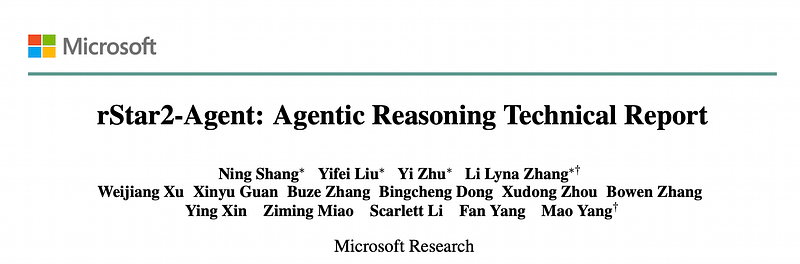
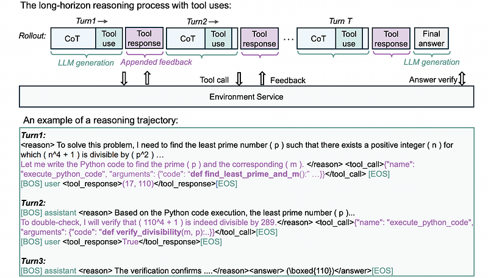
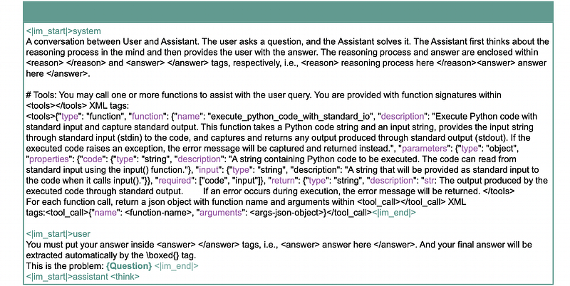
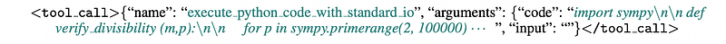
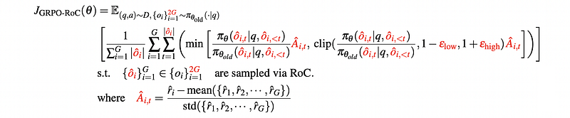
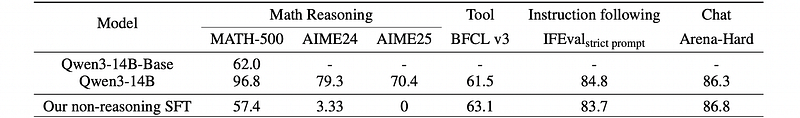
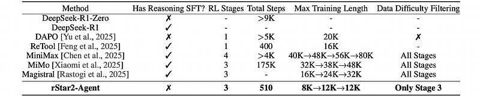
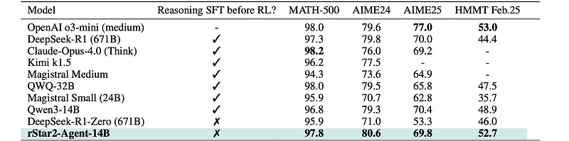
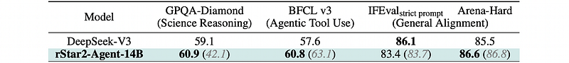

# Papers Explained 460 - rStar2-Agent

rStar2-Agent is a 14B math reasoning model trained with agentic reinforcement learning to achieve frontier-level performance.

This page ingests the source article into the wiki and connects it to [[Papers Explained Corpus]], [[Reasoning Models]], [[Reinforcement Learning Topic]], [[Agentic AI]], [[Code Models]], [[Model Compression and Efficiency]], [[Reinforcement Learning]].

## Source Metadata

- Source file: `raw/2025-09-24_Papers-Explained-460--rStar2-Agent-a3e7f451ddb7.html`
- Source title: Papers Explained 460: rStar2-Agent
- Published: 2025-09-24
- Canonical: [https://medium.com/@ritvik19/papers-explained-460-rstar2-agent-a3e7f451ddb7](https://medium.com/@ritvik19/papers-explained-460-rstar2-agent-a3e7f451ddb7)

## Key Ideas

- Python code and its interpreter, along with scientific computing libraries such as Numpy for efficient numerical computation, Scipy for advanced scientific analysis, and SymPy for symbolic mathematics, can significantly improve the model’s ability for math...
- invokes tools at the right reasoning steps
- writes logically correct and functional code
- carefully reflects on execution results to guide subsequent reasoning steps.
- This capability is cultivated through agentic reinforcement learning.

## Notes

rStar2-Agent is a 14B math reasoning model trained with agentic reinforcement learning to achieve frontier-level performance. Beyond current long CoT, the model demonstrates advanced behaviors, such as thinking carefully before using Python coding tools and reflecting on code execution feedback to autonomously explore, verify, and refine intermediate steps in complex problem-solving.

## Agentic Reinforcement Learning Methodology

### Smarter Reasoning in a Code Environment

Python code and its interpreter, along with scientific computing libraries such as Numpy for efficient numerical computation, Scipy for advanced scientific analysis, and SymPy for symbolic mathematics, can significantly improve the model’s ability for math problem-solving. Ideally, the model:

- invokes tools at the right reasoning steps

- writes logically correct and functional code

- carefully reflects on execution results to guide subsequent reasoning steps.

This capability is cultivated through agentic reinforcement learning.

Unlike standard RL rollouts, which generate a full trajectory until an EOS token, full trajectories are produced through multiple interactive turns with the code environment. The first turn begins with a predefined system prompt and the given question. Then the model generates an initial reasoning trajectory in the role of assistant, ending at the EOS token. If no code tool call is present, the rollout terminates. Otherwise, the code block is extracted and executed by the environment service, and the output is appended to the trajectory under the user role. The model then takes this updated context as input and continues the next turn of reasoning under the assistant role. This multi-turn rollout process repeats until the model produces a final answer or reaches a predefined maximum number of turns T.

A general function call interface is used for invoking coding tools. Each tool call is represented in a structured JSON format.

The environment feedback is wrapped in <tool response> tags.

### End-to-End Agentic Reinforcement Learning

To push the policy beyond its pre-training limits, several key modifications from recent works are incorporated to GRPO.

- The KL divergence penalty is removed. Although commonly used to prevent the online policy from significantly deviating from a reference policy and to stabilize training, it can inadvertently restrict the discovery of novel, tool-augmented reasoning patterns. Removing it allows the model to explore more freely.

- The Clip-Higher strategy is adopted by relaxing the upper bound of the importance sampling ratio. Specifically, εhigh is increased from 0.2 to 0.28, allowing the model to better explore high-entropy, low-probability tokens. These minority tokens may include forking tokens that are essential for reasoning performance, as noted in recent studies.

- The entropy loss term is eliminated to prevent training instability. While commonly used to encourage exploration, it can cause uncontrolled entropy growth, potentially leading to training collapse.

While GRPO provides a strong foundation, agentic reinforcement learning introduces new challenges. In particular, coding tools and the code environment introduce inherent noise into reasoning. Outcome-only reward schemes evaluate trajectories solely based on the final answer to prevent reward hacking. This outcome-only reward cannot penalize undesirable intermediate behaviors. As a result, trajectories with incorrect intermediate tool calls can still receive positive reward if the final answer is correct, effectively reinforcing the model to treat such errors as acceptable. Consequently, the model tends to produce lengthy, low-quality trajectories containing tool call errors, severely limiting the effectiveness of agentic reinforcement learning and inflating training costs.

## GRPO-RoC: Group Relative Policy Optimization with Resampling on Correct

From a reward design perspective, two potential solutions exist:

- Introducing step-level reward

- Retaining outcome-only rewards while adding penalties, such as for tool-call errors.

These approaches are not adopted for two main reasons:

- They introduce additional complexity, such as requiring careful human tuning and reward model construction

- They are prone to reward hacking. For example, during early training, when the model’s reasoning ability is still developing, step-level rewards or tool-error penalties can hinder effective exploration.

To avoid reward hacking, a minimal answer-only outcome reward is used. To address the challenge introduced by environment noise, GRPO-RoC is introduced, which effectively filters out low-quality noisy trajectories through Resample on Correct (RoC) rollout strategy.

Resample on Correct (RoC) is a simple yet effective rollout strategy that enables effective agentic reinforcement learning under an answer-only outcome reward regime. Oversampling a larger group of rollouts and then downsampling to the standard rollout batch size is the first step. Positive trajectories are filtered to retain only the highest-quality ones with minimal tool-induced errors or tool call formatting issues, while negative trajectories are uniformly downsampled. This asymmetric sampling reinforces positive supervision without losing the various learning signal from failures, facilitating more effective policy updates.

Where 2G denotes the oversampled rollout trajectories, ˆoi represents those selected via RoC sampling, and ˆ ri is the 0–1 answer reward for rollout ˆoi. The clipping thresholds εlow and εhigh are hyperparameters, set to 0.2 and 0.28 respectively, following the Clip-Higher strategy.

## Training Recipe

Qwen3–14B-base is used as the base model. Training begins with a non-reasoning SFT stage followed by multi-stage efficient RL with progressively increasing training lengths. Specifically, the non-reasoning SFT enables the model to initially produce relatively short responses, while multi-stage RL with GRPO-RoC further shortens response length throughout RL and significantly reduces computational requirements.

### Non-Reasoning Cold Start for Instruction Following

*Figure: Performance of Qwen3–14B-base after non-reasoning SFT.*

This stage focuses solely on general instruction-following, JSON formatting, and basic coding tool usage, which are essential for agentic RL. The following datasets are incorporated:

- 165K function call data, including 117K from ToolACE-11K, APIGen-MT-5K, Glaive-function-calling-v2–101k, along with 48k Magicoder datasets reformatted into JSON function call format to enhance coding tool capabilities.

- 30K instruction-following examples from Tulu3 post-training dataset, with response rewritten using o4-mini to improve quality.

- 27K chat data from LLaMA-Nemontron post training dataset , with prompts for each conversation rewritten using o4-mini.

### RL Data Curation

Two rules are followed when collecting math problems.

- problems must be high-quality, challenging, and have correctly labeled final answers.

- answers must be integers.

Over 100K candidate problems are collected from three sources. 17K integer-only problems are included from the DAPO training set. Next, 93K problems from the Art of Problem Solving (AoPS) forums via OpenMathReasoning are added. Finally, 937 challenging problems from Project Euler, which require both mathematical insight and programming skills, are included.

Extensive cleaning is then performed to produce a final set of 42K high-quality problem-answer pairs. Specifically, Qwen3–32B is used to generate 16 responses per problem and only those with integer answers that match the original labeled answer at least twice are retained. For the Project Euler dataset, problems with excessively large numerical answers (e.g., 6.5e27330467) that can cause verifiers to time out are removed.

### Multi-Stage RL Training

To improve training efficiency, a multi-stage strategy is adopted that gradually increases both the maximum training length and the difficulty of the data.

*Figure: Comparison of training recipes among leading reasoning models.*

RL Stage-1: Concise Training at 8K Response Length

The first stage focuses on concise training using the full set of 42K curated math problems with a maximum response length of 8K tokens. This shorter length is feasible because the model initially produces relatively short responses (around 1K tokens) after non-reasoning SFT, and GRPO-RoC enhances reasoning efficiency. Although the clipping ratio (rollouts exceeding 8K) temporarily surpasses 10%, the model self-adjusts, leading to a decrease in clipping, improved evaluation scores, and more concise responses. This stage demonstrates that training under a shorter length budget enhances efficiency and fosters stronger early reasoning.

RL Stage-2: Extending to 12K Response Length

Upon completion of Stage 1, the rollout clipping ratio stabilizes around 10%, and performance plateaus, indicating that the 8K maximum response length has become a limiting factor. To facilitate further learning, Stage 2 increases the maximum response length to 12K tokens. This extension results in an increase in the average response length from 4K to 6K tokens and yields consistent improvements in performance on AIME24 and AIME25 benchmarks.

RL Stage-3: Focused Training on Difficult Problems

By the end of Stage 2, a significant portion of problems (over 70%) are perfectly solved, making them too easy for the model. Stage 3 addresses this by shifting focus to harder problems through an offline filtering strategy. The latest policy from Stage 2 is used to generate 8 rollouts per problem on the original 42K set, and problems where all 8 rollouts are correct are removed, yielding a dataset of 17.3K harder problems. Training on this refined dataset, with reset optimizer states and an updated reference model, further improves performance and increases the average response length from 6K to 8K, ultimately advancing the 14B model to frontier-level mathematical reasoning within 125 steps before performance saturation.

### Unsuccessful Attempts And Lessons

Overlong filtering further increases rollout truncation.

In RL training, rollouts exceeding the maximum response length are truncated and assigned a negative reward. DAPO suggests that penalizing such responses can confuse the model, and proposes overlong filtering, which discards truncated rollouts entirely without assigning reward. However, experiments showed that overlong filtering yielded no benefits and increased the ratios of overlong rollouts. This is possibly because many of these overlong responses contain repetitive patterns, and without negative feedback, the model receives no signal to correct them. Therefore, truncated rollouts with negative reward were kept, which turned out to be useful training signals, guiding the model to reduce repetition and adapt its behavior.

N-gram repetition detection risks removing effective reasoning patterns.

Experiments were conducted with lowering the sampling probability of correct rollouts that exhibit repetition patterns, as part of the resample-on-correct strategy, following the n-gram repetition detection method. However, this approach negatively affected both the model’s average response length and its reasoning scores. Analysis of the filtered repetitive rollouts revealed that it is inherently difficult to precisely distinguish between undesirable repetition and legitimate reasoning behavior, such as the model generating two similar tool calls with different inputs to verify its results.

Lessons about reward design.

LLM RL is inherently self-exploratory, with highly diverse and unpredictable intermediate behaviors. Overly complex, rule-based rewards or scoring schemes can introduce bias, penalize useful behaviors, and fail to generalize across reasoning patterns. To address this, a minimal reward design based solely on final answer correctness was adopted. Other low-quality intermediate behaviors are addressed via resample-on-correct rollout strategy rather than direct penalties. This approach reduces bias, preserves exploration, and ensures robust learning throughout training.

## Evaluation

- rStar2-Agent-14B achieves state-of-the-art mathematical reasoning performance, matching or surpassing larger models.

- On AIME24, rStar2-Agent-14B achieves 80.6% accuracy, outperforming o3-mini, DeepSeek-R1, and Claude Opus 4.0.

- On AIME25 and HMMT25, it reaches 69.8% and 52.7% accuracy, respectively.

- Agentic RL alone yields strong reasoning, outperforming state-of-the-art zero-RL baselines.

- rStar2-Agent-14B achieves effective reasoning with significantly fewer tokens.

- rStar2-Agent-14B demonstrates strong generalization performance on diverse benchmarks, outperforming DeepSeek-V3 on most tasks.

- On GPQA-Diamond, rStar2-Agent-14B improves accuracy from 42.1% to 60.9%, surpassing DeepSeek-V3 by 1.8%.

## Paper

rStar2-Agent: Agentic Reasoning Technical Report [2508.20722](https://arxiv.org/abs/2508.20722)

## Figures

Figures from the Medium HTML export (`raw/2025-09-24_Papers-Explained-460--rStar2-Agent-a3e7f451ddb7.html`); local copies under `wiki/assets/papers-explained-460-rstar2-agent/` when download succeeded.

| Figure | Caption |
|--------|---------|
|  | Title card: rStar2-Agent. |
|  | rStar2-Agent is a 14B math reasoning model trained with agentic reinforcement learning to achieve frontier-level performance. |
|  | A general function call interface is used for invoking coding tools. |
|  | A general function call interface is used for invoking coding tools. |
|  | GRPO-RoC: Group Relative Policy Optimization with Resampling on Correct. |
|  | Performance of Qwen3–14B-base after non-reasoning SFT. |
|  | Comparison of training recipes among leading reasoning models. |
|  | LLM RL is inherently self-exploratory, with highly diverse and unpredictable intermediate behaviors. |
|  | LLM RL is inherently self-exploratory, with highly diverse and unpredictable intermediate behaviors. |
|  | LLM RL is inherently self-exploratory, with highly diverse and unpredictable intermediate behaviors. |
## Related

- [[Papers Explained Corpus]]
- [[Reasoning Models]]
- [[Reinforcement Learning Topic]]
- [[Agentic AI]]
- [[Code Models]]
- [[Model Compression and Efficiency]]
- [[Reinforcement Learning]]
- [[Papers Explained 459 - FineWeb2]]
- [[Papers Explained 461 - LLM-JEPA]]

#summary #topic
