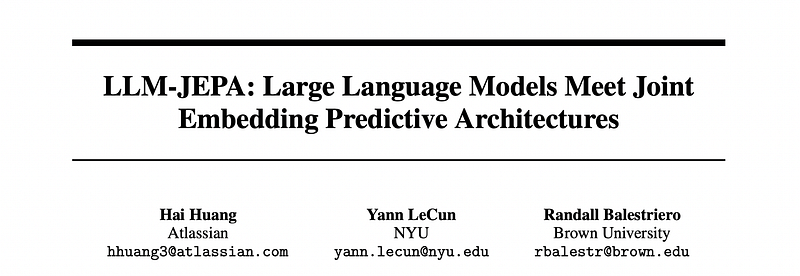
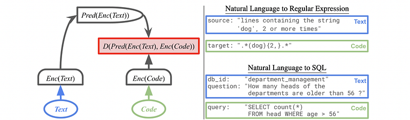
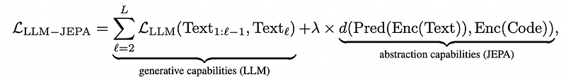
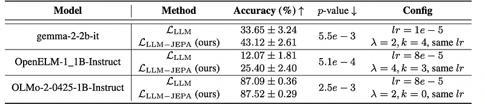
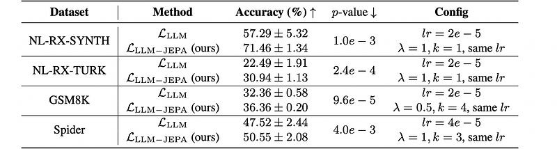
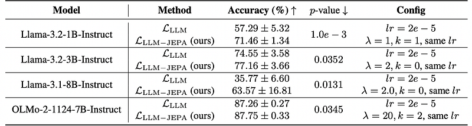
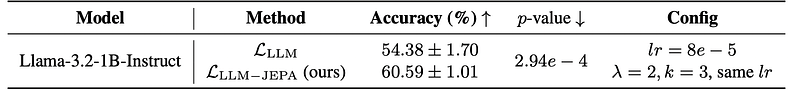
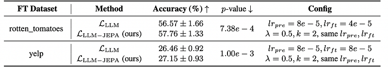

# Papers Explained 461 - LLM-JEPA

LLM pretraining, finetuning, and evaluation rely on input-space reconstruction and generative capabilities. Yet, it has been observed in vision that embedding-space training objectives, e.g., with Joint Embedding Predictive Architectures (JEPAs), are far superior to their input-space counterpart.

This page ingests the source article into the wiki and connects it to [[Papers Explained Corpus]], [[Large Language Models]], [[Embedding and Retrieval]], [[Evaluation and Benchmarks]], [[Code Models]], [[Supervised Fine-Tuning]].

## Source Metadata

- Source file: `raw/2025-09-25_Papers-Explained-461--LLM-JEPA-ceedfd0e63d8.html`
- Source title: Papers Explained 461: LLM-JEPA
- Published: 2025-09-25
- Canonical: [https://medium.com/@ritvik19/papers-explained-461-llm-jepa-ceedfd0e63d8](https://medium.com/@ritvik19/papers-explained-461-llm-jepa-ceedfd0e63d8)

## Key Ideas

- LLM pretraining, finetuning, and evaluation rely on input-space reconstruction and generative capabilities.
- Text and Code can be used as concrete examples of having different views of the same underlying knowledge. The construction of the LLM-JEPA objective relies on two principles.
- where Classifier predicts the logits of the next token TextL given the past tokens Text1:L−1.
- The research aims to improve the abstraction capabilities of LLMs using the joint embedding prediction task. On top of the LLM, a well-established JEPA objective is proposed to be added, leading to the complete loss L defined as:
- where λ≥0 is an hyperparameter balancing the contribution of the two terms, Pred and Enc are the predictor and encoder networks respectively, and dis a metric of choice, e.g., the ℓ2 distance.

## Notes

LLM pretraining, finetuning, and evaluation rely on input-space reconstruction and generative capabilities. Yet, it has been observed in vision that embedding-space training objectives, e.g., with Joint Embedding Predictive Architectures (JEPAs), are far superior to their input-space counterpart. This work proposes a first step in that direction where LLM-JEPA, a JEPA based solution for LLMs, is developed. This solution is applicable both to finetuning and pretraining.

## JEPA-LLM

*Figure: JEPA applied to NLP tasks that has Text and Code.*

Text and Code can be used as concrete examples of having different views of the same underlying knowledge. The construction of the LLM-JEPA objective relies on two principles. First, generative capabilities of LLMs must be preserved, therefore starting with the L_LLM.

where Classifier predicts the logits of the next token TextL given the past tokens Text1:L−1.

The research aims to improve the abstraction capabilities of LLMs using the joint embedding prediction task. On top of the LLM, a well-established JEPA objective is proposed to be added, leading to the complete loss L defined as:

where λ≥0 is an hyperparameter balancing the contribution of the two terms, Pred and Enc are the predictor and encoder networks respectively, and dis a metric of choice, e.g., the ℓ2 distance.

The encoder: The hidden_state of the last token from the last layer is used as the embedding of an input sequence–as commonly done for LLM probing.

The metric: cosine similarity is widely accepted in vision to compare embeddings. Thus, the same approach is used for LLM-JEPA.

The predictor: The auto-regressive nature of LLMs and their internal self-attention are leveraged to define a tied-weights predictor. By introducing a special token [PRED] at the end of a given input, further nonlinear processing of the input is allowed, hereby producing Pred(·) at the final embedding of the last layer. Reusing the internal weights of the LLM for the prediction task greatly reduces the training overhead and architectural design choices. Practically, k ∈{0,…,K} predictor tokens are appended to an input prompt and the embedding of the last predictor token is used to be Pred(Enc(·)). When k= 0, the predictor is trivial, i.e., Pred(x) = x.

## Empirical Validation

LLM-JEPA Improves Finetuning

Experiments are run across multiple pretrained LLMs (Llama-3.2–1B-Instruct, gemma-2–2b-it, OpenELM-1_1B-Instruct, and OLMo-2–0425–1B-Instruct) with various datasets (NL-RX-SYNTH, NL-RX-TURK, GSM8K, and Spider).

*Figure: Fine-tuning accuracy on dataset NL-RX-SYNTH.*

*Figure: Fine-tuning accuracy by model Llama-3.2–1B-Instruct.*

*Figure: Fine-tuning accuracy on NL-RX-SYNTH.*

- LLM-JEPA consistently improves performance during fine tuning across various models, datasets, training times, and model sizes.

LLM-JEPA Improves Pretraining

Llama-3.2–1B-Instruct is pretrained from randomly initialized weights on the NL-RX-SYNTH dataset. A prediction is valid as long as it starts with the ground truth.

*Figure: Pretraining accuracy on dataset NL-RX-SYNTH.*

- LLM-JEPA also improves the quality of the learned representation.

Another pretraining experiment is conducted on cestwc/paraphrase containing groups of 5 paraphrases. The paraphrases within the same group are employed for the JEPA loss. Once the model is pretrained (4 epochs), finetuning evaluation is done on rotten_tomatoes (1 epoch). Finetuning does not employ the JEPA loss–hence showing the benefit of JEPA at the pretraining stage.

- JEPA pretraining improves the downstream performance post-finetuning.

## Paper

LLM-JEPA: Large Language Models Meet Joint Embedding Predictive Architectures [2509.14252](https://www.arxiv.org/abs/2509.14252)

## Figures

Figures from the Medium HTML export (`raw/2025-09-25_Papers-Explained-461--LLM-JEPA-ceedfd0e63d8.html`); local copies under `wiki/assets/papers-explained-461-llm-jepa/` when download succeeded.

| Figure | Caption |
|--------|---------|
|  | Title card: LLM-JEPA. |
|  | JEPA applied to NLP tasks that has Text and Code. |
|  | Text and Code can be used as concrete examples of having different views of the same underlying knowledge. |
|  | The research aims to improve the abstraction capabilities of LLMs using the joint embedding prediction task. |
|  | Fine-tuning accuracy on dataset NL-RX-SYNTH. |
|  | Fine-tuning accuracy by model Llama-3.2–1B-Instruct. |
|  | Fine-tuning accuracy on NL-RX-SYNTH. |
|  | Pretraining accuracy on dataset NL-RX-SYNTH. |
|  | Another pretraining experiment is conducted on cestwc/paraphrase containing groups of 5 paraphrases. |
## Related

- [[Papers Explained Corpus]]
- [[Large Language Models]]
- [[Embedding and Retrieval]]
- [[Evaluation and Benchmarks]]
- [[Code Models]]
- [[Supervised Fine-Tuning]]
- [[Papers Explained 460 - rStar2-Agent]]
- [[Papers Explained 462 - Smol2Operator]]

#summary #topic
