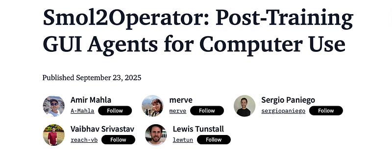
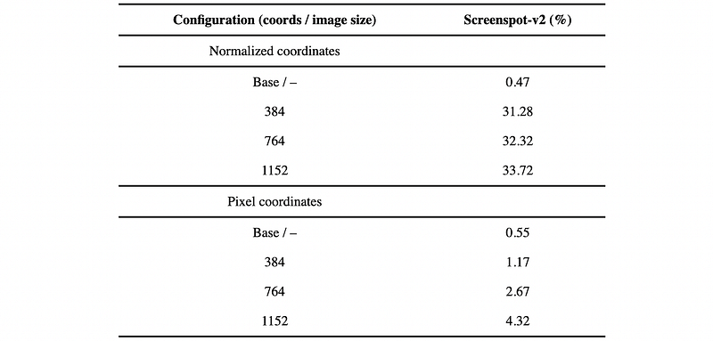
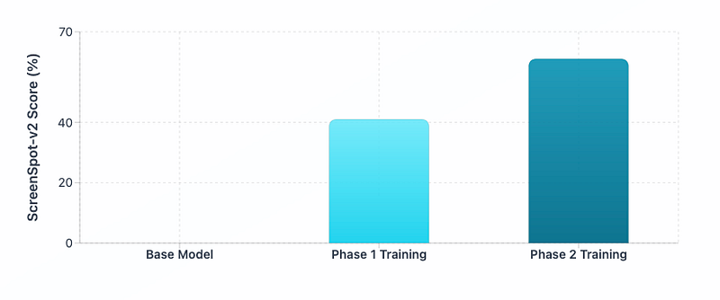

# Papers Explained 462 - Smol2Operator

Graphical User Interface (GUI) automation is one of the most challenging frontiers in computer vision. Developing models that see and interact with user interfaces enables AI agents to navigate mobile, desktop, and web platforms.

This page ingests the source article into the wiki and connects it to [[Papers Explained Corpus]], [[Computer Vision]], [[Large Language Models]], [[Vision Language Models]], [[Model Compression and Efficiency]], [[Document AI]].

## Source Metadata

- Source file: `raw/2025-09-26_Papers-Explained-462--Smol2Operator-3eb931dc6aa6.html`
- Source title: Papers Explained 462: Smol2Operator
- Published: 2025-09-26
- Canonical: [https://medium.com/@ritvik19/papers-explained-462-smol2operator-3eb931dc6aa6](https://medium.com/@ritvik19/papers-explained-462-smol2operator-3eb931dc6aa6)

## Key Ideas

- This work presents a comprehensive approach to training vision-language models for GUI automation through a multi-phase training strategy.
- The approach leverages SmolVLM2–2.2B-Instruct as the baseline model, a small powerful vision-language model that initially has no grounding capabilities for GUI tasks.
- The models and dataset are available at [HuggingFace](https://huggingface.co/collections/smolagents/smol2operator-release-68d288e87d3fa8f551d2ce2e/).
- One of the primary challenges when working with multiple GUI automation datasets is the lack of standardization in action representations.
- A comprehensive data transformation pipeline was implemented to create a unified action space using the open-source datasets (xlangai/aguvis-stage1, xlangai/aguvis-stage2), originally used by AGUVIS.

## Notes

Graphical User Interface (GUI) automation is one of the most challenging frontiers in computer vision. Developing models that see and interact with user interfaces enables AI agents to navigate mobile, desktop, and web platforms.

This work presents a comprehensive approach to training vision-language models for GUI automation through a multi-phase training strategy. The goal is to demonstrate the entire process, from data processing to model training, and, in doing so, show how to unlock GUI-grounding capabilities in VLMs.

The approach leverages SmolVLM2–2.2B-Instruct as the baseline model, a small powerful vision-language model that initially has no grounding capabilities for GUI tasks. The process is inspired by the AGUVIS paper, and carefully curated datasets are leveraged to build upon their foundational work. The approach is evaluated on an established perception benchmark: ScreenSpot-v2, which tests the model’s ability to understand and locate elements within screenshots.

The models and dataset are available at [HuggingFace](https://huggingface.co/collections/smolagents/smol2operator-release-68d288e87d3fa8f551d2ce2e/).

## Data Transformation and Unified Action Space

One of the primary challenges when working with multiple GUI automation datasets is the lack of standardization in action representations. Different datasets use varying function signatures, parameter naming conventions, and action taxonomies, making it difficult to train a unified model across diverse data sources.

A comprehensive data transformation pipeline was implemented to create a unified action space using the open-source datasets (xlangai/aguvis-stage1, xlangai/aguvis-stage2), originally used by AGUVIS.

The approach involved:

Function Parsing and Normalization: A function parser was developed that can extract and parse function calls from various formats across all datasets. This parser supports any function signature format, handles complex parameter structures, and can reconstruct function calls with proper parameter ordering.

Action Space Unification: A comprehensive action conversion system is implemented that transforms all original action representations into a standardized function naming and argument structure. This process highlighted the significant inconsistencies in function signatures across different datasets and allowed us to:

- Remove undesired or redundant actions

- Standardize parameter naming conventions

- Create a cohesive action vocabulary

Flexible Adaptation Framework: The transformation pipeline includes utilities that allow users to:

- Adapt the entire dataset to their own action space naming conventions

- Extract and analyze the current action space structure

Before:

```text
# Mobile Actions
mobile.home()
mobile.open_app(app_name=
'drupe'
)
mobile.swipe(from_coord=[
0.581
,
0.898
], to_coord=[
0.601
,
0.518
])
mobile.long_press(x=
0.799
, y=
0.911
)
mobile.terminate(status=
'success'
)
# Desktop Actions
pyautogui.click(x=
0.8102
, y=
0.9463
)
pyautogui.doubleClick(x=
0.8102
, y=
0.9463
)
pyautogui.hotkey(keys=[
'ctrl'
,
'c'
])
pyautogui.scroll(page=-
0.1
)
pyautogui.write(message=
'bread buns'
)
pyautogui.dragTo(from_coord=[
0.87
,
0.423
], to_coord=[
0.8102
,
0.9463
])
```

After:

```text
# Unified Mobile Actions
navigate_home()
open_app(app_name=
'drupe'
)
swipe(from_coord=[
0.581
,
0.898
], to_coord=[
0.601
,
0.518
])
long_press(x=
0.799
, y=
0.911
)
final_answer(
'success'
)
# Unified Desktop Actions
click(x=
0.8102
, y=
0.9463
)
double_click(x=
0.8102
, y=
0.9463
)
press(keys=[
'ctrl'
,
'c'
])
scroll(direction=
'up'
, amount=
10
)
# Smart direction detection
type
(text=
'bread buns'
)
drag(from_coord=[
0.87
,
0.423
], to_coord=[
0.8102
,
0.9463
])
```

Through this pipeline, open-source datasets xlangai/aguvis-stage1, xlangai/aguvis-stage2 are transformed into a unified action space. The output of this process is released as two new fully formatted datasets: smolagents/aguvis-stage-1 and smolagents/aguvis-stage-2.

## Phase 1: From Zero to Perception

Phase 1 leverages the smolagents/aguvis-stage-1 dataset, which introduces GUI grounding by pairing low-level instructions with diverse executable actions (expressed in code form). Each sample links a screenshot with multi-turn user/assistant interactions, enabling the model to learn fine-grained action grounding across dialogue turns. For example, a user/assistant turn in smolagents/aguvis-stage-1 follows the structure:

```text
{
"user"
:
"click on more button"
,
"assistant"
:
"click(x=0.8875, y=0.2281)"
,
}
```

Before proceeding with full-scale Phase 1 training, comprehensive ablation studies were conducted with different image sizes and coordinate representation systems to determine optimal training configurations for SmolVLM2.

- Image Sizes Tested: 384px, 768px, 1152px

- Coordinate Systems: Pixel coordinates vs. normalized coordinates (0–1 range)

- Training Data: 400K samples from Aguvis datasets

*Figure: Baseline on HuggingFaceTB/SmolVLM2–2.2B-Instruct (400k samples, aguvis-stage-1). Higher is better.*

From the experiments, it is determined that:

- Image Size: 1152px

- Coordinate System: Normalized coordinates (0–1 range)

proved most effective for SmolVLM2

Using the optimal configuration, the model was trained for 2 epochs on the smolagents/aguvis-stage-1 dataset. This resulted in a remarkable +41% improvement over baseline on ScreenSpot-v2.

## Phase 2: From Perception to Cognition

Whereas Phase 1 provided grounding capabilities, Phase 2 targets agentic reasoning, the ability to deliberate and plan before acting. This stage transforms the model from a reactive system identifying GUI elements into a proactive agent capable of executing complex, multi-step interactions.

Phase 2 uses the smolagents/aguvis-stage-2 dataset, which introduces agentic scenarios:

- Explicit reasoning about upcoming actions

- Context consistency across multiple interaction steps

- High-level instructions require multi-step, low-level actions.

Each sample links a screenshot with a system/user/assistant turn, For example, the smolagents/aguvis-stage-2 chat message is like this:

```text
{
"system"
:
"You are a helpful GUI agent. ..."
,
"user"
:
"Please generate the next move according to the UI screenshot, instruction and previous actions.\n\nInstruction: What information does the site provide about Judith Lauand's career, works and exhibitions?\n\nPrevious actions:\nNone"
,
"assistant"
:
"<think>\nClick on the link labeled 'Judith Lauand: Brazilian 1922-2022' to explore more about her career and exhibitions.\n</think>\n<code>\nclick(x=0.41, y=0.178)\n</code>"
,
}
```

Starting from the Phase 1 checkpoint, the model was fine-tuned for two epochs on smolagents/aguvis-stage-2.

The accuracy on ScreenSpot-v2 increased from 41% to 61%, indicating that explicit reasoning improves GUI grounding performance.

The two-phase training was reproduced on a much smaller VLM (nanoVLM-460M). Despite its reduced capacity, the model achieved ~58% on ScreenSpot-v2. This demonstrates that the training strategy scales down effectively, making it SOTA on ScreenSpot-v2 for this model size (460M parameters).

## Paper

[Smol2Operator: Post-Training GUI Agents for Computer Use](https://huggingface.co/blog/smol2operator)

## Figures

Figures from the Medium HTML export (`raw/2025-09-26_Papers-Explained-462--Smol2Operator-3eb931dc6aa6.html`); local copies under `wiki/assets/papers-explained-462-smol2operator/` when download succeeded.

| Figure | Caption |
|--------|---------|
|  | Title card: Smol2Operator. |
|  | Baseline on HuggingFaceTB/SmolVLM2–2.2B-Instruct (400k samples, aguvis-stage-1). Higher is better. |
|  | Starting from the Phase 1 checkpoint, the model was fine-tuned for two epochs on smolagents/aguvis-stage-2. |
## Related

- [[Papers Explained Corpus]]
- [[Computer Vision]]
- [[Large Language Models]]
- [[Vision Language Models]]
- [[Model Compression and Efficiency]]
- [[Document AI]]
- [[Papers Explained 461 - LLM-JEPA]]
- [[Papers Explained 463 - FineVision]]

#summary #topic
