# Papers Explained 463 - FineVision

FineVision is a new multimodal dataset with 24 million samples. It is created by collecting over 200 datasets containing 17M images, 89M question-answer turns, and 10B answer tokens, totaling 5TB of high-quality data.

This page ingests the source article into the wiki and connects it to [[Papers Explained Corpus]], [[Vision Language Models]], [[Synthetic Data]], [[Document AI]], [[Large Language Models]], [[Evaluation and Benchmarks]].

## Source Metadata

- Source file: `raw/2025-09-29_Papers-Explained-463--FineVision-e4b1af24ecbf.md`
- Source title: Papers Explained 463: FineVision
- Published: 2025-09-29
- Canonical: [https://medium.com/@ritvik19/papers-explained-463-finevision-e4b1af24ecbf](https://medium.com/@ritvik19/papers-explained-463-finevision-e4b1af24ecbf)

## Key Ideas

- After gathering all the sub-datasets, every turn is cleaned. Individual turns whose combined question and answer length exceeds 8192 tokens are removed.
- Every single turn in the dataset is rated across 4 axes. A LLM and VLM-as-a-judge pipeline (using Qwen3–32B and Qwen2.5VL-32B-Instruct) rates every turn on a scale from 1–5 in these 4 categories:
- Text Formatting Quality: How is the quality of the answer both linguistically and structurally? (Question and Answer)
- Question-Answer Relevance: Does the answer properly respond to the question? (Question and Answer)
- Visual Dependency: How much does the question depend on visual information to be answered? (Question only)

## Notes

FineVision is a new multimodal dataset with 24 million samples. It is created by collecting over 200 datasets containing 17M images, 89M question-answer turns, and 10B answer tokens, totaling 5TB of high-quality data.

## Data Collection

Over 200 image-text datasets were manually collected from various publicly available sources and processed to unify their formatting. Some datasets are not presented in chat form, so they were converted into question-answer pairs. In some cases, this involved synthetically creating questions for all samples. To address underrepresented domains, such as GUI-oriented data, a new dataset was created and added. This dataset was compiled from existing GUI datasets, after applying chat normalization and unifying the action space to convert their specific formats into a more general GUI action space.

After gathering all the sub-datasets, every turn is cleaned. Individual turns whose combined question and answer length exceeds 8192 tokens are removed. Big images are resized to have a longest side of 2048 pixels while keeping the aspect ratio, and samples with corrupted images are discarded.

Every single turn in the dataset is rated across 4 axes. A LLM and VLM-as-a-judge pipeline (using Qwen3–32B and Qwen2.5VL-32B-Instruct) rates every turn on a scale from 1–5 in these 4 categories:

- Text Formatting Quality: How is the quality of the answer both linguistically and structurally? (Question and Answer)

- Question-Answer Relevance: Does the answer properly respond to the question? (Question and Answer)

- Visual Dependency: How much does the question depend on visual information to be answered? (Question only)

- Image-Question Correspondence: How well does the image support answering the question? (Image and Question)

FineVision’s subsets are classified into 9 categories: Captioning & Knowledge, Chart & Table, General VQA, Grounding & Counting, Mathematics, Naive OCR, OCR QA, Science and Text-only.

## Experiment Setup

A 460M parameter VLM is trained for all ablations and experiments. SmolLM2–360M-Instruct serves as the text backbone, and SigLIP2-Base-512 functions as the vision encoder due to its balance of training time and model performance. Experiments were conducted using a classic 2-stage training schedule. The first stage focused on training the Modality Projection to align Language and Image Embeddings. The second stage trained the whole model. No significant benefits from the additional first stage were observed compared to training the whole model directly at the given size and training duration. Consequently, a single-stage training approach was adopted for most ablations.

Three similar open source alternatives are used as baselines to compare the dataset: The Cauldron, LLaVA-OneVision and Cambrian-7M.

The research evaluates on a diverse set of 11 benchmarks: AI2D, ChartQA, DocVQA, InfoVQA, MME, MMMU, MMStar, OCRBench, ScienceQA, TextVQA and SEED-Bench.

Each ablation trains the 460M model with a maximal image size of 1536x1536 pixel (without resizing smaller images) and a maximal input token length of 4096.

## Experiments

### How does FineVision compare to other open datasets?

- FineVision initially performs comparably to other datasets but surpasses them after sufficient training, demonstrating the benefit of a larger, more diverse dataset.

- FineVision achieves significant average improvements over other datasets across 11 benchmarks: 40.7% over Cauldron, 12.1% over Cambrian, and 46.3% over LLaVa. These improvements increase when comparing deduplicated versions of the datasets.

- FineVision includes data for tasks not present in other datasets, such as agentic browsing, counting, and pointing.

- Models trained on different datasets saturate at different training steps: Cambrian (18k), LLaVa (12k), and Cauldron (7k).

### How much test data is in publicly available datasets?

- All baselines contain between 2–3% images from test benchmarks.

- Removing duplicate images results in a performance drop of 2.4–2.8% across all benchmarks.

- The performance drop after deduplication varies significantly across benchmarks (e.g., ScienceQA drops by 14.49%, OCRBench drops by 1.08%).

- FineVision contains the smallest relative amount of duplicated data (1%) and experiences the smallest performance drop after deduplication (1.45%).

### How diverse are the datasets?

To evaluate the diversity of datasets:

- Used SSCD embeddings (pre-computed) as a proxy for visual diversity.

- Analyzed the covariance matrix of the full embeddings to avoid relying on subsamples.

- Calculated eigenvalues from the covariance matrix.

- Determined the effective rank and participation ratio of the covariance matrix.

- Normalized the effective rank and participation ratio with the embedding dimension.

- Computed the geometric mean of the normalized values to obtain a single diversity score.

### Should you merge multiple questions for the same image into a single multi turn conversation?

- Models trained with single-turn and multi-turn conversations performed similarly when given the same training budget.

- Some benchmarks favored the single-turn approach, while others favored the multi-turn approach.

### Should you train on multilingual data if your language backbone was not?

- Including multilingual data, even though the Language Backbone was only trained on English, resulted in a slight performance advantage. This supports the hypothesis that greater dataset diversity is generally beneficial for VLM training.

- The benefit of including unseen languages only becomes apparent after the first full epoch of training .

### How can you assess the quality of the dataset?

- Training on the most diverse data, including all samples regardless of individual quality ratings, outperformed training on filtered subsets in benchmark evaluations.

- Removing samples, even those judged to be of low quality, hurt model performance, suggesting that the benefits of a large dataset outweigh the negative impact of lower-quality samples.

- The inherent curation of VLM datasets, which are typically based on curated Image-Question-Answer pairs rather than massive web crawls, provides a baseline level of quality.

- The chosen LLM and VLM models used for judging data quality may not have been powerful enough to accurately assess the nuances in the quality of the samples.

## Paper

[FineVision: Open Data Is All You Need](https://huggingface.co/spaces/HuggingFaceM4/FineVision)

## Figures

Figures from the Medium HTML export (`raw/2025-09-29_Papers-Explained-463--FineVision-e4b1af24ecbf.md`); local copies under `wiki/assets/papers-explained-463-finevision/` when download succeeded.

| Figure | Caption |
|--------|---------|
| 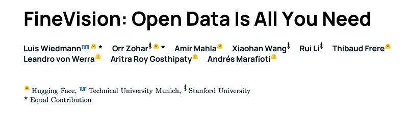 | Title card: FineVision. |
| 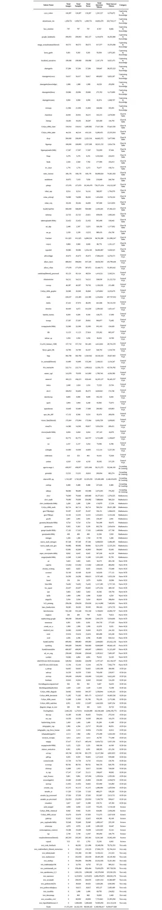 | Over 200 image-text datasets were manually collected from various publicly available sources and processed to unify their formatting. |
| 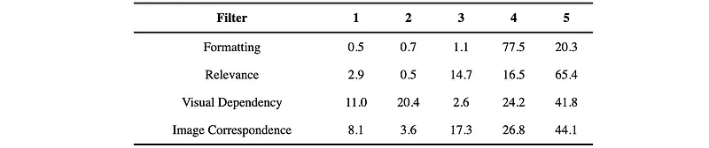 | Every single turn in the dataset is rated across 4 axes. |
| 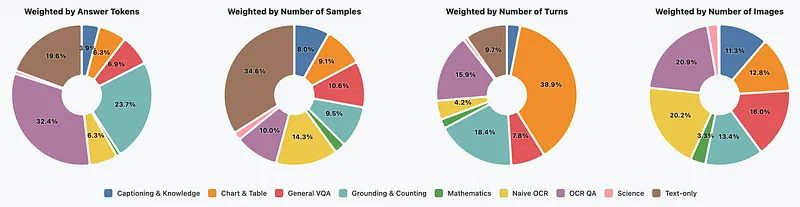 | Data Collection. |
| 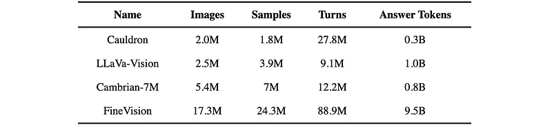 | Three similar open source alternatives are used as baselines to compare the dataset: The Cauldron, LLaVA-OneVision and Cambrian-7M. |
| 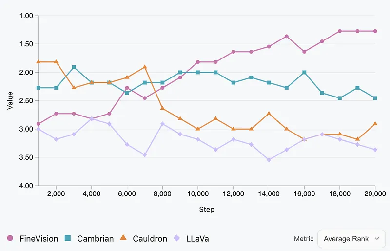 | How does FineVision compare to other open datasets? |
| 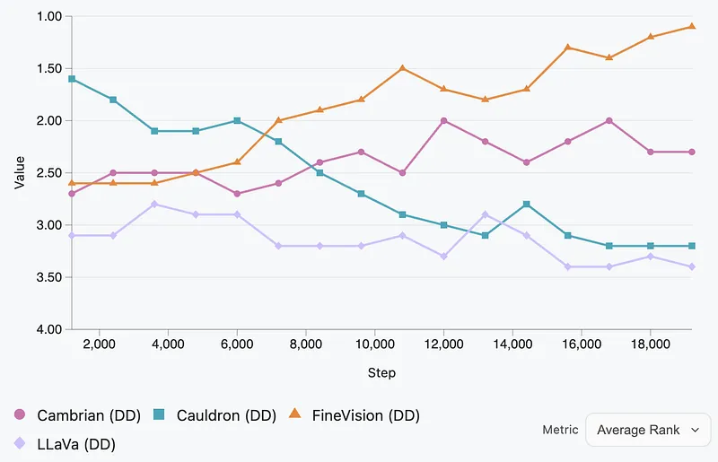 | How much test data is in publicly available datasets? |
| 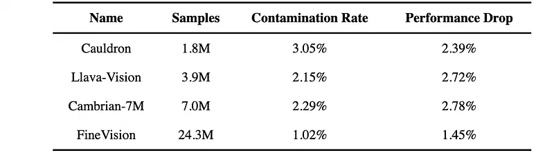 | How much test data is in publicly available datasets? |
| 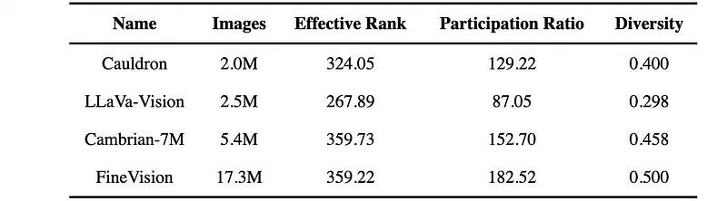 | To evaluate the diversity of datasets. |
| 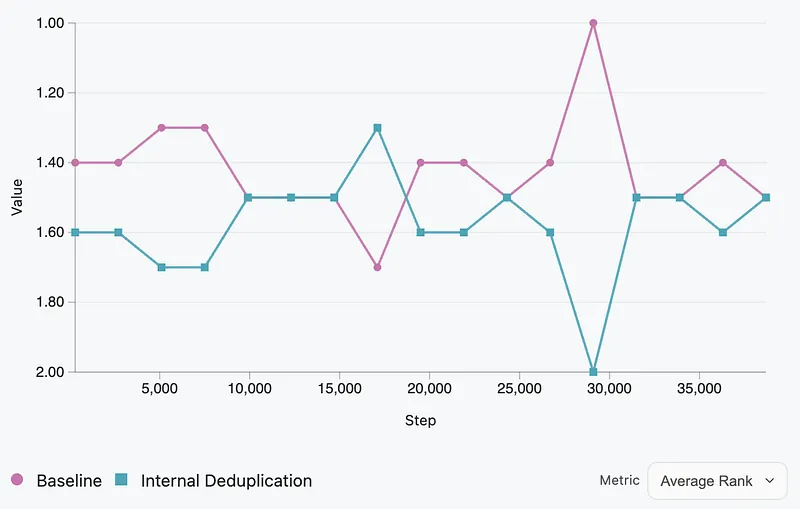 | To evaluate the diversity of datasets. |
| 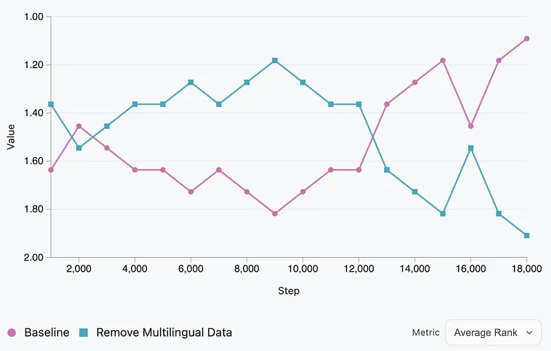 | To evaluate the diversity of datasets. |
| 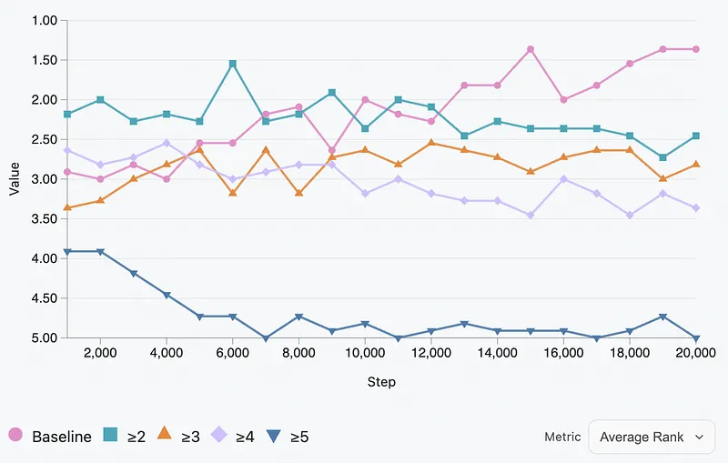 | To evaluate the diversity of datasets. |
## Related

- [[Papers Explained Corpus]]
- [[Vision Language Models]]
- [[Synthetic Data]]
- [[Document AI]]
- [[Large Language Models]]
- [[Evaluation and Benchmarks]]
- [[Papers Explained 462 - Smol2Operator]]
- [[Papers Explained 464 - AggLM]]

#summary #topic
