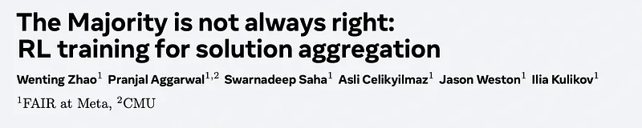
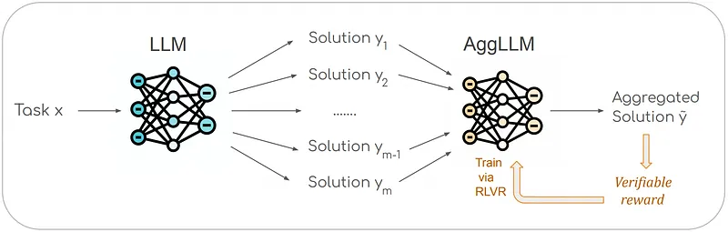
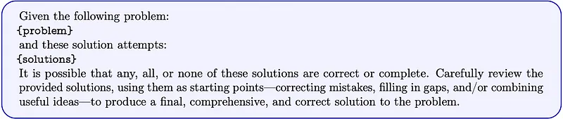
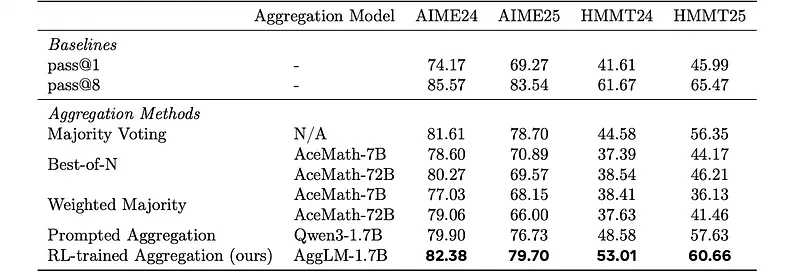
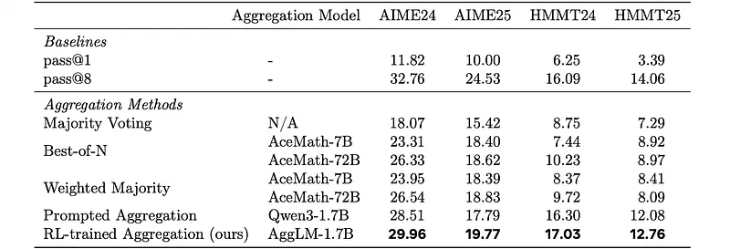
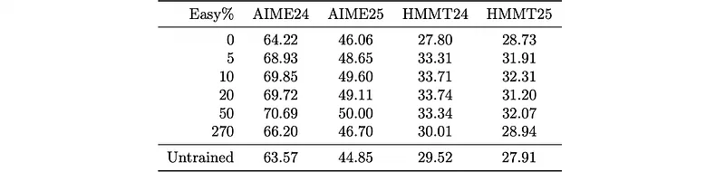

# Papers Explained 464 - AggLM

This work proposes to learn aggregation as an explicit reasoning skill. Given a set of candidate solutions, an aggregator model called AggLM is trained to review, reconcile, and synthesize a final, correct answer using reinforcement learning from verifiable rewards.

This page ingests the source article into the wiki and connects it to [[Papers Explained Corpus]], [[Reinforcement Learning Topic]], [[Reasoning Models]], [[Safety and Alignment]], [[Evaluation and Benchmarks]], [[Reinforcement Learning]], [[Verifier-Bounded Learning]].

## Source Metadata

- Source file: `raw/2025-09-30_Papers-Explained-464--AggLM-d3ee0e491a98.md`
- Source title: Papers Explained 464: AggLM
- Published: 2025-09-30
- Canonical: [https://medium.com/@ritvik19/papers-explained-464-agglm-d3ee0e491a98](https://medium.com/@ritvik19/papers-explained-464-agglm-d3ee0e491a98)

## Key Ideas

- This work proposes to learn aggregation as an explicit reasoning skill. Given a set of candidate solutions, an aggregator model called AggLM is trained to review, reconcile, and synthesize a final, correct answer using reinforcement learning from verifiable...
- Let x be a given problem and y⋆ its ground-truth solution. Two models are considered: (i) a solution model pθ(y|x) that generates a solution y;
- Then, the aggregation model produces an aggregated solution:
- Let D= {(x,y⋆)}n be a collection of problems with ground-truth solutions. For each x, s·m solutions are drawn from pθ and grouped into s sets of size m, yielding an aggregation-training corpus
- AggLM-1.7B initialized from Qwen3–1.7B trained it on DeepScaler, a collection of around 40 thousand math problems with ground-truth solutions.

## Notes

This work proposes to learn aggregation as an explicit reasoning skill. Given a set of candidate solutions, an aggregator model called AggLM is trained to review, reconcile, and synthesize a final, correct answer using reinforcement learning from verifiable rewards. A key ingredient is careful balancing of easy and hard training examples, allowing the model to learn both to recover minority-but-correct answers as well as easy majority-correct answers.

## AggLM

Let x be a given problem and y⋆ its ground-truth solution. Two models are considered: (i) a solution model pθ(y|x) that generates a solution y; and (ii) an aggregation model pϕ(˜y|x,y1:m) that reads the problem together with a set of m candidate solutions y1:m = (y1,…,ym) and outputs an aggregated solution ˜y. Given a problem x, the solution model samples m candidate solutions independently:

yi ∼pθ(y|x), i∈1,…,m.

Then, the aggregation model produces an aggregated solution:

˜y∼pϕ(y|x,y1:m).

Let D= {(x,y⋆)}n be a collection of problems with ground-truth solutions. For each x, s·m solutions are drawn from pθ and grouped into s sets of size m, yielding an aggregation-training corpus

D′ = {x,y1:m,y⋆}s·n.

An example is considered hard if the majority answer in y1:m is wrong, and easy otherwise. Constructing D′ from existing data sources Dmay lead to many easy examples, where most generated solutions for a problem are correct. This can under-train the model’s ability to recover minority-but-correct answers, whereas training only on hard groups makes rewards sparse. The final training mixture is constructed by taking all hard examples and mixing in p% of easy examples, producing a balanced dataset that preserves realism while emphasizing challenging cases.

AggLM-1.7B initialized from Qwen3–1.7B trained it on DeepScaler, a collection of around 40 thousand math problems with ground-truth solutions.

To construct D′, 128 independent solutions with temperature 1.5 are sampled from Qwen3–1.7B in the thinking mode, dividing into 16 sets of 8 solutions. A data mixture is obtained by setting p= 50%, resulting in 446,220 training examples. Training occurs for one epoch, with a maximum prompt length of 16384 tokens and a maximum response length of 16384 tokens. When constructing the easy subset, diversity is maximized by repeating each problem as little as possible. In GRPO, a group size of 8 is used and a sampling temperature of 1.5 is maintained for the aggregator during training. The solutions used for aggregation (i.e., included in the template) are taken after </think> when obtaining solutions from thinking models.

## Evaluation

Evaluation was conducted on four mathematics competition datasets from MathArena: AIME24, AIME25, HMMT24, and HMMT25, each comprising 30 examples. For each problem, 128 solutions were independently sampled, partitioned into 16 sets of 8 solutions. Aggregation models generated four aggregated solutions per set, and Pass@1 was computed as the success rate over these four answers, averaged across sets and problems.

*Figure: Results when aggregating eight solutions sampled from Qwen3–1.7B in thinking mode.*

- Superiority on In-Distribution Solutions: AggLM-1.7B consistently outperformed all baselines on solutions from Qwen3–1.7B in thinking mode (its training distribution), achieving significant gains (3–7 points) over majority voting and prompted Qwen3–1.7B. This confirms that training the aggregation policy is crucial for performance.

- Learned Generative Aggregation Outperforms Selection Methods: The learned generative aggregation method (AggLM-1.7B) was found to be superior to frequency- and reward-model-based selection methods (majority voting, best-of-N, weighted majority with AceMath) at surfacing correct minority solutions.

*Figure: Results when aggregating eight solutions sampled from Qwen3–8B in thinking mode.*

- Robustness to Stronger Solution Models: AggLM-1.7B, despite being trained on 1.7B solution distributions, transferred effectively and remained the top performer when aggregating solutions from a stronger Qwen3–8B thinking model. This indicates that learned generative aggregation is robust to better solutions than its original training data.

*Figure: Results when aggregating eight solutions sampled from Qwen3–1.7B in non-thinking mode.*

- Generalization to Non-Thinking Solutions: AggLM-1.7B, trained on thinking-mode distributions, generalized effectively to solutions from a Qwen3–1.7B non-thinking model, consistently outperforming all baselines.

- Role of Reward Models in Lower-Signal Regimes: In the lower-signal regime of non-thinking solutions, reward models showed an improvement over majority voting, suggesting that learned scorers are more helpful when base-model outputs are weak or noisy. However, AggLM-1.7B still achieved the best overall performance by synthesizing and correcting candidates rather than merely selecting among them.

*Figure: Ablation of training mixtures.*

- Optimal Training Mixture: An ablation study on training mixtures indicated that there is an optimal “sweet spot” for the percentage of easy sets relative to hard examples, which yields superior performance compared to including all or no easy examples in training.

## Paper

The Majority is not always right: RL training for solution aggregation [2509.06870](https://arxiv.org/abs/2509.06870)

## Figures

Figures from the Medium HTML export (`raw/2025-09-30_Papers-Explained-464--AggLM-d3ee0e491a98.md`); local copies under `wiki/assets/papers-explained-464-agglm/` when download succeeded.

| Figure | Caption |
|--------|---------|
|  | Title card: AggLM. |
|  | This work proposes to learn aggregation as an explicit reasoning skill. |
|  | AggLM. |
|  | Results when aggregating eight solutions sampled from Qwen3–1.7B in thinking mode. |
|  | Results when aggregating eight solutions sampled from Qwen3–8B in thinking mode. |
|  | Results when aggregating eight solutions sampled from Qwen3–1.7B in non-thinking mode. |
|  | Ablation of training mixtures. |
## Related

- [[Papers Explained Corpus]]
- [[Reinforcement Learning Topic]]
- [[Reasoning Models]]
- [[Safety and Alignment]]
- [[Evaluation and Benchmarks]]
- [[Reinforcement Learning]]
- [[Verifier-Bounded Learning]]
- [[Papers Explained 463 - FineVision]]
- [[Papers Explained 465 - EmbeddingGemma]]

#summary #topic
