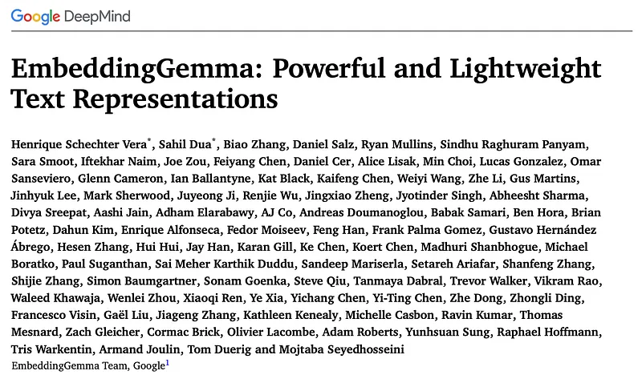
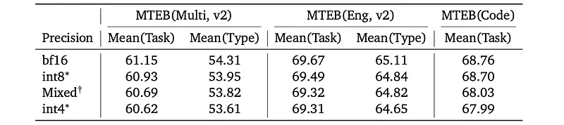
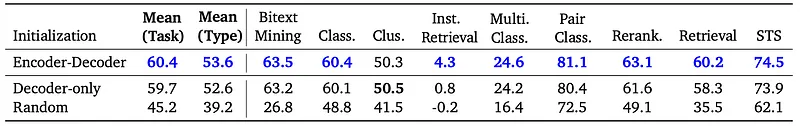
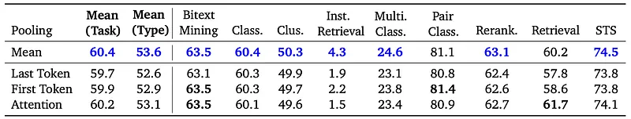
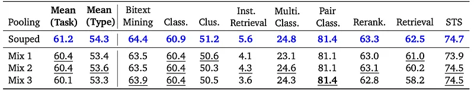
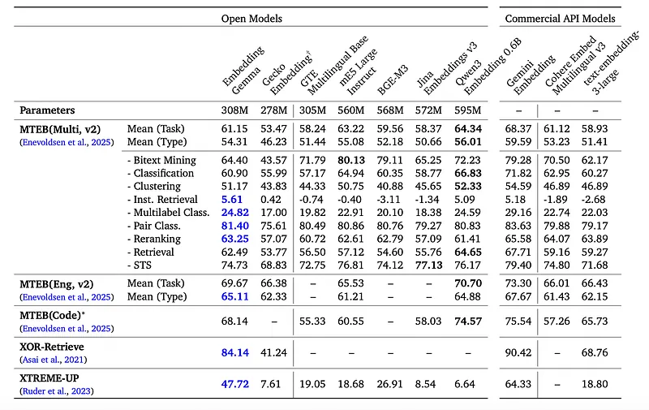
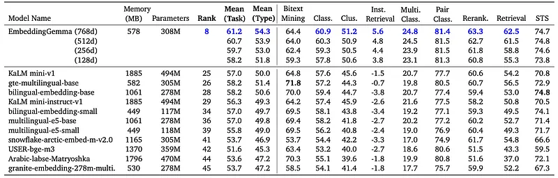
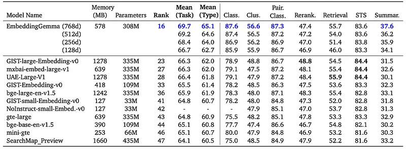
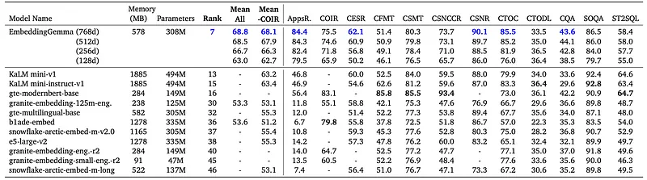
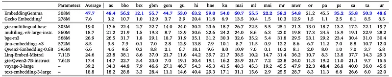

# Papers Explained 465 - EmbeddingGemma

EmbeddingGemma is an encoder-only transformer model adapted from a pretrained 300M decoder-only Gemma 3 model. The Gemma 3 model is adapted into an encoder-decoder model following the T5Gemma recipe, and then EmbeddingGemma is initialized from the encoder of this encoder-decoder model.

This page ingests the source article into the wiki and connects it to [[Papers Explained Corpus]], [[Large Language Models]], [[Embedding and Retrieval]], [[Model Compression and Efficiency]], [[Agentic AI]], [[Evaluation and Benchmarks]].

## Source Metadata

- Source file: `raw/2025-10-01_Papers-Explained-465--EmbeddingGemma-076b2bc8b460.md`
- Source title: Papers Explained 465: EmbeddingGemma
- Published: 2025-10-01
- Canonical: [https://medium.com/@ritvik19/papers-explained-465-embeddinggemma-076b2bc8b460](https://medium.com/@ritvik19/papers-explained-465-embeddinggemma-076b2bc8b460)

## Key Ideas

- EmbeddingGemma is an encoder-only transformer model adapted from a pretrained 300M decoder-only Gemma 3 model.
- Each training example includes a query 𝑞𝑖, a positive passage 𝑝+𝑖 , and (optionally) a hard negative passage 𝑝−𝑖 . Each example also has prescribed task strings 𝑡𝑞 and 𝑡𝑝 for queries and passages respectively, describing the nature of the task.
- The query and passages are embedded as vectors:
- EmbeddingGemma was trained using three different losses. The first is a noise-contrastive estimation (NCE) loss with in-batch negatives. Given a batch of size 𝐵 := |B|, the contrastive loss is defined as:
- where sim(x,y) is cosine similarity, and 𝟙TN masks out false negatives from duplicates:

## Notes

EmbeddingGemma is a new lightweight, open text embedding model based on the Gemma 3 language model family. Its innovative training recipe strategically captures knowledge from larger models via encoder-decoder initialization and geometric embedding distillation. Notably, it outperforms prior top models, both proprietary and open, with fewer than 500M parameters, and provides performance comparable to models double its size, offering an exceptional performance-to-cost ratio. Remarkably, this lead persists when quantizing model weights or truncating embedding outputs.

## Architecture

EmbeddingGemma is an encoder-only transformer model adapted from a pretrained 300M decoder-only Gemma 3 model. The Gemma 3 model is adapted into an encoder-decoder model following the T5Gemma recipe, and then EmbeddingGemma is initialized from the encoder of this encoder-decoder model.

Given an input sequence T of 𝐿 tokens, an 𝑛-layer transformer with bidirectional attention, M𝑛, is applied first. This produces a sequence of token embeddings Tembed = M𝑛(T) where 𝑑𝑀 is the model dimension used for the transformer’s inner representations. A mean pooling P is then employed, averaging the token embeddings along the sequence axis to generate a single embedding representing all the information in the input, producing Pembed = P(Tembed). A randomly initialized linear projection 𝑔 is applied next to upscale the embedding to an intermediate embedding dimension 𝑑𝑈, producing E𝑈 = 𝑔(Pembed). Finally, another randomly initialized linear projection 𝑓 scales the embedding to the target dimension 𝑑, resulting in E= 𝑓(E𝑈). In EmbeddingGemma, 𝑛= 24, 𝑑𝑀 = 768, 𝑑𝑈 = 3072, and 𝑑= 768 are used.

## Training

Each training example includes a query 𝑞𝑖, a positive passage 𝑝+𝑖 , and (optionally) a hard negative passage 𝑝−𝑖 . Each example also has prescribed task strings 𝑡𝑞 and 𝑡𝑝 for queries and passages respectively, describing the nature of the task. For instance, for retrieval, “task: search result | query: {content}” and “title: {title | ‘none’} | text: {content}” are used.

The query and passages are embedded as vectors:

EmbeddingGemma was trained using three different losses. The first is a noise-contrastive estimation (NCE) loss with in-batch negatives. Given a batch of size 𝐵 := |B|, the contrastive loss is defined as:

where sim(x,y) is cosine similarity, and 𝟙TN masks out false negatives from duplicates:

The hardness weight 𝑤𝑖 represents how challenging a (query, hard negative passage) pair is for the model to differentiate between, forcing it to learn more discriminative representations. This is defined as 𝑤𝑖 = exp(𝛼sg(sim(q𝑖,p−𝑖 ))), where sg(·)is the stop-gradient operator, and 𝛼 is a hyperparameter that controls the strength of the weighting, experimentally set to 5.0. The stop-gradient ensures we are weighing based on the current difficulty and not differentiating through the weight factor itself.

The second loss is based on the global orthogonal regularizer (GOR). This loss encourages EmbeddingGemma to produce embeddings that are spread out over the embedding space, to fully utilize the expressive power of the embedding space. This also intends to ensure that a) the model is robust to quantization (especially embedding quantization), and that b) the embeddings produced by the model can be retrieved efficiently in vector databases using approximate nearest neighbor (ANN) algorithms.

The idea is to make the embeddings of a random pair of inputs have similar statistical properties (mean and second moment) as two points independently and uniformly sampled from the unit sphere.

The third loss is an embedding matching loss based on geometric knowledge distillation for information retrieval. In contrast to previous distillation research which has relied only on the teacher’s query-document relevance scores as a signal, this loss directly aligns EmbeddingGemma’s embedding space with that of a teacher model, allowing it to more effectively learn from the larger, more powerful Gemini Embedding model. Embedding matching is applied not only to queries and passages but also to hard negative passages, as this substantially improves performance. Intuitively, this serves the same purpose as using hard negative passages in NCE loss, as the model learns how the teacher discriminates between the queries and its corresponding hard negatives. These individual losses are weighed uniformly.

The contrastive and spread-out losses are adapted using MRL, which splits each loss into 𝑘 separate losses applied to 𝑘 overlapping sub-dimensions of the embedding. Each of these individual losses are considered equally, simply adding their values during training without any special weights. EmbeddingGemma provides 𝑑= 768 dimensional embeddings, additionally supporting 512, 256, and 128 dimensional embeddings via MRL.

## Recipe

### Encoder-Decoder Training

The process begins with adapting the decoder-only Gemma 3 model to an encoder-decoder model to get a strong encoder with improved contextual representations. Following T5Gemma, the encoder-decoder is initialized with the Gemma 3 decoder-only checkpoint and further pretrain it on the Gemma 3 pretraining data with UL2.

### Pre-finetuning

The embedding model is then trained on large-scale unsupervised data to build the model’s generalization capabilities. The pre-finetuning mixture spans both various, evenly weighted task types — question answering, sentence similarity, code retrieval, and web search tasks — and various languages (natural and programming). Only (query, target) pairs are used as input, as the training mixture is large and noisy, so mining high-quality hard negatives is challenging. This process leverages a corpus containing billions of title and body text pairs crawled from websites, much like in previous work.

### Finetuning

The model is finetuned using a smaller but higher-quality mixture of task-specific datasets. A set of three different groups of tasks are utilized, aimed at task diversity, language diversity, and coding capability, respectively. This includes a subset of the academic datasets used by Gecko and the synthetic datasets used by Gemini Embedding. These mixtures specialize in different domains, creating experts which synergize during souping.

### Model Souping

Finally, models from finetuning runs are combined by averaging their parameters, to improve the final model’s quality and robustness

### Quantization-Aware Training

Quantized versions of EmbeddingGemma are provided in standard quantization configurations: int4 per-block, int8 per-block, and mixed-precision per-channel. These variants are obtained by applying quantization-aware training during the model fine tuning stage, to minimize quality degradation for quantized checkpoints.

*Figure: Performance of raw and quantized EmbeddingGemma checkpoints on MTEB benchmarks.*

## Ablation Studies

### Initialization Strategy

*Figure: Results using different initialization strategies.*

- Encoder-decoder initialization outperforms decoder-only initialization across various task types. This suggests the encoder-decoder is able to produce more expressive representations

### Pooling Types

*Figure: Results using different types of poolers.*

- In first-token pooling, the representation of the first token is taken and used directly.

- In last-token pooling, the same process is done with the last token of the sequence.

- Attention pooling utilizes an attention mechanism to weigh and aggregate the token representations.

- Mean pooling yields the best performance, despite attention pooling offering a large amount of additional learnable parameters.

### Model Souping

*Figure: Results using different training mixtures.*

- The model soup not only improves on overall performance, but even outperforms the ingredients in each task type.

- This indicates that model souping works not only on runs with varied hyperparameter configurations, but also on runs with different finetuning mixtures altogether.

## Evaluation

*Figure: Comparison of popular embedding models on MTEB(Multilingual, v2), MTEB(English, v2), and MTEB(Code).*

- Overall State-of-the-Art Performance: EmbeddingGemma achieves the #1 rank and highest overall performance on the MTEB multilingual, English, and code leaderboards for models under 500M parameters, demonstrating a significant lead over previous top models across aggregate metrics (Task Mean, Task Type Mean, Borda rank). This performance advantage holds even with lower-dimensional embeddings (128-dimensional).

- Competitiveness with Larger Models: EmbeddingGemma is competitive with larger models (nearly double its size), ranking #3, #2, and #2 across models under 1B parameters on the MTEB multilingual, English, and code leaderboards, respectively. It also outperforms most commercial API models, with the notable exception of Gemini Embedding.

*Figure: Performance of top leaderboard models under 500M parameters on MTEB(Multilingual, v2).*

- MTEB Multilingual Excellence: EmbeddingGemma leads in nearly all task types within the MTEB multilingual benchmark, achieving the highest aggregate scores and offering drastic improvements, even competing with larger models in specific task types like instruction retrieval, multilabel classification, pair classification, and reranking.

*Figure: Performance of top leaderboard models under 500M parameters on MTEB(Eng, v2).*

- Exceptional English Task Performance: In MTEB(Eng, v2), EmbeddingGemma achieves the highest overall scores and significant improvements in classification (+8.5), clustering (+7.8), and summarization (+4.4), topping the sub-1B-parameter leaderboard in these areas.

*Figure: Performance of top leaderboard models under 500M parameters on MTEB(Code, v1).*

- Strong Code Understanding and Cross-Domain Capability: EmbeddingGemma demonstrates the best performance in MTEB(Code) aggregate metrics (including Mean -COIR) and provides dramatic performance increases in tasks like AppsRetrieval (+37.6) and CosQA (+10.0), indicating its ability to create representations that work across languages and domains.

*Figure: Performance of top multilingual models on XTREME-UP (MRR@10).*

- Outstanding Low-Resource Language Capability: On XTREME-UP, EmbeddingGemma vastly outperforms top models with billions of parameters and commercial API models, achieving the strongest performance for each individual language evaluated among selected open models. This highlights its exceptional capability in low-resource languages.

## Paper

EmbeddingGemma: Powerful and Lightweight Text Representations [2509.20354](https://arxiv.org/abs/2509.20354)

## Figures

Figures from the Medium HTML export (`raw/2025-10-01_Papers-Explained-465--EmbeddingGemma-076b2bc8b460.md`); local copies under `wiki/assets/papers-explained-465-embeddinggemma/` when download succeeded.

| Figure | Caption |
|--------|---------|
|  | Title card: EmbeddingGemma. |
|  | The query and passages are embedded as vectors. |
|  | where sim(x,y) is cosine similarity, and 𝟙TN masks out false negatives from duplicates. |
|  | where sim(x,y) is cosine similarity, and 𝟙TN masks out false negatives from duplicates. |
|  | The second loss is based on the global orthogonal regularizer (GOR). |
|  | The third loss is an embedding matching loss based on geometric knowledge distillation for information retrieval. |
|  | Performance of raw and quantized EmbeddingGemma checkpoints on MTEB benchmarks. |
|  | Results using different initialization strategies. |
|  | Results using different types of poolers. |
|  | Results using different training mixtures. |
|  | Comparison of popular embedding models on MTEB(Multilingual, v2), MTEB(English, v2), and MTEB(Code). |
|  | Performance of top leaderboard models under 500M parameters on MTEB(Multilingual, v2). |
|  | Performance of top leaderboard models under 500M parameters on MTEB(Eng, v2). |
|  | Performance of top leaderboard models under 500M parameters on MTEB(Code, v1). |
|  | Performance of top multilingual models on XTREME-UP (MRR@10). |
## HF Blog Cross-References

- "Welcome EmbeddingGemma, Google's new efficient embedding model" (`huggingface.co/blog/embeddinggemma`, 2025-09-04) is the launch-day integration post from Hugging Face and Google. It repeats the architecture and MRL truncation details above but adds practical material this page doesn't cover: the required task-prefix strings for each MTEB task type, framework usage snippets for Sentence Transformers, LangChain, LlamaIndex, Haystack, txtai, Transformers.js, and Text Embeddings Inference/ONNX Runtime, and a worked domain fine-tuning case study. Fine-tuning `google/embeddinggemma-300m` on the MIRIAD medical QA dataset (100K pairs, `CachedMultipleNegativesRankingLoss`, ~5.5h on one RTX 3090) produced `sentence-transformers/embeddinggemma-300m-medical`, raising NDCG@10 on a held-out medical-retrieval test set from 0.8340 to 0.8862 and beating every general-purpose embedding model tested at the same size.

## Related

- [[Papers Explained Corpus]]
- [[Large Language Models]]
- [[Embedding and Retrieval]]
- [[Model Compression and Efficiency]]
- [[Agentic AI]]
- [[Evaluation and Benchmarks]]
- [[Papers Explained 464 - AggLM]]
- [[Papers Explained 466 - Jina Code Embeddings]]

#summary #topic
