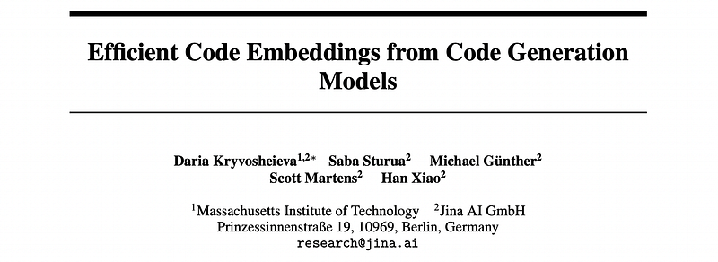
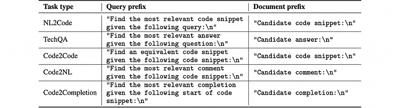
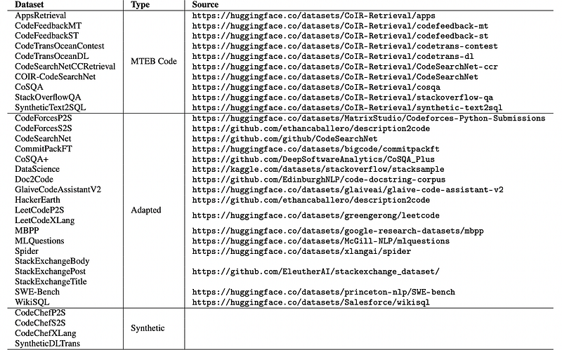
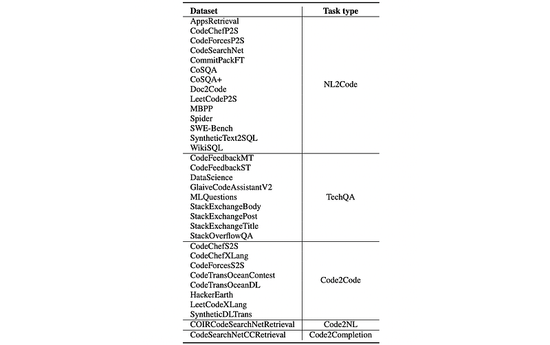
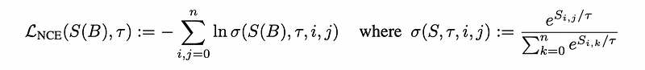
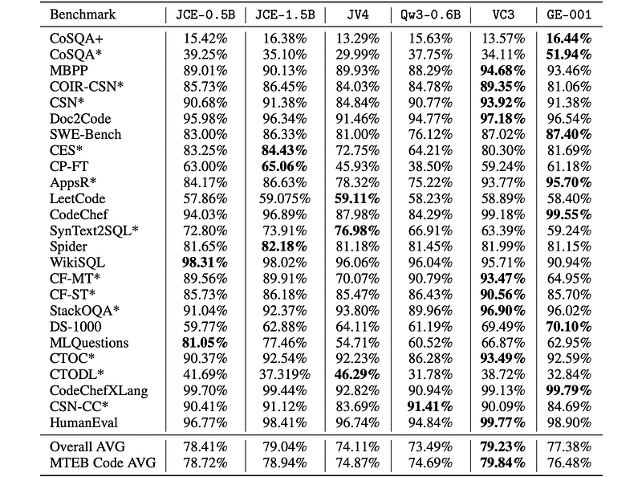

# Papers Explained 466 - Jina Code Embeddings

jina-code-embeddings is a novel code embedding model suite designed to retrieve code from natural language queries, perform technical question-answering, and identify semantically similar code snippets across programming languages.

This page ingests the source article into the wiki and connects it to [[Papers Explained Corpus]], [[Code Models]], [[Embedding and Retrieval]], [[Reasoning Models]], [[Model Compression and Efficiency]], [[Large Language Models]].

## Source Metadata

- Source file: `raw/2025-10-02_Papers-Explained-466--Jina-Code-Embeddings-0a6c9ad05bbd.html`
- Source title: Papers Explained 466: Jina Code Embeddings
- Published: 2025-10-02
- Canonical: [https://medium.com/@ritvik19/papers-explained-466-jina-code-embeddings-0a6c9ad05bbd](https://medium.com/@ritvik19/papers-explained-466-jina-code-embeddings-0a6c9ad05bbd)

## Key Ideas

- jina-code-embeddings-0.5b and 1.5b build on the Qwen2.5-Coder-0.5B and Qwen2.5-Coder-1.5B backbones. The final hidden layer of the LLMs is transformed into an embedding via last-token pooling.
- Downstream code embedding tasks were analyzed and divided into five categories: Natural language to code retrieval (NL2Code), technical question answering (TechQA), code-to-code retrieval (Code2Code), code to natural language retrieval (Code2NL), and code to...
- For each of these tasks, an instruction string in English was created that prefixes the text passed to the Model.
- The model undergoes further training with a contrastive objective using the InfoNCE loss function. Pairs of inputs are classed as related or unrelated, and the model learns to embed related items closely together and unrelated items further apart.
- where τ is the temperature (training hyperparameter), and n is the batch size, which increases the weight of small differences in similarity scores in calculating the loss.

## Notes

jina-code-embeddings is a novel code embedding model suite designed to retrieve code from natural language queries, perform technical question-answering, and identify semantically similar code snippets across programming languages. It makes use of an autoregressive backbone pre-trained on both text and code, generating embeddings via last-token pooling.

## Method

### Model Architecture

jina-code-embeddings-0.5b and 1.5b build on the Qwen2.5-Coder-0.5B and Qwen2.5-Coder-1.5B backbones. The final hidden layer of the LLMs is transformed into an embedding via last-token pooling. Last-token pooling gave better performance than mean pooling or latent attention pooling. CLS pooling was not tested, but is generally not favored for decoder-only architectures.

Downstream code embedding tasks were analyzed and divided into five categories: Natural language to code retrieval (NL2Code), technical question answering (TechQA), code-to-code retrieval (Code2Code), code to natural language retrieval (Code2NL), and code to completion retrieval (Code2Completion).

For each of these tasks, an instruction string in English was created that prefixes the text passed to the Model.

*Figure: Task categories and their corresponding instruction prefixes.*

### Training

The model undergoes further training with a contrastive objective using the InfoNCE loss function. Pairs of inputs are classed as related or unrelated, and the model learns to embed related items closely together and unrelated items further apart. Matryoshka representation learning is used during training to produce truncat-able embeddings, so users can make flexible trade-offs between precision and resource usage.

The training data consists of query-document pairs for a variety of code retrieval tasks, largely using docstrings, comments, commit messages, and problem statements as queries, and matching code snippets, diffs, or answers as documents. A selection of internet forum questions and answers relating to computer technologies was also used. These pairs have been collected from various sources, including the training splits of MTEB code tasks and the non-MTEB code retrieval dataset CoSQA+. Additionally, public datasets originally created for other purposes were adapted. GPT-4o was used to synthetically generate datasets when available data is scarce. The SyntheticDLTrans dataset consists of generated deep learning code translations between frameworks, an area where very little non-synthetic data is available. A multilingual extension of the CodeChef dataset was also synthesized, using the original programming solutions in C++ and Python to generate solutions in eight more programming languages. The resulting dataset has been adapted for three tasks: CodeChefP2S (problem-to-solution), CodeChefS2S (monolingual solution-to-solution), and CodeChefXLang (crosslingual solution-to-solution).

*Figure: Datasets used to train jina-code-embeddings.*

*Figure: Breakdown of the training datasets by task type.*

In each training step, a batch B = (q1,d1),…,(qn,dn) of n query-document text pairs is sampled. Normalized embeddings are generated for all texts in the selected pairs. A matrix of similarity values Sdense(B) is constructed by calculating the cosine similarity of all combinations of embeddings qi and dj in B. Training is performed by taking the training embedding pairs (qi,di) as similar, and all other combinations of (qi,dj),i̸= j in each batch as dissimilar. The contrastive InfoNCE loss function LNCE is then applied on the resulting matrix of similarity scores.

where τ is the temperature (training hyperparameter), and n is the batch size, which increases the weight of small differences in similarity scores in calculating the loss. During training, constant hyperparameters are maintained: τ = 0.05, n= 512 for the 0.5B parameter model and n= 256 for the 1.5B parameter one, and sequence length is 512.

## Evaluation

*Figure: Evaluation Results on Code Retrieval Tasks.*

- Both jina-code-embeddings-0.5b and 1.5b outperform similar-sized general-purpose embedding model Qwen3-Embedding-0.6B and the substantially larger models jina-embeddings-v4 and gemini-embedding-001.

## Paper

Efficient Code Embeddings from Code Generation Models [2508.21290](https://arxiv.org/abs/2508.21290)

## Figures

Figures from the Medium HTML export (`raw/2025-10-02_Papers-Explained-466--Jina-Code-Embeddings-0a6c9ad05bbd.html`); local copies under `wiki/assets/papers-explained-466-jina-code-embeddings/` when download succeeded.

| Figure | Caption |
|--------|---------|
|  | Title card: Jina Code Embeddings. |
|  | Task categories and their corresponding instruction prefixes. |
|  | Datasets used to train jina-code-embeddings. |
|  | Breakdown of the training datasets by task type. |
|  | In each training step, a batch B = (q1,d1),…,(qn,dn) of n query-document text pairs is sampled. |
|  | Evaluation Results on Code Retrieval Tasks. |
## Related

- [[Papers Explained Corpus]]
- [[Code Models]]
- [[Embedding and Retrieval]]
- [[Reasoning Models]]
- [[Model Compression and Efficiency]]
- [[Large Language Models]]
- [[Papers Explained 465 - EmbeddingGemma]]
- [[Papers Explained 467 - Mix Data or Merge Models]]

#summary #topic
