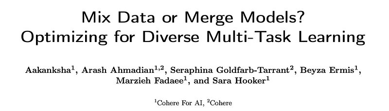
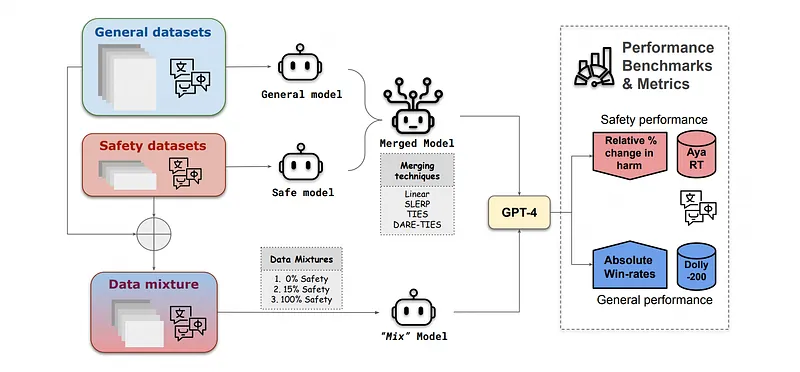
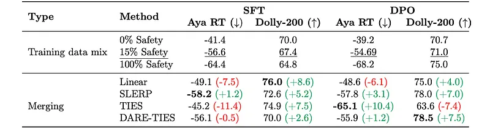
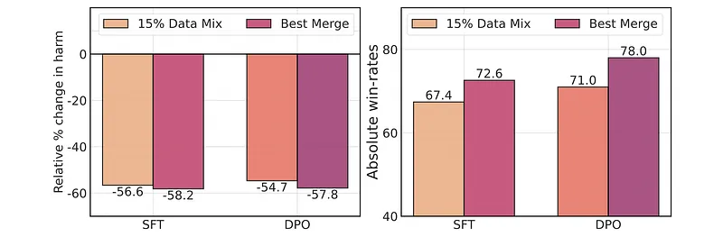
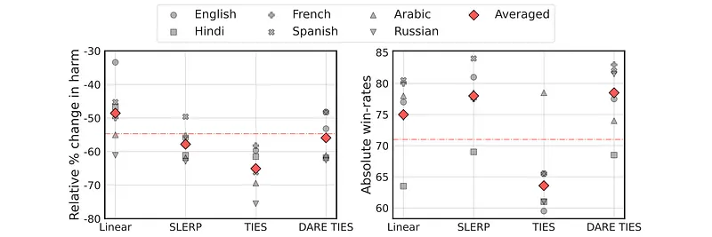
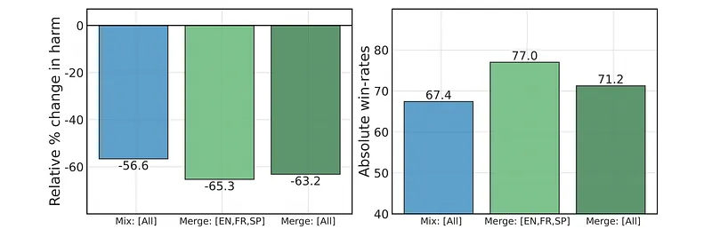
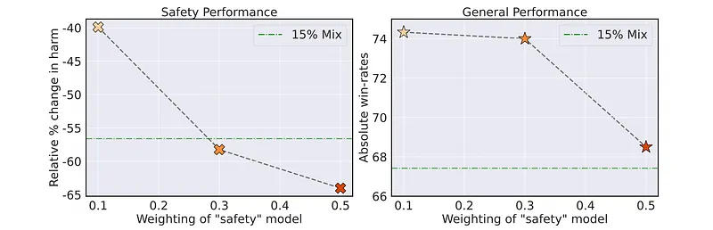

# Papers Explained 467 - Mix Data or Merge Models

Extensive experiments are conducted with diverse data mixtures to create a pool of model candidates. From this pool, the best-performing checkpoints are merged using four different algorithms to produce the final merged models:

This page ingests the source article into the wiki and connects it to [[Papers Explained Corpus]], [[Safety and Alignment]], [[Multilingual Models]], [[Embedding and Retrieval]], [[Supervised Fine-Tuning]].

## Source Metadata

- Source file: `raw/2025-10-03_Papers-Explained-467--Mix-Data-or-Merge-Models-75a3373c7f30.md`
- Source title: Papers Explained 467: Mix Data or Merge Models
- Published: 2025-10-03
- Canonical: [https://medium.com/@ritvik19/papers-explained-467-mix-data-or-merge-models-75a3373c7f30](https://medium.com/@ritvik19/papers-explained-467-mix-data-or-merge-models-75a3373c7f30)

## Key Ideas

- Linear merging involves simple linear weighted averaging of model parameters, weighted by specified coefficients.
- where αi represents the weight assigned to the parameters of each model, with the constraint that ∑_{i=1}^{N} αi = 1. Ablations are conducted by varying the values of αi to investigate different weighting ratios for the base models.
- This technique smoothly blends two models by interpolating their weights along the shortest path on a high-dimensional sphere. SLERP preserves each model’s unique characteristics and geometric properties, even in complex spaces.
- SLERP typically merges only two models at a time. Here, t ∈[0,1] determines the interpolation weight, with t= 0 using only Model 1 and t= 1 using only Model 2. This method improves upon standard weight averaging by preserving the models’ geometric integrity.
- This method efficiently combines multiple models by addressing parameter interference and sign conflicts, which occur when models suggest opposing adjustments to the same parameter due to task-specific fine-tuning.

## Notes

This work explores model merging in a diverse multi-task setting, combining safety and general-purpose tasks within a multilingual context. Each language introduces unique and varied learning challenges across tasks. Objective-based merging is more effective than mixing data, with improvements of up to 8% and 10% in general performance and safety respectively. Language-based merging is highly effective, by merging monolingually fine-tuned models, a 4% increase in general performance and 7% reduction in harm across all languages is achieved on top of the data mixtures method using the same available data.

## Experiment Setup

*Figure: Overview of the Mix versus Merge framework.*

### Merging Approaches

Extensive experiments are conducted with diverse data mixtures to create a pool of model candidates. From this pool, the best-performing checkpoints are merged using four different algorithms to produce the final merged models:

Linear Merge

Linear merging involves simple linear weighted averaging of model parameters, weighted by specified coefficients.

where αi represents the weight assigned to the parameters of each model, with the constraint that ∑_{i=1}^{N} αi = 1. Ablations are conducted by varying the values of αi to investigate different weighting ratios for the base models.

Spherical Linear Interpolation (SLERP)

This technique smoothly blends two models by interpolating their weights along the shortest path on a high-dimensional sphere. SLERP preserves each model’s unique characteristics and geometric properties, even in complex spaces. The process involves normalizing the vectors to ensure equal length, calculating the angle Ω between them, and performing the interpolation as follows:

SLERP typically merges only two models at a time. Here, t ∈[0,1] determines the interpolation weight, with t= 0 using only Model 1 and t= 1 using only Model 2. This method improves upon standard weight averaging by preserving the models’ geometric integrity.

TIES-Merging

This method efficiently combines multiple models by addressing parameter interference and sign conflicts, which occur when models suggest opposing adjustments to the same parameter due to task-specific fine-tuning. The process begins by trimming parameters to retain only those with significant magnitude changes. It then resolves sign conflicts by creating a consensus sign vector:

Finally, it merges the parameters by averaging those that align with the consensus sign:

TIES-Merging ensures that only parameters contributing to the agreed-upon direction are included in the final model, enhancing performance.

DARE-TIES

This technique builds upon TIES by applying dropout to the delta parameters before merging them using the TIES method. It reduces interference from redundant parameters and helps maintain the model’s overall performance.

Gradient weighting is applied to all merging methods except for Linear Merge. Gradient weighting dictates how the ratio changes across the specified values and uses linear interpolation to further establish a smoother gradient of blend ratios for merging the tensors of the models. For example, if the blend ratio between Model 1 and Model 2 is defined as [0, 0.5, 1], this implies that the merge begins with 100% of Model 2’s parameters, gradually transitioning to a 50–50 blend between the two and concluding with only Model 1’s parameters at the end. For all methods, an exhaustive search over the set {0,0.3,0.5,0.7,1} is conducted to determine the optimal parameter contributions.

### Training Data

- Safety dataset: Human-annotated prompts from the multilingual Aya Red-teaming dataset are used as seeds to synthetically generate pairs of adversarial prompts and contextually safe completions.

- General purpose dataset: A sampled set of 10,000 English prompts from the Ultrafeedback Binarized dataset are translated into the target languages.

- Training data Mix: This research studies models trained on different mixtures of data: 0% Safety Mix, 15% Safety Mix, and 100% Safety Mix. The varying ratio of safety data simulates different objectives.

### Key Ablations

- Objective-based merging: To evaluate the relative merits of merging on balancing dual-objectives, models that have been separately optimized for general-purpose abilities and safety are merged. This builds upon multilingual 0% and 100% Safety Mixes to balance the trade-offs between safety and general performance.

- Language-based merging: The aim is to determine whether language-specific models can be used off-the-shelf to incorporate language capabilities and explore how merging models based exclusively on different languages affects their downstream performance. Specifically, the research investigates whether combining models optimized for both safety and general performance with a 15% language-specific safety mix for the target languages leads to better performance than training on a mixture of those languages.

- Comparison of merging applied to DPO and SFT: To determine the optimal stage for maximizing its benefits, SFT and DPO checkpoints are merged and evaluated independently. These techniques have shown great success towards the alignment of language models.

- Sensitivity to hyperparameters: Previous works have shown that merging is sensitive to the hyperparameters involved and have developed sophisticated algorithms to find the optimal values for the same. To this end, the impact of varying the weighting scheme of Linear merging on both general performance and safety is sought.

## Evaluation

The Aya 23 8B model is used as the baseline. The evaluation focuses on two key aspects:

- Safety: Measured by the negative relative percent change in harmful model generations compared to the Aya 23 base model. The English prompts from the human-annotated Aya Red-teaming dataset are translated into Hindi, French, Spanish, Arabic, and Russian using the NLLB-3.3B model for evaluation across 6 languages.

- General Performance: Measured using the Multilingual Dolly-200 Eval set, which assesses open-ended generation capabilities. Win-rates against the baseline are used to track performance changes.

The evaluation framework uses the LLM-as-an-evaluator approach with GPT-4 as the judge model to classify model outputs for safety and to indicate preferences between model responses for general performance.

### Merging for the win

*Figure: Comparison of Safety and General performance across various methods.*

- Merging generally improves general performance compared to the 15% Safety Mix baseline.

- DARE-TIES and SLERP achieve gains as high as 7.5% and 7% respectively in general performance.

- Most merging methods improve safety performance compared to the 15% Safety Mix baseline, except for Linear.

- TIES significantly improves harm reduction by around 10% over the 15% Safety Mix.

*Figure: Mixing versus merging.*

- SLERP is the most effective method for balancing safety and general performance.

- Merging checkpoints leads to greater improvements in both win rates and harm reduction compared to the 15% Safety Mix model.

### DPO merge is better than SFT merge

- Merging DPO checkpoints yields larger and more consistent improvements compared to merging SFT checkpoints, with average gains of 2.8% for general performance and 2.2% for safety over the base model.

- Merging SFT checkpoints results in significant general performance gains (around 6%) but also leads to an average increase of 4.6% in harmful generations

### Uneven gains across languages

*Figure: Comparison between different merging methods across safety and general performance with DPO checkpoints.*

- The optimal merging strategy varies depending on the language and the training regime (DPO vs. SFT) of the merged checkpoints.

For DPO-based models:

- Russian shows the most successful safety performance with TIES merging.

- Spanish exhibits the most impressive improvements in general performance with SLERP.

For SFT-based models:

- Hindi displays the largest reduction in harm with SLERP.

- Spanish continues to reap the most benefits from merging with Linear and TIES in general performance.

- English benefits the least from merging DPO-based checkpoints, showing a decline in both safety and general metrics.

- Spanish shows the lowest safety performance with TIES when merging SFT checkpoints.

- Hindi has the least gains in general performance with DARE-TIES when merging SFT checkpoints.

### Merging monolingual models

*Figure: Monolingual model merging.*

- Merging monolingual models increases general performance and reduces harm generation compared to the base model.

- Merging all 6 monolingual models ([All]) outperforms the multilingual mix baseline, with harm reductions up to 6.6% and general performance improvements of 3.8%.

- Merging 3 models ([EN,FR,SP]) yields better performance than merging 6 models, suggesting cross-lingual interference when merging more languages (approximately 2% better in safety and 6% in general performance).

- Model merging is an effective method for integrating diverse languages without sacrificing performance, but the choice and number of languages significantly influence performance gains.

### Impact of safety model weight on merging

*Figure: Comparison between offline preference tuning models before (row 2) and after (row 3) merging.*

*Figure: Effect of “safety weighting” while Linear merging.*

- Increasing the weight of the safety model during merging significantly enhances the safety performance of the merged model. The merged model outperforms the 15% Safety Mix baseline even with a relatively low weighting (0.3) for the safety model.

- Increasing the weight of the safety model leads to a decrease in general task performance.

- Merging models consistently outperforms the data mix run across all weightings.

- Offline preference tuning models show different results before and after merging, with specific changes in harm reduction and gains compared to the 15% Safety Mix model.

### Continual training after merging

- Continually preference-tuning after merging (SFT → ⟨merge⟩ → DPO) leads to better alignment compared to preference-tuning each model individually before merging (SFT → DPO → ⟨merge⟩).

- The “after” merging variant shows a 6.5% reduction in harmful generations (better safety performance).

- The “before” merging variant shows a 3.1% reduction in harmful generations.

- Both variants show improvements in general performance. The “after” merge variant yields a 3% increase, and the “before” merge variant achieves a 7% increase.

## Paper

Mix Data or Merge Models? Optimizing for Diverse Multi-Task Learning [2410.10801](https://arxiv.org/abs/2410.10801)

## Figures

Figures from the Medium HTML export (`raw/2025-10-03_Papers-Explained-467--Mix-Data-or-Merge-Models-75a3373c7f30.md`); local copies under `wiki/assets/papers-explained-467-mix-data-or-merge-models/` when download succeeded.

| Figure | Caption |
|--------|---------|
|  | Title card: Mix Data or Merge Models. |
|  | Overview of the Mix versus Merge framework. |
|  | Linear merging involves simple linear weighted averaging of model parameters, weighted by specified coefficients. |
|  | This technique smoothly blends two models by interpolating their weights along the shortest path on a high-dimensional sphere. |
|  | Finally, it merges the parameters by averaging those that align with the consensus sign. |
|  | Finally, it merges the parameters by averaging those that align with the consensus sign. |
|  | Comparison of Safety and General performance across various methods. |
|  | Mixing versus merging. |
|  | Comparison between different merging methods across safety and general performance with DPO checkpoints. |
|  | Monolingual model merging. |
|  | Comparison between offline preference tuning models before (row 2) and after (row 3) merging. |
|  | Effect of “safety weighting” while Linear merging. |
## Related

- [[Papers Explained Corpus]]
- [[Safety and Alignment]]
- [[Multilingual Models]]
- [[Embedding and Retrieval]]
- [[Supervised Fine-Tuning]]
- [[Papers Explained 466 - Jina Code Embeddings]]
- [[Papers Explained 468 - NaturalThoughts]]

#summary #topic
