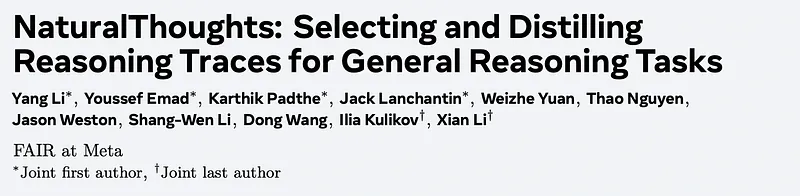
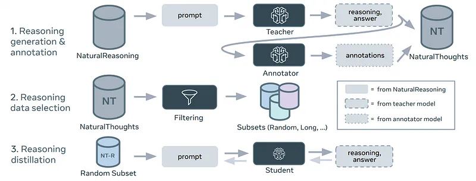
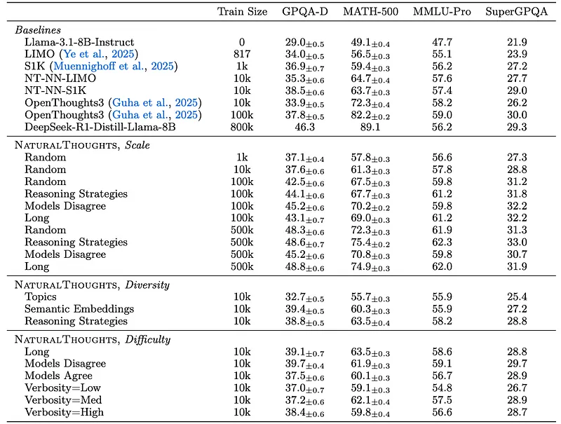
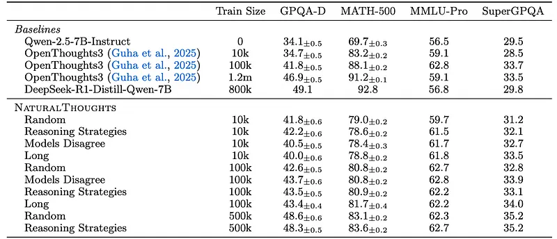
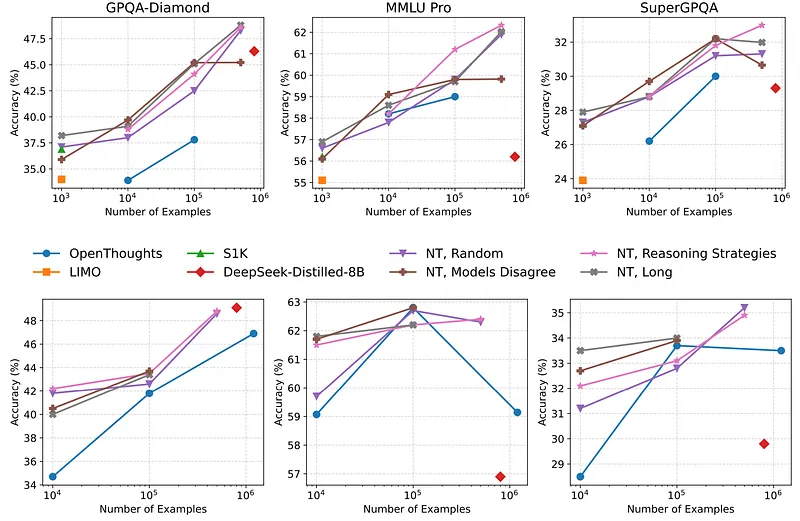
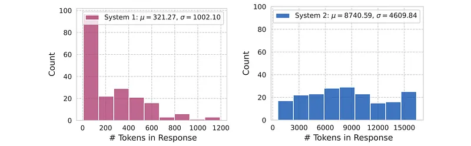
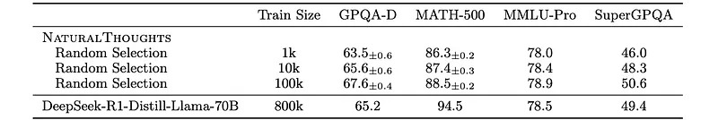
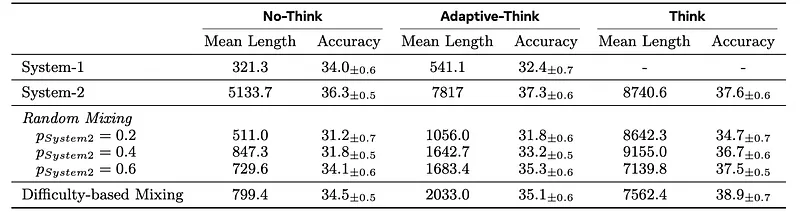

# Papers Explained 468 - NaturalThoughts

This study examines different data selection strategies along two axes: diversity and difficulty.

This page ingests the source article into the wiki and connects it to [[Papers Explained Corpus]], [[Reasoning Models]], [[Synthetic Data]], [[Large Language Models]], [[Embedding and Retrieval]], [[Model Compression and Efficiency]], [[Model Distillation]].

## Source Metadata

- Source file: `raw/2025-10-06_Papers-Explained-468--NaturalThoughts-360e8075f17c.md`
- Source title: Papers Explained 468: NaturalThoughts
- Published: 2025-10-06
- Canonical: [https://medium.com/@ritvik19/papers-explained-468-naturalthoughts-360e8075f17c](https://medium.com/@ritvik19/papers-explained-468-naturalthoughts-360e8075f17c)

## Key Ideas

- Diversity is hypothesized to be effective for distillation. To obtain diverse subsets of data, three properties are utilized:
- Question topics: Data is sampled uniformly across the 12 topic domains, with approximately 850 samples taken from each domain.
- Question semantic embeddings: Questions are embedded using Llama 3.1–8B-Instruct. Density-based clustering is then performed on the embeddings, and samples are uniformly taken from each cluster.
- Another hypothesis is that the quality of the reasoning traces is correlated with the difficulty of the questions, which usually requires advanced reasoning.
- Length: examples with short reasoning responses are downsampled to study the benefit of using longer reasoning chains.

## Notes

This work curates high-quality NaturalThoughts by selecting reasoning traces from a strong teacher model based on a large pool of questions from NaturalReasoning. A systematic analysis of factors that affect distilling reasoning capabilities is conducted, in terms of sample efficiency and scalability for general reasoning tasks. It is observed that simply scaling up data size with random sampling is a strong baseline with steady performance gains. Further, selecting difficult examples that require more diverse reasoning strategies is more sample-efficient to transfer the teacher model’s reasoning skills.

## Method

*Figure: NaturalThoughts Overview.*

The objective is to distill reasoning capabilities from a “reasoning” teacher model to an (initially) “non-reasoning” student model. Each reasoning training example is defined as a (question, reasoning response) pair, where the response is generated by a teacher model. The response consists of two parts: the intermediate reasoning trace (e.g. the tokens between <think> and </think>, which represent System-2 reasoning) and the final answer (System-1). Questions are sampled from NaturalReasoning, a comprehensive dataset comprising 2.8 million questions that span multiple domains and have been shown to be effective in eliciting reasoning. DeepSeek-R1 is used as the teacher model to generate reasoning responses. The resulting dataset of distilled reasoning examples is called NaturalThoughts.

### Reasoning Annotation

Given a training set of (question, reasoning response) pairs, the data is first annotated using three different annotations. First, the domain and topics of each question are annotated, including 13 top-level domains such as Engineering, Philosophy, Medicine, Economics, Science, Law, History, Education, Management, Literature and Arts, Agronomy, Sociology and Military Science, by prompting Llama-3.1–70B-Instruct. Then, for each reasoning trace, Llama-3.1–70B-Instruct is prompted to identify the “meta-reasoning” strategies throughout the thinking process, such as self-verification, backtracking, exploration, etc. and to score the “verbosity” of the reasoning, from 0 to 10, where 0 means the reasoning is very efficient with no rambling, and 10 means excessive rambling and not making progress towards a solution.

### Reasoning Data Selection

This study examines different data selection strategies along two axes: diversity and difficulty.

Diversity is hypothesized to be effective for distillation. To obtain diverse subsets of data, three properties are utilized:

- Question topics: Data is sampled uniformly across the 12 topic domains, with approximately 850 samples taken from each domain.

- Question semantic embeddings: Questions are embedded using Llama 3.1–8B-Instruct. Density-based clustering is then performed on the embeddings, and samples are uniformly taken from each cluster.

- Reasoning strategies: Each example has a set of strategies S= {si}. There are frequently used strategies such as self-verification, followed by a long tail of niche strategies. To select examples demonstrating diverse problem-solving strategies without “overthinking”, examples where the number of reasoning strategies |S|≤Rmin or |S|>Rmax are downsampled. Rmin = 4 and Rmax = 8 are used, based on the distribution of unique strategies annotated per example. Examples with low reasoning density, measured as having fewer unique reasoning strategies than the number of reasoning steps, are also downsampled.

Another hypothesis is that the quality of the reasoning traces is correlated with the difficulty of the questions, which usually requires advanced reasoning. Therefore, data subsets with varying levels of difficulty are attempted to be created using the following strategies.

- Length: examples with short reasoning responses are downsampled to study the benefit of using longer reasoning chains. Specifically, each example is sampled with probability p= (l/C)τ, where l is the length of reasoning response measured by the number of tokens, C is a constant normalizer, and τ is the sampling temperature modulating how heavily shorter sequences are downsampled. C = 5000, τ = 2.5.

- Verbosity: three subsets are derived by sampling without replacement based on the scores: Low (beginning with the lowest verbosity, 0, and progressively including samples with higher verbosity), High (starting from the highest verbosity, 10, and progressively including samples with lower verbosity), and Med (including all samples with a verbosity of 5).

- Models Agreement: For each example, responses from a model with long CoT reasoning traces (Deepseek-R1) and a model without long CoT traces (Llama-3.3–70B) are compared. Their disagreement, judged by Llama-3.1–8B-Instruct, is used as a proxy of question difficulty. Two subsets of training examples are created based on solution agreement or disagreement.

### Mixed Reasoning Distillation

As the teacher reasoning model may have sub-optimal reasoning patterns such as “overthinking” or “under-thinking”, different settings of distilling the teacher model’s reasoning are compared.

- System-2 Distillation involves supervised finetuning on the entire response generated by the teacher model, which includes the full reasoning trace and the final answer.

- System-1 Distillation investigates the effectiveness of only learning from the teacher’s final answer instead of the long CoT reasoning trace.

- Mixed System-1 and System-2 Training utilizes a mixture of examples from both types described above. Two mixing approaches are compared: random mixing and difficulty-based mixing. In random mixing, training examples with full System-2 reasoning are selected with probability p= {0.2,0.4,0.6}. In difficulty-based mixing, full System-2 reasoning traces are used for examples annotated with disagreement (as a proxy of difficult questions) and only the condensed System-1 response is used for the remaining examples.

To enable explicit control of which types of reasoning to use at inference time, an explicit instruction is appended to the end of the question to indicate which types of reasoning and how much inference budget the response should use. At inference time, the accuracy-efficiency trade-offs are evaluated under three settings:

- No-Think: The model is instructed to “Answer directly without thinking”, i.e. perform System-1 mode of reasoning by generating short condensed answers.

- Think: The model is instructed to “Think carefully before answering. Use about {K} words” followed by the special begin-of-reason token <think> for force the generation into a full System-2 mode. K is set to 3500 which is the average length of System-2 responses in the training set.

- Adaptive-Think: To test whether the mixed System-1 and System-2 distillation can enable the student model to efficiently and automatically adapt to the question difficulty at inference time, a hybrid mode is also evaluated, where the model is instructed to “Think carefully before answering.” but without explicitly appending the special token <think>.

## Experiment Setup

Supervised finetuning is performed with NaturalThoughts data on Llama-3.1–8B-Instruct, Qwen-2.5–7B-Instruct, and Llama-3.3–70B-Instruct student models with DeepSeek R1 as the teacher model. A maximum response length of 16,384 tokens is used and each training example contains a complete response within the maximum number of tokens. Training epochs are 10 for 1k samples, 6 for 10k, 8 for 100k, and 500k training examples respectively. The AdamW optimizer with 0.1 weight decay and a constant learning rate 2e−5 are utilized.

## Results

*Figure: Reasoning data scaling and selection for the Llama-3.1–8b-Instruct student model.*

- Randomly selecting 1,000 examples from NaturalThoughts outperforms LIMO and is on par with S1K.

- Selecting examples based on diverse reasoning strategies results in the best performance compared to question topic or semantic embedding diversity.

- Training on the “Long” subset (longer reasoning traces) performs better than random selection.

- Training on the “Models Disagree” subset (examples where models disagree) performs better than random selection and “Long” reasoning traces.

*Figure: Reasoning data scaling and selection for the Qwen-2.5–7B-Instruct student model.*

- Training with 500k examples from NaturalThoughts outperforms training with 1.2m examples from OpenThoughts3 on three of the four evaluation benchmarks.

- The “Medium Verbosity” subset is on average the best performing verbosity training set.

- Scaling up the NaturalThoughts dataset size improves performance on tasks requiring knowledge and reasoning, unlike observations with LIMO and S1K datasets.

- Manually curated data as question seeds (NT-NN-LIMO, and NT-NN-S1K) improves the scaling trend compared to random selection.

*Figure: Comparison of NaturalThoughts (NT) with existing distillation datasets, when training Llama-3.1–8BInstruct (Top) and Qwen-2.5–7B-Instruct (Bottom) respectively.*

- Performance does not saturate even when scaling up to 500,000 examples, using both random selection and selection based on reasoning strategy diversity.

*Figure: Generation length distributions of System-1 and System-2 reasoning for GPQA-Diamond.*

- System-2 responses are significantly longer than those of System-1 and exhibit greater variance, as the response lengths vary based on the amount of thinking required for each question, depending on its complexity.

*Figure: Scaling results with a larger model.*

- Scaling up data size consistently improves performance across all four tasks, even with a larger student model (Llama-3.3–70B-Instruct).

- Training Llama-3.3–70B-Instruct with NaturalThoughts outperforms DeepSeek-R1-Distill-Llama-70B on general STEM reasoning tasks, even though DeepSeek-R1-Distill-Llama-70B was trained with more data.

*Figure: Mixed Reasoning Distillation.*

- System-2 Distillation: Achieves higher accuracy (37.6%) but at the cost of significantly longer response lengths (8,740 tokens).

- System-1 Distillation: Achieves significant inference-time efficiency gains (27x shorter responses) with a small accuracy drop (4.6%) compared to System-2. However, it cannot leverage test-time compute.

- Random Mixing Distillation: Enables the student model to flexibly adjust response length at inference time, interpolating between fast and slow thinking. Performance and response length are influenced by the proportion of System-2 examples used during training.

- Difficulty-based Mixing Distillation: Achieves the best accuracy (38.9%) and a favorable accuracy-efficiency tradeoff. It outperforms random mixing methods, suggesting that selectively applying System-1 and System-2 distillation based on question difficulty is beneficial.

## Paper

NaturalThoughts: Selecting and Distilling Reasoning Traces for General Reasoning Tasks [2507.01921](https://arxiv.org/abs/2507.01921)

## Figures

Figures from the Medium HTML export (`raw/2025-10-06_Papers-Explained-468--NaturalThoughts-360e8075f17c.md`); local copies under `wiki/assets/papers-explained-468-naturalthoughts/` when download succeeded.

| Figure | Caption |
|--------|---------|
|  | Title card: NaturalThoughts. |
|  | NaturalThoughts Overview. |
|  | Reasoning data scaling and selection for the Llama-3.1–8b-Instruct student model. |
|  | Reasoning data scaling and selection for the Qwen-2.5–7B-Instruct student model. |
|  | Comparison of NaturalThoughts (NT) with existing distillation datasets, when training Llama-3.1–8BInstruct (Top) and Qwen-2.5–7B-Instruct (Bottom) respectively. |
|  | Generation length distributions of System-1 and System-2 reasoning for GPQA-Diamond. |
|  | Scaling results with a larger model. |
|  | Mixed Reasoning Distillation. |
## Related

- [[Papers Explained Corpus]]
- [[Reasoning Models]]
- [[Synthetic Data]]
- [[Large Language Models]]
- [[Embedding and Retrieval]]
- [[Model Compression and Efficiency]]
- [[Model Distillation]]
- [[Papers Explained 467 - Mix Data or Merge Models]]
- [[Papers Explained 469 - MobileLLM-R1]]

#summary #topic
