# Papers Explained 47 - Gopher

This paper presents an analysis of Transformer-based language model performance across a wide range of model scales — from models with tens of millions of parameters up to a 280 billion parameter model called Gopher. These models are evaluated on 152 diverse tasks, achieving state-of-the-art performance across the majority.

This page ingests the source article into the wiki and connects it to [[Papers Explained Corpus]], [[Large Language Models]], [[Long Context]], [[Vision Language Models]], [[Reasoning Models]], [[Evaluation and Benchmarks]].

## Source Metadata

- Source file: `raw/2023-07-17_Papers-Explained-47--Gopher-2e71bbef9e87.html`
- Source title: Papers Explained 47: Gopher
- Published: 2023-07-17
- Canonical: [https://medium.com/@ritvik19/papers-explained-47-gopher-2e71bbef9e87](https://medium.com/@ritvik19/papers-explained-47-gopher-2e71bbef9e87)

## Key Ideas

- This paper presents an analysis of Transformer-based language model performance across a wide range of model scales — from models with tens of millions of parameters up to a 280 billion parameter model called Gopher.
- This paper presents results on six Transformer language models ranging from 44 million to 280 billion parameters. We refer to the largest as Gopher and the entire set of models as the Gopher family.
- We use the autoregressive Transformer architecture with two modifications:
- Relative positional encoding scheme rather than absolute positional encodings. Relative encodings permit the evaluation of longer sequences than trained on, which improves the modeling of articles and books.
- We tokenize the text using SentencePiece with a vocabulary of 32,000 and use a byte-level backoff to support open-vocabulary modeling.

## Notes

This paper presents an analysis of Transformer-based language model performance across a wide range of model scales — from models with tens of millions of parameters up to a 280 billion parameter model called Gopher. These models are evaluated on 152 diverse tasks, achieving state-of-the-art performance across the majority. Gains from scale are largest in areas such as reading comprehension, fact-checking, and the identification of toxic language, but logical and mathematical reasoning see less benefit.

## Models

*Figure: Model architecture details*

This paper presents results on six Transformer language models ranging from 44 million to 280 billion parameters. We refer to the largest as Gopher and the entire set of models as the Gopher family.

We use the autoregressive Transformer architecture with two modifications:

- RMSNorm instead of LayerNorm

- Relative positional encoding scheme rather than absolute positional encodings. Relative encodings permit the evaluation of longer sequences than trained on, which improves the modeling of articles and books.

We tokenize the text using SentencePiece with a vocabulary of 32,000 and use a byte-level backoff to support open-vocabulary modeling.

## Training

We train all models for 300 billion tokens with a 2048 token context window, using the Adam optimiser. We warm up the learning rate from 10−7 to the maximum learning rate over the first 1500 steps, and then decay it 10× using a cosine schedule.

As we increase the model size, we decrease the maximum learning rate and increase the number of tokens in each batch. Furthermore, we increase Gopher’s batch size from three to six million tokens per batch during training.

We clip gradients based on the global gradient norm using a clipping value of 1. However, for the 7.1B model and for Gopher we reduce this to 0.25 for improved stability.

We incorporate the bfloat16 numerical format to reduce memory and increase training throughput. Models smaller than 7.1B are trained with mixed precision float32 parameters and bfloat16 activations, while 7.1B and 280B use bfloat16 activations and parameters. bfloat16 parameters are updated using stochastic rounding to maintain stability.

We subsequently found that stochastic rounding does not fully recover mixed precision training performance.

## Training Dataset

We train the Gopher family of models on MassiveText, a collection of large English-language text datasets from multiple sources: web pages, books, news articles, and code.

*Figure: MassiveText data makeup*

Our data pipeline includes text quality filtering, removal of repetitious text, deduplication of similar documents, and removal of documents with significant test-set overlap. We find that successive stages of this pipeline improve language model downstream performance, emphasizing the importance of dataset quality.

*Figure: Diagram of dataset processing stages*

- Filtering: Non-English documents are removed from all subsets. In MassiveWeb, pages failing Google’s SafeSearch filter (which identifies explicit content) are also removed.

- Text Extraction (MassiveWeb): Text is extracted from web pages by identifying coherent blocks of salient text within semantic tags in the HTML markup. Formatting such as indentation and bullet points are preserved.

- Quality Filtering (MassiveWeb): To remove low-quality data, various heuristics are applied. Documents with inadequate word count or mean word length, excessive symbol usage, or a high proportion of bullet points or ellipsis usage are filtered out. Stop word filtering is also applied.

- Repetition Removal (MassiveWeb): Documents with excessive repetition of lines, paragraphs, or n-grams are removed. Different approaches are used to calculate the proportion of duplicate content at different levels.

- Document Deduplication: Exact duplicates are removed, and near-duplicates are identified using the MinHash algorithm based on 13-gram Jaccard similarities. One randomly chosen document is removed for each near-duplicate pair.

- Test-set Filtering: Documents similar to those in the test sets (Wikitext103, C4, Curation Corpus, LAMBADA) are removed based on 13-gram Jaccard similarities. Wikipedia pages used in the Wikitext103 test sets are also removed from the training dataset to prevent leakage.

*Figure: Thresholds for repetitious text*

## Evaluation

*Figure: Evaluation Tasks*

*Figure: Gopher (280B) vs LM SOTA. An overview of the percentage change in performance metric (higher is better) of Gopher versus state-of-the-art language model performance across 124 tasks. Each bar represents a task, here we clip the maximum relative improvement to 120%. In total Gopher shows an improvement across 100 / 124. The best-published results include (175B) GPT-3, (178B) Jurassic-1, and (530B) Megatron-Turing NLG.*

*Figure: RACE reading comprehension. Accuracy for few-shot models: Gopher, GPT-3, Megatron-Turing. Gopher extends performance significantly. Comparison with supervised SOTA: ALBERT (ensemble), Amazon Turk and Human Ceiling (obtained by restricting to unambiguous questions with correctly labeled answers)*

*Figure: Language Modelling Comparisons with SOTA. Comparison of Gopher to the current SOTA models on various language modeling tasks, including many from The Pile. The superscript (1) indicates the prior SOTA was Jurassic-1 and (2) indicates GPT-3. Gopher achieves state-of-the-art performance on 11 out of 19 datasets with the largest improvements on books and articles.*

*Figure: Massive Multitask Language Understanding (MMLU). Average accuracy over 57 tasks with model and human accuracy comparisons. Human rater performance is obtained using Mechanical Turk and average human expert performance is estimated per task based on published exam results and averaged. Gopher improves over the prior supervised SOTA models by a considerable margin (>30%) however it is far from human expertise. We also include the average prediction for SOTA accuracy in June 2022 and 2023 made by 73 competitive human forecasters. Gopher is situated between the 2022 and 2023 forecast.*

*Figure: 280B vs best performance up to 7.1B across different tasks. We compare the performance of Gopher to the best performance of our smaller models up to 7.1B. In nearly every case, Gopher outperforms the best smaller model’s performance. Small gains come from either scale not improving results substantially or the smaller models already being very performant. Language modeling improvements are in BPB and the rest are in terms of accuracy.*

## Paper

Scaling Language Models: Methods, Analysis & Insights from Training Gopher [2112.11446](https://arxiv.org/abs/2112.11446)

## Figures

Figures from the Medium HTML export (`raw/2023-07-17_Papers-Explained-47--Gopher-2e71bbef9e87.html`); local copies under `wiki/assets/papers-explained-47-gopher/` when download succeeded.

| Figure | Caption |
|--------|---------|
| 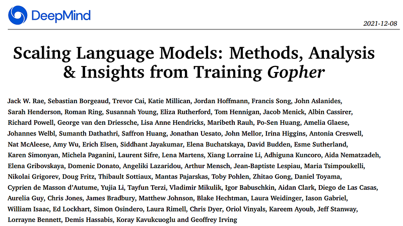 | Title card: Gopher. |
| 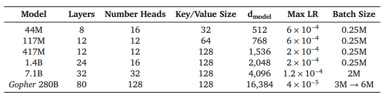 | Model architecture details. |
| 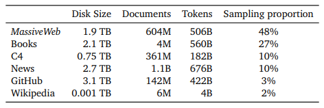 | MassiveText data makeup. |
| 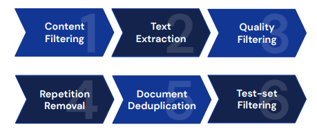 | Diagram of dataset processing stages. |
| 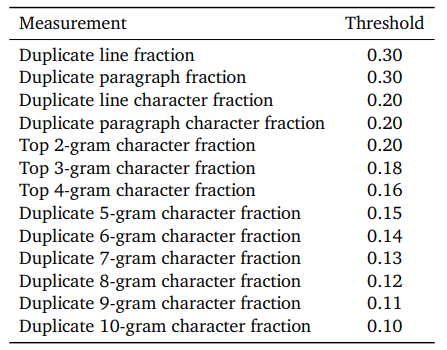 | Thresholds for repetitious text. |
| 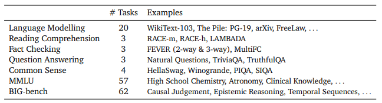 | Evaluation Tasks. |
| 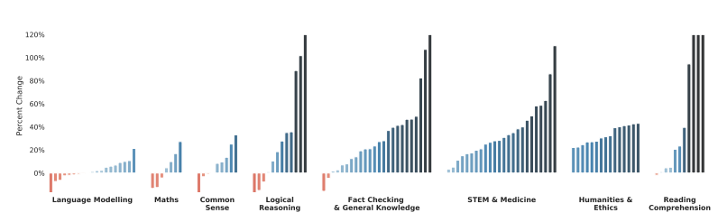 | Gopher (280B) vs LM SOTA. An overview of the percentage change in performance metric (higher is better) of Gopher versus state-of-the-art language model performance across 124 tasks. Each bar represents a task, here we clip the maximum relative improvement to 120%. In total Gopher shows an improvement across 100 / 124. The best-published results include (175B) GPT-3, (178B) Jurassic-1, and (530B) Megatron-Turing NLG. |
| 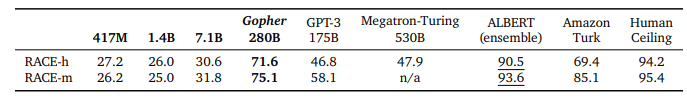 | RACE reading comprehension. Accuracy for few-shot models: Gopher, GPT-3, Megatron-Turing. Gopher extends performance significantly. Comparison with supervised SOTA: ALBERT (ensemble), Amazon Turk and Human Ceiling (obtained by restricting to unambiguous questions with correctly labeled answers). |
| 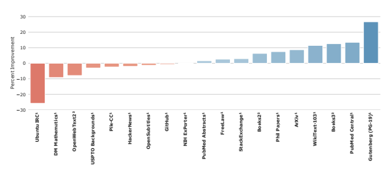 | Language Modelling Comparisons with SOTA. Comparison of Gopher to the current SOTA models on various language modeling tasks, including many from The Pile. The superscript (1) indicates the prior SOTA was Jurassic-1 and (2) indicates GPT-3. Gopher achieves state-of-the-art performance on 11 out of 19 datasets with the largest improvements on books and articles. |
| 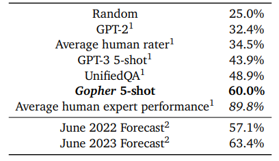 | Massive Multitask Language Understanding (MMLU). Average accuracy over 57 tasks with model and human accuracy comparisons. Human rater performance is obtained using Mechanical Turk and average human expert performance is estimated per task based on published exam results and averaged. Gopher improves over the prior supervised SOTA models by a considerable margin (>30%) however it is far from human expertise. We also include the average prediction for SOTA accuracy in June 2022 and 2023 made by 73 competitive human forecasters. Gopher is situated between the 2022 and 2023 forecast. |
| 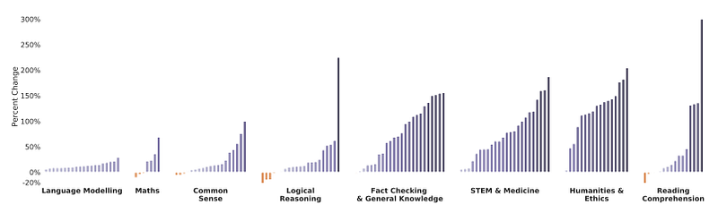 | 280B vs best performance up to 7.1B across different tasks. We compare the performance of Gopher to the best performance of our smaller models up to 7.1B. In nearly every case, Gopher outperforms the best smaller model’s performance. Small gains come from either scale not improving results substantially or the smaller models already being very performant. Language modeling improvements are in BPB and the rest are in terms of accuracy. |
## Related

- [[Papers Explained Corpus]]
- [[Large Language Models]]
- [[Long Context]]
- [[Vision Language Models]]
- [[Reasoning Models]]
- [[Evaluation and Benchmarks]]
- [[Papers Explained 46 - FLAN]]
- [[Papers Explained 48 - InstructGPT]]

#summary #topic
