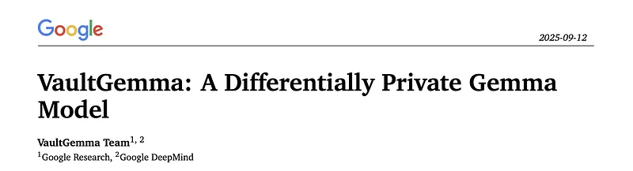
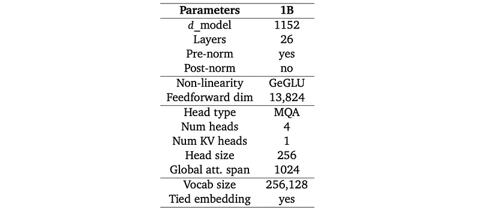
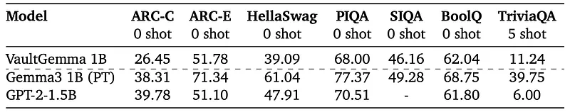

# Papers Explained 470 - VaultGemma

VaultGemma 1B is a 1 billion parameter model within the Gemma family, fully trained with differential privacy (DP) on the same data mixture used for the Gemma 2 series. VaultGemma addresses the privacy risks inherent in LLMs, which are susceptible to memorizing and extracting training data, potentially disclosing sensitive information.

This page ingests the source article into the wiki and connects it to [[Papers Explained Corpus]], [[Large Language Models]], [[Safety and Alignment]], [[Synthetic Data]].

## Source Metadata

- Source file: `raw/2025-10-08_Papers-Explained-470--VaultGemma-f738ba8705dd.md`
- Source title: Papers Explained 470: VaultGemma
- Published: 2025-10-08
- Canonical: [https://medium.com/@ritvik19/papers-explained-470-vaultgemma-f738ba8705dd](https://medium.com/@ritvik19/papers-explained-470-vaultgemma-f738ba8705dd)

## Key Ideas

- VaultGemma 1B is a 1 billion parameter model within the Gemma family, fully trained with differential privacy (DP) on the same data mixture used for the Gemma 2 series.
- VaultGemma 1B is a decoder-only transformer model, with most architecture elements similar to other Gemma versions.
- The sequence length is decreased to 1024 for pretraining. Using a smaller sequence length significantly reduces compute requirements, which in turn allows training using larger batch sizes, a necessity for good performance in private training.
- Given the use of a small sequence length, global attention is used on all layers rather than alternating with sliding window attention.
- To stabilize training, RMSNorm is used to normalize the input of each transformer sub-layer, the attention layer, and the feedforward layer.

## Notes

LLMs face a significant challenge due to the inherent privacy risks associated with their training on vast, web-scale corpora, making them susceptible to memorizing and extracting training data, potentially disclosing sensitive or personally identifiable information (PII). Differential Privacy (DP) has emerged as a rigorous mathematical framework to address these challenges by limiting the influence of any single training example on the resulting model, thereby limiting the reconstruction or leakage of information tied to individual data points.

Given that LLMs encounter the majority of their training data during the initial pretraining phase, it is crucial to consider pretraining LLMs fully with DP. This approach provides an end-to-end privacy guarantee, ensuring the foundational model is built in a way that prevents the memorization of specific, sensitive details, allowing the model to learn general patterns without being overly influenced by individual data. Applying DP exclusively during the fine-tuning phase leaves the foundational model and its pretraining data unprotected, as the model may have already memorized sensitive PII, creating a false sense of security.

VaultGemma 1B is a 1 billion parameter model within the Gemma family, fully trained with differential privacy (DP) on the same data mixture used for the Gemma 2 series. VaultGemma addresses the privacy risks inherent in LLMs, which are susceptible to memorizing and extracting training data, potentially disclosing sensitive information. By pretraining the LLM fully with DP, VaultGemma provides an end-to-end privacy guarantee, mitigating the risk of privacy leaks from the original training corpus.

## Model Architecture and Dataset

VaultGemma 1B is a decoder-only transformer model, with most architecture elements similar to other Gemma versions.

- The sequence length is decreased to 1024 for pretraining. Using a smaller sequence length significantly reduces compute requirements, which in turn allows training using larger batch sizes, a necessity for good performance in private training.

- Given the use of a small sequence length, global attention is used on all layers rather than alternating with sliding window attention.

- To stabilize training, RMSNorm is used to normalize the input of each transformer sub-layer, the attention layer, and the feedforward layer.

*Figure: Overview of the main parameters and design choices for the 1B model.*

The same non-private tokenizer as Gemma 1, Gemma 2, and Gemini is used: a SentencePiece tokenizer with split digits, preserved whitespace, and byte-level encodings. The resulting vocabulary has 256K entries.

The same pretraining dataset as Gemma 2 27B is used. This dataset contains 13T tokens of primarily-English data. These tokens come from a variety of data sources, including web documents, code, and science articles and only contain text data. The same data filtering techniques as Gemma are used. The pretraining dataset is filtered to reduce the risk of unwanted or unsafe utterances, filter out certain personal information or other sensitive data, de-contaminate evaluation sets from the pretraining data mixture, and reduce the risk of recitation by minimizing the proliferation of sensitive outputs.

## Differentially Private SGD (DP-SGD) algorithm

The algorithm aims to minimize an empirical loss function L(θ) for a model with parameters θ. At each step, it computes gradients for a subset of examples, clips their ℓ2 norm, averages them, adds carefully calibrated noise to protect privacy, and then takes a step in the opposite direction of this noisy average gradient. Finally, it outputs the trained model and computes the overall privacy loss.

Training Loop (for t∈[T] steps):

- Take a Random Sample (Lot): Select a random subset L_t of examples from the full dataset, with a sampling probability of L/N.

- The term “lot” is used to distinguish this privacy-relevant grouping from a “batch,” which is a computational grouping.

- Compute Gradient: For each example xi in the sampled lot L_t, compute its individual gradient: gt(xi)←∇θtL(θt,xi).

- Clip Gradient: For each computed gradient gt(xi), clip its ℓ2 norm to the bound C: gˉt(xi)←gt(xi)/max⁡(1,∣∣gt(xi)∣∣2/C).

- If ∣∣gt(xi)∣∣2≤C, the gradient is preserved. If ∣∣gt(xi)∣∣2>C, it is scaled down so its norm becomes exactly C.

- Add Noise: Compute the average of the clipped gradients and add Gaussian noise: g~t←(1L∑i∈Ltgˉt(xi))+N(0,σ2C2I).

- The noise is added to the aggregated gradient, scaled by the noise scale σ and the clipping threshold C.

- Descent Step: Update the model parameters using the noisy average gradient: θt+1←θt−ηtg~t

### Implementation Details

- The implementation uses vectorized per-example clipping for maximum parallelism, and gradient accumulation to simulate large batch sizes. Gradient accumulation steps are independent and each adds properly calibrated Gaussian noise to the partial gradients so that when these partial noisy gradients are averaged the target gradient required for DP-SGD model updates is obtained.

- Repeated Documents: Training data is sampled from diverse sources with probabilities proportional to their assigned weights, reflecting data quality. Documents can be sampled up to seven times, but most are sampled fewer than three times.

- Truncated Poisson Subsampling: This technique is used for mini-batch sampling, providing a computationally efficient approximation of Poisson subsampling. It allows for a fixed batch size by padding smaller batches and truncating larger ones. Unlike the original work’s suggestion of using MapReduce for pre-generation, the implementation here performs on-the-fly sampling and batching within the data loading pipeline using pygrain. This approach maintains comparable data throughput speeds and introduces minimal overhead, with padding accounting for less than 2% of the total batch size at large batch sizes.

- Packing: Documents are packed into fixed-size sequences of 1024 tokens to increase training efficiency. This packing can combine multiple documents into a single example or split a single document into multiple sequences.

- Privacy Guarantee: VaultGemma was trained with a (𝜖 ≤2.0, 𝛿 ≤1.1𝑒−10)-sequence-level Differential Privacy (DP) guarantee, where a sequence consists of 1024 tokens. Repeated sequences due to document sampling are treated as separate privacy units.

## Evaluation

*Figure: A comparison of DP and standard model performance and training configurations.*

- Today’s private training methods produce models with utility comparable to that of non-private models from roughly five years ago.

## Paper

[VaultGemma: A Differentially Private Gemma Model](https://services.google.com/fh/files/blogs/vaultgemma_tech_report.pdf)

## Figures

Figures from the Medium HTML export (`raw/2025-10-08_Papers-Explained-470--VaultGemma-f738ba8705dd.md`); local copies under `wiki/assets/papers-explained-470-vaultgemma/` when download succeeded.

| Figure | Caption |
|--------|---------|
|  | Title card: VaultGemma. |
|  | Overview of the main parameters and design choices for the 1B model. |
|  | A comparison of DP and standard model performance and training configurations. |
## Related

- [[Papers Explained Corpus]]
- [[Large Language Models]]
- [[Safety and Alignment]]
- [[Synthetic Data]]
- [[Papers Explained 469 - MobileLLM-R1]]
- [[Papers Explained 471 - mmBERT]]

#summary #topic
