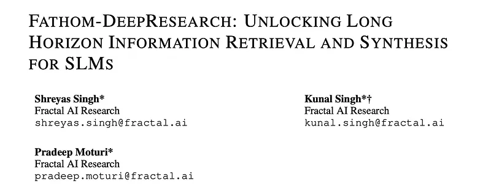
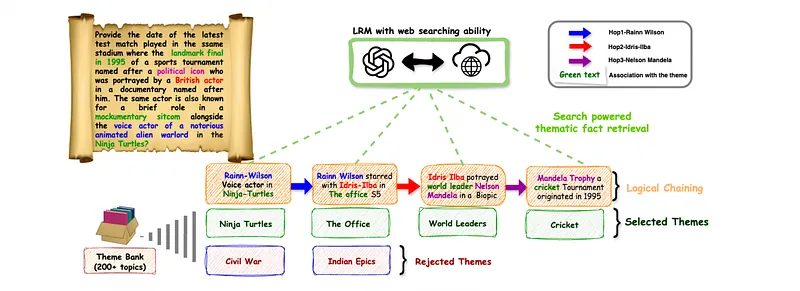
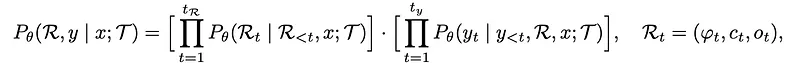
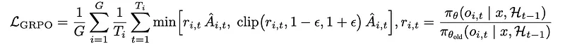
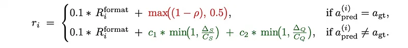
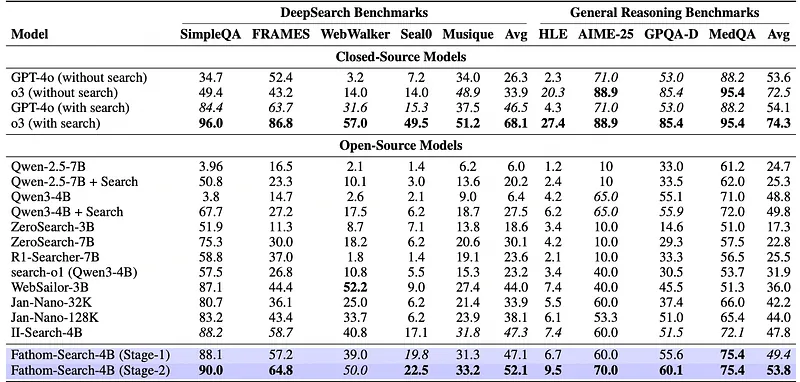
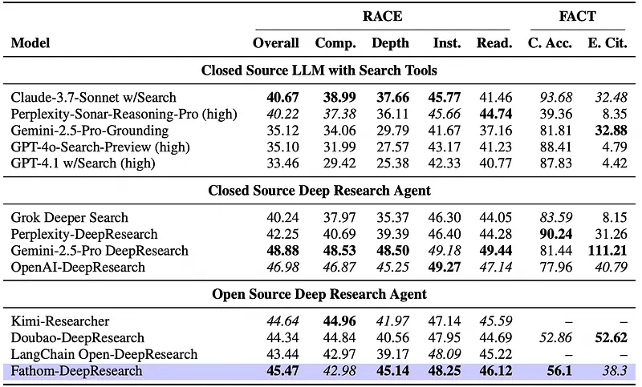
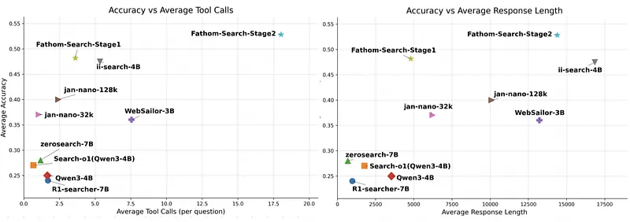

# Papers Explained 473 - Fathom-DeepResearch

The first is Fathom-Search-4B, a DeepSearch model trained from Qwen3–4B and optimized for evidence-based investigation through live web search and targeted webpage querying. Its training combines three advances:

This page ingests the source article into the wiki and connects it to [[Papers Explained Corpus]], [[Agentic AI]], [[Reinforcement Learning Topic]], [[Synthetic Data]], [[Reasoning Models]], [[Model Compression and Efficiency]], [[Reinforcement Learning]], [[Verifier-Bounded Learning]].

## Source Metadata

- Source file: `raw/2025-10-13_Papers-Explained-473--Fathom-DeepResearch-c022d3fa6863.md`
- Source title: Papers Explained 473: Fathom-DeepResearch
- Published: 2025-10-13
- Canonical: [https://medium.com/@ritvik19/papers-explained-473-fathom-deepresearch-c022d3fa6863](https://medium.com/@ritvik19/papers-explained-473-fathom-deepresearch-c022d3fa6863)

## Key Ideas

- Fathom-DeepResearch is an agentic system composed of two specialized models.
- DueQA, a ~5K-sample dataset generated via multi-agent self-play that enforces strict web-search dependence and heterogeneous source grounding
- RAPO, a zero-overhead extension of GRPO that stabilizes multi-turn Reinforcement Learning with Verifiable Rewards through curriculum pruning, reward-aware advantage scaling, and per-prompt replay buffers
- A steerable step-level reward that classifies each tool call by cognitive behavior and marginal utility, enabling explicit control over search trajectory breadth, depth, and horizon.
- The second is Fathom-Synthesizer-4B, trained from Qwen3–4B, which converts multi-turn DeepSearch traces into structured, citation-dense DeepResearch Reports for comprehensive synthesis.

## Notes

Fathom-DeepResearch is an agentic system composed of two specialized models.

The first is Fathom-Search-4B, a DeepSearch model trained from Qwen3–4B and optimized for evidence-based investigation through live web search and targeted webpage querying. Its training combines three advances:

- DueQA, a ~5K-sample dataset generated via multi-agent self-play that enforces strict web-search dependence and heterogeneous source grounding

- RAPO, a zero-overhead extension of GRPO that stabilizes multi-turn Reinforcement Learning with Verifiable Rewards through curriculum pruning, reward-aware advantage scaling, and per-prompt replay buffers

- A steerable step-level reward that classifies each tool call by cognitive behavior and marginal utility, enabling explicit control over search trajectory breadth, depth, and horizon.

The second is Fathom-Synthesizer-4B, trained from Qwen3–4B, which converts multi-turn DeepSearch traces into structured, citation-dense DeepResearch Reports for comprehensive synthesis.

*Figure: End-to-end inference framework of Fathom-DeepResearch.*

## Fathom-Search-4B

Fathom-Search-4B is a tool-using LLM that leverages live web-search capabilities to do evidence based reasoning in a multi-turn tool interaction setting, unlocking long-horizon tool use (>20 calls) ability.

### DuetQA

*Figure: Multi-agent self-play framework used to generate a sample multi-hop DeepSearch question.*

A self-supervised dataset construction framework is developed to yield verifiable, search-dependent, multi-hop QA pairs. This pipeline serves as the basis for generating DuetQA, a dataset tailored for training agentic deep-search models. The design goals are:

- Live web-search dependency: for each QA pair (q,a), the question is unanswerable without search by enforcing that at least one hop contains information post–2024–01–01.

- Diverse source domains: questions require querying heterogeneous web-sources beyond Wikipedia

- Steerable theme control: each example is grounded in k∈[5,7] sampled themes from T, a manually curated taxonomy of 200+ themes covering a broad range of topics.

Questions are generated using two frontier web search enabled large language models, M1 (O3) and M2 (O4-mini), acting as proxy web-crawling agents that produce QA pairs and as independent verifiers to ensure question solvability. A third model, M3 (GPT-4o), is a non-search model used for controlled paraphrasing/obfuscation of questions and as a baseline verifier without search.

Two strategies are adopted to synthesize multi-hop, search-dependent question-answer pairs. In both, a set of themes is sampled. In the Mixture of Themes setting, for each theme, the generator issues live queries to retrieve recent and/or obscure facts, and composes a multi-hop pair (q,a) by chaining a subset of them into a coherent reasoning path. In the Seeded Question setting, a seed bank of 100 questions is maintained; given a seed q0, the generator rewrites it into a new question q by integrating one or more sampled facts while preserving the multi-hop scaffold of q0. In both settings, it is enforced that at least one incorporated fact references information after 2024.

To remove surface cues that let models short-circuit the intended multi-hop reasoning, a dedicated obfuscation pass is applied after question generation. Using the non-search model M3 (GPT-4o) under an in-context learning setup, the question is paraphrased to mask intermediate hops. Concretely, M3 softens exact anchors in each hop by

- converting specific dates to coarse intervals (“March 2025” →“early 2025”)

- mapping precise numerics to qualitative magnitudes (“1%” →“negligible”)

- replacing named entities with indirect descriptors (“University of Florida” →“a major southeastern university”)

- embedding causal/comparative pivots as descriptors rather than explicit connectors.

These edits suppress shortcut signals without altering the underlying facts that must be recovered via search.

A candidate pair (q,a) is retained only if two independent search-enabled LRMs M1 and M2 produce the same correct answer whileM3 fails.

### Agentic Reinforcement Learning

Let x∈X be an input from distribution D and T the set of available tools. The policy πθ generates a reasoning trajectory R interleaved with tool feedback, followed by a final textual answer y. A reference policy πref is used for KL regularization, and a verifiable reward function rϕ (LLM-as-judge) provides supervision.

where φt is a latent “think” segment, ct ∈T a tool call (with arguments), and ot the tool response, all expressed in a ReAct-style template. The policy model is optimized with a token-level clipped loss defined as follows:

For a group of G sampled rollouts with scalar rewards {ri}, group-relative advantages defined as:

The trajectory-level scalar reward combines a format score and an answer score:

R_format verifies that rollout follows the ReAct template (i.e., all steps are correctly wrapped in <think>, <tool_call>, <tool_response> tags). R_answer = 1[a_pred= a_gt], where correctness of the final answer is judged by an LLM-as-judge against the ground truth.

A policy model is given access to two tools:

- The search_urls tool takes as input a natural language query q and returns a ranked list of triples (u,title,snippet) using a live search engine. The policy model uses this to identify promising sources and optionally select a URL u for opening in the next step. The tool is invoked as follows: <tool_call>{name: search_urls, args: {query: q}}</tool_call>

- The query_url tool, given a goal g and a URL u, leverages a query LLM to return targeted evidence-backed responses that address g. This tool enables precise grounding of facts and targeted querying of web-pages. Compared to the injection of an entire web-page into the policy model’s trajectory, this tool minimizes noise and increases recall. The tool is invoked as follows: <tool_call>{name: query_url, args: {goal: g, url: u}}</tool_call>

### RAPO: Reward Aware Policy Optimization

In GRPO, the per-prompt (group) reward variance σR determines the strength of the advantage signal. When σR=0, group-relative advantages vanish, collapsing batch gradient norms and destabilizing updates. To this end:

- Dataset pruning: First, prompts that are effectively solved at the end of each epoch are pruned. This prevents training batches from being dominated by saturated groups that provide negligible variance, while implicitly yielding a curriculum in which the active set concentrates on harder prompts.

- Advantage scaling: To counter the dilution of gradients when only a few groups in a batch are informative, token-level advantages of Good groups are rescaled inversely with their batch frequency. This adjustment preserves effective gradient magnitude without requiring costly re-sampling as in DAPO, ensuring that updates remain stable even when informative groups are sparse.

- Replay buffer: A per-prompt buffer B contains the most recent successful trajectory o⋆ with R(q,o⋆)>0.5. If all rollouts for a prompt fail in the current epoch, one trajectory is randomly replaced with o⋆ from B. This reintroduces variance (σR>0) into otherwise collapsed groups, restores group-relative advantages, and anchors updates to a high-quality, low-entropy reference that curbs uncontrolled trajectory growth.

### Steerable Step-Level Reward Design For Search Tools

The Steerable Step-Level Reward design addresses the reward-hacking. Its primary goal is to provide fine-grained control over the agent’s tool-use behavior, specifically steering:

- Tool Usage Frequency: How much the agent utilizes its available tools.

- Cognitive Allocation: How the agent distributes its cognitive effort between exploration and verification.

The GPT-4.1 LLM-as-judge classifies tool calls into specific categories:

search_urls tool calls are classified as:

- UNIQUESEARCH: A semantically new query about previously unseen entities or facts.

- REDUNDANTSEARCH: A query highly similar to a prior one, likely yielding overlapping results.

query_url tool calls are classified as:

- EXPLORATION: The first query made to a new URL.

- VERIFICATION: A cross-source check on a new URL for an existing query, allowed up to Bv times.

- REDUNDANTQUERY: Further checks for a query or fact on new URLs beyond the allowed Bv verification budget.

Based on these classifications, the following aggregates are formed:

- nuniqS: Number of UNIQUESEARCH calls.

- nredS: Number of REDUNDANTSEARCH calls.

- nexplore: Number of EXPLORATION calls.

- nverify: Number of VERIFICATION calls.

- nuniqQ: Total unique query calls, calculated as nexplore + nverify.

- nredQ: Number of REDUNDANTQUERY calls.

These tallies are then used to define three key aggregate metrics:

- ρ (Redundancy Penalty): ρ = (nredS + nredQ) / T

This metric penalizes redundant tool calls, promoting efficiency in the agent’s actions.

- ∆S (Unique Search Credit): ∆S = nuniqS — nredS

This provides credit for genuine, non-redundant exploration using search_urls.

- ∆Q (Unique Query Credit): ∆Q = nuniqQ — nredQ

This provides credit for genuine, non-redundant information seeking using query_url.

The final steerable step-level reward ri is defined as:

if a(i)pred = agt (Correct Rollout)

- If the agent’s predicted answer is correct, the reward includes max((1 — ρ), 0.5).

- This term rewards correctness while penalizing redundancy (ρ). The max(…, 0.5) ensures that a correct rollout always receives a reward of at least 0.5 (when Rformat_i is 0.1, total 0.1 + 0.5 = 0.6), even if it was highly redundant, thus prioritizing correctness.

if a(i)pred ≠ agt (Incorrect Rollout)

- If the agent’s predicted answer is incorrect, the reward includes c1 * min(1, ∆S / CS) + c2 * min(1, ∆Q / CQ).

- This provides credit to incorrect rollouts that still exhibit genuine, non-redundant exploration and information-seeking behavior.

- c1 and c2 are weights, set to 0.2 in experiments. This ensures that any incorrect rollout has ri ≤ 0.5 (when Rformat_i is 0.1, total 0.1 + 0.2 + 0.2 = 0.5), preventing them from being rewarded more than correct ones. Equal c1 and c2 values ensure equal weight is given to search_urls (∆S) and query_url (∆Q) contributions.

- min(1, ∆S / CS) and min(1, ∆Q / CQ) cap the credit for novelty based on saturation thresholds CS and CQ.

Steerability knobs

- CS (Search Saturation Threshold): Sets the saturation threshold for creditable novelty in search_urls calls. Increasing CS allows more search_urls steps to earn credit for introducing genuinely new evidence, effectively encouraging more extensive searching. Decreasing CS compresses trajectories by limiting credit for novelty.

- CQ (Query Saturation Threshold): Sets the saturation threshold for creditable novelty in query_url calls. Similar to CS, increasing CQ raises the novelty caps for query_url steps, enabling more steps to earn credit for new evidence from page reading. Decreasing CQ compresses trajectories.

- Bv (Per-Claim Verification Budget): Controls the verification depth. A higher Bv permits multiple creditable cross-checks per claim, thereby promoting more thorough verification of information.

For the experiments:

- Bv = 1: Allowing one cross-check per claim.

- CS = 8: The saturation threshold for search_urls novelty.

- CQ = 16: The saturation threshold for query_url novelty.

### Training Recipe

Training is carried out in two stages.

- Training with RAPO for 10 epochs on the curated DUETQA dataset, comprising 4,988 high-quality QA instances. Each rollout is capped at 32 tool-interaction steps, with each step limited to 8,192 output tokens.

- RLVR training for an additional 2 epochs. For Stage 2, a mixed dataset is constructed by combining DUETQA with math data from the S1 dataset. This combined pool is adversarially filtered against the Stage-1 checkpoint, yielding 5,077 instances. From MUSIQUE, only questions requiring at least three reasoning hops are retained to ensure sufficient compositional depth. For this stage, the Steerable Step-Level Reward is adopted to extend the tool-use horizon beyond 20 calls in a stable manner.

The Qwen3–4B model is used as the base, which supports a maximum context length of 40,960 tokens; the full window is utilized during training. GPT-4.1-mini(Temperature=0.) is used as the query LLM. A higher sampling temperature of 1.4 is applied to Qwen3 models.

## Fathom-Synthesizer-4B

DeepResearch-SFT is a synthetic dataset distilled from GPT-5 to train Fathom-Synthesizer-4B. It provides supervision along three complementary axes:

- Question decomposition. Each input question q is decomposed into ordered sub-questions πdecomp = (S1,…,Sn), which form the report scaffold and ensure coverage of all facets.

- Section mapping. Every piece of evidence recovered during search (URLs, quoted passages, tables, figures) is grounded to one or more sections via a mapping πmap, this aligns each explored URL to the most relevant Si, enhancing citation accuracy and preventing omissions/duplication.

- Planning for insights. The model specifies an analysis strategy πinsight how the gathered evidence should be synthesized into higher-level insights.

Formally, given a question q and trajectory τ = {R1,…,RT}, the teacher outputs Plan and Report. The plan π = (πdecomp,πmap,πinsight) appears in a private <think> block, followed by the public report r. The training target is y= <think> π </think> r.

Qwen3–4B is fine-tuned on DeepResearch-SFT for 5 epochs. DeepSearch traces exhaust Qwen3–4B’s native 40,960-token context window, so YaRN RoPE scaling: rope_scaling:{type=yarn, factor=2.0} is used to extend the effective context during SFT. This increases the usable positional range to 65,536 tokens, allowing the synthesizer to ingest the full investigation trace and generate high-quality synthesis.

## Results

- Fathom-DeepResearch establishes itself as state-of-the-art by achieving large, non-incremental gains on challenging DeepSearch tasks (FRAMES, WebWalker, & Seal0) and shows strong generalization to broader reasoning benchmarks.

- Fathom-DeepResearch consistently outperforms its base model, other open-source systems, and even larger closed-source models such as GPT-4o with notable margins. On the DeepResearch-Bench, it outperforms most proprietary closed-source systems (including Claude, Grok, and Perplexity Deep Research).

- Fathom-Search models demonstrate higher accuracy and efficient long-horizon tool interaction ability compared to its open-source contemporaries.

## Paper

Fathom-DeepResearch: Unlocking Long Horizon Information Retrieval and Synthesis for SLMs [2509.24107](https://arxiv.org/abs/2509.24107)

## Figures

Figures from the Medium HTML export (`raw/2025-10-13_Papers-Explained-473--Fathom-DeepResearch-c022d3fa6863.md`); local copies under `wiki/assets/papers-explained-473-fathom-deepresearch/` when download succeeded.

| Figure | Caption |
|--------|---------|
|  | Title card: Fathom-DeepResearch. |
|  | End-to-end inference framework of Fathom-DeepResearch. |
|  | Multi-agent self-play framework used to generate a sample multi-hop DeepSearch question. |
|  | Let x∈X be an input from distribution D and T the set of available tools. |
|  | For a group of G sampled rollouts with scalar rewards {ri}, group-relative advantages defined as. |
|  | For a group of G sampled rollouts with scalar rewards {ri}, group-relative advantages defined as. |
|  | The trajectory-level scalar reward combines a format score and an answer score. |
|  | The final steerable step-level reward ri is defined as. |
|  | Qwen3–4B is fine-tuned on DeepResearch-SFT for 5 epochs. |
|  | Qwen3–4B is fine-tuned on DeepResearch-SFT for 5 epochs. |
|  | Qwen3–4B is fine-tuned on DeepResearch-SFT for 5 epochs. |
## Related

- [[Papers Explained Corpus]]
- [[Agentic AI]]
- [[Reinforcement Learning Topic]]
- [[Synthetic Data]]
- [[Reasoning Models]]
- [[Model Compression and Efficiency]]
- [[Reinforcement Learning]]
- [[Verifier-Bounded Learning]]
- [[Papers Explained 473 - FusioN]]
- [[Papers Explained 474 - Jina Reranker v3]]

#summary #topic
