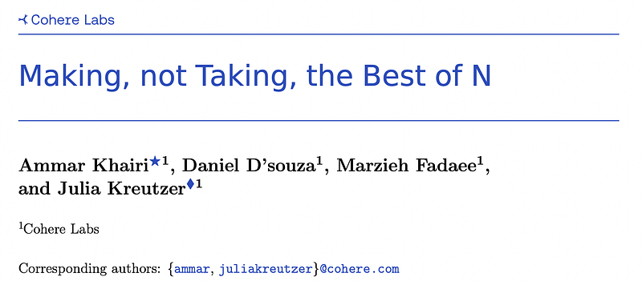
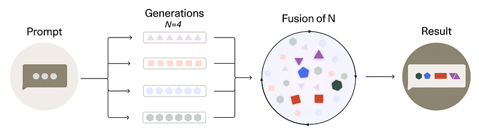
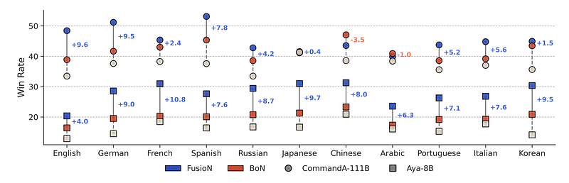
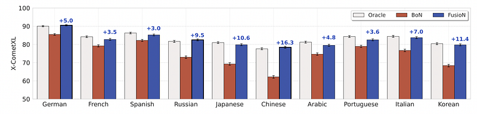
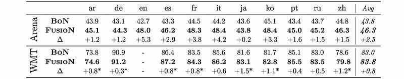
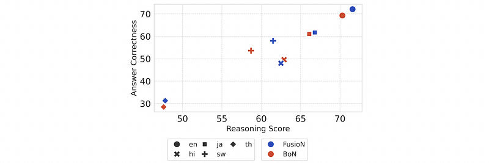

# Papers Explained 473 - FusioN

Generating high-quality text with modern LLMs has traditionally focused on selecting the best output from a set of diverse candidates (Best-of-N). This approach discards valuable information from the other candidates.

This page ingests the source article into the wiki and connects it to [[Papers Explained Corpus]], [[Synthetic Data]], [[Reinforcement Learning Topic]], [[Reasoning Models]], [[Large Language Models]], [[Evaluation and Benchmarks]], [[Model Distillation]], [[Reinforcement Learning]], [[Verifier-Bounded Learning]].

## Source Metadata

- Source file: `raw/2025-10-10_Papers-Explained-473--FusioN-0c884d0a465c.html`
- Source title: Papers Explained 473: FusioN
- Published: 2025-10-10
- Canonical: [https://medium.com/@ritvik19/papers-explained-473-fusion-0c884d0a465c](https://medium.com/@ritvik19/papers-explained-473-fusion-0c884d0a465c)

## Key Ideas

- This work proposes Fusion-of-N (FusioN), a collaborative approach where all candidate outputs contribute to the final result. FusioN uses a general LLM judge to combine the most informative parts of each candidate into a single, improved answer.
- Test-time scaling: Multiple samples are generated and combined from a single model during testing.
- Synthetic data generation: Samples from diverse teacher models are fused to enhance a student model.
- Given a prompt x, a pool of candidates y ∈Y, and a scoring function S, the BoN method selects the optimal candidate y∗by maximizing a scalar score:
- The scoring function could be a specialized reward model as used in rejection sampling for synthetic data generation, or test-time scaling.

## Notes

Generating high-quality text with modern LLMs has traditionally focused on selecting the best output from a set of diverse candidates (Best-of-N). This approach discards valuable information from the other candidates.

This work proposes Fusion-of-N (FusioN), a collaborative approach where all candidate outputs contribute to the final result. FusioN uses a general LLM judge to combine the most informative parts of each candidate into a single, improved answer. FusioN is evaluated in two ways:

- Test-time scaling: Multiple samples are generated and combined from a single model during testing.

- Synthetic data generation: Samples from diverse teacher models are fused to enhance a student model.

## Methodology

### Selection with Best-of-N (BoN)

Given a prompt x, a pool of candidates y ∈Y, and a scoring function S, the BoN method selects the optimal candidate y∗by maximizing a scalar score:

The scoring function could be a specialized reward model as used in rejection sampling for synthetic data generation, or test-time scaling. The score could also be produced by a generative LLM that is prompted to predict a scalar score, though in practice trained classifiers often perform better. These types of scoring functions are typically optimized on verifiable domains and pairwise human preferences.

The limiting factors for selection with BoN are

- the alignment with the desired task

- the quality of the generated sample pool (as per definition, the final generation can only be as good as the best of the candidates).

### Synthesis with Fusion-of-N (FusioN)

*Figure: FusioN principle.*

A fusor model F (a standard LLM) generates a new response y⋆ based on the input prompt X, and a pool of candidates Y:

This means that the final generation y∗ is conditionally dependent on the other candidates, and can in contrast to BoN exceed the original pool in quality. It can be seen as a form of collaborative refinement: Rather than only selecting a sample according to a monolithic notion of quality, FusioN goes beyond and productively integrates a polylithic (meaning that we acknowledge the existence of higher and lower-quality parts in each sample) notion of quality into the synthesis of a better sample.

FusioN can “mix and match” fragments of variable size (e.g. tokens, terms, sentences, …) that stand out in quality in each of the provided samples. BoN is captured as a special case: the fusor still has the option to copy one whole generation if it outperforms all others for the entire sequence.

## Experimental Setup

The experiments span two prominent environments for BoN, the first focused on test-time scaling, and the second focused on synthetic data generation.

### Models for Test-Time Scaling

This study examines the test-time scaling behavior for multilingual models of two sizes: Aya Expanse 8B and Command A at 111B. Temperature sampling at T = 0.7 is used to generate N = 5 samples from each model. A competitive in-house multilingual Reward Model (RM) is used for scoring the candidates in BoN and Command A as fusor in FusioN.

### Models and Data for Synthetic Data Generation

Five open and strong models of varying size and families are employed as teachers for synthetic data generation: Gemma3–27B-It, Kimi-K2-Instruct, Qwen3–235B, DeepSeek-V3 and Command A. A low temperature completion (τ = 0.3) is sampled from each of them to generate the pool of samples for each prompt. From this pool, one completion is selected for supervised fine-tuning (SFT), either with RM or Command A as fusor. An 111B instruction-tuned LLM is chosen as the baseline model for main SFT experiments, and an ablation is performed with a smaller 7B Base LLM baseline. Test-time scaling is not applied on top of the fine-tuned models.

General Fine-tuning Dataset

For main fine-tuning experiments, 10k prompts are randomly sampled from UltraFeedback Binarized (UFB), an English preference dataset with 61k pairs that was previously used to measure the impacts of data composition in fine-tuning. The prompts are automatically translated into 9 languages: German, French, Spanish, Chinese, Japanese, Arabic, Korean, Italian, Portuguese.

Reasoning Fine-tuning Dataset

The dataset includes prompts from the GeoFactX dataset (train split) for geography-based factual reasoning, and translated s1k prompts for mathematical reasoning. The prompts are machine-translated from English and cover five and ten languages, respectively.

### Prompt used for FusioN

```text
Based on the provided Instruction and Generated Texts in language, fuse them into a better generation that combines the strength of each of them.
Do so in two steps:
First, compare the Generated Text with a focus on what sets them apart in terms of content, language quality and responsibility, highlighting strengths and weaknesses.
Second, fuse them into a new final generation that combines the best aspects of each of them while avoiding the weaknesses.
The fused generation should be adequately responding to the instruction, sound natural to a native speaker, and be focused on conveying the most relevant and accurate information in a responsible and ethical way.
Output Format
Comparison: (short explanation of the strengths and weaknesses of each generation)
Answer: \[\[ The final fused generation \]\]
Context
Instruction
{prompt}
Generated Texts
{generations}
Please analyse the Generated Texts, discarding any unsafe or unethical generations and provide your fused text.
Remember to stick to the requested Output Format, providing first a short explanation and then putting the final fused generation inside double brackets \[\[\]\].
```

### Evaluation Benchmarks

Open-ended challenging prompts (Arena) are sourced from mArenaHard V.2 (11 languages). Quality of generations is measured in terms of win rates as determined by an LLM judge (gpt-4o-2024–05–13) in direct comparison to the commercial Gemini2.5-Flash and Gemini2.5-Pro models and in head-to-head comparisons of FusioN vs BoN.

Machine Translation (WMT) prompts are sourced from WMT24++ (English to 10 languages). Quality of generations is measured with XComet-XL, a state-of-the-art multilingual translation evaluation metric.

Reasoning evaluations target the reasoning fine-tuning mix and include the GeoFactX test split (5 languages) and math problems from MGSM (11 languages including English). Both are evaluated in terms of accuracy of the final answers, and reasoning quality for GeoFactX is additionally inspected.

## Evaluation

*Figure: Test-time scaling with N = 5.*

- Substantial Improvements in Multilingual Open-Ended Generation

- FusioN consistently brings significant gains in win-rate against strong baselines like Gemini2.5-Pro across various languages and models.

- Aya Expanse 8B saw win-rate jumps of up to +10.8% in French.

- Command A with FusioN outperformed BoN in 9 out of 11 languages, enabling it to win over Gemini2.5-Pro in German (+9.5%) and Spanish (+7.8%) with only 5 samples, suggesting FusioN acts as a very effective self-refinement mechanism.

*Figure: FusioN vs BoN vs Oracle in Translation, error bar show std-err.*

- Synthesis Outperforms Selection (BoN) and Even Oracle in Machine Translation

- FusioN demonstrates superior performance in machine translation.

- More importantly, FusioN outperformed the “Oracle” selection (the highest scoring sample) in German, Russian, and Chinese translation (e.g., +0.8 in Chinese XCometXL), confirming the utility of the aggregation framework and implying that generations should be treated as collaborators rather than competitors.

*Figure: Downstream evaluation of BoN/FusioN-fine-tuned 111B models on Arena (% win rate against Gemini2.5-Flash) and WMT (XCometXL, en→ ·).*

- Consistent Multilingual Gains and Downstream Impact from Synthetic Data Generation

- Fine-tuning models on FusioN-generated data leads to notable and consistent improvements across tasks and languages.

- On average, models fine-tuned on FusioN-generated data achieved +0.8 higher XCometXL scores on WMT24++ and improved win-rates against Gemini2.5-Flash by +2.5% over BoN, highlighting the powerful ripple effect of even modest improvements in data generation.

*Figure: Downstream evaluation on multilingual factual reasoning on the GeoFactX test set.*

- Enhanced Multilingual Factual Reasoning

- FusioN-generated data significantly improves the factual reasoning capabilities of fine-tuned models.

- The gains were particularly large for lower-resourced languages like Swahili and Thai (e.g., +2.8% higher for Swahili), indicating effective exploitation of teacher diversity.

- Fine-tuned models (both BoN and FusioN) significantly outperform base and fusor models, validating the hypothesis of leveraging “wisdom of the crowd” without being bounded by the fusor model, even for languages it doesn’t officially support.

## Paper

Making, not Taking, the Best of N [2510.00931](https://arxiv.org/abs/2510.00931)

## Figures

Figures from the Medium HTML export (`raw/2025-10-10_Papers-Explained-473--FusioN-0c884d0a465c.html`); local copies under `wiki/assets/papers-explained-473-fusion/` when download succeeded.

| Figure | Caption |
|--------|---------|
|  | Title card: FusioN. |
|  | Given a prompt x, a pool of candidates y ∈Y, and a scoring function S, the BoN method selects the optimal candidate y∗by maximizing a scalar score. |
|  | FusioN principle. |
|  | A fusor model F (a standard LLM) generates a new response y⋆ based on the input prompt X, and a pool of candidates Y. |
|  | Test-time scaling with N = 5. |
|  | FusioN vs BoN vs Oracle in Translation, error bar show std-err. |
|  | Downstream evaluation of BoN/FusioN-fine-tuned 111B models on Arena (% win rate against Gemini2.5-Flash) and WMT (XCometXL, en→ ·). |
|  | Downstream evaluation on multilingual factual reasoning on the GeoFactX test set. |
## Related

- [[Papers Explained Corpus]]
- [[Synthetic Data]]
- [[Reinforcement Learning Topic]]
- [[Reasoning Models]]
- [[Large Language Models]]
- [[Evaluation and Benchmarks]]
- [[Model Distillation]]
- [[Reinforcement Learning]]
- [[Verifier-Bounded Learning]]
- [[Papers Explained 471 - mmBERT]]
- [[Papers Explained 473 - Fathom-DeepResearch]]

#summary #topic
