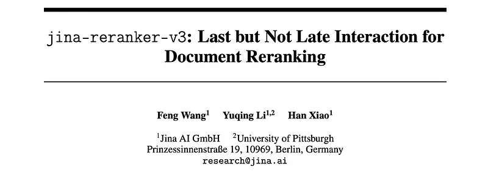
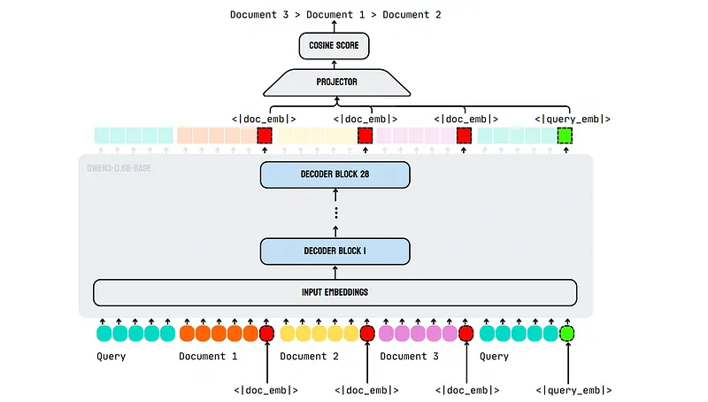
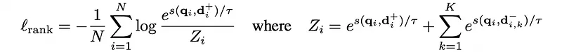
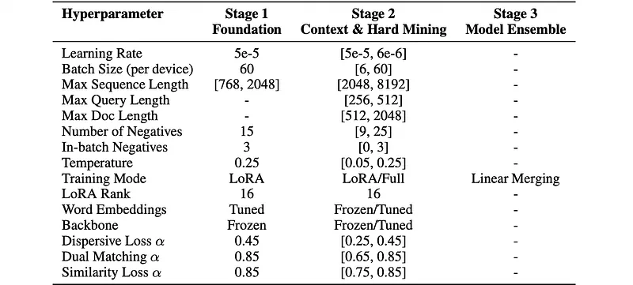
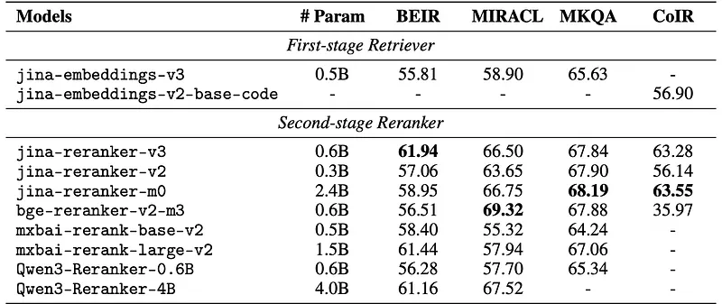
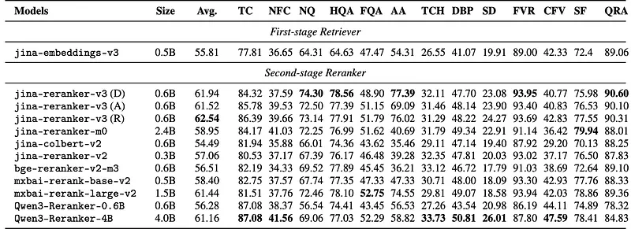
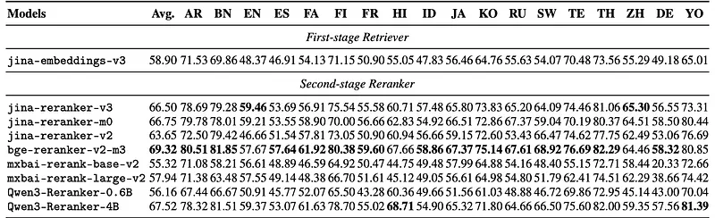

# Papers Explained 474 - Jina Reranker v3

jina-reranker-v3 is a 0.6B parameter multilingual document reranker that introduces a novel last but not late interaction.

This page ingests the source article into the wiki and connects it to [[Papers Explained Corpus]], [[Embedding and Retrieval]], [[Document AI]], [[Long Context]], [[Multilingual Models]], [[Large Language Models]].

## Source Metadata

- Source file: `raw/2025-10-14_Papers-Explained-474--Jina-Reranker-v3-c45f2830754e.md`
- Source title: Papers Explained 474: Jina Reranker v3
- Published: 2025-10-14
- Canonical: [https://medium.com/@ritvik19/papers-explained-474-jina-reranker-v3-c45f2830754e](https://medium.com/@ritvik19/papers-explained-474-jina-reranker-v3-c45f2830754e)

## Key Ideas

- Built upon Qwen3–0.6B with 28 transformer layers, 1024 hidden dimensions, 16 attention heads, and 131K token context capacity, the approach processes queries and multiple documents simultaneously within shared context windows.
- The core innovation lies in enabling cross-document interactions during encoding: instead of delaying interaction until after separate encoding as in late interaction models, all documents and the query are processed simultaneously within shared context...
- Contextual embeddings are extracted at special token positions: q = Htq and di = Hti, where tq and ti are the positions of the special tokens and H represents the transformer’s final layer hidden states after causal self-attention.
- These embeddings capture local document semantics and global cross-document context through shared attention, enabling rich inter-document interactions unavailable in separate encoding approaches.
- A two-layer projection network with ReLU activation maps the 1024-dimensional hidden states to a 256-dimensional embedding space: q = Pϕ(q) and di = Pϕ(di). Relevance scores are computed via cosine similarity: si = cos(q, di).

## Notes

jina-reranker-v3 is a 0.6B parameter multilingual document reranker that introduces a novel last but not late interaction. Unlike late interaction models such as ColBERT that perform separate encoding followed by multi-vector matching, the approach conducts causal self-attention between query and documents within the same context window, enabling rich cross-document interactions before extracting contextual embeddings from the last token of each document.

## Architecture

*Figure: Architecture of jina-reranker-v3.*

Built upon Qwen3–0.6B with 28 transformer layers, 1024 hidden dimensions, 16 attention heads, and 131K token context capacity, the approach processes queries and multiple documents simultaneously within shared context windows. A lightweight MLP projector (1024→512→256 dimensions) is added to transform contextual representations into ranking-optimized embeddings.

*Figure: Model architecture configuration for jina-reranker-v3.*

The core innovation lies in enabling cross-document interactions during encoding: instead of delaying interaction until after separate encoding as in late interaction models, all documents and the query are processed simultaneously within shared context windows. This allows each document to attend to other documents and observe their content, enabling contextual embeddings that capture not just query-document relevance but also inter-document relationships and comparative context.

Contextual embeddings are extracted at special token positions: q = Htq and di = Hti, where tq and ti are the positions of the special tokens and H represents the transformer’s final layer hidden states after causal self-attention.

These embeddings capture local document semantics and global cross-document context through shared attention, enabling rich inter-document interactions unavailable in separate encoding approaches.

A two-layer projection network with ReLU activation maps the 1024-dimensional hidden states to a 256-dimensional embedding space: q = Pϕ(q) and di = Pϕ(di). Relevance scores are computed via cosine similarity: si = cos(q, di). This architecture combines the expressiveness of joint encoding with efficient similarity computation.

For document collections exceeding the 131K token context limit, documents are processed in batches of up to 64 documents per forward pass, with query embeddings maintained consistently across batches to ensure ranking coherence.

### Prompt Template

```text
<|im_start|>system
You are a search relevance expert who can determine a ranking of passages based on their relevance to the query.
<|im_end|>
<|im_start|>user
I will provide you with k passages, each indicated by a numerical identifier.
Rank the passages based on their relevance to query: [QUERY]
<passage id="0">
[DOCUMENT_1]<|doc_emb|>
</passage>
<passage id="1">
[DOCUMENT_2]<|doc_emb|>
</passage>
...
<passage id="k-1">
[DOCUMENT_k]<|doc_emb|>
</passage>
<query>
[QUERY]<|query_emb|>
</query>
<|im_end|>
<|im_start|>assistant
<think></think>
```

## Training

jina-reranker-v3 employs a comprehensive multi-objective training approach combining InfoNCE loss with specialized auxiliary losses to optimize ranking performance across diverse domains.

- ℓrank (InfoNCE Loss): Generates the core ranking signal through contrastive learning with hard negatives. It calculates the negative log-likelihood of correctly identifying the positive document among a set of negatives for a given query.

- ℓdisperse (Dispersive Loss): Prevents representation collapse and enhances embedding diversity by maximizing the average pairwise cosine distance between document embeddings.

- ℓdual (Dual Matching Loss): Enforces bidirectional consistency between query-to-document and document-to-query similarity scores, thereby enhancing ranking robustness. Follows the same formulation as the similarity loss but computes the query embedding from the query tokens at the sequence start.

- ℓsimilar (Similarity Loss): Maintains semantic coherence at the document level. For each document, an augmented duplicate (d∗i) is created using text augmentation. The loss then treats the original document and its augmented version as a positive pair, while other documents serve as negatives. This encourages consistent embedding representations for semantically equivalent documents.

The training methodology follows a progressive three-stage approach designed for systematic complexity scaling:

Stage 1: Foundation Specialization

Starting from pretrained Qwen3–0.6B, domain-specific configurations are simultaneously trained using LoRA fine-tuning with r=16 and α=32 targeting all attention and FFN layers while freezing the backbone. The model processes training sequences containing 16 documents per query (one positive and 15 negative examples), with each document truncated or padded to 768 tokens, yielding a maximal total sequence length of 12,288 tokens. Training data is drawn from diverse datasets including BGE-M3 for multilingual coverage across 15 languages, Cornstack for code retrieval, as well as specialized datasets for biomedical and instruction following configurations.

Stage 2: Context and Hard Negative Mining

This stage combines context scaling and comprehensive robustness optimization. Context scaling extends sequence lengths to 8,192 tokens through configurations like mldr-8192 for long documents using multilingual MLDR datasets, jina-crosslingual for enhanced multilingual capabilities, and biomed for medical domains. Simultaneously, cross-system hard negative mining ensures robustness through specialized optimizations including jina-en-v2 for English performance, miracl-v2 for multilingual retrieval, cornstack-v2 for code understanding, and context-chunk-v3 for long-document processing. Training systematically mines hard negatives across multiple retrieval systems including BGE, Jina, GTE, and E5-Large with up to 25 negatives per query and very low temperature of 0.05, using key datasets including MS-MARCO, mMARCO, and domain-specific synthetic question-answer pairs.

Stage 3: Model Ensemble and Optimization

The final stage combines multiple specialized models trained in previous stages through linear model merging. Each domain-specific model contributes weighted expertise, with merge weights ranging from 0.25 to 0.65 based on domain importance and performance. This approach enables the final model to leverage diverse domain knowledge while maintaining architectural efficiency.

*Figure: Multi-stage supervised fine-tuning hyperparameters showing ranges across 47 training configurations.*

## Evaluation

Benchmarks: Evaluation was conducted on four challenging benchmarks:

- BEIR: Gold standard for English retrieval (13 heterogeneous tasks).

- MIRACL: Multilingual retrieval (18 languages).

- MKQA: Cross-lingual question answering.

- CoIR: Specialized code retrieval.

Baselines: Comprehensive baselines included:

- first-stage dense retrievers (jina-embeddings-v3)

- second-stage rerankers (jina-reranker-v2, bge-reranker-v2-m3, mxbai-rerank variants, Qwen3-Reranker-0.6B, Qwen3-Reranker-4B).

Metrics & Protocols: All evaluations followed identical protocols using nDCG@10 as the primary metric.

*Figure: Evaluation results for reranking models.*

Overall Performance & Parameter Efficiency: jina-reranker-v3 demonstrates exceptional performance density, achieving state-of-the-art English retrieval performance on BEIR with a score of 61.94. This represents a 4.88% improvement over jina-reranker-v2 (57.06). The model also shows superior parameter efficiency, outperforming mxbai-rerank-large-v2 (1.5B parameters) on BEIR (61.94 vs 61.44) using 2.5× fewer parameters.

Specialized Domain Coverage: The model provides specialized domain coverage, reaching 63.28 on CoIR (code retrieval).

*Figure: Performances of different rerankers on BEIR.*

English Retrieval (BEIR) Strengths: The model achieves consistent excellence across diverse reasoning tasks on BEIR, with particularly strong performance on complex multi-hop reasoning (78.56 on HotpotQA) and fact verification (93.95 on FEVER). It delivers a substantial 5.43% improvement over bge-reranker-v2-m3 (both 0.6B parameters) on BEIR (61.94 vs 56.51), highlighting architectural innovation over simple parameter scaling.

Robustness to Document Ordering: jina-reranker-v3 exhibits relatively stable performance across different input orderings (random, descending, ascending relevance scores), suggesting robust self-attention mechanisms.

*Figure: Multi-lingual retrieval performance on the MIRACL dev set.*

Multilingual Performance (MIRACL): Despite its compact architecture, jina-reranker-v3 demonstrates strong cross-lingual capabilities, achieving an average score of 66.50 on MIRACL. It shows particularly strong results in morphologically complex languages like Arabic (78.69) and challenging contexts like Thai (81.06), with minimal performance degradation across linguistic families. This consistency and effectiveness are attributed to the progressive multilingual training strategy and the LBNL interaction’s ability to handle complex morphology (e.g., Korean 73.83).

## Paper

jina-reranker-v3: Last but Not Late Interaction for Document Reranking [2509.25085](https://arxiv.org/abs/2509.25085)

## Figures

Figures from the Medium HTML export (`raw/2025-10-14_Papers-Explained-474--Jina-Reranker-v3-c45f2830754e.md`); local copies under `wiki/assets/papers-explained-474-jina-reranker-v3/` when download succeeded.

| Figure | Caption |
|--------|---------|
|  | Title card: Jina Reranker v3. |
|  | Architecture of jina-reranker-v3. |
|  | Model architecture configuration for jina-reranker-v3. |
|  | Training. |
|  | Training. |
|  | The training methodology follows a progressive three-stage approach designed for systematic complexity scaling. |
|  | Multi-stage supervised fine-tuning hyperparameters showing ranges across 47 training configurations. |
|  | Evaluation results for reranking models. |
|  | Performances of different rerankers on BEIR. |
|  | Multi-lingual retrieval performance on the MIRACL dev set. |
## Related

- [[Papers Explained Corpus]]
- [[Embedding and Retrieval]]
- [[Document AI]]
- [[Long Context]]
- [[Multilingual Models]]
- [[Large Language Models]]
- [[Papers Explained 473 - Fathom-DeepResearch]]
- [[Papers Explained 475 - ModernVBERT]]

#summary #topic
