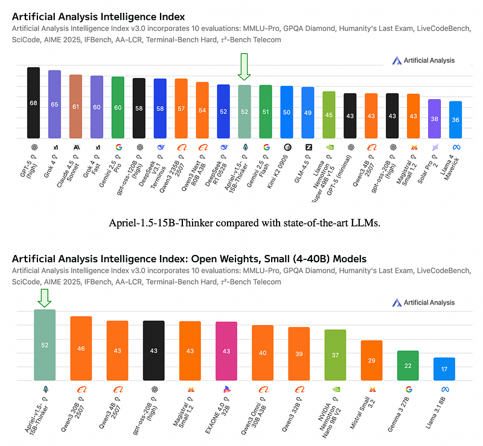
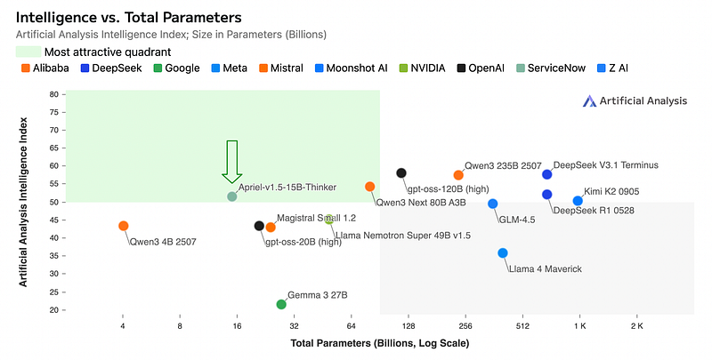
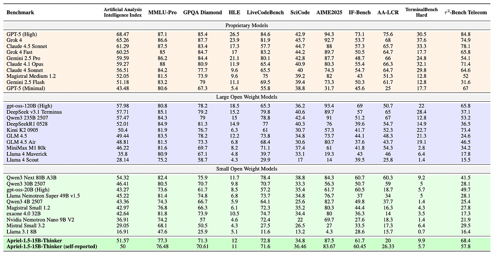
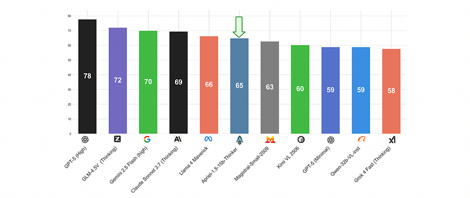
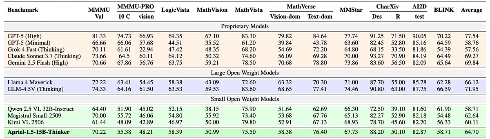

# Papers Explained 478 - Apriel-1.5–15B-Thinker

Apriel-1.5–15B-Thinker is a 15-billion parameter open-weights multi-modal reasoning model. Starting from Pixtral-12B, a progressive three-stage methodology is applied:

This page ingests the source article into the wiki and connects it to [[Papers Explained Corpus]], [[Vision Language Models]], [[Reasoning Models]], [[Reinforcement Learning Topic]], [[Synthetic Data]], [[Model Compression and Efficiency]], [[Supervised Fine-Tuning]], [[Reinforcement Learning]].

## Source Metadata

- Source file: `raw/2025-10-27_Papers-Explained-478--Apriel-1-5-15B-Thinker-228b6fab1efd.html`
- Source title: Papers Explained 478: Apriel-1.5–15B-Thinker
- Published: 2025-10-27
- Canonical: [https://medium.com/@ritvik19/papers-explained-478-apriel-1-5-15b-thinker-228b6fab1efd](https://medium.com/@ritvik19/papers-explained-478-apriel-1-5-15b-thinker-228b6fab1efd)

## Key Ideas

- Depth upscaling to expand reasoning capacity without pretraining from scratch
- Staged continual pre-training that first develops foundational text and vision understanding, then enhances visual reasoning through targeted synthetic data generation addressing spatial structure, compositional understanding, and fine-grained perception
- High-quality text-only supervised fine-tuning on curated instruction-response pairs with explicit reasoning traces spanning mathematics, coding, science, and tool use.
- Notably, the model achieves competitive results without reinforcement learning or preference optimization, isolating the contribution of the data-centric continual pre-training approach.
- To enable multimodal capabilities in a compute efficient manner, the model builds on Pixtral-12B-Base-2409.

## Notes

Apriel-1.5–15B-Thinker is a 15-billion parameter open-weights multi-modal reasoning model. Starting from Pixtral-12B, a progressive three-stage methodology is applied:

- Depth upscaling to expand reasoning capacity without pretraining from scratch

- Staged continual pre-training that first develops foundational text and vision understanding, then enhances visual reasoning through targeted synthetic data generation addressing spatial structure, compositional understanding, and fine-grained perception

- High-quality text-only supervised fine-tuning on curated instruction-response pairs with explicit reasoning traces spanning mathematics, coding, science, and tool use.

Notably, the model achieves competitive results without reinforcement learning or preference optimization, isolating the contribution of the data-centric continual pre-training approach.

## Architecture and Model Upscaling

To enable multimodal capabilities in a compute efficient manner, the model builds on Pixtral-12B-Base-2409. Pixtral follows the LLaVA architecture, consisting of a vision encoder connected to a multimodal decoder through a two-layer fully connected projection network.

Following the approach adopted in Apriel-Nemotron-15B-Thinker, the base model is first upscaled via depth upscaling to balance compute, latency, and performance, while maintaining deployability on a single high-end GPU. To upscale the multimodal model, the decoder is increased from 40 to 48 hidden layers, training on a large corpus of text tokens. Half of these tokens serve as replay data, and the rest are drawn from diverse domains including high-quality web content, technical literature, mathematical problem sets, programming code, and StackExchange discussions.

Next, the projection network is realigned by training on data from image captioning datasets, multimodal instruction-response pairs, and document understanding scenarios. During this stage, the vision encoder and the decoder remain frozen.

Both depth upscaling and projection network realignment were trained with a sequence length of 8192 (with sequence packing). The weights of six equispaced intermediate checkpoints from the depth upscaling stage were averaged in equal proportions before projection network realignment. The final checkpoint obtained from the projection network realignment stage was used for subsequent stages of training.

## Continual Pretraining

The CPT process is divided into two stages: the first focuses on enhancing the model’s textual reasoning and image understanding capabilities, while the second aims at further improving its visual reasoning capabilities.

### CPT Stage 1

The first stage involves training on a dataset that comprises of 50% text-only tokens covering mathematical and scientific reasoning, coding tasks, and general knowledge; 20% tokens replayed from the decoder upscaling stage; and 30% multimodal tokens drawn from data on document understanding, chart understanding and reasoning, image captioning, long-form image descriptions, OCR-related tasks, and reasoning over mathematical and logical problems in visual contexts.

The vision encoder, projection network, and decoder were kept unfrozen. The training was performed at a sequence length of 32768 (with sequence packing)Loss was computed on all the tokens in the sequence. The weights of three equispaced intermediate checkpoints were averaged in equal proportions to form the final checkpoint from this stage.

### CPT Stage 2

To further strengthen visual reasoning after the first stage, a targeted multimodal dataset is constructed by employing a synthetic data generation pipeline to large collections of raw images. This pipeline transforms each image into one or more task-centric training samples. This shifts the original image distribution to a custom curriculum that encourages the model to learn spatial structure, compositionality, and fine-grained perception that transfer to more complex visual reasoning. The following are the primary categories targeted:

- Image Reconstruction: Learn holistic scene priors and part–whole reasoning by masking image regions.

- Visual Matching: Improve correspondence, retrieval, and fine-grained discrimination by matching cropped or augmented anchors to candidates across views or images.

- Object Detection: Strengthen grounding and localization by identifying object presence and approximate location.

- Counting: Enhance the ability to count and distinguish specific visual elements by querying total or category-specific counts.

In this stage, the vision encoder was frozen, with just the projection network and decoder updated during training. The training was performed at a sequence length of 16384 (with sequence packing). For samples having an instruction-response format, loss was computed only on the responses in this stage. The final checkpoint from this stage was considered as the base model for future stages.

## Supervised Fine Tuning

Given compute constraints that preclude training a larger annotator model or scaling post-training runs from a cold-start SFT, gpt-oss-120b is adopted as the annotator model due to its greater compute efficiency. For verifiable domains, such as Math, Coding and Science, a synthetic data generation methodology is followed, synthesizing high quality, execution verifiable data samples across domains starting from a seed taxonomy and samples, and evolving iteratively toward more complex scenarios.

A multi-step filtering process is followed that includes rigorous de-duplication to enhance data diversity, content filtering to remove unsafe or inappropriate material, and heuristic filtering to remove low-quality samples. Following this initial cleaning, the data’s correctness is verified using LLM-as-Judge and execution-based verification where applicable, implementing rejection sampling to discard incorrect or low-quality instruction-response pairs.

The final dataset comprised samples from domains including mathematical reasoning, coding, scientific reasoning, tool calling, generic reasoning and knowledge-intensive samples, conversations, instruction-following, security, content moderation, and robustness.

An initial SFT for 4 epochs at a sequence length of 32768 (with sequence packing) is performed. To further improve performance, two smaller SFT runs are conducted on top of the large-scale SFT:

- trained with a stratified 25% subset of the full dataset for 4 more epochs at the same sequence length

- a longer-sequence run at 49,152 sequence length, using 25k samples between 32768 and 49152 tokens and 100k samples ≤ 32768 tokens, randomly drawn from the original mix.

The models from these two smaller runs are merged by averaging their weights in equal proportions to produce the final APRIEL-1.5–15B-THINKER checkpoint. This phase consisted entirely of text data, only the decoder was updated. In all SFT runs, loss was computed only on response, and the chat template was applied to all samples.

## Evaluation

### Text Benchmarks

*Figure: Artificial Analysis Intelligence Index vs. Total Parameters (log scale).*

*Figure: Evaluation (pass@1 or accuracy) on benchmarks with maximum reasoning.*

- Apriel-1.5–15B-Thinker achieved a score of 52 on the Artificial Analysis Intelligence index, outperforming larger open-weight systems and performing comparably to some SOTA models.

- It demonstrated state-of-the-art accuracy on challenging evaluations: 87% on AIME2025 (mathematical reasoning), 62% on IF-Bench (instruction-following), and 68% on τ 2Bench (Telecom) (domain-specific problem-solving).

- On TerminalBench-Hard, it scored 10%, performing competitively with much larger proprietary systems (e.g., GPT-4.1, Gemini 2.5 Flash, Qwen3–250B at 13%) and surpassing strong open-source peers of comparable size (e.g., gpt-oss-20b at 6%).

- These findings underscore the model’s efficiency and competitiveness, offering strong reasoning and agentic capabilities despite its smaller 15B parameter count, and indicating a superior cost-to-intelligence trade-off.

### Vision Benchmarks

*Figure: Average performance across the benchmark suite.*

*Figure: Evaluation (pass@1 or accuracy, as applicable) on multimodal benchmarks.*

- Apriel-1.5–15B-Thinker achieved a solid overall position among evaluated models, outperforming most similarly-sized and even larger open-weight vision-language models.

- Despite its 15B parameters, it closely tracked much larger models (e.g., Llama 4 Maverick, 400B parameters) and surpassed several larger proprietary baselines (e.g., GPT-5 Minimal, Grok 4 Fast) in overall average score.

- It showed strong results on document-centric and diagram understanding benchmarks (e.g., 88.20% on CharXiv descriptive tasks, 76.40% on MathVerse Text Dominant), competitive performance on general multimodal reasoning (MMStar), and visual mathematical skills (MathVista).

- The model performs better on tasks combining visual inputs with substantial textual reasoning components, while showing moderate performance on purely visual reasoning tasks (e.g., 48.21% on MMMU-PRO Vision).

- There is a notable gap between its surface-level document comprehension (CharXiv descriptive 88.20%) and deeper contextual reasoning (CharXiv reasoning 50.10%).

- Opportunity for Improvement: Performance on the most demanding STEM-centric and visual logic tasks remains an area for further enhancement.

## Paper

Apriel-1.5–15b-Thinker [2510.01141](https://arxiv.org/abs/2510.01141)

## Figures

Figures from the Medium HTML export (`raw/2025-10-27_Papers-Explained-478--Apriel-1-5-15B-Thinker-228b6fab1efd.html`); local copies under `wiki/assets/papers-explained-478-apriel-1-5-15b-thinker/` when download succeeded.

| Figure | Caption |
|--------|---------|
|  | Title card: Apriel-1.5–15B-Thinker. |
|  | Text Benchmarks. |
|  | Artificial Analysis Intelligence Index vs. Total Parameters (log scale). |
|  | Evaluation (pass@1 or accuracy) on benchmarks with maximum reasoning. |
|  | Average performance across the benchmark suite. |
|  | Evaluation (pass@1 or accuracy, as applicable) on multimodal benchmarks. |
## Related

- [[Papers Explained Corpus]]
- [[Vision Language Models]]
- [[Reasoning Models]]
- [[Reinforcement Learning Topic]]
- [[Synthetic Data]]
- [[Model Compression and Efficiency]]
- [[Supervised Fine-Tuning]]
- [[Reinforcement Learning]]
- [[Papers Explained 477 - General-Reasoner]]
- [[Papers Explained 479 - olmOCR]]

#summary #topic
