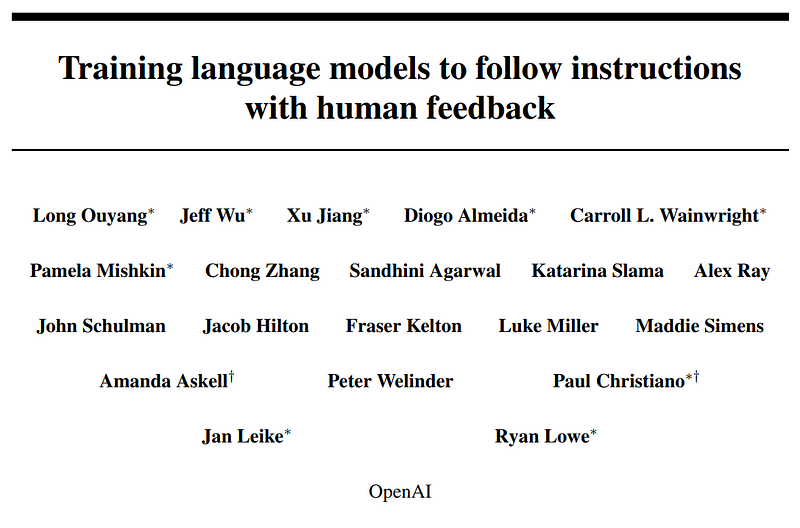
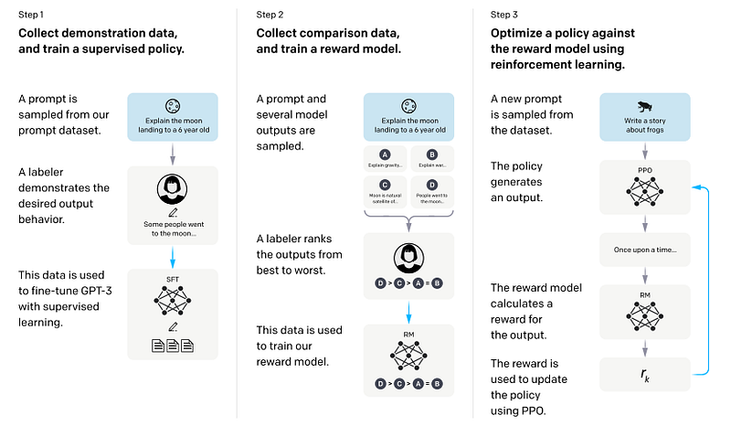
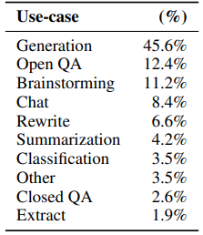
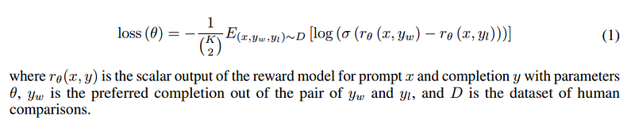
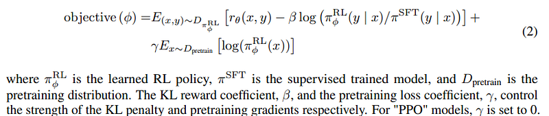

# Papers Explained 48 - InstructGPT

We start with a pretrained language model, a distribution of prompts on which we want our model to produce aligned outputs and a team of trained human labelers. We then apply the following three steps:

This page ingests the source article into the wiki and connects it to [[Papers Explained Corpus]], [[Reinforcement Learning Topic]], [[Large Language Models]], [[Safety and Alignment]], [[Synthetic Data]], [[Reinforcement Learning]], [[Supervised Fine-Tuning]].

## Source Metadata

- Source file: `raw/2023-07-24_Papers-Explained-48--InstructGPT-e9bcd51f03ec.html`
- Source title: Papers Explained 48: InstructGPT
- Published: 2023-07-24
- Canonical: [https://medium.com/@ritvik19/papers-explained-48-instructgpt-e9bcd51f03ec](https://medium.com/@ritvik19/papers-explained-48-instructgpt-e9bcd51f03ec)

## Key Ideas

- Step 1: Collect demonstration data, and train a supervised policy. Our labelers provide demonstrations of the desired behavior on the input prompt distribution. We then fine-tune a pretrained GPT-3 model on this data using supervised learning.
- Step 2: Collect comparison data, and train a reward model. We collect a dataset of comparisons between model outputs, where labelers indicate which output they prefer for a given input. We then train a reward model to predict the human-preferred output.
- Step 3: Optimize a policy against the reward model using PPO. We use the output of the RM as a scalar reward. We fine-tune the supervised policy to optimize this reward using the PPO algorithm.
- Steps 2 and 3 can be iterated continuously; more comparison data is collected on the current best policy, which is used to train a new RM and then a new policy.
- Our prompt dataset consists primarily of text prompts submitted to the OpenAI API, specifically those using an earlier version of the InstructGPT models (trained via supervised learning on a subset of our demonstration data) on the Playground interface.

## Notes

This paper shows an avenue for aligning language models with user intent on a wide range of tasks by fine-tuning with human feedback. Starting with a set of labeler-written prompts and prompts submitted through the OpenAI API, we collect a dataset of labeler demonstrations of the desired model behavior, which we use to fine-tune GPT-3 using supervised learning. We then collect a dataset of rankings of model outputs, which we use to further fine-tune this supervised model using reinforcement learning from human feedback. We call the resulting models InstructGPT. In human evaluations on our prompt distribution, outputs from the 1.3B parameter InstructGPT model are preferred to outputs from the 175B GPT-3, despite having 100x fewer parameters.

## High-Level Methodology

*Figure: A diagram illustrating the three steps of training*

We start with a pretrained language model, a distribution of prompts on which we want our model to produce aligned outputs and a team of trained human labelers. We then apply the following three steps:

Step 1: Collect demonstration data, and train a supervised policy. Our labelers provide demonstrations of the desired behavior on the input prompt distribution. We then fine-tune a pretrained GPT-3 model on this data using supervised learning.

Step 2: Collect comparison data, and train a reward model. We collect a dataset of comparisons between model outputs, where labelers indicate which output they prefer for a given input. We then train a reward model to predict the human-preferred output.

Step 3: Optimize a policy against the reward model using PPO. We use the output of the RM as a scalar reward. We fine-tune the supervised policy to optimize this reward using the PPO algorithm.

Steps 2 and 3 can be iterated continuously; more comparison data is collected on the current best policy, which is used to train a new RM and then a new policy.

## Dataset

Our prompt dataset consists primarily of text prompts submitted to the OpenAI API, specifically those using an earlier version of the InstructGPT models (trained via supervised learning on a subset of our demonstration data) on the Playground interface.

To train the very first InstructGPT models, we asked labelers to write prompts themselves. This is because we needed an initial source of instruction-like prompts to bootstrap the process, and these kinds of prompts weren’t often submitted to the regular GPT-3 models on the API. We asked labelers to write three kinds of prompts:

- Plain: We simply ask the labelers to come up with an arbitrary task, while ensuring the tasks had sufficient diversity.

- Few-shot: We ask the labelers to come up with an instruction, and multiple query/response pairs for that instruction.

- User-based: We had a number of use cases stated in waitlist applications to the OpenAI API. We asked labelers to come up with prompts corresponding to these use cases.

*Figure: Distribution of use case categories from our API prompt dataset.*

Our training tasks are from two sources: (1) a dataset of prompts written by our labelers and (2) a dataset of prompts submitted to early InstructGPT models on our API.

For each natural language prompt, the task is most often specified directly through a natural language instruction, but could also be indirectly through either few-shot examples or implicit continuation.

## Models

We start with the GPT-3 pretrained language models. These models are trained on a broad distribution of Internet data and are adaptable to a wide range of downstream tasks, but have poorly characterized behavior. Starting from these models, we then train models with three different techniques: supervised fine-tuning (SFT), reward modeling (RM), and reinforcement learning (RL).

In the supervised fine-tuning (SFT) approach, the GPT-3 model is fine-tuned using supervised learning with labeler demonstrations. Training for more epochs improves the performance despite overfitting on the validation set.

The reward modeling (RM) technique involves training a model to generate scalar rewards based on prompts and responses. The authors use 6B reward models instead of 175B to save computational resources. The RM model is trained on a dataset of comparisons between two model outputs, using cross-entropy loss. To speed up comparison collection, labelers rank between 4 and 9 responses, generating multiple comparisons for each prompt. Training on all the comparisons as a single batch element improves computational efficiency and prevents overfitting.

After RM training, the reward model is normalized using a bias so that labeler demonstrations achieve a mean score of 0. This normalization is done to address reward shifts.

*Figure: The loss function for the reward model.*

In the reinforcement learning (RL) phase, the SFT model is further fine-tuned using Proximal Policy Optimization (PPO) in a bandit environment. The environment presents a random prompt and expects a response, which is evaluated using the reward model. A per-token KL penalty from the SFT model is added to mitigate the overoptimization of the reward model. The value function is initialized from the RM.

*Figure: Maximization objective function in RL training.*

PPO models are compared to the SFT models and GPT-3 baselines. GPT-3 with a few-shot prefix to prompt instruction-following mode is also compared. Additionally, InstructGPT is also compared to fine-tuning 175B GPT-3 on FLAN and T0 datasets, which include a variety of NLP tasks combined with natural language instructions. The best-performing checkpoint on the validation set is chosen for each dataset.

## Results

### Results on the API distribution

Labelers significantly prefer InstructGPT outputs over GPT-3 outputs across different model sizes. Using a few-shot prompt, supervised learning and comparison data training methods improves the performance of GPT-3, but InstructGPT still outperforms it. InstructGPT models are found to be more appropriate, reliable, and easier to control compared to GPT-3. The preferences of held-out labelers align with the training labelers, indicating that InstructGPT models do not overfit specific preferences. The reward models used in the study accurately predict labelers’ preferences. Public NLP datasets, such as FLAN and T0, do not reflect the usage of language models in real-world applications. InstructGPT performs better than these datasets’ fine-tuned GPT-3 models, highlighting the need for diverse and open-ended generation tasks in training language models.

### Results on public NLP datasets

In terms of truthfulness, the PPO models of InstructGPT show small but significant improvements in generating truthful and informative outputs compared to GPT-3. This improvement is observed even without explicitly instructing the models to tell the truth. However, the 1.3B PPO-ptx model performs slightly worse than a GPT-3 model of the same size. The PPO models of InstructGPT also hallucinate (fabricate information) less often on closed-domain tasks compared to GPT-3.

Regarding toxicity, InstructGPT models show improvements over GPT-3 in generating less toxic outputs when provided with a respectful prompt. However, without the respectful prompt, the advantage disappears, and InstructGPT performs similarly to GPT-3. When explicitly prompted to produce toxic output, InstructGPT models are more toxic than GPT-3. These findings are supported by human evaluations.

In terms of bias, InstructGPT models are not found to be less biased than GPT-3. The PPO-ptx model, when instructed to act respectfully, exhibits lower entropy and higher bias. The bias pattern is not clear, suggesting that the instructed models are more certain of their outputs regardless of whether they exhibit stereotypical behavior.

Modifying the RLHF fine-tuning procedure by adding pretraining updates helps mitigate performance regressions and even surpass GPT-3 on certain datasets. However, more work is needed to address performance regressions on other datasets. Additionally, mixing in pretraining updates is found to be more effective than increasing the KL coefficient in reducing performance regressions. Changing the KL model from PPO init to GPT-3 yields similar results.

### Qualitative results

InstructGPT models have the potential to generalize well to instructions outside of the fine-tuning distribution. InstructGPT can follow instructions in non-English languages and perform tasks like code summarization and question-answering, even though these tasks were a small portion of the training data. While the 175B PPO-ptx model showed good performance in answering code-related questions and following instructions in other languages, it often produced responses in English, regardless of the instruction language. In comparison, GPT-3 could perform these tasks but required more specific prompts and rarely followed instructions accurately in these domains.

However, InstructGPT still exhibited some limitations. It sometimes made simple mistakes, such as assuming a false premise is true or providing multiple answers to a question that has a clear single answer. The model also struggled when instructions contained multiple explicit constraints or challenging prompts, such as writing a summary in a specified number of sentences. These issues could be mitigated through adversarial data collection.

## Paper

Training language models to follow instructions with human feedback [2203.02155](https://arxiv.org/abs/2203.02155)

## Figures

Figures from the Medium HTML export (`raw/2023-07-24_Papers-Explained-48--InstructGPT-e9bcd51f03ec.html`); local copies under `wiki/assets/papers-explained-48-instructgpt/` when download succeeded.

| Figure | Caption |
|--------|---------|
|  | Title card: InstructGPT. |
|  | A diagram illustrating the three steps of training. |
|  | Distribution of use case categories from our API prompt dataset. |
|  | The loss function for the reward model. |
|  | Maximization objective function in RL training. |
## Related

- [[Papers Explained Corpus]]
- [[Reinforcement Learning Topic]]
- [[Large Language Models]]
- [[Safety and Alignment]]
- [[Synthetic Data]]
- [[Reinforcement Learning]]
- [[Supervised Fine-Tuning]]
- [[Papers Explained 47 - Gopher]]
- [[Papers Explained 49 - Chinchilla]]

#summary #topic
