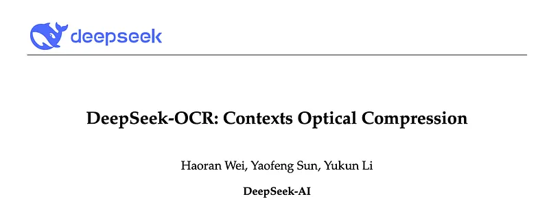
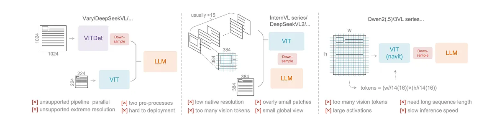
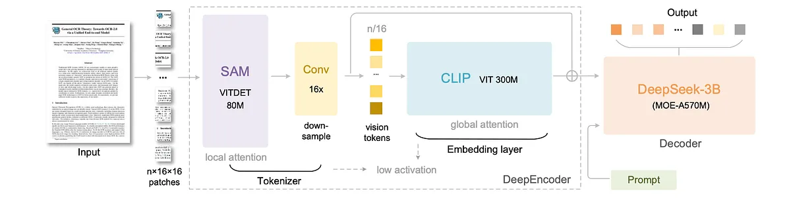
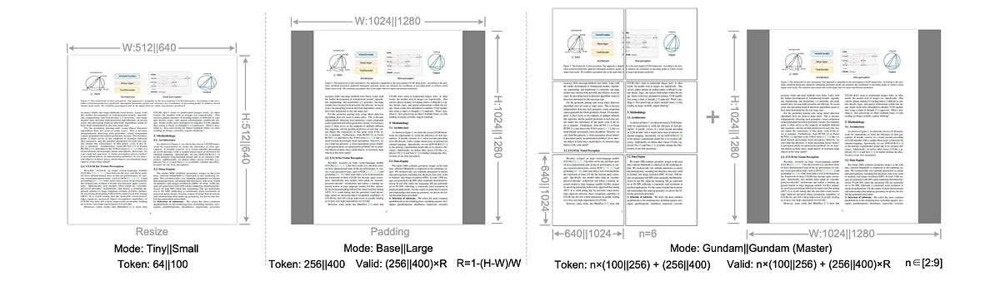
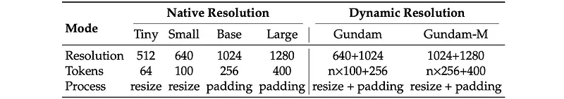
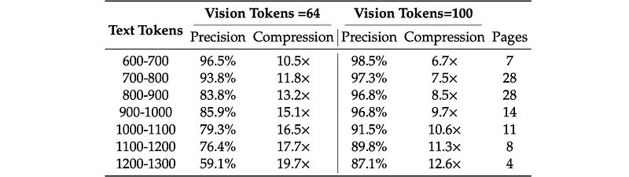
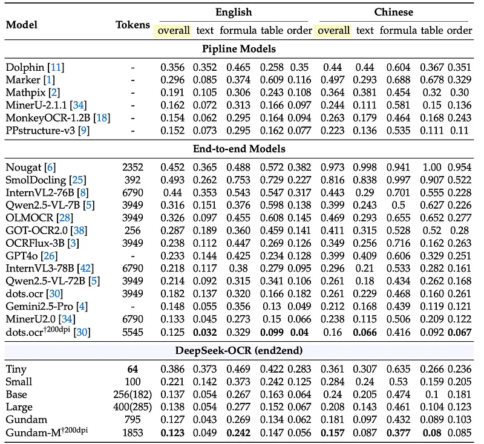
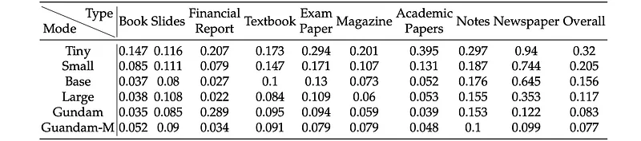

# Papers Explained 481 - DeepSeek-OCR

DeepSeek-OCR is an initial investigation into the feasibility of compressing long contexts via optical 2D mapping. It consists of two components: DeepEncoder and DeepSeek3B-MoE-A570M as the decoder.

This page ingests the source article into the wiki and connects it to [[Papers Explained Corpus]], [[Document AI]], [[Long Context]], [[Mixture of Experts]], [[Model Compression and Efficiency]], [[Computer Vision]].

## Source Metadata

- Source file: `raw/2025-10-30_Papers-Explained-481--DeepSeek-OCR-d7e1c19499d7.md`
- Source title: Papers Explained 481: DeepSeek-OCR
- Published: 2025-10-30
- Canonical: [https://medium.com/@ritvik19/papers-explained-481-deepseek-ocr-d7e1c19499d7](https://medium.com/@ritvik19/papers-explained-481-deepseek-ocr-d7e1c19499d7)

## Key Ideas

- The model is available on [HuggingFace](https://huggingface.co/deepseek-ai/DeepSeek-OCR).
- Current open-source VLMs employ three main types of vision encoders:
- The first type is a dual-tower architecture which utilizes a parallel SAM encoder to increase visual vocabulary parameters for high-resolution image processing.
- The second type is a tile-based method that processes images by dividing them into small tiles for parallel computation, reducing activation memory under high-resolution settings.
- The third type is adaptive resolution encoding which directly processes full images through patch-based segmentation without tile parallelization.

## Notes

DeepSeek-OCR is an initial investigation into the feasibility of compressing long contexts via optical 2D mapping. It consists of two components: DeepEncoder and DeepSeek3B-MoE-A570M as the decoder. DeepEncoder serves as the core engine, designed to maintain low activations under high-resolution input while achieving high compression ratios to ensure an optimal and manageable number of vision tokens.

The model is available on [HuggingFace](https://huggingface.co/deepseek-ai/DeepSeek-OCR).

### Typical Vision Encoders in VLMs

*Figure: Typical vision encoders in popular VLMs.*

Current open-source VLMs employ three main types of vision encoders:

The first type is a dual-tower architecture which utilizes a parallel SAM encoder to increase visual vocabulary parameters for high-resolution image processing. While offering controllable parameters and activation memory, this approach suffers from significant drawbacks: it requires dual image preprocessing that complicates deployment and makes encoder pipeline parallelism challenging during training.

The second type is a tile-based method that processes images by dividing them into small tiles for parallel computation, reducing activation memory under high-resolution settings. Although capable of handling extremely high resolutions, this approach has notable limitations due to its typically low native encoder resolution (below 512×512), causing large images to be excessively fragmented and resulting in numerous vision tokens.

The third type is adaptive resolution encoding which directly processes full images through patch-based segmentation without tile parallelization. While this encoder can handle diverse resolutions flexibly, it faces substantial challenges with large images due to massive activation memory consumption that can cause GPU memory overflow, and sequence packing requires extremely long sequence lengths during training. Long vision tokens will slow down both prefill and generation phases of inference.

## Architecture

*Figure: The architecture of DeepSeek-OCR.*

DeepSeek-OCR utilizes a unified end-to-end VLM architecture consisting of an encoder and a decoder. The encoder, known as DeepEncoder, is responsible for extracting image features and tokenizing as well as compressing visual representations. The decoder is used for generating the required result based on image tokens and prompts. DeepEncoder is approximately 380M in parameters, mainly composed of an 80M SAM-base and a 300M CLIP-large connected in series. The decoder adopts a 3B MoE architecture with 570M activated parameters.

### DeepEncoder

A vision encoder needs the following features:

- The ability to process high resolutions

- Low activation at high resolutions

- Few vision tokens

- Support for multiple resolution inputs

- A moderate parameter count

DeepEncoder mainly consists of two components: a visual perception feature extraction component dominated by window attention, and a visual knowledge feature extraction component with dense global attention. SAM-base (patch-size 16) and CLIP-large are used as the main architectures for the two components respectively. For CLIP, the first patch embedding layer is removed since its input is no longer images but output tokens from the previous pipeline. Between the two components, a 2-layer convolutional module performs 16×downsampling of vision tokens. Each convolutional layer has a kernel size of 3, stride of 2, padding of 1, and channels increase from 256 to 1024. Assuming a 1024×1024 image input, DeepEncoder will segment it into 1024/16×1024/16=4096 patch tokens. Since the first half of the encoder is dominated by window attention and only 80M, the activation is acceptable. Before entering global attention, the 4096 tokens go through the compression module and the token count becomes 4096/16=256, thus making the overall activation memory controllable.

### Multiple resolution support

Several resolution modes for simultaneous model training are designed to achieve the capability of a single DeepSeek-OCR model supporting multiple resolutions. DeepEncoder mainly supports two major input modes: native resolution and dynamic resolution. Each of them contains multiple sub-modes.

Native resolution supports four sub-modes: Tiny, Small, Base, and Large, with corresponding resolutions and token counts of 512×512 (64), 640×640 (100), 1024×1024 (256), and 1280×1280 (400) respectively. Since Tiny and Small modes have relatively small resolutions, to avoid wasting vision tokens, images are processed by directly resizing the original shape. For Base and Large modes, in order to preserve the original image aspect ratio, images are padded to the corresponding size. After padding, the number of valid vision tokens is less than the actual number of vision tokens: 𝑁𝑣𝑎𝑙𝑖𝑑 = ⌈𝑁𝑎𝑐𝑡𝑢𝑎𝑙 ×[1 −((𝑚𝑎𝑥(𝑤, ℎ)−𝑚𝑖𝑛(𝑤, ℎ))/(𝑚𝑎𝑥(𝑤, ℎ)))]⌉

Dynamic resolution can be composed of two native resolutions. Gundam mode consists of n×640×640 tiles (local views) and a 1024×1024 global view. The vision token number output by the DeepEncoder under Gundam mode is: 𝑛×100 +256, where 𝑛is the number of tiles. For images with both width and height smaller than 640, 𝑛is set to 0. Gundam-master mode (1024×1024 local views+1280×1280 global view) is obtained through continued training on a trained DeepSeek-OCR model. This is mainly for load balancing, as Gundam-master’s resolution is too large and training it together would slow down the overall training speed.

### MoE Decoder

The decoder uses DeepSeek-3B-MoE. During inference, the model activates 6 out of 64 routed experts and 2 shared experts, with about 570M activated parameters.

## Data Engine

### OCR 1.0 data

For document data, 30M pages of diverse PDF data covering about 100 languages are collected from the Internet, with Chinese and English accounting for approximately 25M. Two types of ground truth are created for this data: coarse annotations and fine annotations. Coarse annotations are extracted directly from the full dataset using fitz, aimed at teaching the model to recognize optical text, especially in minority languages. Fine annotations include 2M pages each for Chinese and English, labeled using advanced layout models (such as PP-DocLayout) and OCR models (such as MinuerU and GOT-OCR2.0) to construct detection and recognition interleaved data. For minority languages, in the detection part, the layout model enjoys certain generalization capabilities. In the recognition part, fitz is used to create small patch data to train a GOT-OCR2.0, then the trained model is used to label small patches after layout processing, employing a model flywheel to create 600K data samples.

3M Word data is also collected, constructing high-quality image-text pairs without layout by directly extracting content. This data mainly brings benefits to formulas and HTML-formatted tables. Additionally, some open-source data is selected as supplements.

For natural scene OCR, the model mainly supports Chinese and English. The image data sources come from LAION and Wukong, labeled using PaddleOCR, with 10M data samples each for Chinese and English. Like document OCR, natural scene OCR can also control whether to output detection boxes through prompts.

### OCR 2.0 data

Following GOT-OCR2.0, chart, chemical formula, and plane geometry parsing data is referred to as OCR 2.0 data. For chart data, pyecharts and matplotlib are used to render 10M images, mainly including commonly used line, bar, pie, and composite charts. For chemical formulas, SMILES format from PubChem is utilized as the data source and rendered into images using RDKit, constructing 5M image-text pairs. For plane geometry images, Slow Perception is followed for generation. To increase the diversity of rendered data, geometric translation-invariant data augmentation is introduced, where the same geometric image is translated in the original image, corresponding to the same ground truth drawn at the centered position in the coordinate system. Based on this, a total of 1M plane geometry parsing data is constructed.

### General vision data

DeepEncoder can benefit from CLIP’s pretraining gains and has sufficient parameters to incorporate general visual knowledge. Therefore, some data for tasks such as caption, detection, and grounding was prepared. This portion of data accounts for only 20% of the total data.

### Text-only data

To ensure the model’s language capabilities, 10% of in-house text-only pretrain data was introduced. All data was processed to a length of 8192 tokens, which is also the sequence length for DeepSeek-OCR.

## Training Pipelines

The training pipeline is very simple and consists mainly of two stages: training DeepEncoder independently; training the DeepSeek-OCR. Note that the Gundam-master mode is obtained by continuing training on a pre-trained DeepSeek-OCR model with 6M sampled data.

### Training DeepEncoder

A compact language model is utilized and the next token prediction framework is used to train DeepEncoder. All OCR 1.0 and 2.0 data, as well as 100M general data sampled from the LAION dataset, are used in this stage. All data is trained for 2 epochs for a sequence length of 4096.

### Training DeepSeek-OCR

After DeepEncoder is ready, all the data is used to train DeepSeek-OCR. SAM and the compressor are treated as the vision tokenizer. The CLIP part is frozen as the input embedding layer with unfrozen weights for training.

## Evaluation

### Vision-text Compression Performance

*Figure: DeepSeek-OCR’s vision-text compression ratio.*

- DeepSeek-OCR achieves approximately 97% decoding precision within a 10× compression ratio, demonstrating a very promising result for optical contexts compression.

- Performance begins to decline when the compression ratio exceeds 10×, potentially due to complex document layouts or text blurring at 512×512 or 640×640 resolution.

- Even at nearly 20× token compression, the model can still achieve approximately 60% precision.

- Optical context compression is a promising and worthwhile research direction that does not add overhead, as it leverages existing VLM infrastructure.

### Practical OCR Performance

- DeepSeek-OCR demonstrates strong practical capabilities, surpassing GOT-OCR2.0 [38] with fewer vision tokens (100 vs. 256 tokens) and achieving on-par performance with state-of-the-art models on OmniDocBench with 400 tokens.

- In Gundam mode (fewer than 800 tokens), DeepSeek-OCR outperforms MinerU2.0, which requires nearly 7,000 vision tokens, highlighting its efficiency.

*Figure: Edit distances for different categories of documents in OmniDocBench.*

- Performance varies by document category: slides require only 64 vision tokens, and books/reports achieve good performance with 100 vision tokens, likely because their text tokens are within 1,000 (not exceeding 10× compression).

- Newspapers, with 4–5,000 text tokens, require higher modes (Gundam or Gundam-master) for acceptable edit distances, which further demonstrates the boundaries of contexts optical compression.

## Paper

DeepSeek-OCR: Contexts Optical Compression [2510.18234](https://www.arxiv.org/abs/2510.18234)

## Figures

Figures from the Medium HTML export (`raw/2025-10-30_Papers-Explained-481--DeepSeek-OCR-d7e1c19499d7.md`); local copies under `wiki/assets/papers-explained-481-deepseek-ocr/` when download succeeded.

| Figure | Caption |
|--------|---------|
|  | Title card: DeepSeek-OCR. |
|  | Typical vision encoders in popular VLMs. |
|  | The architecture of DeepSeek-OCR. |
|  | A vision encoder needs the following features. |
|  | Dynamic resolution can be composed of two native resolutions. |
|  | DeepSeek-OCR’s vision-text compression ratio. |
|  | After DeepEncoder is ready, all the data is used to train DeepSeek-OCR. |
|  | Edit distances for different categories of documents in OmniDocBench. |
## Related

- [[Papers Explained Corpus]]
- [[Document AI]]
- [[Long Context]]
- [[Mixture of Experts]]
- [[Model Compression and Efficiency]]
- [[Computer Vision]]
- [[Papers Explained 480 - olmOCR 2]]
- [[Papers Explained 482 - Agent Foundation Models (Chain-of-Agents)]]

#summary #topic
