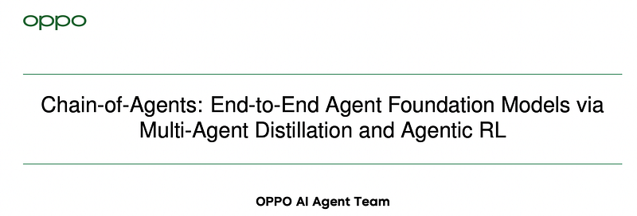
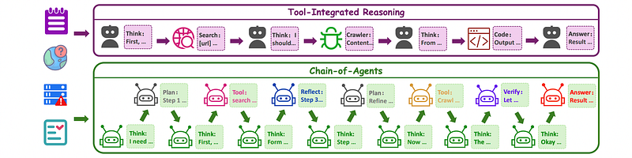
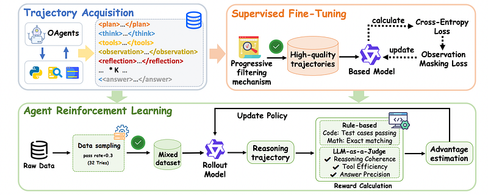
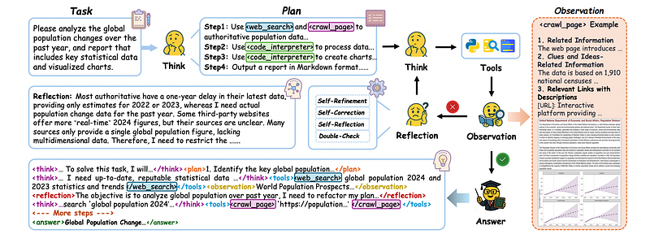
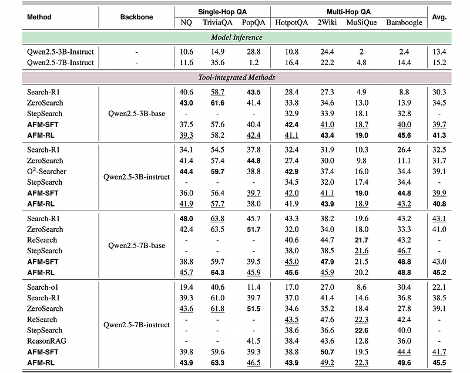
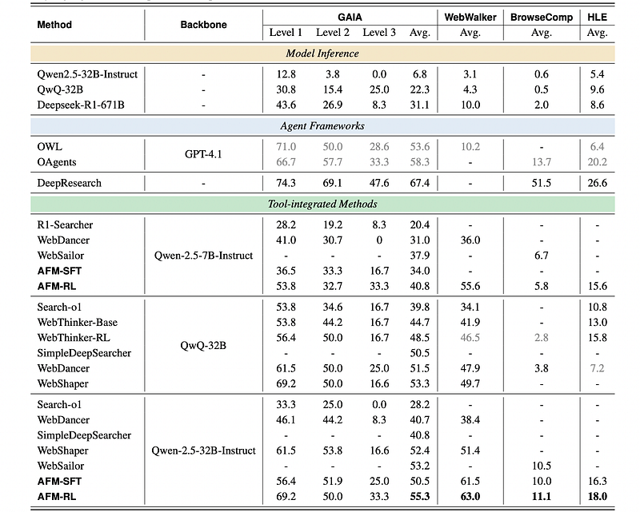
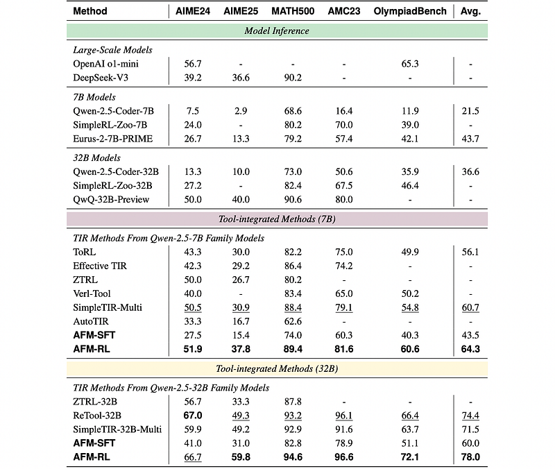

# Papers Explained 482 - Agent Foundation Models (Chain-of-Agents)

The [models](https://huggingface.co/collections/PersonalAILab/afm-models-689200e11d0b21a67c015ba8) and [datasets](https://huggingface.co/collections/PersonalAILab/afm-datasets-6892140eaad360ea5ccdcde1) are available on HuggingFace.

This page ingests the source article into the wiki and connects it to [[Papers Explained Corpus]], [[Agentic AI]], [[Reasoning Models]], [[Verifier-Bounded Learning]].

## Source Metadata

- Source file: `raw/2025-10-31_Papers-Explained-482--Agent-Foundation-Models--Chain-of-Agents--725db27dc0e5.html`
- Source title: Papers Explained 482: Agent Foundation Models (Chain-of-Agents)
- Published: 2025-10-31
- Canonical: [https://medium.com/@ritvik19/papers-explained-482-agent-foundation-models-chain-of-agents-725db27dc0e5](https://medium.com/@ritvik19/papers-explained-482-agent-foundation-models-chain-of-agents-725db27dc0e5)

## Key Ideas

- Role-playing Agents: High-level reasoning and coordination agents:
- Thinking Agent: Orchestrates the reasoning pipeline by activating specialized agents and maintaining solution state coherence
- Plan Agent: Decomposes the given query q into structured task sequences ⟨ϕsearch,ϕcrawl,...⟩
- Reflection Agent: Conducts self-critique through knowledge fusion and inconsistency resolution
- Verification Agent: Validates reasoning integrity against formal correctness criteria

## Notes

Chain-of-Agents (CoA) is a novel paradigm of LLM reasoning that enables native end-to-end complex problem-solving in the same way as a multi-agent system (i.e., multi-turn problem solving with multiple tools and multiple agents) within one model. The model dynamically activates different tool agents and role-playing agents to simulate multi-agent collaboration in an end-to-end fashion. To elicit such abilities in LLMs, a distillation framework is introduced to distill multi-agent systems into chain-of-agents trajectories for supervised fine-tuning. Reinforcement learning on verifiable tasks is then used to further improve the models’ capabilities. The resulting models are called Agent Foundation Models (AFMs).

The [models](https://huggingface.co/collections/PersonalAILab/afm-models-689200e11d0b21a67c015ba8) and [datasets](https://huggingface.co/collections/PersonalAILab/afm-datasets-6892140eaad360ea5ccdcde1) are available on HuggingFace.

## Chain-of-Agents Paradigm

*Figure: Illustration of TIR and CoA paradigms.*

CoA consists of two core components:

Role-playing Agents: High-level reasoning and coordination agents:

- Thinking Agent: Orchestrates the reasoning pipeline by activating specialized agents and maintaining solution state coherence

- Plan Agent: Decomposes the given query q into structured task sequences ⟨ϕsearch,ϕcrawl,...⟩

- Reflection Agent: Conducts self-critique through knowledge fusion and inconsistency resolution

- Verification Agent: Validates reasoning integrity against formal correctness criteria

Tool Agents: Domain-specific execution agents including:

- Search Agent: Formulates optimized queries with source prioritization

- Crawl Agent: Performs parallel content extraction and technical detail parsing

- Code Generate Agent: Generates and executes code snippets within sandbox environments

Unlike Tool-Integrated Reasoning, the CoA paradigm orchestrates multi-agent collaboration within a single decoding (inference) process: the Thinking Agent dynamically coordinates this ecosystem through state transitions:

where St maintains persistent reasoning state, and ϕt ∈ {ϕthink, ϕplan, ϕsearch, ...} denotes activated roles.

*Figure: Overview of the training framework.*

## Agentic Supervised Fine-tuning

OAgents, an open-source multiagent system, is used to extract trajectories by recording each agent’s activation, reasoning state, and output in sequence. When OAgents executes a task, the agent selection process is monitored. The reasoning state before each agent acts is captured and the agent’s output is recorded. This transforms OAgents’ multi-agent collaboration procedure into a CoA-like trajectory suitable for agentic supervised fine-tuning.

Given the variability in trajectory quality across different data sources, a progressive filtering mechanism is implemented to ensure that only high-quality, non-trivial samples are used for SFT.

*Figure: Illustration of the proposed multi-agent distillation framework.*

- Complexity filtering: Trajectories with fewer than five total agent-tool interactions are excluded to eliminate overly simplistic tasks.

- Quality filtering: "Dirty data" is removed, including instances with incorrect answers, redundant tool inputs, or failure to strictly follow instructions (validated via prompting, even for otherwise correct answers). The correctness of QA and search tasks is evaluated using large language models. In contrast, the validity of code-related tasks is determined by whether the generated code successfully passes all test cases. For mathematical reasoning tasks, correctness is assessed through a direct comparison between the generated answers and the predefined golden answers.

- Reflection enrichment: Trajectories lacking reflection mechanisms (e.g., self-reflection, self-refinement) are downsampled to prioritize instances modeling self-critical reasoning. For math or code tasks, trajectories without reflection mechanisms are dropped.

- Error-correction trajectory upsampling: For search or QA tasks, trajectories where the <double_check> agent initially yields low credibility scores but ultimately achieves correct answers through iterative re-reasoning are upsampled.

The resulting corpus is distinguished by three key traits:

- All trajectories necessitate multi-tool collaborative coordination, embodying complex functional interdependencies that demand advanced planning and execution capabilities.

- Reasoning chains span 5–20 hops, significantly surpassing the 2–3 hop range typical of standard benchmarks.

- It is enriched with high-quality reflective trajectories, particularly those featuring iterative error correction.

SFT training trajectories are formulated into the following format:

<think> Ccot </think><tools> αm(αp) </tools><observation> Ot </observation><reflection> Ft </reflection>...<answer> At </answer>

The training objective minimizes:

with observation masking (O) to prevent environmental noise propagation.

## Agentic Reinforcement Learning

Qwen-2.5-72B-Instruct is used to evaluate question solvability without tool assistance. For each query q in the QA dataset:

where N=32 is the number of model predictions, ai denotes the i-th prediction, ygt represents the ground truth, and EM(⋅) computes the exact match score between two inputs. This pass rate rq quantifies parametric knowledge contamination risk. Queries with rq >0.3 are excluded as they either represent:

- Trivially solvable cases requiring no tool usage

- Highly contaminated samples vulnerable to parametric recall.

Randomly sampled queries from the remaining challenging ones (with rq ≤0.3) are used for RL training. The sampled subset is excluded from the SFT dataset.

### Reward Design

Web Agent Reward Function:

The reward function, Rweb(τ), focuses solely on answer correctness.Format consistency is assumed to be ensured by supervised fine-tuning. LLM-as-Judge (Mj) is used to provide a binary assessment (scoreanswer ∈ {0,1}) of the final prediction's correctness.

Code Agent Reward Function:

The reward function, Rcode(τ), considers both answer correctness and format correctness.

- scoreanswer ∈ {0,1} reflects answer correctness. For code generation, solutions must pass all test cases in a secure sandbox. For mathematical tasks, answers are evaluated with Math-Verify.

- scoreformat ∈ {0,1} denotes whether each call of the Code agent is in the format of <code>\npy\n...\n</code>.

## Experimental Setup

### Web Agent

Two types of datasets are constructed, varying in task types and difficulty:

MHQA Dataset:

- SFT Stage: Samples question-answer pairs from NQ and HotpotQA datasets. Generates approximately 8.8k training data using a trajectory synthesis and quality-filtering pipeline.

- RL Stage: Adopts the same dataset setting as Search-R1, using the full NQ and HotpotQA datasets.

Web Agent Dataset:

- Constructed through systematic integration of synthetic and filtered real-world sources, refined for complexity and quality.

- Generated Agentic Datasets: Created with an autonomous agentic task generation pipeline. Starts with unlabeled corpora (PDFs, HTML), generates atomic tasks, and enhances complexity via:

- Depth-based extension: Multi-step tasks requiring sequential tool executions.

- Width-based extension: Tasks decomposed into parallel subtasks requiring independent tool usage.

- Filtered Real-World QA Datasets: Includes filtered single-hop and multi-hop QA data from NQ, TQ, and HotpotQA, processed for complex web agent scenarios.

Supervised Fine-Tuning (SFT): A total of 16,433 high-quality trajectories:

- 8,826 from MHQA Dataset.

- 7,607 from Web Agent Dataset.

- These trajectories feature extended reasoning chains of 5–20 hops, a significant increase from prior benchmarks' 2–3 hops.

Reinforcement Learning (RL):

- MHQA Dataset: 169,615 instances.

- Web Agent Dataset: 10,427 instances.

The approach is evaluated on single-hop QA, multi-hop QA, and specialized benchmarks for complex information retrieval tasks:

Single-Hop QA: Comprises 22,328 examples (3,610 NQ, 11,313 TQ, 7,405 HotpotQA).

Multi-Hop QA: Uses 29,385 examples (14,267 PopQA, 12,576 2Wiki, 2,417 Musique, 125 Bamboogle).

Specialized Benchmarks:

- GAIA: 103 text-only validation samples for General AI Assistants, evaluating multi-step reasoning and tool-use proficiency in real-world questions.

- BrowseComp: 1,266 examples assessing advanced web navigation through obscure, verifiable questions requiring persistent search strategies.

- HLE: 500 text-only samples (from 2,500 multi-modal questions) from a frontier academic benchmark requiring expert-level reasoning across mathematics, humanities, and natural sciences.

Model performance is evaluated using the LLM-as-Judge method, with Qwen-2.5-72B serving as the judge. The judge provides binary correctness assessments, yielding accuracy scores per dataset.

Implementation Details

- Backbone Architecture: Qwen-2.5 model family (Qwen2.5-3B-Instruct, 7B-Instruct, and 32B-Instruct variants).

- Maximum Sequence Length: 32,768 tokens.

- Reinforcement Learning Method: DAPO.

- 64 prompts processed per iteration, generating 8 rollouts per prompt through environment interaction. Up to 24 steps and 32k tokens, followed by final answer generation.

### Code Agent

The code agent's training dataset unifies several publicly available datasets for code generation and mathematical reasoning:

- Pure Code Tasks: LiveCodeBench v1–v3 and CodeForces.

- Pure Math Tasks: Retool-SFT and DAPO-Math.

- Mixed Code & Math Tasks: Skywork-OR1-RL-Data.

Sources are selected for verifiability (code problems ≥ 50 test cases, proof-based math problems discarded), diversity, and challenge (spanning common to contest-level programming, high-school to Olympiad mathematics).

SFT (Supervised Fine-Tuning) Stage

- Datasets Used: Full splits of LiveCodeBench v1–v3, Retool-SFT, Skywork-OR1-RL-Data, and the verifiable-prompts split of CodeForces.

- Processing: After trajectory synthesis and quality-filtering, approximately 47k reasoning traces are retained, with final answers passing all unit tests or numerical verifications.

RL (Reinforcement Learning) Stage

- Datasets Used: LiveCodeBench v1–v3, Skywork-OR1-RL-Data, and DAPO-Math.

- Skywork-OR1-RL-Data Filtering: Initially over 100k math problems, questions that a DeepSeek-distill-Qwen-7B model fails on all 16 samples are discarded, resulting in 35k math problems.

- Quality Filter: Applied to eliminate overly simplistic queries.

- Deduplication: Prompts are intentionally not deduplicated between SFT and RL sets, relying on DAPO algorithm's implicit difficulty-based filtering.

Metrics:

Code Generation Tasks:

- Generated code is executed in a sandbox environment.

- A task is solved only if all predefined test cases are passed.

- Performance is evaluated based on the pass@1 rate.

Mathematical Reasoning Tasks:

- Each question has a ground-truth answer.

- Math-Verify is used for robust answer extraction and correctness assessment.

- For AMC23, AIME24, and AIME25 (due to limited sample sizes and high pass@1 variance), the mean pass@1 over 16 independently drawn samples (avg@16) is the primary metric.

- Standard pass@1 is retained for all other benchmarks.

Implementation Details:

- Backbone Models: Qwen2.5-Coder-7B-Instruct, Qwen2.5-Coder-32B-Instruct

- RL Algorithm: DAPO.

- 8 rollouts per prompt. Overlong Buffer: Set to 1/8 of the maximum response length.

- Each rollout is constrained to at most 8 tool calls before a final answer.

- 7B model: 32k tokens throughout training.

- 32B model: Initially 16k tokens, expanded to 32k tokens at the 40th global training step.

## Evaluation

### Web Agent

*Figure: Main results on 7 Multi-hop Question Answering (MHQA) benchmarks.*

- AFM achieves strong performance on MHQA benchmarks, surpassing previous state-of-the-art methods, especially AFM-SFT. AFM-RL establishes a new state-of-the-art in average performance across 7 datasets.

- AFM demonstrates exceptional generalization capability, achieving significant performance gains on unseen validation and test sets of other multi-hop QA datasets.

*Figure: Results on agentic benchmarks including GAIA, WebWalker, BrowseComp and HLE.*

- AFM establishes a new state-of-the-art on knowledge-intensive complex tasks, achieving a new state-of-the-art average success rate of 55.3% on the GAIA benchmark with the Qwen-2.5-32B-Instruct backbone.

- AFM achieves a new state-of-the-art among 32B models on BrowseComp with a success rate of 11.1%.

- AFM's 63.0% average accuracy on the WebWalker benchmark substantially exceeds other baselines.

- AFM achieves 18.0% on the challenging HLE benchmark, outperforming strong baselines.

- AFM's performance with the Qwen-2.5-32B-Instruct backbone approaches that of GPT-4.1 based systems on GAIA and surpasses them on HLE.

*Figure: SFT performance comparison of 32B models.*

- AFM-SFT achieves a GAIA score of 50.5%—outperforming WebSailor-SFT-32B (46.6%), WebDancer-SFT-32B (35.0%), and WebShape-SFT-32B (44.6%) by notable margins.

- AFM-SFT reaches 61.5% on WebWalker—a substantial lead over WebShape-SFT-32B (44.6%).

- AFM-SFT scores 10.0% on BrowseComp, surpassing WebSailor-SFT-32B (7.2%).

### Code Agent

*Figure: Results comparison of mathematical benchmarks.*

- AFM significantly outperforms existing baseline models in mathematical reasoning at both 7B and 32B parameter scales.

- AFM-RL-7B achieved an average accuracy of 64.3% across five benchmarks, a 3.6% improvement over the second-best performer.

- AFM-RL-32B attained an average accuracy of 78.0%, 3.6% higher than the state-of-the-art ReTool-32B.

- AFM-RL-32B achieved absolute improvements of 10.5% and 5.7% on AIME25 and OlympiadBench, respectively.

## Paper

Chain-of-Agents: End-to-End Agent Foundation Models via Multi-Agent Distillation and Agentic RL [2508.13167](https://www.arxiv.org/abs/2508.13167)

## Figures

Figures from the Medium HTML export (`raw/2025-10-31_Papers-Explained-482--Agent-Foundation-Models--Chain-of-Agents--725db27dc0e5.html`); local copies under `wiki/assets/papers-explained-482-agent-foundation-models-chain-of-agents/` when download succeeded.

| Figure | Caption |
|--------|---------|
|  | Title card: Agent Foundation Models (Chain-of-Agents). |
|  | Illustration of TIR and CoA paradigms. |
|  | CoA consists of two core components:: where St maintains persistent reasoning state, and ϕt ∈ {ϕthink, ϕplan, ϕsearch,...} denotes activated roles. |
|  | Overview of the training framework. |
|  | Illustration of the proposed multi-agent distillation framework. |
|  | The training objective minimizes. |
|  | Qwen-2.5-72B-Instruct is used to evaluate question solvability without tool assistance. For each query q in the QA dataset. |
|  | Code Agent Reward Function. |
|  | The reward function, Rcode(τ), considers both answer correctness and format correctness. |
|  | Main results on 7 Multi-hop Question Answering (MHQA) benchmarks. |
|  | Results on agentic benchmarks including GAIA, WebWalker, BrowseComp and HLE. |
|  | SFT performance comparison of 32B models. |
|  | Results comparison of mathematical benchmarks. |
## Related

- [[Papers Explained Corpus]]
- [[Agentic AI]]
- [[Reasoning Models]]
- [[Verifier-Bounded Learning]]
- [[Papers Explained 481 - DeepSeek-OCR]]
- [[Papers Explained 483 - PANNs]]

#summary #topic
