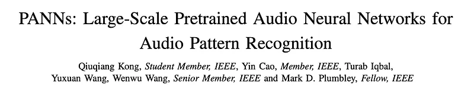
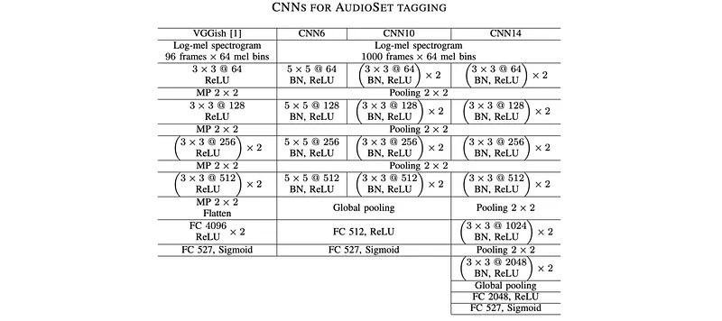
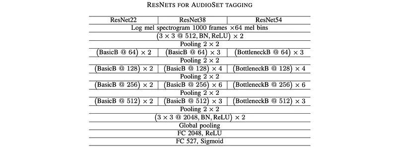
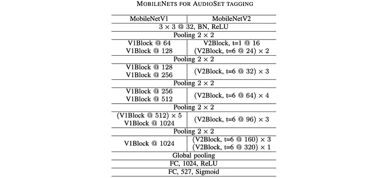
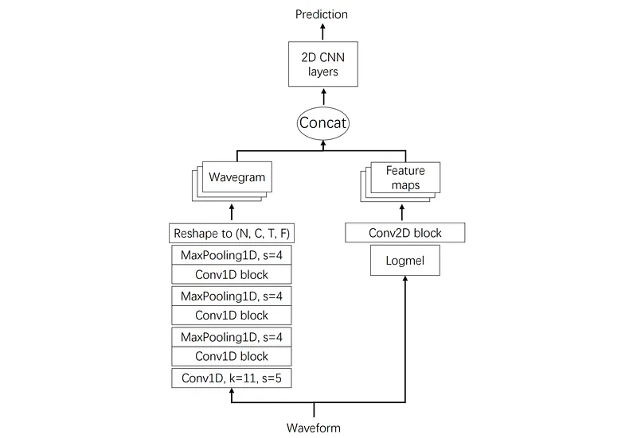
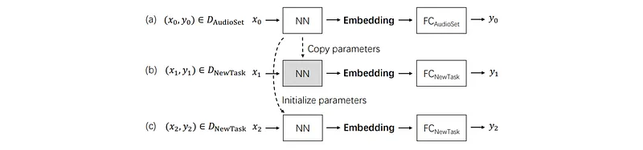
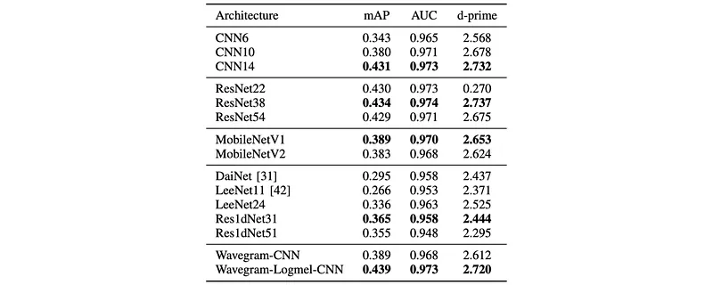
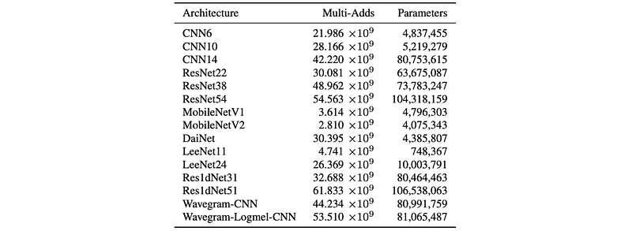

# Papers Explained 483 - PANNs

In computer vision and natural language processing, systems pretrained on large-scale datasets have generalized well to several tasks. However, there is limited research on pretraining systems on large-scale datasets for audio pattern recognition.

This page ingests the source article into the wiki and connects it to [[Papers Explained Corpus]], [[Audio Models]], [[Computer Vision]], [[Embedding and Retrieval]], [[Vision Language Models]], [[Synthetic Data]].

## Source Metadata

- Source file: `raw/2025-11-03_Papers-Explained-483--PANNs-a4baa79c5139.md`
- Source title: Papers Explained 483: PANNs
- Published: 2025-11-03
- Canonical: [https://medium.com/@ritvik19/papers-explained-483-panns-a4baa79c5139](https://medium.com/@ritvik19/papers-explained-483-panns-a4baa79c5139)

## Key Ideas

- In this work, Pretrained audio neural networks (PANNs) are proposed, trained on the large-scale AudioSet dataset. These PANNs are transferred to other audio related tasks.
- Audio tagging is an essential task of audio pattern recognition, with the goal of predicting the presence or absence of audio tags in an audio clip.
- CNNs adopted for audio tagging often use log mel spectrograms as input. Short time Fourier transforms (STFTs) are applied to time-domain waveforms to calculate spectrograms.
- An extra fully-connected layer is added to the fixed-length vectors to extract embedding features which can further increase their representation ability.
- Two convolutional layers and a downsampling layer are applied on the log mel spectrogram to reduce the input log mel spectrogram size. Three types of ResNets with different depths are implemented: a 22-layer ResNet with 8 basic blocks;

## Notes

In computer vision and natural language processing, systems pretrained on large-scale datasets have generalized well to several tasks. However, there is limited research on pretraining systems on large-scale datasets for audio pattern recognition.

In this work, Pretrained audio neural networks (PANNs) are proposed, trained on the large-scale AudioSet dataset. These PANNs are transferred to other audio related tasks. The performance and computational complexity of PANNs modeled by a variety of convolutional neural networks are investigated. An architecture called Wavegram-Logmel-CNN is proposed, using both log-mel spectrogram and waveform as input features.

## Audio Tagging Systems

Audio tagging is an essential task of audio pattern recognition, with the goal of predicting the presence or absence of audio tags in an audio clip. Early work on audio tagging included using manually-designed features as input, such as audio energy, zero-crossing rate, and mel-frequency cepstrum coefficients (MFCCs).

### CNNs

CNNs adopted for audio tagging often use log mel spectrograms as input. Short time Fourier transforms (STFTs) are applied to time-domain waveforms to calculate spectrograms. Then, mel filter banks are applied to the spectrograms, followed by a logarithmic operation to extract log mel spectrograms.

This research investigates 6-, 10-, and 14-layer CNNs. The 6-layer CNN consists of 4 convolutional layers with a kernel size of 5 ×5, based on AlexNet. The 10- and 14-layer CNNs consist of 4 and 6 convolutional layers, respectively, inspired by the VGG-like CNNs. Each convolutional block consists of 2 convolutional layers with a kernel size of 3 ×3. Batch normalization is applied between each convolutional layer, and the ReLU nonlinearity is used to speed up and stabilize the training. 2 ×2 average pooling is applied to each convolutional block for downsampling, as 2 ×2 average pooling has been shown to outperform 2 ×2 max pooling. Global pooling is applied after the last convolutional layer to summarize the feature maps into a fixed-length vector. To combine the advantages of maximum and average operation, the averaged and maximized vectors are summed.

An extra fully-connected layer is added to the fixed-length vectors to extract embedding features which can further increase their representation ability. For a particular audio pattern recognition task, a linear classifier is applied to the embedding features, followed by either a softmax nonlinearity for classification tasks or a sigmoid nonlinearity for tagging tasks. Dropout is applied after each downsampling operation and fully connected layers to prevent systems from overfitting.

### ResNets

Two convolutional layers and a downsampling layer are applied on the log mel spectrogram to reduce the input log mel spectrogram size. Three types of ResNets with different depths are implemented: a 22-layer ResNet with 8 basic blocks; a 38-layer ResNet with 16 basic blocks, and a 54-layer ResNet with 16 residual blocks.

### MobileNets

MobileNets are based on depthwise separable convolutions by factorizing a standard convolution into a depthwise convolution and a 1 ×1 pointwise convolution. The V1Blocks and V2Blocks are MobileNet convolutional blocks, each consisting of two and three convolutional layers, respectively.

### One-dimensional CNNs

Previous audio tagging systems were based on the log mel spectrogram, a hand-crafted feature. To improve performance, several researchers proposed to build one-dimensional CNNs which operate directly on the time-domain waveforms.

- DaiNet applied kernels of length 80 and stride 4 to the input waveform of audio recordings. The kernels are learnable during training. To begin with, a maximum operation is applied to the first convolutional layer, which is designed to make the system be robust to phase shift of the input signals. Then, several one-dimensional convolutional blocks with kernel size 3 and stride 4 were applied to extract high level features. An 18-layer DaiNet with four convolutional layers in each convolutional block achieved the best result in UrbanSound8K classification.

- In contrast to DaiNet that applied large kernels in the first layer, LeeNet applied small kernels with length 3 on the waveforms, to replace the STFT for spectrogram extraction. LeeNet consists of several one dimensional convolutional layers, each followed by a downsampling layer of size 2. The original LeeNet consists of 11 layers.

- Adapting one-dimensional CNNs for AudioSet tagging: LeeNet was modified by extending it to a deeper architecture with 24 layers, replacing each convolutional layer with a convolutional block that consists of two convolutional layers. To further increase the number of layers of the one-dimensional CNNs, a one-dimensional residual network (Res1dNet) with a small kernel size of 3 was proposed. The convolutional blocks in LeeNet were replaced with residual blocks, where each residual block consists of two convolutional layers with kernel size 3. The first and second convolutional layers of the convolutional block have dilations of 1 and 2, respectively, to increase the receptive field of the corresponding residual block. Downsampling is applied after each residual block. By using 14 and 24 residual blocks, Res1dNet31 and Res1dNet51 with 31 and 51 layers, respectively, were obtained.

## Wavegram-CNN systems

Previous one-dimensional CNN systems have not outperformed the systems trained with log mel spectrograms as input. One characteristic of previous time-domain CNN systems is that they were not designed to capture frequency information, because there is no frequency axis in the one-dimensional CNN systems, so they can not capture frequency patterns of a sound event with different pitch shifts.

### Wavegram-CNN systems

The proposed Wavegram-CNN is a time-domain audio tagging system. Wavegram is a feature that is similar to a log mel spectrogram, but is learnt using a neural network. A Wavegram is designed to learn a time-frequency representation that is a modification of the Fourier transform. A Wavegram has a time axis and a frequency axis.

A Wavegram is designed to learn frequency information that may be lacking in one-dimensional CNN systems. Wavegrams may also improve over hand-crafted log mel spectrograms by learning a new kind of time-frequency transform from data. Wavegrams can then replace log mel spectrograms as input features resulting in our Wavegram-CNN system.

### Wavegram

To build a Wavegram, a one-dimensional CNN is first applied to a time-domain waveform. The one-dimensional CNN begins with a convolutional layer with filter length 11 and stride 5 to reduce the size of the input. This immediately reduces the input length by a factor of 5, helping to reduce memory usage.

This is followed by three convolutional blocks, where each block consists of two convolutional layers with dilations of 1 and 2, respectively. These dilations are designed to increase the receptive field of the convolutional layers. Each convolutional block is followed by a downsampling layer with stride 4.

By using the initial stride and downsampling three times, a 32 kHz audio recording is downsampled to:
32,000 ÷ 5 ÷ 4 ÷ 4 ÷ 4 = 100 frames of features per second.

The output size of the one-dimensional CNN layers is denoted as T × C, where T is the number of frames and C is the number of channels. This output is then reshaped to a tensor with size T × F × (C/F) by splitting the C channels into C/F groups, where each group has F frequency bins.

This tensor is called a Wavegram. The Wavegram learns frequency information by introducing F frequency bins in each of the C/F channels.

CNN14 is applied as a backbone architecture on the extracted Wavegram so that a fair comparison can be made between Wavegram and log mel spectrogram based systems. Two-dimensional CNNs such as CNN14 can capture time-frequency invariant patterns in the Wavegram, because kernels are convolved along both time and frequency axes.

### Wavegram-Logmel-CNN

*Figure: Architecture of Wavegram-Logmel-CNN.*

Furthermore, the Wavegram and log mel spectrogram can be combined into a new representation. This combination utilizes information from both time-domain waveforms and log mel spectrograms. The combination is carried out along the channel dimension. The Wavegram provides extra information for audio tagging, complementing the log mel spectrogram.

## Data Processing

### Data Balancing

A balanced sampling strategy is designed to train PANNs. Audio clips are approximately equally sampled from all sound classes to constitute a mini-Batch.

### Data augmentation

Some sound classes in AudioSet contain only a small number (e.g., hundreds) of training clips which may limit the performance of PANNs. Mixup and SpecAugment are applied to augment data during training.

- Mixup is a way to augment a dataset by interpolating both the input and target of two audio clips from a dataset. For example, if the input of two audio clips are denoted as x1,x2, and their targets as y1,y2, respectively, then the augmented input and target can be obtained by x= λx1 +(1− λ)x2 and y= λy1 +(1−λ)y2 respectively, where λis sampled from a Beta distribution.

- SpecAugment was proposed for augmenting speech data for speech recognition. SpecAugment operates on the log mel spectrogram of an audio clip using frequency masking and time masking. These frequency masks can improve the robustness of PANNs to frequency /time distortion of audio clips.

### Experiment Setup

To investigate the generalization ability of PANNs, PANNs are transferred to a range of audio pattern recognition tasks.

- A PANN is pretrained with the AudioSet dataset.

- For a new task, the PANN is used as a feature extractor. A classifier is built on the extracted embedding features. The shaded rectangle indicates the parameters are frozen and not trained.

- For a new task, the parameters of a neural network are initialized with a PANN. Then, all parameters are fine-tuned on the new task.

AudioSet is a large-scale audio dataset with an ontology of 527 sound classes. The audio clips from AudioSet are extracted from YouTube videos. The training set consists of 2,063,839 audio clips, including a “balanced subset” of 22,160 audio clips, where there are at least 50 audio clips for each sound class. The evaluation set consists of 20,371 audio clips.

Raw audio waveforms of AudioSet were downloaded in December 2018 using the links provided, and audio clips that are no longer downloadable were ignored. A total of 1,934,187 (94%) of the audio clips of the full training set, including 20,550 (93%) of the balanced training set, were successfully downloaded. Additionally, 18,887 audio clips of the evaluation dataset were successfully downloaded.

Audio clips shorter than 10 seconds were padded with silence to a length of 10 seconds. Considering that a large number of audio clips from YouTube are monophonic and have a low sampling rate, all audio clips were converted to monophonic and resampled to 32 kHz.

For the CNN systems based on log mel spectrograms, STFT is applied on the waveforms with a Hamming window of size 1024 and a hop size of 320 samples. This configuration leads to 100 frames per second. 64 mel filter banks are applied to calculate the log mel spectrogram. The lower and upper cut-off frequencies of the mel banks are set to 50 Hz and 14 kHz to remove low frequency noise and the aliasing effects.

The log mel spectrogram of a 10-second audio clip has a shape of 1001 × 64. The extra one frame is caused by applying the “centre” argument when calculating STFT.

## Evaluation

*Figure: Comparison with previous methods.*

- The proposed CNN14 system achieved an mAP of 0.431, outperforming previous state-of-the-art AudioSet tagging systems (e.g., DeepRes at 0.392).

*Figure: Results with data balancing and augmentation.*

- Data balancing significantly accelerates training convergence and improves mAP (0.416 with vs. 0.375 without).

- Mixup data augmentation is crucial for PANNs, improving mAP (0.431 with vs. 0.416 without), especially with smaller datasets, and is more effective on log mel spectrograms than time-domain waveforms.

*Figure: Results of different hop sizes.*

- Smaller hop sizes lead to better mAP, with a hop size of 320 achieving the highest mAP of 0.431.

*Figure: Results of different embedding dimensions.*

- Increasing embedding dimensions generally improves mAP performance.

*Figure: Results of partial training data.*

- The amount of training data is important, as mAP decreases with reduced training data (e.g., 5.8% drop for 50% data).

*Figure: Results of different sample rates.*

- A sample rate of 16 kHz yields similar performance to 32 kHz, but 8 kHz significantly lowers mAP, indicating the usefulness of information in the 4 kHz — 8 kHz range.

*Figure: Results of different Mel bins.*

- More mel bins generally lead to better performance (mAP 0.442 for 128 bins), with 64 mel bins chosen as a trade-off between performance and computational complexity.

*Figure: Results of different systems.*

- The Wavegram-Logmel-CNN system achieved a state-of-the-art mAP of 0.439 among all PANNs, outperforming CNN14 and MobileNetV1.

- Deeper CNN architectures (e.g., 14 layers) achieve better performance on the large AudioSet dataset, contrasting with findings on smaller datasets.

- ResNet38 achieved a slightly higher mAP of 0.434 compared to CNN14, while ResNet54 did not offer further improvement.

- Among one-dimensional CNNs, Res1dNet31 and Res1dNet51 achieved state-of-the-art performance.

- The Wavegram-CNN system demonstrated that Wavegram is an effective learned feature.

*Figure: Number of multi-adds and parameters of different systems*

- MobileNets (V1 and V2) offer significant computational efficiency (e.g., MobileNetV1 has 8.6% multi-adds and 5.9% parameters of CNN14) at the cost of a lower mAP compared to CNN14.

- Computational complexity analysis shows that MobileNets are the most efficient, while Wavegram-Logmel-CNN achieves the best performance among all PANNs.

## Paper

PANNs: Large-Scale Pretrained Audio Neural Networks for Audio Pattern Recognition [1912.10211](https://arxiv.org/abs/1912.10211)

## Figures

Figures from the Medium HTML export (`raw/2025-11-03_Papers-Explained-483--PANNs-a4baa79c5139.md`); local copies under `wiki/assets/papers-explained-483-panns/` when download succeeded.

| Figure | Caption |
|--------|---------|
|  | Title card: PANNs. |
|  | CNNs adopted for audio tagging often use log mel spectrograms as input. |
|  | Two convolutional layers and a downsampling layer are applied on the log mel spectrogram to reduce the input log mel spectrogram size. |
|  | Two convolutional layers and a downsampling layer are applied on the log mel spectrogram to reduce the input log mel spectrogram size. |
|  | Architecture of Wavegram-Logmel-CNN. |
|  | Some sound classes in AudioSet contain only a small number (e.g., hundreds) of training clips which may limit the performance of PANNs. |
|  | Comparison with previous methods. |
|  | Results with data balancing and augmentation. |
|  | Results of different hop sizes. |
|  | Results of different embedding dimensions. |
|  | Results of partial training data. |
|  | Results of different sample rates. |
|  | Results of different Mel bins. |
|  | Results of different systems. |
|  | Number of multi-adds and parameters of different systems. |
## Related

- [[Papers Explained Corpus]]
- [[Audio Models]]
- [[Computer Vision]]
- [[Embedding and Retrieval]]
- [[Vision Language Models]]
- [[Synthetic Data]]
- [[Papers Explained 482 - Agent Foundation Models (Chain-of-Agents)]]
- [[Papers Explained 484 - wav2vec]]

#summary #topic
