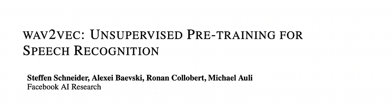
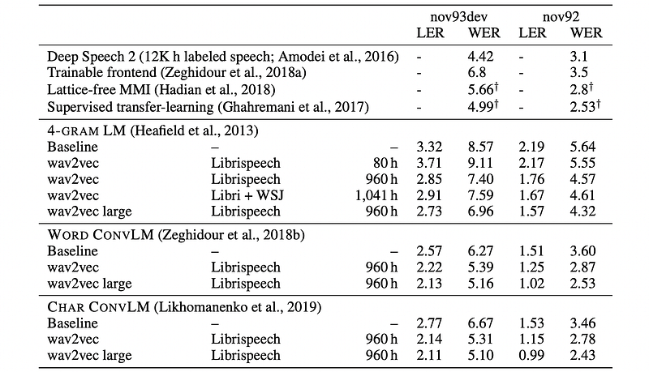
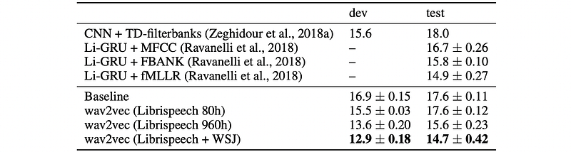

# Papers Explained 484 - wav2vec

Wav2vec is an unsupervised pre-training method for speech recognition that learns representations of raw audio using a multi-layer convolutional neural network.

This page ingests the source article into the wiki and connects it to [[Papers Explained Corpus]], [[Audio Models]], [[Long Context]], [[Embedding and Retrieval]].

## Source Metadata

- Source file: `raw/2025-11-04_Papers-Explained-484--wav2vec-f82a0cbde202.html`
- Source title: Papers Explained 484: wav2vec
- Published: 2025-11-04
- Canonical: [https://medium.com/@ritvik19/papers-explained-484-wav2vec-f82a0cbde202](https://medium.com/@ritvik19/papers-explained-484-wav2vec-f82a0cbde202)

## Key Ideas

- The model takes raw audio signals as input and applies two networks. The encoder network embeds the audio signal in a latent space and the context network combines multiple time-steps of the encoder to obtain contextualized representations.
- Given raw audio samples xi ∈X, the encoder network f : X →Z parameterized as a five-layer convolutional network is applied. The encoder layers have kernel sizes (10,8,4,4,4) and strides (5,4,2,2,2).
- Next, the context network g : Z → C is applied to the output of the encoder network to mix multiple latent representations zi…zi−v into a single contextualized tensor ci = g(zi…zi−v ) for a receptive field size v.
- The layers in both the encoder and context networks consist of a causal convolution with 512 channels, a group normalization layer and a ReLU nonlinearity.
- For training on larger datasets, a model variant (“wav2vec large”) with increased capacity is considered.

## Notes

Wav2vec is an unsupervised pre-training method for speech recognition that learns representations of raw audio using a multi-layer convolutional neural network. It is trained on large amounts of unlabeled audio data via a noise contrastive binary classification task, and the resulting representations are used to improve acoustic model training.

## Model

*Figure: Illustration of pre-training from audio data.*

The model takes raw audio signals as input and applies two networks. The encoder network embeds the audio signal in a latent space and the context network combines multiple time-steps of the encoder to obtain contextualized representations. Both networks are then used to compute the objective function.

Given raw audio samples xi ∈X, the encoder network f : X →Z parameterized as a five-layer convolutional network is applied. The encoder layers have kernel sizes (10,8,4,4,4) and strides (5,4,2,2,2). The output of the encoder is a low frequency feature representation zi ∈Z which encodes about 30 ms of 16 kHz of audio and the striding results in representations zi every 10ms.

Next, the context network g : Z → C is applied to the output of the encoder network to mix multiple latent representations zi…zi−v into a single contextualized tensor ci = g(zi…zi−v ) for a receptive field size v. The context network has nine layers with kernel size three and stride one. The total receptive field of the context network is about 210 ms.

The layers in both the encoder and context networks consist of a causal convolution with 512 channels, a group normalization layer and a ReLU nonlinearity. Normalization is performed across the feature and temporal dimension for each sample which is equivalent to group normalization with a single normalization group. This choice resulted in representations that generalize well across datasets.

For training on larger datasets, a model variant (“wav2vec large”) with increased capacity is considered. This variant uses two additional linear transformations in the encoder and a considerably larger context network comprising twelve layers with increasing kernel sizes (2,3,…,13). Skip connections are introduced in the aggregator to help convergence in this case. The total receptive field in the last context network layer is hereby increased to about 810 ms.

## Pretraining Approach

Wav2Vec’s pretraining approach is designed to learn useful representations from raw audio data in a self-supervised manner. Instead of directly modeling the probability distribution of the data p(x), Wav2Vec implicitly models a density ratio. This is achieved by encoding the raw speech samples x into a feature representation z at a lower temporal frequency. The model then learns to estimate the ratio p(z_i+k | z_i…z_i-r ) / p(z_i+k ), where r is the context window size.

The model’s task is to distinguish the true future feature vector z_i+k (the k-th step in the future from time step i) from a set of distractor (negative) samples.

After pretraining, the context network’s representations c_i are used as input features for downstream tasks like speech recognition, replacing traditional features like log-mel filterbanks.

The model minimizes the following contrastive loss for each future step k (where k ranges from 1 to K):

Where:

- σ(x) is the sigmoid function (1 / (1 + exp(-x))).

- zᵀ_{i+k} h_k(c_i) represents the similarity score between the true future sample z_i+k and a transformation of the context vector c_i.

- h_k(c_i) = W_k c_i + b_k is an affine transformation applied to the context vector c_i, where W_k and b_k are learned parameters specific to step k.

- ~z represents a distractor sample drawn from a proposal distribution p_n.

- λ is a weighting factor that balances the positive and negative terms in the loss.

## Experimental Setup

### Data

The experiments utilize three primary corpora:

- TIMIT: Used for phoneme recognition, it employs a standard train, dev, and test split, with the training data comprising just over three hours of audio.

- Wall Street Journal: Consists of approximately 81 hours of transcribed audio. Training is performed on si284, validation on nov93dev, and testing on nov92.

- Librispeech: Provides a total of 960 hours of clean and noisy speech for training.

For pre-training, the following datasets are used:

- The full 81 hours of the WSJ corpus.

- An 80-hour subset of clean Librispeech.

- The full 960-hour Librispeech training set.

- A combination of all the above.

Acoustic models are trained using 80 log-mel filterbank coefficients, computed from a 25 ms sliding window with a 10 ms stride. Final models are evaluated based on both Word Error Rate (WER) and Letter Error Rate (LER).

### Acoustic Models

The wav2letter++ toolkit is used for training and evaluating acoustic models.

TIMIT Task:

- Architecture: Seven consecutive blocks of convolutions (kernel size 5, 1,000 channels), followed by a PReLU nonlinearity and a dropout rate of 0.7.

- Output: Projects to a 39-dimensional phoneme probability.

WSJ Benchmark Baseline:

- Architecture: A 17-layer model incorporating gated convolutions .

- Output: Predicts probabilities for 31 graphemes, including the standard English alphabet, apostrophe, period, two repetition characters (e.g., an1 for ann), and a silence token (|) for word boundaries.

### Decoding

Decoding emissions from the acoustic model involves a lexicon and a separate language model trained exclusively on WSJ language modeling data.

Language Models (LMs) Considered:

- A 4-gram KenLM language model.

- A word-based convolutional language model.

- A character-based convolutional language model.

Decoding Process: The word sequence y is decoded from the output of the context network c or log-mel filterbanks using the beam search decoder by maximizing the following objective:

- fAM is the acoustic model.

- pLM is the language model.

- π = π1, …, πL are the characters of y.

- α, β, γ are hyperparameters weighting the language model, word penalty, and silence penalty, respectively.

## Results

- Pre-training on more unlabeled audio data consistently leads to better accuracy on the WSJ benchmark.

- Pre-trained representations substantially improve performance over character-based baselines, demonstrating that pre-training on unlabeled audio data can surpass the best character-based approaches (e.g., 0.67 WER improvement over Deep Speech 2 on nov92).

- wav2vec models achieve competitive or superior performance compared to existing phoneme-based models.

- Pre-training significantly reduces WER, especially when limited transcribed data is available (e.g., a 36% WER reduction on nov92 when only about eight hours of transcribed data is available).

- Pre-training on larger datasets (e.g., full Librispeech) yields better performance than pre-training on smaller datasets (e.g., WSJ audio only).

- Fine-tuning the embedding network does not meaningfully improve performance but substantially increases acoustic model training time.

- On the TIMIT task, wav2vec pre-training on Librispeech and WSJ audio data achieves results matching the state of the art.

- Similar to WSJ, accuracy on TIMIT steadily increases with more data used for pre-training, with the best accuracy achieved using the largest amount of pre-training data.

## Paper

wav2vec: Unsupervised Pre-training for Speech Recognition [1904.05862](https://arxiv.org/abs/1904.05862)

## Figures

Figures from the Medium HTML export (`raw/2025-11-04_Papers-Explained-484--wav2vec-f82a0cbde202.html`); local copies under `wiki/assets/papers-explained-484-wav2vec/` when download succeeded.

| Figure | Caption |
|--------|---------|
|  | Title card: wav2vec. |
|  | Illustration of pre-training from audio data. |
|  | The model minimizes the following contrastive loss for each future step k (where k ranges from 1 to K). |
|  | Language Models (LMs) Considered. |
|  | Language Models (LMs) Considered. |
|  | Language Models (LMs) Considered. |
## Related

- [[Papers Explained Corpus]]
- [[Audio Models]]
- [[Long Context]]
- [[Embedding and Retrieval]]
- [[Papers Explained 483 - PANNs]]
- [[Papers Explained 485 - wav2vec 2.0]]

#summary #topic
