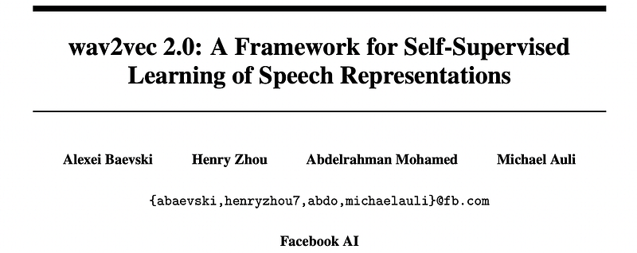
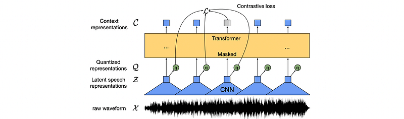
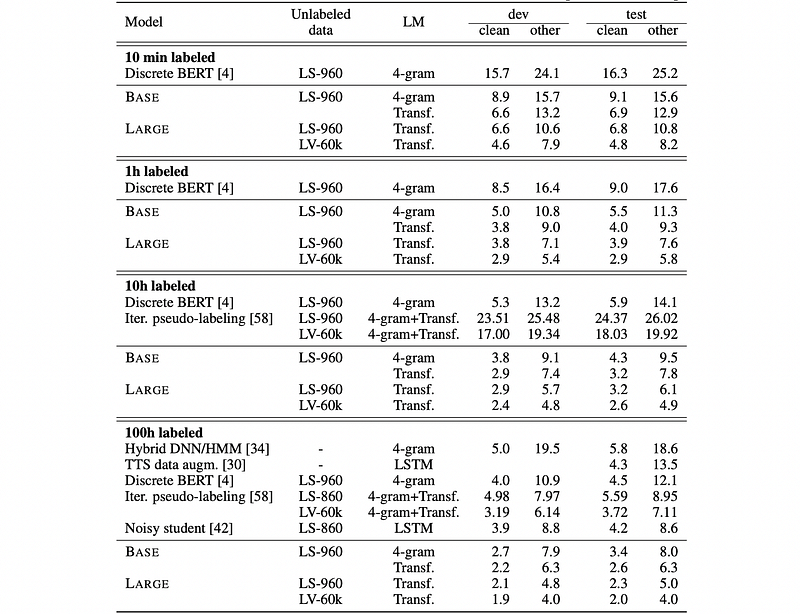
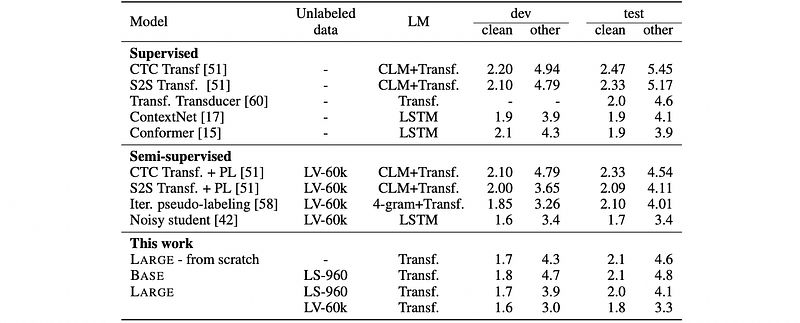

# Papers Explained 485 - wav2vec 2.0

This research shows for the first time that learning powerful representations from speech audio alone followed by fine-tuning on transcribed speech can outperform the best semi-supervised methods while being conceptually simpler.

This page ingests the source article into the wiki and connects it to [[Papers Explained Corpus]], [[Audio Models]], [[Large Language Models]], [[Model Compression and Efficiency]], [[Embedding and Retrieval]], [[Supervised Fine-Tuning]].

## Source Metadata

- Source file: `raw/2025-11-05_Papers-Explained-485--wav2vec-2-0-fe05d2379da1.html`
- Source title: Papers Explained 485: wav2vec 2.0
- Published: 2025-11-05
- Canonical: [https://medium.com/@ritvik19/papers-explained-485-wav2vec-2-0-fe05d2379da1](https://medium.com/@ritvik19/papers-explained-485-wav2vec-2-0-fe05d2379da1)

## Key Ideas

- The model is composed of a multi-layer convolutional feature encoder f : X→Zwhich takes as input raw audio Xand outputs latent speech representations z1,…,zT for T time-steps.
- The encoder consists of several blocks containing a temporal convolution followed by layer normalization and a GELU activation function. The raw waveform input to the encoder is normalized to zero mean and unit variance.
- The output of the feature encoder is fed to a context network which follows the Transformer architecture.
- To make the selection of codewords differentiable, the Gumbel softmax technique is used. This allows the model to be trained end-to-end with gradient descent.
- Logits: The feature encoder output is mapped to logits l ∈ R^(G×V).

## Notes

This research shows for the first time that learning powerful representations from speech audio alone followed by fine-tuning on transcribed speech can outperform the best semi-supervised methods while being conceptually simpler. wav2vec 2.0 masks the speech input in the latent space and solves a contrastive task defined over a quantization of the latent representations which are jointly learned.

## Model

*Figure: Illustration of the framework.*

The model is composed of a multi-layer convolutional feature encoder f : X→Zwhich takes as input raw audio Xand outputs latent speech representations z1,…,zT for T time-steps. These are then fed to a Transformer g: Z→Cto build representations c1,…,cT capturing information from the entire sequence. The output of the feature encoder is discretized to qt with a quantization module Z→Qto represent the targets in the self-supervised objective.

Feature encoder

The encoder consists of several blocks containing a temporal convolution followed by layer normalization and a GELU activation function. The raw waveform input to the encoder is normalized to zero mean and unit variance. The total stride of the encoder determines the number of time-steps T which are input to the Transformer.

Contextualized representations

The output of the feature encoder is fed to a context network which follows the Transformer architecture. Instead of fixed positional embeddings which encode absolute positional information, a convolutional layer which acts as relative positional embedding is used. The output of the convolution followed by a GELU is added to the inputs and then layer normalization is applied.

Quantization module

The primary goal is to convert the continuous output of the feature encoder into a discrete representation. Speech is continuous, which poses a challenge for certain modeling techniques. The quantization module addresses this by mapping the feature encoder’s output (z) to a finite set of speech representations. wav2vec 2.0 employs product quantization. This involves using multiple codebooks (groups) of potential speech units. The model selects one entry (codeword) from each codebook. These selected codewords are then concatenated to form the final discrete speech representation.

To make the selection of codewords differentiable, the Gumbel softmax technique is used. This allows the model to be trained end-to-end with gradient descent.

- Logits: The feature encoder output is mapped to logits l ∈ R^(G×V).

- Probabilities: The probabilities for choosing each codeword are calculated using the Gumbel softmax formula:

- τ is a non-negative temperature parameter.

- n = -log(-log(u)), where u are uniform samples from U(0,1).

Straight-Through Estimator: The straight-through estimator is used to approximate the gradient during backpropagation. This allows the model to learn even though the argmax operation in the forward pass is non-differentiable.

## Training

To pre-train the model, a certain proportion of time steps in the latent feature encoder space are masked, similar to masked language modeling in BERT. The training objective requires identifying the correct quantized latent audio representation in a set of distractors for each masked time step. The final model is fine-tuned on the labeled data.

### Masking

A proportion of the feature encoder outputs, or time steps, are masked before being fed to the context network. These masked time steps are replaced with a trained feature vector shared between all masked time steps. Inputs to the quantization module are not masked.

To mask the latent speech representations output by the encoder, a certain proportion p of all time steps are randomly sampled without replacement to be starting indices. Subsequently, M consecutive time steps are masked from every sampled index; spans may overlap.

### Objective

During pre-training, representations of speech audio are learned by solving a contrastive task Lm which requires identifying the true quantized latent speech representation for a masked time step within a set of distractors. This is augmented by a codebook diversity loss Ld to encourage the model to use the codebook entries equally often.

L= Lm + αLd

Contrastive Loss

Given context network output ct centered over masked time step t, the model needs to identify the true quantized latent speech representation qt in a set of K + 1 quantized candidate representations ˜q ∈Qt which includes qt and K distractors. Distractors are uniformly sampled from other masked time steps of the same utterance. The loss is defined as

where cosine similarity sim(a,b) = aT b/∥a∥∥b∥ is computed between context representations and quantized latent speech representations.

Diversity Loss

The contrastive task depends on the codebook to represent both positive and negative examples and the diversity loss Ld is designed to increase the use of the quantized codebook representations. The equal use of the V entries in each of the Gcodebooks is encouraged by maximizing the entropy of the averaged softmax distribution l over the codebook entries for each codebook¯ pg across a batch of utterances; the softmax distribution does not contain the gumbel noise nor a temperature:

### Fine-tuning

Pre-trained models are fine-tuned for speech recognition by adding a randomly initialized linear projection on top of the context network into Cclasses representing the vocabulary of the task. For Librispeech, there are 29 tokens for character targets plus a word boundary token. Models are optimized by minimizing a CTC loss and a modified version of SpecAugment is applied by masking to time-steps and channels during training which delays overfitting and significantly improves the final error rates, especially on the Libri-light subsets with few labeled examples.

## Experiment Setup

### Datasets

Unlabeled Data:

- Librispeech (LS-960): 960 hours of audio without transcriptions.

- LibriVox (LV-60k): 53.2k hours of audio after pre-processing.

Labeled Data for Fine-tuning:

- Librispeech: 960 hours transcribed, train-clean-100 (100 hours).

- Libri-light: train-10h (10 hours), train-1h (1 hour), train-10min (10 minutes).

- TIMIT: 5 hours of audio with detailed phoneme labels for phoneme recognition fine-tuning, using standard train/dev/test splits and collapsing phone labels to 39 classes.

### Pre-training

For masking, p= 0.065 of all time-steps are sampled to be starting indices and the subsequent M = 10 time-steps are masked. This results in approximately 49% of all time steps to be masked with a mean span length of 14.7, or 299ms.

The feature encoder contains seven blocks and the temporal convolutions in each block have 512 channels with strides (5,2,2,2,2,2,2) and kernel widths (10,3,3,3,3,2,2). This results in an encoder output frequency of 49 hz with a stride of about 20ms between each sample, and a receptive field of 400 input samples or 25ms of audio. The convolutional layer modeling relative positional embeddings has kernel size 128 and 16 groups.

Two model configurations are experimented with which use the same encoder architecture but differ in the Transformer setup: BASE contains 12 transformer blocks, model dimension 768, inner dimension (FFN) 3,072 and 8 attention heads. The LARGE model contains 24 transformer blocks with model dimension 1,024, inner dimension 4,096 and 16 attention heads.

For the quantization module, G= 2 and V = 320 are used for both models, resulting in a theoretical maximum of 102.4k codewords. Entries are of size d/G = 128 for BASE and d/G = 384 for LARGE. The Gumbel softmax temperature τ is annealed from 2 to a minimum of 0.5 for BASE and 0.1 for LARGE by a factor of 0.999995 at every update. The temperature in the contrastive loss is set to κ= 0.1.

### Fine-tuning

After pre-training, learned representations are fine-tuned on labeled data. A randomly initialized output layer is added on top of the Transformer to predict characters (Librispeech/Libri-light) or phonemes (TIMIT).

### Language Models and Decoding

Two types of language models (LM) are considered: a 4-gram model and a Transformer trained on the Librispeech LM corpus. The Transformer LM is identical to and contains 20 blocks, model dimension 1,280, inner dimension 6,144 and 16 attention heads. The weights of the language model (interval [0,5]) and a word insertion penalty ([−5,5]) are tuned via Bayesian optimization. 128 trials with beam 500 are run for the 4-gram LM and beam 50 for the Transformer LM, and the best set of weights is chosen according to performance on dev-other. Test performance is measured with beam 1,500 for the n-gram LM and beam 500 for the Transformer LM.

## Results

### Low-Resource Labeled Data Evaluation

*Figure: WER on the Librispeech dev/test sets when training on the Libri-light low-resource labeled data setups of 10 min, 1 hour, 10 hours and the clean 100h subset of Librispeech.*

- The approach demonstrates that ultra-low resource speech recognition is possible with self-supervised learning: A LARGE model pre-trained on LV-60k and fine-tuned on only 10 minutes of labeled data achieved a Word Error Rate (WER) of 5.2/8.6 on the Librispeech clean/other test sets.

- On the 100-hour subset of Librispeech, the LARGE model achieved a WER of 2.3/5.0, representing a 45%/42% relative WER reduction compared to iterative self-training [42], while being a simpler approach.

- Even with significantly less labeled data (10 hours and 1 hour), the model achieved strong performance, outperforming prior work with two orders of magnitude less labeled data in some cases.

- Increasing model size (BASE vs. LARGE) and the amount of unlabeled training data (LS-960 vs. LV-60k) consistently led to large improvements in WER, especially on the ‘test-other’ set.

### High-Resource Labeled Data Evaluation on Librispeech

*Figure: WER on Librispeech when using all 960 hours of labeled data.*

- The approach is effective even with large quantities of labeled data, achieving a WER of 1.8/3.3 on test-clean/other on the full 960 hours of Librispeech.

- This competitive performance was achieved despite using a simpler architecture and setup compared to some state-of-the-art methods, suggesting the robustness of the pre-trained representations.

### Phoneme Recognition on TIMIT

*Figure: TIMIT phoneme recognition accuracy in terms of phoneme error rate (PER).*

- The approach achieves a new state of the art on TIMIT phoneme recognition, reducing Phoneme Error Rate (PER) by a relative 23%/29% over the next best result on the dev/test sets, highlighting the generalizability of the learned representations.

## Paper

wav2vec 2.0: A Framework for Self-Supervised Learning of Speech Representations [2006.11477](https://arxiv.org/abs/2006.11477)

## Figures

Figures from the Medium HTML export (`raw/2025-11-05_Papers-Explained-485--wav2vec-2-0-fe05d2379da1.html`); local copies under `wiki/assets/papers-explained-485-wav2vec-2-0/` when download succeeded.

| Figure | Caption |
|--------|---------|
|  | Title card: wav2vec 2.0. |
|  | Illustration of the framework. |
|  | To make the selection of codewords differentiable, the Gumbel softmax technique is used. |
|  | Contrastive Loss. |
|  | Diversity Loss. |
|  | WER on the Librispeech dev/test sets when training on the Libri-light low-resource labeled data setups of 10 min, 1 hour, 10 hours and the clean 100h subset of Librispeech. |
|  | WER on Librispeech when using all 960 hours of labeled data. |
|  | TIMIT phoneme recognition accuracy in terms of phoneme error rate (PER). |
## Related

- [[Papers Explained Corpus]]
- [[Audio Models]]
- [[Large Language Models]]
- [[Model Compression and Efficiency]]
- [[Embedding and Retrieval]]
- [[Supervised Fine-Tuning]]
- [[Papers Explained 484 - wav2vec]]
- [[Papers Explained 487 - CLAP]]

#summary #topic
