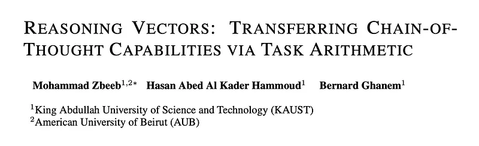
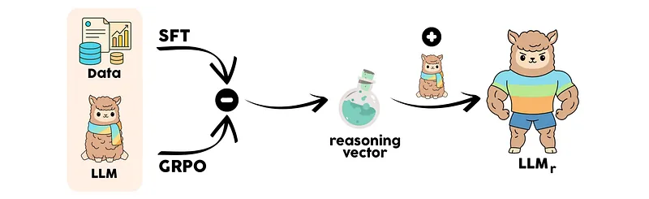
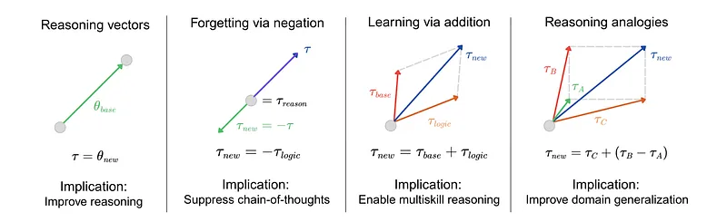
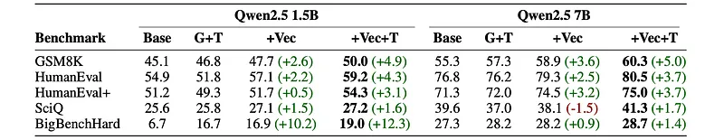
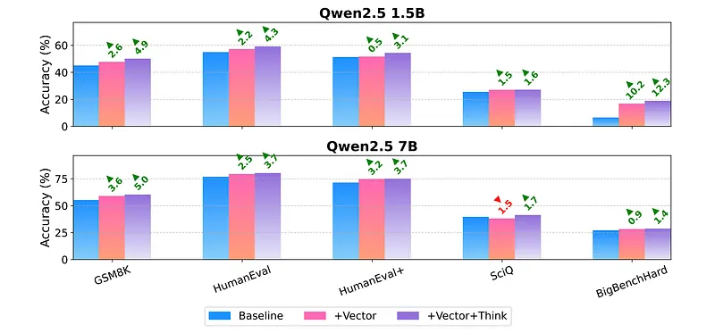

# Papers Explained 488 - Reasoning Vectors

The core idea involves comparing two models that share an identical architecture, initialization, and pre-training history, sourced from a public repository.

This page ingests the source article into the wiki and connects it to [[Papers Explained Corpus]], [[Reinforcement Learning Topic]], [[Reasoning Models]], [[Synthetic Data]], [[Embedding and Retrieval]], [[Safety and Alignment]], [[Reinforcement Learning]], [[Supervised Fine-Tuning]].

## Source Metadata

- Source file: `raw/2025-11-07_Papers-Explained-488--Reasoning-Vectors-94cfbe4387bb.md`
- Source title: Papers Explained 488: Reasoning Vectors
- Published: 2025-11-07
- Canonical: [https://medium.com/@ritvik19/papers-explained-488-reasoning-vectors-94cfbe4387bb](https://medium.com/@ritvik19/papers-explained-488-reasoning-vectors-94cfbe4387bb)

## Key Ideas

- θSFT: Represents a model that has undergone Supervised Fine-Tuning (SFT) on a specific dataset D (e.g., the GSM8K training set) using a standard cross-entropy loss.
- θGRPO: Represents a counterpart model optimized using Group Relative Policy Optimization (GRPO), a reinforcement learning (RL) algorithm, on the same dataset D with a reasoning-focused reward function.
- This controlled comparison is crucial because it allows to isolate the impact of the reasoning vector itself, independent of the pre-training dataset.
- The reasoning vector, vreason, is defined as the difference in parameters between these two models: vreason = θGRPO − θSFT
- The hypothesis is that vreason captures the essential parameter updates introduced by the reinforcement learning process that specifically enhance multi-step reasoning.

## Notes

## Papers Explained 487: Reasoning Vectors

This work demonstrates that reasoning ability, once learned, can be extracted and transferred between models as a compact task vector. Two publicly available, identically initialized QWEN2.5 models are sourced, one fine-tuned with supervised fine-tuning and the other with group relative policy optimization on the same dataset. From these, a reasoning vector is extracted: vreason = θGRPO−θSFT. This vector is hypothesized to capture the reasoning capability instilled by reinforcement learning while factoring out shared knowledge from the SFT process. When added to compatible instruction-tuned models through simple arithmetic, this vector consistently improves performance across diverse reasoning benchmarks.

*Figure: Merging the Fine-Tuning and Reasoning Vectors.*

## Method

*Figure: Reasoning vector operations in weight space.*

The core idea involves comparing two models that share an identical architecture, initialization, and pre-training history, sourced from a public repository.

- θSFT: Represents a model that has undergone Supervised Fine-Tuning (SFT) on a specific dataset D (e.g., the GSM8K training set) using a standard cross-entropy loss.

- θGRPO: Represents a counterpart model optimized using Group Relative Policy Optimization (GRPO), a reinforcement learning (RL) algorithm, on the same dataset D with a reasoning-focused reward function.

This controlled comparison is crucial because it allows to isolate the impact of the reasoning vector itself, independent of the pre-training dataset.

The reasoning vector, vreason, is defined as the difference in parameters between these two models: vreason = θGRPO − θSFT

The hypothesis is that vreason captures the essential parameter updates introduced by the reinforcement learning process that specifically enhance multi-step reasoning. Since both “donor” models (θGRPO and θSFT) share the same data and base knowledge, their subtraction is intended to factor out this shared, dataset-specific information, leaving behind a more general representation of the reasoning capability.

To enhance the reasoning ability of a target instruction-tuned model (θtarget) that is compatible with the donor models, a simple arithmetic operation is performed:

θenhanced = θtarget + α · vreason

α ∈ [0, 1] is a scalar coefficient that controls the magnitude of the transferred vector.

For more fine-grained control, this operation can be applied to specific layers or modules by introducing a binary mask m ∈ {0, 1}|θ|:

θenhanced = θtarget + α · (m ⊙ vreason)

⊙ denotes element-wise multiplication.

In experiments, applying the full vector (m = 1) with a scaling factor of α = 1 was consistently effective, suggesting the extracted vector is well-calibrated for direct transfer without further adjustment.

For a successful transfer, the target model must satisfy specific compatibility criteria:

- Architecture Match: Identical layer structures, hidden dimensions, and parameter tensor shapes.

- Tokenizer Compatibility: The same vocabulary and token-to-ID mapping to ensure semantic alignment, especially in the embedding layer.

- Initialization Similarity: Models should ideally originate from the same pre-trained checkpoint family to ensure their parameter spaces are sufficiently aligned.

### Theoretical Foundation

The safety and effectiveness of this transfer method rely on the principle of Linear Mode Connectivity (LMC).

LMC Principle: States that when two models are fine-tuned from the same initialization, they typically reside in the same connected low-loss basin of the optimization landscape.

Formal Definition: For parameters θA and θB obtained from the same starting point, their convex interpolation satisfies:

L(λθA + (1 − λ)θB) ≤ max (L(θA), L(θB)) + ϵ, λ ∈ [0, 1]

L is the loss function, and ϵ is a small value.

Intuition: This inequality guarantees that a straight line between θA and θB in weight space does not leave the low-loss region. Moving continuously from one model to the other does not increase the loss beyond that of the worse endpoint. Geometrically, both models occupy the same flat “valley” of the loss surface, and the connecting path avoids high-loss barriers.

Relevance to Reasoning Vector

Because θSFT and θGRPO share the same initialization and were trained on the same data, they are expected to satisfy the conditions for LMC. Therefore, their difference vector, vreason = θGRPO − θSFT, points in a direction within this shared low-loss basin. Adding this vector to another compatible model corresponds to moving it along a trajectory that has been implicitly validated to remain within a stable, low-loss region. This explains why the transfer is effective and can enhance reasoning ability without catastrophically destabilizing the base model’s existing capabilities.

### Experimental Setup

Publicly available Qwen2.5 models at 1.5B and 7B scales are used. For each size, donor models consist of a checkpoint fine-tuned on the GSM8K training split via SFT (θSFT) and a counterpart further trained on the same data with GRPO (θGRPO).

To isolate the effects of the vector and prompting, four models are compared.

- Baseline: the original instruction-tuned QWEN2.5-Instruct model without modification.

- G+T: the GRPO-tuned donor model prompted with “Think step by step.” This serves as a reference for the performance of the RL-tuned source model.

- +Vector: the baseline model enhanced with the reasoning vector via addition (α= 1).

- +Vector+Think: the vector-enhanced model evaluated with the prefix “Think step by step”.

## Evaluation

*Figure: Accuracy (%) of Qwen2.5 models on reasoning benchmarks.*

*Figure: Accuracy improvements from reasoning vector transfer.*

- For the 1.5B model, vector injection alone boosted GSM8K accuracy by +2.6%, reaching +4.9% with a reasoning prompt. Significant gains were also observed on HumanEval (+2.2% alone, +4.3% with prompt) and most strikingly on BigBenchHard (+12.3% alone, +12.3% with prompt).

- The 7B model exhibited similar improvements at a higher baseline, e.g., GSM8K accuracy increased by +5.0% with vector and prompt.

- The addition of the reasoning vector provides a consistent and positive impact, indicating the method is robust across different model scales.

## Paper

Reasoning Vectors: Transferring Chain-of-Thought Capabilities via Task Arithmetic [2509.01363](https://arxiv.org/abs/2509.01363)

## Figures

Figures from the Medium HTML export (`raw/2025-11-07_Papers-Explained-488--Reasoning-Vectors-94cfbe4387bb.md`); local copies under `wiki/assets/papers-explained-488-reasoning-vectors/` when download succeeded.

| Figure | Caption |
|--------|---------|
|  | Title card: Reasoning Vectors. |
|  | Merging the Fine-Tuning and Reasoning Vectors. |
|  | Reasoning vector operations in weight space. |
|  | Accuracy (%) of Qwen2.5 models on reasoning benchmarks. |
|  | Accuracy improvements from reasoning vector transfer. |
## Related

- [[Papers Explained Corpus]]
- [[Reinforcement Learning Topic]]
- [[Reasoning Models]]
- [[Synthetic Data]]
- [[Embedding and Retrieval]]
- [[Safety and Alignment]]
- [[Reinforcement Learning]]
- [[Supervised Fine-Tuning]]
- [[Papers Explained 487 - CLAP]]
- [[Papers Explained 489 - UserLM]]

#summary #topic
