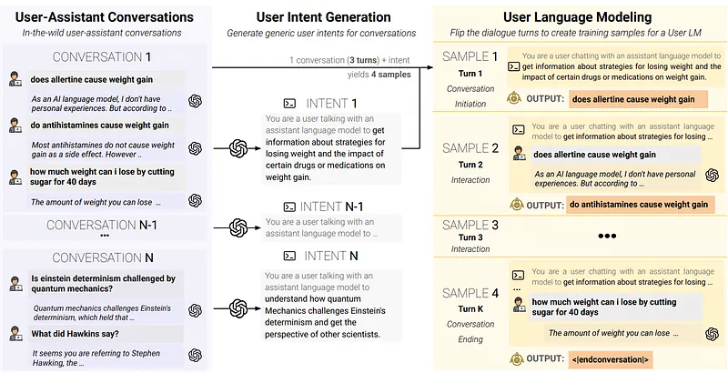
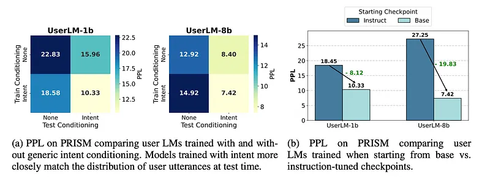
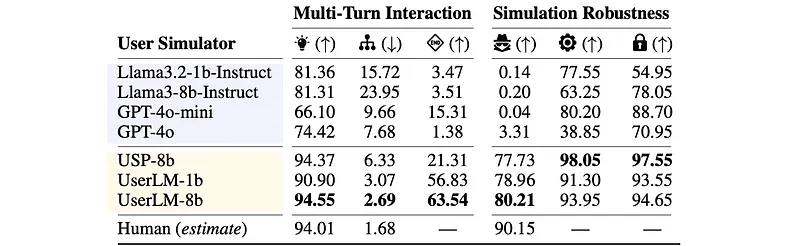
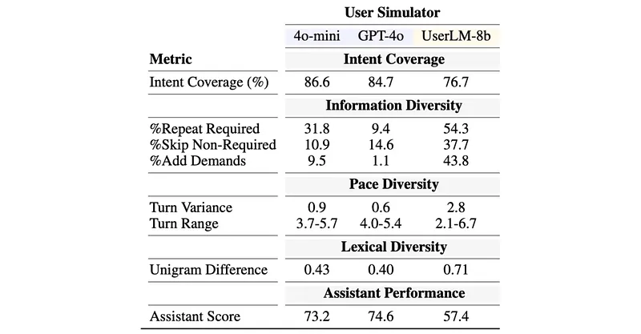

# Papers Explained 489 - UserLM

To evaluate LM performance in realistic settings, prior work simulated users in multi-turn conversations, often prompting an LLM originally trained to be a helpful assistant to act as a user.

This page ingests the source article into the wiki and connects it to [[Papers Explained Corpus]], [[Large Language Models]].

## Source Metadata

- Source file: `raw/2025-11-10_Papers-Explained-489--UserLM-33c5a51525bd.md`
- Source title: Papers Explained 489: UserLM
- Published: 2025-11-10
- Canonical: [https://medium.com/@ritvik19/papers-explained-489-userlm-33c5a51525bd](https://medium.com/@ritvik19/papers-explained-489-userlm-33c5a51525bd)

## Key Ideas

- The model is available on [HuggingFace](https://huggingface.co/microsoft/UserLM-8b).
- The objective is to train a user language model that mimics human behavior when interacting with assistant language models. This user LM will perform three key functions:
- initiate a conversation with the assistant given a defined user intent
- follow-up with the assistant based on its responses in subsequent turns
- end the conversation once it has run its course.

## Notes

## Papers Explained 488: UserLM

To evaluate LM performance in realistic settings, prior work simulated users in multi-turn conversations, often prompting an LLM originally trained to be a helpful assistant to act as a user. However, this work shows that assistant LMs make for poor user simulators, with the surprising finding that better assistants yield worse simulators. Instead, this work introduces purpose-built User Language Models (User LMs) — models post-trained to simulate human users in multi-turn conversations.

The model is available on [HuggingFace](https://huggingface.co/microsoft/UserLM-8b).

## Methodology

The objective is to train a user language model that mimics human behavior when interacting with assistant language models. This user LM will perform three key functions:

- initiate a conversation with the assistant given a defined user intent

- follow-up with the assistant based on its responses in subsequent turns

- end the conversation once it has run its course.

To achieve this, the approach leverages real human-assistant conversations as training data and “flips the dialogue” to train the UserLM to model the conditional distribution of user utterances.

*Figure: Diagram illustrating the approach to train a UserLM.*

Defining User Intents: Similar to how assistant LMs must follow instructions, user LMs must follow an intent that directs the conversation. User intents are defined as high-level conversation objectives: capturing the overall goal of the user without mentioning explicit details, achieving a balance between the two extremes. Preliminary analyses showed that user LMs trained on high-level intents were practically more useful than ones trained without intent or with fully-specified intents.

Ending the Conversation: Typically, users disengage without providing explicit feedback to the assistant. To replicate this behavior, it is essential that the user LM can effectively decide when to end the conversation. This is implemented by adding a special <|endconversation|> token to the tokenizer, which is then used as the output to generate after the last assistant turn in each conversation.

Training Data: WildChat contains 478,498 English conversations between ChatGPT and users from 192 countries. Many near-duplicate samples were noticed and de-duplication was performed, resulting in 384,336 conversations. For each country, users were randomly split into a 90/5/5 split for training, validation, and testing by identifying unique users based on their hashed IP addresses and countries. This resulted in 343,951 conversations for training, 22,442 for validation, and 17,943 for testing. After formatting conversations, 1,047,930 training samples, 118,291 validation samples, and 137,224 testing samples were obtained.

Intent Generation: For each of the 384,336 conversations in WildChat, a generic user intent was generated using few-shot prompting with GPT-4o. The model was given the entire conversation history between the user and the assistant and instructed to produce a high-level summary of the user’s intent, abstracting away specific details.

```text
You are given the conversation history between a user and assistant model and your task is to create a summary of the user's intent from the conversation.
Your summary should be structured to define what the high level intent of the user is, but should not go into specific details.
Format the summary to start with "You are a user chatting with an assistant language model to"
Example 1:
Conversation History:
<user>: List to me 5 beautiful sights in Algeria
<assistant>: Algeria is a country of striking natural beauty and rich cultural heritage.
Here are five breathtaking sights you should know about:
Tassili n'Ajjer National Park, Djemila, Timgad, Beni Hammad Fort, Basilique Notre Dame d'Afrique
Intent Summary:
You are a user chatting with an assistant language model to obtain some recommendations of places to see in Algeria.
Example 2:
Conversation History:
<user>: does allertine cause weight gain
<assistant>: As an AI language model, I don't have personal experiences.
But according to the available literature, Allertine is not known to cause weight gain. However, ...
<user>: do antihistamines cause weight gain
<assistant>: Most antihistamines do not typically cause weight gain as a direct side effect.
However, some people find that they experience increased appetite or cravings for sugary, high-calorie ...
<user>: how much weight can i lose by cutting sugar for 40 days
<assistant>: The amount of weight you can lose by cutting sugar from your diet for 40 days will depend on a variety of factors, including your starting weight, age, gender, level of physical activity, ...
Intent Summary:
You are a user chatting with an assistant language model to get information about strategies for losing weight and the impact of certain drugs or medications on weight gain.
Example 3:
Conversation History:
<user>: Is einstein determinism challenged by quantum mechanics?
<assistant>: Quantum mechanics challenges Einstein's determinism, which held that the universe is fully predictable given complete information. Key quantum principles like the Heisenberg uncertainty ...
<user>: What did hawkins say?
<assistant>: It seems you are referring to Stephen Hawking, the renowned physicist.
Stephen Hawking supported the principles of quantum mechanics, believing that the universe is fundamentally ...
<user>: So does it mean determinism is refuted?
<assistant>: Determinism is not entirely refuted but is significantly challenged at the quantum level, where subatomic behavior follows probabilistic principles rather than predictable, classical laws ...
<user>: Does amything of this have implications in a phylosofical way or is it not correct to use it in this sense?
<assistant>: Quantum mechanics challenges classical determinism and raises important philosophical questions in metaphysics, free will, and the nature of observation. Its probabilistic nature ...
Intent Summary:
You are a user chatting with an assistant language model to understand how quantum mechanics challenges Eistein's determinism and get the perspective of different scientists on this.
Now generate a summary of the user intent for the following conversation:
[CONVERSATION]
Reply with only the intent summary and nothing else.
```

Training Details: Full-parameter fine-tuning of Llama3–8b-Base and Llama3.2–1b-Base is performed for a maximum sequence length of 2048 tokens. Starting from a base model leads to better performance than an instruction-tuned model.

### Initial Analysis

To evaluate how well different language models (LMs) match the distribution of human language in conversations, focusing on “user language modeling,”

- Perplexity (PPL) was computed on held-out test samples from WildChat and the PRISM dataset (out-of-domain).

- Models were compared conditioned on generic intents versus not conditioned on intents at prediction time.

- Additionally, UserLMs trained from base checkpoints versus instruction-tuned checkpoints were compared.

*Figure: Perplexity (PPL) of prompted and trained models.*

- Intent conditioning consistently leads to gains in PPL for all models across both datasets, confirming its effectiveness in steering LMs.

- Models exhibit higher PPL on PRISM than WildChat, but performance trends are consistent, validating PRISM as a challenging, out-of-domain test set for measuring generalization.

- The UserLM-8b model achieves the lowest PPL by a significant margin (often 60–70% lower than all baselines).

- Improvements from scaling UserLM from 1b to 8b are encouraging, suggesting further scaling could yield even lower PPL and better distributional alignment.

- Overall, UserLM-8b is more effective than baselines at modeling out-of-domain user populations and effectively leveraging generic user intents.

*Figure: Comparison of different training setups for the user LMs.*

- Even models not trained with intents can effectively leverage them at test time (showing lower PPL).

- However, the most significant drops in PPL are observed with models that were explicitly trained with intent.

- Training with intent-conditioning leads to improved sensitivity to intent in user LMs, resulting in a more steerable and usable model.

- User models trained from the base checkpoint achieve better results with lower PPL.

- This is hypothesized to be because instruction-tuned models are typically trained for helpful assistants using synthetic data, which is semantically distant from user behavior, whereas base models are trained on natural text closer to real user distribution.

- A high-level observation is that base pre-trained LMs are neutral, general-purpose models that can be effectively post-trained towards distinct and opposing roles like user and assistant LMs.

## Evaluation

Beyond distributional measures such as perplexity, more fine-grained evaluations are introduced that capture key properties user simulators should reflect if they align with human behavior.

Multi-Turn Interaction Evaluations:

- First Turn Diversity: Measured by computing the pairwise 1-gram Jaccard index on 2,000 randomly sampled first-turn utterances. A higher value indicates better lexical diversity.

- Intent Decomposition: Measured by computing the average overlap of 1-grams (after removing stopwords) between generated user turns and the generic intent. A lower overlap indicates progressive intent revelation across turns.

- Dialogue Termination: Assessed by comparing the model’s generation of the <|endconversation|> token with actual conversation endings in PRISM conversations, treated as a binary classification task, and quantified using the F1 score.

Simulation Robustness Evaluations:

- Naturalness: Measured using the state-of-the-art AI-detector Pangram on 2,000 first-turn generations (50–200 tokens). Pangram returns a likelihood of the text being human-written.

- User Role Adherence: Tested by initiating conversations with MCQ questions, prompting GPT-4o to express uncertainty, and measuring the rate at which models avoid revealing the answer in the subsequent user turn. This used 2,000 random samples from the CommonsenseQA dataset.

- Intent Adherence: Tested by initiating conversations with open-ended questions, prompting GPT-4o to suggest a diversion, and measuring the rate at which models refuse the suggestion and adhere to their original intent. This used 2,000 random samples from the NaturalQuestions dataset, with GPT-4o acting as a judge.

*Figure: Results of user simulators based on prompted assistant LMs and trained user LMs.*

- Overall Performance: User LMs demonstrate better alignment with human behavior across all multi-turn interaction metrics compared to prompted assistant LMs.

- First Turn Diversity: UserLM-8B achieves 94.55% unique 1-grams, performing on-par with real users (94.01%) and significantly outperforming GPT-4o (74.42%).

- Intent Decomposition: User LMs are better at decomposing intent across turns, producing more abstractive utterances with an average overlap of 2.69% with the conditioned intent, close to the 1.68% observed in human utterances. This indicates they spread information and phrase requests in varied ways, reflecting real human interaction dynamics.

- Dialogue Termination: User LMs are better at recognizing when to terminate a conversation, achieving an F1 score of 63.54. In contrast, prompted assistants rarely end conversations, with F1 scores ranging from 3–15, indicating their ingrained assistant nature hinders their ability to simulate user-like conversation endings.

- Naturalness: User LMs produce more natural-looking utterances (77–81% human-written confidence by Pangram), significantly outperforming prompted assistant models (0–3% confidence) and being only slightly lower than real user utterances (90.2%). This suggests user and assistant utterances are distinct text distributions, and User LMs effectively learn to generate user-like text.

- User Role Adherence: Trained User LMs exhibit stellar robustness (91–98%), consistently maintaining the user role even when ambiguity is introduced. Prompted assistant simulators show shallow instruction following, reverting to their assistant role in 20–60% of conversations.

- Intent Adherence: User LMs achieve high robustness scores (93–97%), predominantly sticking to their original intent and avoiding distraction. Prompted assistant LMs are more accepting of diversions, hypothesized to be related to their “sycophantic nature” that prioritizes pleasing the conversational partner over following original instructions. This highlights a key difference: users are conversation pilots (stubborn intent), while assistants are supportive (flexible), making assistant-trained models limited for user simulation.

- Scaling Effect: For prompted assistant models, increased model size does not consistently lead to improvements in user simulation quality. However, for User LMs, UserLM-8b outperforms UserLM-1b on all metrics, demonstrating that scaling the training of User LMs effectively leads to better user simulators.

## Simulating Conversations

To gain a practical understanding of the value of User LMs by deploying them in an extrinsic evaluation using a simulator to interact with an assistant for solving tasks.

The study adopted a multi-turn conversation simulation setting based on “LLMs get lost in multi-turn conversation”. 65 task intents were used, involving math word problems (based on GSM8k) and Python programming (based on HumanEval).

UserLM-8b was used to simulate 10 conversations for each task intent (totaling 650 simulations). GPT-4o-mini and GPT-4o were also used as user simulators for comparison. GPT-4o was used as the assistant LM across all conversations.

A quantitative analysis was performed using eight metrics focused on five aspects of the simulator: Intent Coverage, Information Diversity, Pace Diversity, Lexical Diversity, and Assistant Performance.

*Figure: Summary of results from simulated conversations.*

- Intent Coverage: All three simulators successfully stayed on topic, covering 76–86% of the original intent’s information units. UserLM-8b was more likely to repeat required information and less likely to reveal non-required information, while GPT-based simulators were more monotonic, revealing information once.

- Information Diversity: UserLM-8b uniquely introduced additional demands not specified in the original intent, such as providing example test cases (34%), defining naming conventions (21%), and implementation constraints (20%). GPT-based simulators rarely injected such demands, leading to more homogeneous simulations.

- Pace Diversity: UserLM-8b exhibited more turn variance (conversations ranging from 2.1 to 6.7 turns), dynamically deciding information granularity. This allows it to simulate users with varied interaction paces, capturing a broader spectrum of dialogue behaviors, unlike the more consistent GPT-based simulators (3.7 to 5.7 turns).

- Lexical Diversity: UserLM-8b generated more lexically diverse conversations, meaning less lexical overlap between simulations for the same intent due to its varied language and style. GPT-based simulators maintained high similarity with the intent and avoided language variation.

- Assistant Performance: Assistant task performance was approximately 17% lower when conversing with UserLM-8b compared to GPT-based simulators. This indicates that UserLM-8b’s more diverse and realistic behaviors (in information presentation, conversational pace, and lexical choices) create more challenging simulation conditions, offering a more comprehensive and realistic estimation of assistant performance in multi-turn interactions with diverse users.

## Paper

Flipping the Dialogue: Training and Evaluating User Language Models [2510.06552](https://arxiv.org/abs/2510.06552)

## Figures

Figures from the Medium HTML export (`raw/2025-11-10_Papers-Explained-489--UserLM-33c5a51525bd.md`); local copies under `wiki/assets/papers-explained-489-userlm/` when download succeeded.

| Figure | Caption |
|--------|---------|
|  | Title card: UserLM. |
|  | Diagram illustrating the approach to train a UserLM. |
|  | Perplexity (PPL) of prompted and trained models. |
|  | Comparison of different training setups for the user LMs. |
|  | Results of user simulators based on prompted assistant LMs and trained user LMs. |
|  | Summary of results from simulated conversations. |
## Related

- [[Papers Explained Corpus]]
- [[Large Language Models]]
- [[Papers Explained 488 - Reasoning Vectors]]
- [[Papers Explained 489 - LIMI]]

#summary #topic
