# Papers Explained 49 - Chinchilla

This paper investigated the optimal model size and number of tokens for training a transformer LLM within a given compute budget and discovered that current LLMs are not sufficiently trained due to the emphasis on scaling models while keeping the amount of training data constant.

This page ingests the source article into the wiki and connects it to [[Papers Explained Corpus]], [[Large Language Models]], [[Evaluation and Benchmarks]], [[Supervised Fine-Tuning]].

## Source Metadata

- Source file: `raw/2023-07-31_Papers-Explained-49--Chinchilla-a7ad826d945e.md`
- Source title: Papers Explained 49: Chinchilla
- Published: 2023-07-31
- Canonical: [https://medium.com/@ritvik19/papers-explained-49-chinchilla-a7ad826d945e](https://medium.com/@ritvik19/papers-explained-49-chinchilla-a7ad826d945e)

## Key Ideas

- This paper investigated the optimal model size and number of tokens for training a transformer LLM within a given compute budget and discovered that current LLMs are not sufficiently trained due to the emphasis on scaling models while keeping the amount of...
- By training over 400 language models ranging from 70 million to over 16 billion parameters on 5 to 500 billion tokens, we find that for compute-optimal training, the model size and the number of training tokens should be scaled equally: for every doubling of...
- The authors test this hypothesis by training a predicted compute optimal model, Chinchilla, that uses the same compute budget as Gopher but with 70B parameters and 4× more data.
- This also means that Chinchilla uses substantially less computing for fine-tuning and inference, greatly facilitating downstream usage.
- The paper presents three different approaches to answer the question driving the research: Given a fixed FLOPs budget, how should one trade-off model size and the number of training tokens?

## Notes

This paper investigated the optimal model size and number of tokens for training a transformer LLM within a given compute budget and discovered that current LLMs are not sufficiently trained due to the emphasis on scaling models while keeping the amount of training data constant.

By training over 400 language models ranging from 70 million to over 16 billion parameters on 5 to 500 billion tokens, we find that for compute-optimal training, the model size and the number of training tokens should be scaled equally: for every doubling of model size, the number of training tokens should also be doubled.

The authors test this hypothesis by training a predicted compute optimal model, Chinchilla, that uses the same compute budget as Gopher but with 70B parameters and 4× more data. Chinchilla uniformly and significantly outperforms Gopher (280B), GPT-3 (175B), Jurassic-1 (178B), and Megatron-Turing NLG (530B) on a large range of downstream evaluation tasks.

This also means that Chinchilla uses substantially less computing for fine-tuning and inference, greatly facilitating downstream usage. As a highlight, Chinchilla reaches a state-of-the-art average accuracy of 67.5% on the MMLU benchmark, greater than a 7% improvement over Gopher.

*Figure: Shows that current large models should be substantially smaller and therefore trained much longer than is currently done.*

## Estimating the optimal parameter/training tokens

The paper presents three different approaches to answer the question driving the research: Given a fixed FLOPs budget, how should one trade-off model size and the number of training tokens?

In all three cases, they start by training a range of models varying both model size and the number of training tokens and use the resulting training curves to fit an empirical estimator of how they should scale. It assumes a power-law relationship between compute and model size, though future work may want to include potential curvature in this relationship for large model sizes.

In the first approach, they vary the number of training steps for a fixed family of models (ranging from 70M to over 10B parameters), training each model for 4 different numbers of training sequences. From these runs, they are able to directly extract an estimate of the minimum loss achieved for a given number of training FLOPs.

In the second approach, they vary the model size for a fixed set of 9 different training FLOP counts (ranging from 6 × 10¹⁸ to 3 × 10²¹ FLOPs), and consider the final training loss for each point. This allows them to directly answer the question: For a given FLOP budget, what is the optimal parameter count?

Lastly, they model all final losses from experiments in Approaches 1 & 2 as a parametric function of model parameter count and the number of seen tokens.

The authors find that the three approaches, despite using different fitting methodologies and different trained models, yield comparable predictions for the optimal scaling in parameters and tokens with FLOPs.

*Figure: Estimated optimal training FLOPs and training tokens for various model sizes*

## Model

The authors train Chinchilla on MassiveText (the same dataset as Gopher) but use a slightly different subset distribution to account for the increased number of training tokens.

They use AdamW for Chinchilla rather than Adam as this improves the language modeling loss and the downstream task performance after finetuning.

Chinchilla is trained with a slightly modified SentencePiece tokenizer that does not apply NFKC normalization. The vocabulary is very similar– 94.15% of tokens are the same as those used for training Gopher. Findings suggest that this particularly helps with the representation of mathematics and chemistry, for example.

Whilst the forward and backward pass are computed in bfloat16, we store a float32 copy of the weights in the distributed optimizer state.

*Figure: Chinchilla architecture details*

## Results

*Figure: All evaluation tasks. We evaluate Chinchilla on a collection of language modeling along with downstream tasks.*

Language Modelling

*Figure: Pile Evaluation. For the different evaluation sets in The Pile, we show the bits-per-byte (bpb) improvement (decrease) of Chinchilla compared to Gopher. On all subsets, Chinchilla outperforms Gopher*

MMLU

*Figure: Massive Multitask Language Understanding (MMLU). We report the average 5-shot accuracy over 57 tasks with model and human accuracy comparisons. We also include the average prediction for state-of-the-art accuracy in June 2022/2023 made by 73 competitive human forecasters.*

*Figure: MMLU results compared to Gopher We find that Chinchilla outperforms Gopher by 7.6% on average in addition to performing better on 51/57 individual tasks, the same on 2/57, and worse on only 4/57 tasks.*

Reading Comprehension

*Figure: Reading comprehension. On RACE-h and RACE-m, Chinchilla considerably improves performance over Gopher. Note that GPT-3 and MT-NLG 530B use a different prompt format than we do on RACE-h/m, so the results are not comparable to Gopher and Chinchilla. On LAMBADA, Chinchilla outperforms both Gopher and MT-NLG 530B.*

Big Bench

*Figure: BIG-bench results compared to Gopher Chinchilla outperforms Gopher on all but four BIG-bench tasks considered.*

Common sense

*Figure: Zero-shot comparison on Common Sense benchmarks. We show a comparison between Chinchilla, Gopher, and MT-NLG 530B on various Common Sense benchmarks. We see that Chinchilla matches or outperforms Gopher and GPT-3 on all tasks. On all but one Chinchilla outperforms the much larger MT-NLG 530B model.*

Closed-book question answering

*Figure: Closed-book question answering. For Natural Questions and TriviaQA, Chinchilla outperforms Gopher in all cases. On Natural Questions, Chinchilla outperforms GPT-3. On TriviaQA we show results on two different evaluation sets to allow for comparison to GPT-3 and to open book SOTA*

## Paper

Training Compute-Optimal Large Language Models [2203.15556](https://arxiv.org/abs/2203.15556)

## Figures

Figures from the Medium HTML export (`raw/2023-07-31_Papers-Explained-49--Chinchilla-a7ad826d945e.md`); local copies under `wiki/assets/papers-explained-49-chinchilla/` when download succeeded.

| Figure | Caption |
|--------|---------|
| 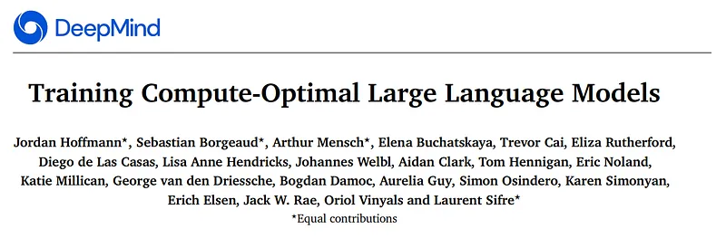 | Title card: Chinchilla. |
| 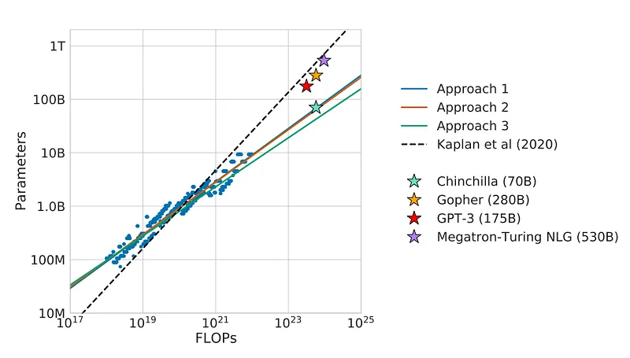 | Shows that current large models should be substantially smaller and therefore trained much longer than is currently done. |
| 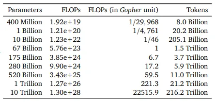 | Estimated optimal training FLOPs and training tokens for various model sizes. |
| 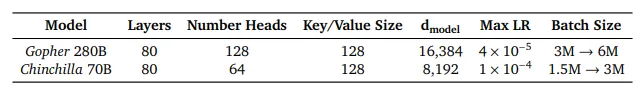 | Chinchilla architecture details. |
| 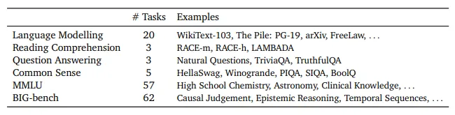 | All evaluation tasks. We evaluate Chinchilla on a collection of language modeling along with downstream tasks. |
| 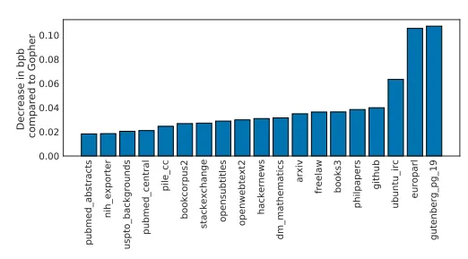 | Pile Evaluation. For the different evaluation sets in The Pile, we show the bits-per-byte (bpb) improvement (decrease) of Chinchilla compared to Gopher. On all subsets, Chinchilla outperforms Gopher. |
| 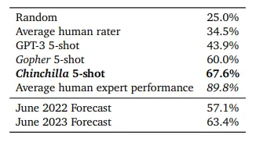 | Massive Multitask Language Understanding (MMLU). We report the average 5-shot accuracy over 57 tasks with model and human accuracy comparisons. We also include the average prediction for state-of-the-art accuracy in June 2022/2023 made by 73 competitive human forecasters. |
| 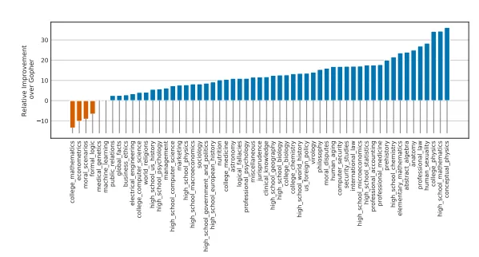 | MMLU results compared to Gopher We find that Chinchilla outperforms Gopher by 7.6% on average in addition to performing better on 51/57 individual tasks, the same on 2/57, and worse on only 4/57 tasks. |
| 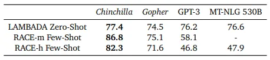 | Reading comprehension. On RACE-h and RACE-m, Chinchilla considerably improves performance over Gopher. Note that GPT-3 and MT-NLG 530B use a different prompt format than we do on RACE-h/m, so the results are not comparable to Gopher and Chinchilla. On LAMBADA, Chinchilla outperforms both Gopher and MT-NLG 530B. |
| 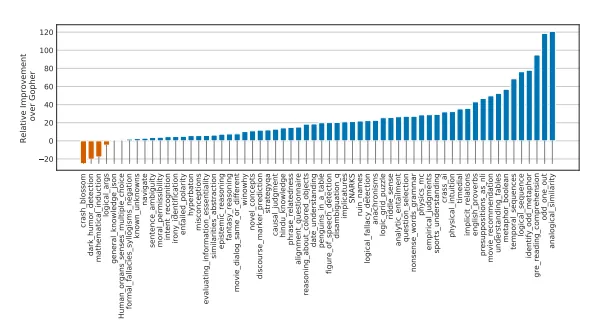 | BIG-bench results compared to Gopher Chinchilla outperforms Gopher on all but four BIG-bench tasks considered. |
| 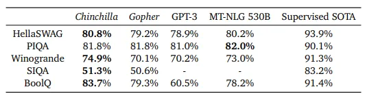 | Zero-shot comparison on Common Sense benchmarks. We show a comparison between Chinchilla, Gopher, and MT-NLG 530B on various Common Sense benchmarks. We see that Chinchilla matches or outperforms Gopher and GPT-3 on all tasks. On all but one Chinchilla outperforms the much larger MT-NLG 530B model. |
| 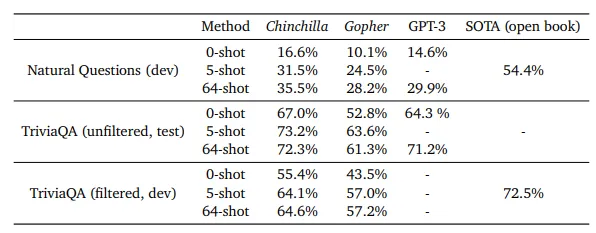 | Closed-book question answering. For Natural Questions and TriviaQA, Chinchilla outperforms Gopher in all cases. On Natural Questions, Chinchilla outperforms GPT-3. On TriviaQA we show results on two different evaluation sets to allow for comparison to GPT-3 and to open book SOTA. |
## Related

- [[Papers Explained Corpus]]
- [[Large Language Models]]
- [[Evaluation and Benchmarks]]
- [[Supervised Fine-Tuning]]
- [[Papers Explained 48 - InstructGPT]]
- [[Papers Explained 50 - PaLM]]
- [[gzip Predicts Data-dependent Scaling Laws]] — challenges the data-agnostic assumption of Chinchilla's scaling law; shows all five parameters shift with gzip compressibility of the training data.
- [[Scaling Laws, Carefully]] — Weng survey of Kaplan/Chinchilla reconciliation, data-limited extensions, and fitting pitfalls.
- [[IsoFLOP Profiles]] — Chinchilla Method 2 concept page.
- [[Data-Constrained Scaling Laws]] — repetition-aware scaling extensions.

#summary #topic
