# Papers Explained 490 - A single character can make or break your LLM evals

A diverse set of instruction-tuned open-source language models from the Llama, Gemma, and Qwen families is chosen. Specifically, two model sizes are considered, approximately 8B and 70B. The smaller size includes Llama-3.1–8B, Gemma-2–9B, and Qwen2.5–7B, while the larger size includes Llama-3.1–70B.

This page ingests the source article into the wiki and connects it to [[Papers Explained Corpus]], [[Large Language Models]], [[Evaluation and Benchmarks]], [[Reasoning Models]].

## Source Metadata

- Source file: `raw/2025-11-12_Papers-Explained-490--A-single-character-can-make-or-break-your-LLM-evals-8741757cd6c3.html`
- Source title: Papers Explained 490: A single character can make or break your LLM evals
- Published: 2025-11-12
- Canonical: [https://medium.com/@ritvik19/papers-explained-490-a-single-character-can-make-or-break-your-llm-evals-8741757cd6c3](https://medium.com/@ritvik19/papers-explained-490-a-single-character-can-make-or-break-your-llm-evals-8741757cd6c3)

## Key Ideas

- A diverse set of instruction-tuned open-source language models from the Llama, Gemma, and Qwen families is chosen. Specifically, two model sizes are considered, approximately 8B and 70B.
- Widely used benchmarks, including mmlu, arc-challenge, and commonsense-qa, are selected to assess language model performance under different demonstration separators. A standardized evaluation pipeline is incorporated.
- For all instruction-tuned models used, the chat template is used by directly appending task-specific demonstration examples (e.g., “1+1=? A: 1, B: 2, …”) together with the question as the user-role message, mirroring how real-world users provide examples...
- To assess the effect of different example delimiters, 30 non-alphanumeric characters are evaluated and the performance spread (max — min) across all these choices is reported.
- Delimiters significantly affect model outputs across different model families (Llama, Qwen, Gemma) and benchmarks (mmlu, arc-challenge, commonsense-qa).

## Notes

The evaluation of LLMs often relies on demonstration examples to guide their responses. However, the choice of formatting these examples has not been thoroughly investigated. The study found that the seemingly minor decision of how to separate in-context examples can significantly impact model response quality. In fact, the performance of leading LLM families (Llama, Qwen, Gemma) can vary by up to 23% depending on the delimiter used. This brittleness is not limited to a specific topic or model family and does not improve with scale.

## Method

A diverse set of instruction-tuned open-source language models from the Llama, Gemma, and Qwen families is chosen. Specifically, two model sizes are considered, approximately 8B and 70B. The smaller size includes Llama-3.1–8B, Gemma-2–9B, and Qwen2.5–7B, while the larger size includes Llama-3.1–70B.

Widely used benchmarks, including mmlu, arc-challenge, and commonsense-qa, are selected to assess language model performance under different demonstration separators. A standardized evaluation pipeline is incorporated.

For all instruction-tuned models used, the chat template is used by directly appending task-specific demonstration examples (e.g., “1+1=? A: 1, B: 2, …”) together with the question as the user-role message, mirroring how real-world users provide examples before asking a question. Then, this prompt is fed to the model and the corresponding outputs are evaluated.

## Experiments

To assess the effect of different example delimiters, 30 non-alphanumeric characters are evaluated and the performance spread (max — min) across all these choices is reported.

- Delimiters significantly affect model outputs across different model families (Llama, Qwen, Gemma) and benchmarks (mmlu, arc-challenge, commonsense-qa).

- For instance, mmlu performance drops ranged from 18.3% to 29.4% for the tested models, and this sensitivity extends to commonly used semantically meaningful delimiters like “&” and “#”.

- The fluctuations in performance due to delimiter choice are widespread across a range of topic domains within mmlu (e.g., history, philosophy, science, math), suggesting a pervasive sensitivity across topics.

- The choice of delimiter can be manipulated to place any model in the lead, highlighting its critical impact on comparative model rankings.

- Scaling LLMs (e.g., Llama from 8B to 70B) does not improve robustness to delimiter choice; larger models can even exhibit more serious brittleness (e.g., Llama-3.1–70B-instruct showed a ±40% fluctuation on commonsense-qa compared to ±29.1% for the 8B model).

- This suggests that model scale alone does not address this brittleness.

- Models remain highly sensitive to the choice of delimiter even as the number of demonstration examples increases for in-context learning tasks.

- Performance can vary dramatically (e.g., Llama-3.1–8B-instruct on Banking77 varied between 20% and 80% depending on “[space]” or “\n” delimiter), regardless of the model or the number of demonstrations.

*Figure: mmlu summary statistics under different delimiters of GPT-4o.*

- Closed-source models like GPT-4o also exhibit significant brittleness to delimiter choice, demonstrating a spread of 45.63% on mmlu, which is nearly 3 times higher than the open-source models studied.

- This indicates that delimiter brittleness is a pervasive issue across both open- and closed-source models.

## Improving LLMs’ robustness to the choice of delimiter

Supervised finetuning with randomly varying delimiters

Llama-3.2–3B-instruct is finetuned with the public Tulu SFT dataset using LoRA r of 16 and Lora alpha of 32.

*Figure: mmlu, normal SFT.*

*Figure: mmlu, SFT with random delimiter choices.*

*Figure: arc-challenge, normal SFT.*

*Figure: arc-challenge, SFT with random delimiter choices.*

*Figure: commonsense-qa, normal SFT.*

*Figure: commonsense-qa, SFT with random delimiter choices.*

- Naive supervised finetuning with randomly varying delimiters does not improve LLMs’ sensitivity to the delimiter choice.

- This stems from the distributional mismatch in SFT training data, which does not contain in-context examples.

Specifying the choice of delimiter

A single line is explicitly added that reads: “The following are multiple choice questions (with answers), separated by X” where X indicates the selected delimiter character.

- Specifying the delimiter choice improves model performance across choices of delimiters on all three benchmarks, ranging from 1.5% to 27.9%.

Practical delimiter recommendations

- The “\n”and “!” delimiters provide an average performance boost of 5.3% and 12.2% respectively, compared to the average performance across delimiters.

## Paper

A Single Character can Make or Break Your LLM Evals [2510.05152](https://arxiv.org/abs/2510.05152)

## Figures

Figures from the Medium HTML export (`raw/2025-11-12_Papers-Explained-490--A-single-character-can-make-or-break-your-LLM-evals-8741757cd6c3.html`); local copies under `wiki/assets/papers-explained-490-a-single-character-can-make-or-break-your-llm-evals/` when download succeeded.

| Figure | Caption |
|--------|---------|
|  | Title card: A single character can make or break your LLM evals. |
|  | Experiments. |
| 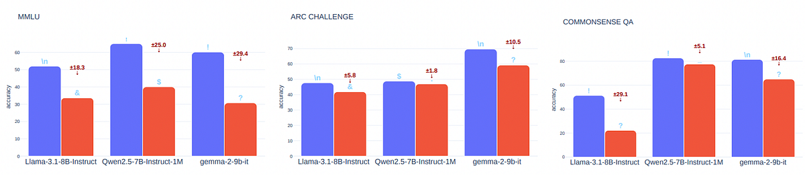 | Experiments. |
| 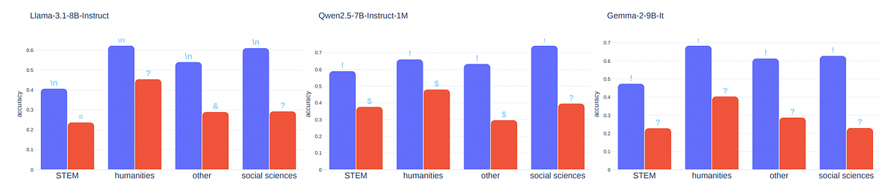 | Experiments. |
| 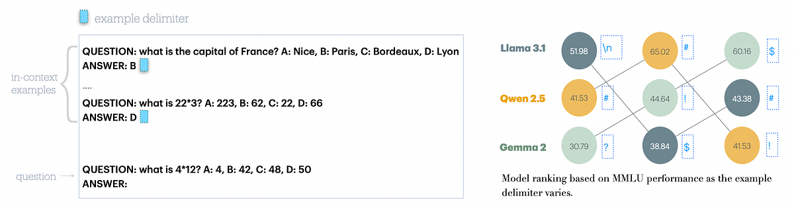 | Experiments. |
| 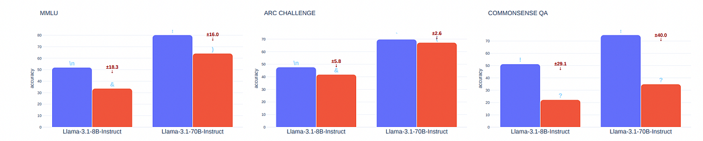 | Experiments. |
| 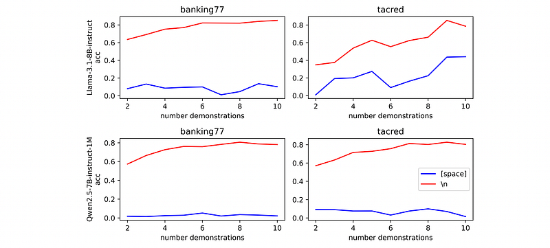 | Experiments. |
|  | mmlu summary statistics under different delimiters of GPT-4o. |
| 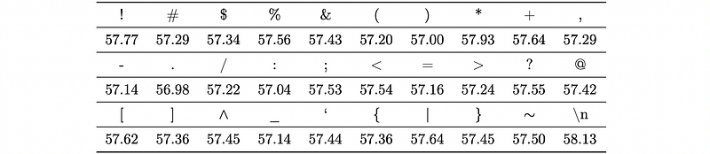 | mmlu, normal SFT. |
| 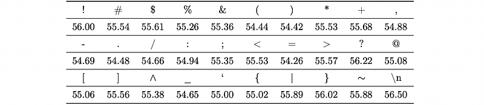 | mmlu, SFT with random delimiter choices. |
| 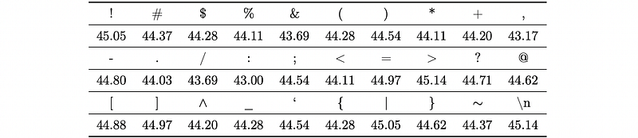 | arc-challenge, normal SFT. |
| 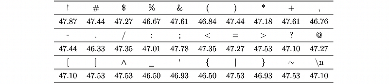 | arc-challenge, SFT with random delimiter choices. |
| 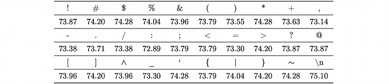 | commonsense-qa, normal SFT. |
| 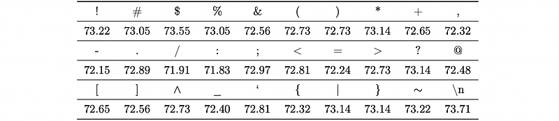 | commonsense-qa, SFT with random delimiter choices. |
| 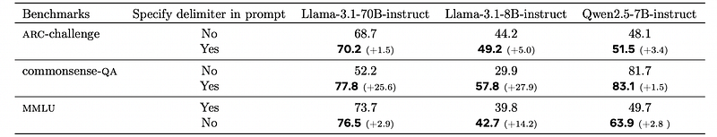 | Specifying the choice of delimiter: Practical delimiter recommendations. |
|  | Practical delimiter recommendations. |
## Related

- [[Papers Explained Corpus]]
- [[Large Language Models]]
- [[Evaluation and Benchmarks]]
- [[Reasoning Models]]
- [[Papers Explained 489 - LIMI]]
- [[Papers Explained - Extracting alignment data in open models]]

#summary #topic
