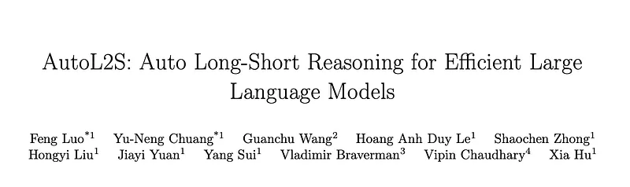
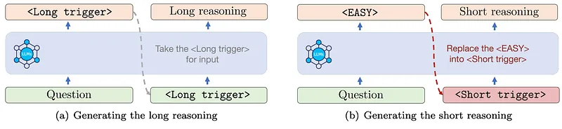
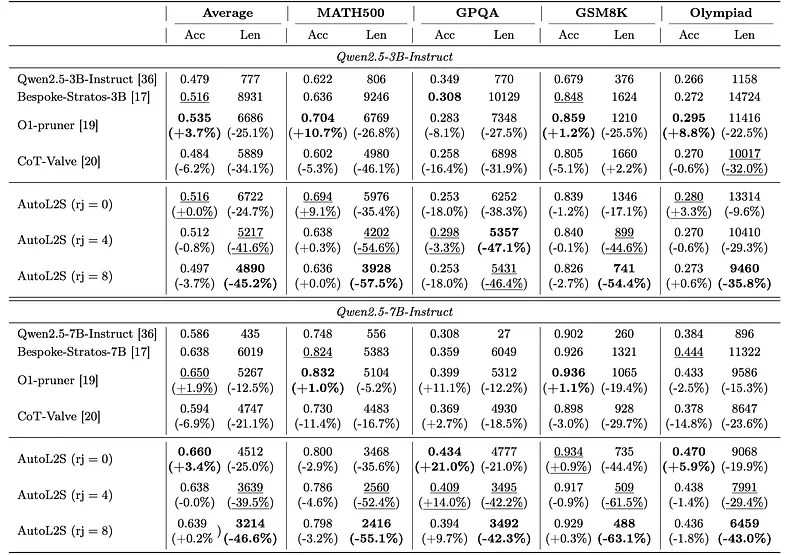
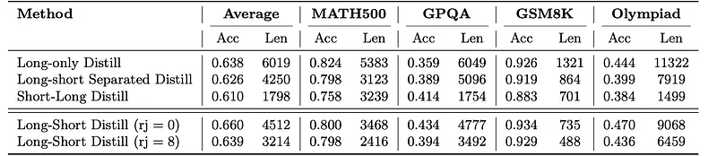
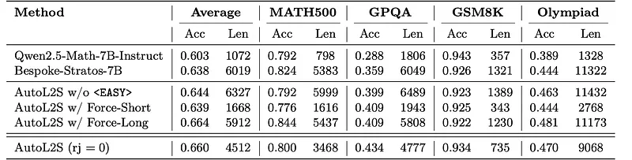
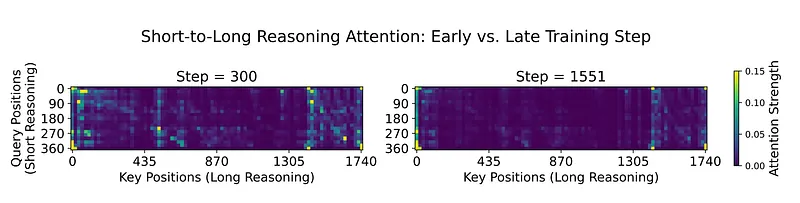

# Papers Explained 492 - AutoL2S

AutoL2S aims to distill reasoning capabilities from reasoning-capable LLMs, enabling the model to learn effective reasoning patterns while reducing the length of reasoning paths required to arrive at correct reasoning answers.

This page ingests the source article into the wiki and connects it to [[Papers Explained Corpus]], [[Reasoning Models]], [[Synthetic Data]], [[Model Compression and Efficiency]].

## Source Metadata

- Source file: `raw/2025-11-14_Papers-Explained-492--AutoL2S-9ab82981a24c.md`
- Source title: Papers Explained 492: AutoL2S
- Published: 2025-11-14
- Canonical: [https://medium.com/@ritvik19/papers-explained-492-autol2s-9ab82981a24c](https://medium.com/@ritvik19/papers-explained-492-autol2s-9ab82981a24c)

## Key Ideas

- Questions that are solvable through a short reasoning path are defined as EASY questions. AutoL2S aims to train LLMs to learn both long and short reasoning patterns, and to identify EASY questions, enabling LLMs to perform efficient reasoning when appropriate.
- Constructing Long CoT Reasoning Paths: Bespoke-Stratos-17k is used as the source of questions. DeepSeek-R1 is employed to generate CoT traces along with final answers as the basic long CoT reasoning dataset.
- Each question has a <Long Trigger> and <Answer Trigger> to mark the beginning of a long reasoning path and answer, respectively.
- An EASY question has a <Long Trigger>, <Short Trigger>, and <Answer trigger> to mark the beginning of long reasoning, short reasoning, and answer, respectively. The <EASY> token indicates that this question is solvable through a short reasoning path.
- AutoL2S follows the regular perplexity loss function to distill the target model based on the constructed reasoning dataset D with long and short CoT reasoning paths.

## Notes

AutoL2S aims to distill reasoning capabilities from reasoning-capable LLMs, enabling the model to learn effective reasoning patterns while reducing the length of reasoning paths required to arrive at correct reasoning answers. In particular, AutoL2S effectively identifies easy questions and applies short reasoning for efficiency, while preserving long-form reasoning only for more complex cases, ultimately resulting in a reduced average number of generated reasoning tokens.

## Training Stage of Auto Long-Short Reasoning

Questions that are solvable through a short reasoning path are defined as EASY questions. AutoL2S aims to train LLMs to learn both long and short reasoning patterns, and to identify EASY questions, enabling LLMs to perform efficient reasoning when appropriate.

Constructing Long CoT Reasoning Paths: Bespoke-Stratos-17k is used as the source of questions. DeepSeek-R1 is employed to generate CoT traces along with final answers as the basic long CoT reasoning dataset.

Each question has a <Long Trigger> and <Answer Trigger> to mark the beginning of a long reasoning path and answer, respectively.

Constructing Short CoT Reasoning Paths for EASY Questions: To curate concise Chain-of-Thought (CoT) for easier questions, Qwen2.5-Math-7B is applied to the same Bespoke-Stratos-17k dataset, generating reasoning traces with shorter CoT trajectories. Rejection sampling is employed to filter and retain only those traces that produce correct answers, replacing the corresponding long CoT responses with these shorter alternatives. Long reasoning path significantly helps LLMs better understand and learn short reasoning path. This motivates annotating both the long and short CoT reasoning paths for the EASY question.

An EASY question has a <Long Trigger>, <Short Trigger>, and <Answer trigger> to mark the beginning of long reasoning, short reasoning, and answer, respectively. The <EASY> token indicates that this question is solvable through a short reasoning path.

AutoL2S follows the regular perplexity loss function to distill the target model based on the constructed reasoning dataset D with long and short CoT reasoning paths. The framework is trained using two non-reasoning base LLMs: Qwen2.5–3B-Instruct and Qwen2.5–7B-Instruct.

## Inference Stage of Auto Long-Short Reasoning

During the inference stage, AutoL2S automatically determines whether to reason with long or short CoT reasoning paths. The model begins generation by producing either a <Long Trigger> or an <EASY> token, corresponding to a regular or EASY question, respectively.

- After receiving the user prompt, if the model first generates a <Long Trigger>, it indicates that the question requires a long reasoning path for resolution. AutoL2S proceeds with the standard auto-regressive generation to produce the long reasoning, followed by the final answer.

- After receiving the user prompt, if the model first generates an <EASY> token, it implies that the question can be solved through a short reasoning path. To activate this behavior, AutoL2S replaces the <EASY> token into a <Short Trigger> to explicitly guide the model to generate a short reasoning path and answer.

## Results

### RQ1: Reasoning Efficiency of AutoL2S

*Figure: Accuracy and Token Length across four reasoning benchmarks for 3B and 7B models.*

- AutoL2S outperforms CoT-Valve in terms of accuracy preservation and reasoning path length.

- AutoL2S achieves shorter reasoning paths than O1-pruner while maintaining competitive accuracy. AutoL2S achieves approximately 4X shorter reasoning paths compared to O1-pruner.

- AutoL2S achieves nearly identical average reasoning accuracy compared to the oracle SFT R1-Distilled reasoning LLMs (i.e., Bespoke-Stratos-3B/7B), while producing significantly shorter reasoning paths.

- Increasing the number of rejection samples leads to a slight decline in reasoning accuracy but significantly reduces reasoning length.

### RQ2: Impact on Long-short Reasoning Annotation and Impact of the <EASY> Token

Ablation studies are conducted on different distillation strategies for long-short CoT reasoning paths, with the Qwen2.5–7B-Instruct model serving as the non-reasoning base model. Three other different formats of annotation are compared:

- Long-only Distill represents the original distillation from only long reasoning

- Short-long Distill switches the position of long and short reasoning path

- Long-short Separated Distill constructs the long and short CoT reasoning paths where long CoT reasoning paths are replaced with short reasoning paths only whenever the corresponding answers are correct.

*Figure: Ablation studies of different annotation strategies on training the AutoL2S framework.*

- Long-Short Distill maintains reasoning accuracy without degradation while achieving the best balance between accuracy preservation and output length compression, compared with other formats of long-short term annotation.

Ablation studies are conducted on three different cases in terms of the long-short triggers and <EASY> token:

- “w/ Force-Short” refers to the setting where <Short Trigger> is always used to initiate reasoning path generation

- “w/ Force-Long” denotes the setting where <Longer Trigger> is consistently used to initiate CoT generation

- “w/o <EASY>” indicates that no explicit trigger is applied

*Figure: Ablation studies of auto long-short reasoning using token.*

- AutoL2S outperforms the “w/o <EASY>” variant in both reasoning accuracy and the length of the generated CoT reasoning paths.

- Compared with the “Force-Long” case, AutoL2S obtains a similar reasoning accuracy on average while generating around 30% shorter of the reasoning length.

- The comparison between “Force-Short” and Qwen2.5-Math-7B-Instruct (i.e., the training sources of short CoT reasoning paths) indicates the significant quality improvement of short CoT reasoning path generation, benefited by the proposed long-short reasoning annotation.

### RQ3: Mechanism behind the Auto Long-short Reasoning

To understand and explain the mechanism behind AutoL2S, attention maps are analyzed at different training steps to observe the relationship between long and short CoT reasoning paths.

- In early training stages (step 300), long CoT reasoning paths significantly influence the attention patterns of short CoT reasoning paths, suggesting long reasoning aids short reasoning learning.

- As training progresses (step 1551), the correlation between long and short CoT reasoning paths decreases, indicating they become distinct components.

- The direct use of <Short Trigger> remains effective, as it requires nearly no contextual attention to initiate the generation of a short reasoning path.

## Paper

AutoL2S: Auto Long-Short Reasoning for Efficient Large Language Models [2505.22662](https://arxiv.org/abs/2505.22662)

## Figures

Figures from the Medium HTML export (`raw/2025-11-14_Papers-Explained-492--AutoL2S-9ab82981a24c.md`); local copies under `wiki/assets/papers-explained-492-autol2s/` when download succeeded.

| Figure | Caption |
|--------|---------|
|  | Title card: AutoL2S. |
|  | Constructing Long CoT Reasoning Paths: Bespoke-Stratos-17k is used as the source of questions. |
|  | An EASY question has a,, and to mark the beginning of long reasoning, short reasoning, and answer, respectively. |
|  | During the inference stage, AutoL2S automatically determines whether to reason with long or short CoT reasoning paths. |
|  | Accuracy and Token Length across four reasoning benchmarks for 3B and 7B models. |
|  | Ablation studies of different annotation strategies on training the AutoL2S framework. |
|  | Ablation studies of auto long-short reasoning using token. |
|  | RQ3: Mechanism behind the Auto Long-short Reasoning. |
## Related

- [[Papers Explained Corpus]]
- [[Reasoning Models]]
- [[Synthetic Data]]
- [[Model Compression and Efficiency]]
- [[Papers Explained - Extracting alignment data in open models]]
- [[Papers Explained 493 - gpt oss safeguard]]

#summary #topic
