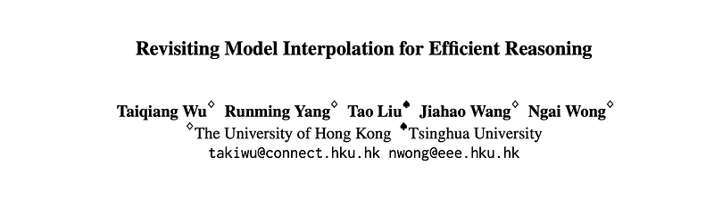
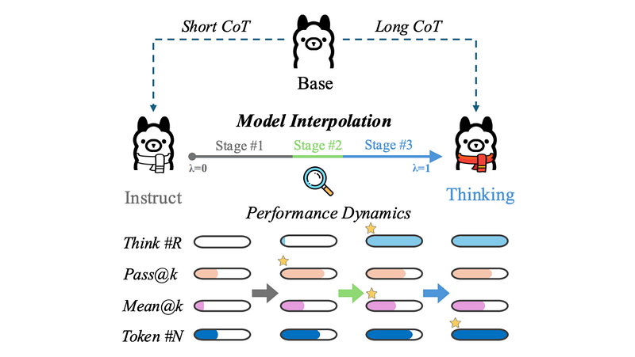
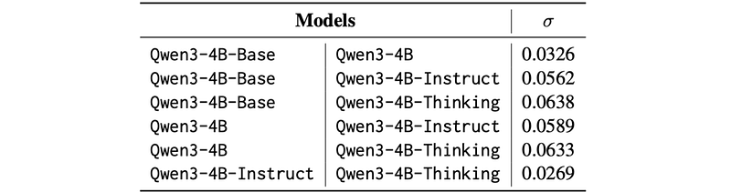
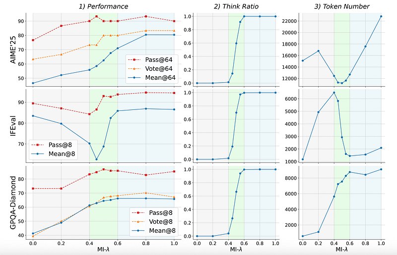
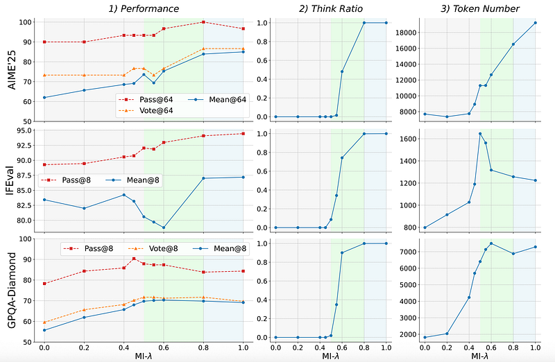
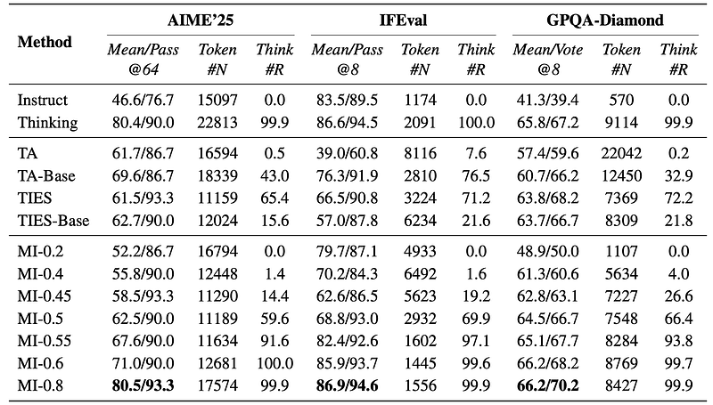
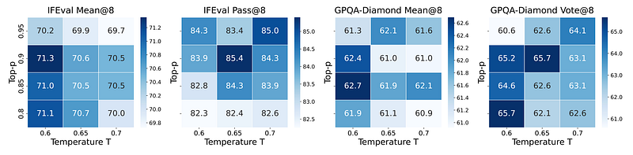
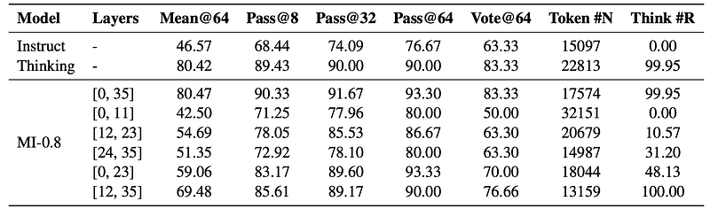
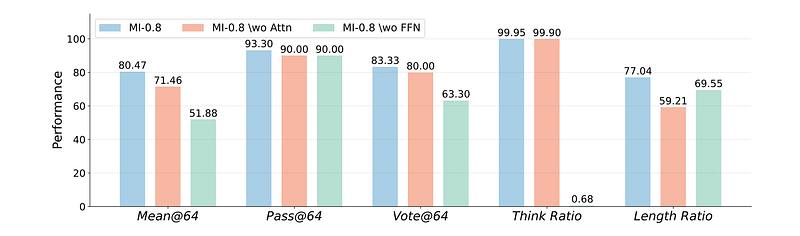
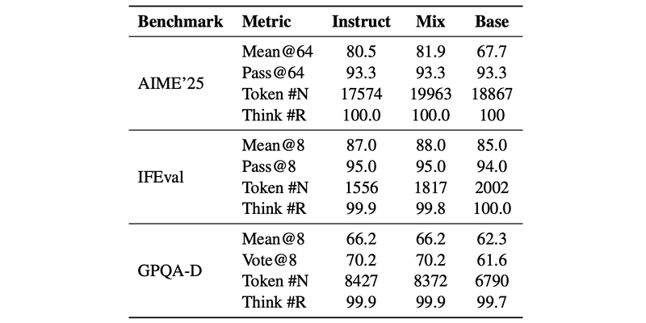

# Papers Explained 494 - Model Interpolation for Efficient Reasoning

This paper observes that model interpolation follows a three-stage evolutionary paradigm with distinct behaviors on the reasoning trajectory. These dynamics provide a principled guide for navigating the performance-cost trade-off.

This page ingests the source article into the wiki and connects it to [[Papers Explained Corpus]], [[Reasoning Models]], [[Model Compression and Efficiency]].

## Source Metadata

- Source file: `raw/2025-11-18_Papers-Explained-494--Model-Interpolation-for-Efficient-Reasoning-9029e3301a8b.html`
- Source title: Papers Explained 494: Model Interpolation for Efficient Reasoning
- Published: 2025-11-18
- Canonical: [https://medium.com/@ritvik19/papers-explained-494-model-interpolation-for-efficient-reasoning-9029e3301a8b](https://medium.com/@ritvik19/papers-explained-494-model-interpolation-for-efficient-reasoning-9029e3301a8b)

## Key Ideas

- There are two distinct reasoning styles, i.e., long CoT and short CoT. To better understand the relationship between these model variants, their parameter similarity is analyzed by the σ defined in Shadow-ft (a relative gap ratio used to quantify the...
- W_B represents the weights of the Base model.
- W_I represents the weights of the Instruct model.
- | · | signifies the absolute value operation.
- All the paired models are highly similar in weights.

## Notes

This paper observes that model interpolation follows a three-stage evolutionary paradigm with distinct behaviors on the reasoning trajectory. These dynamics provide a principled guide for navigating the performance-cost trade-off.

There are two distinct reasoning styles, i.e., long CoT and short CoT. To better understand the relationship between these model variants, their parameter similarity is analyzed by the σ defined in Shadow-ft (a relative gap ratio used to quantify the similarity between the weights of a paired Base model and its Instruct variant.)

- W_B represents the weights of the Base model.

- W_I represents the weights of the Instruct model.

- Σ denotes the element-wise sum.

- | · | signifies the absolute value operation.

*Figure: Weight similarity σ on paired models from Qwen3 series.*

- All the paired models are highly similar in weights.

- Qwen3–4B is more similar to Qwen3–4B-Thinking-2507 models than Qwen3–4B-Base, suggesting a potential inheritance relationship.

## Experimental Setup

Models:

Experiments are conducted merging the Qwen3–4B and Qwen3–30B-A3B models and merge the Instruct-2507 and Thinking-2507 variants.

Benchmarks:

Three representative benchmarks are selected to cover diverse reasoning skills:

- IFEval for instruction following

- GPQA-Diamond for scientific reasoning

- AIME’25 for mathematical reasoning.

Decoding Strategy:

For the baseline Instruct and Thinking models, their official sampling configurations are employed to ensure optimal performance.

The Thinking model uses a temperature T of 0.6 and Top-p of 0.95

The Instruct model uses 0.7 and 0.8, respectively.

For all merged models, the same hyperparameters with Thinking model are consistently applied (i.e., T=0.6, Top-p=0.95). 64 times are rolled out for AIME’25 and 8 for IFEval and GPQA-Diamond.

Evaluation Metrics

The models are evaluated across the following abilities:

- Effectiveness: Pass@k and Mean@k scores are reported.

- Consistency: On the multiple-choice task GPQA-Diamond, Vote@k is also reported to measure the stability of the model’s most frequent answer.

- Efficiency: Computational cost is measured by the average number of tokens in the generated responses, denoted as Token #N.

- Reasoning Pattern: The Thinking Ratio (Think #R), defined as the percentage of responses containing the </think> token, is further introduced to quantify the prevalence of explicit CoT reasoning.

## Three-Stage Paradigm

*Figure: The performance dynamics of model interpolation on Qwen3–4B-Instruct-2507 and Qwen3–4B-Thinking-2507.*

The performance dynamics do not evolve linearly with the interpolation coefficient λ. Instead, they follow a consistent and predictable three-stage paradigm, which is detailed below using the Qwen3–4B model as the primary example.

### Stage #1: Corresponding to λ ∈ [0,0.4)

In this initial phase, the merged model is dominated by the Instruct model but begins to incorporate traits from the Thinking model, and thus generating longer outputs without adopting an explicit thinking process. The Think Ratio (Think #R) remains near zero. Meanwhile, the number of tokens (Token #N) and Pass@k gradually increase as the model begins to generate more verbose responses. However the Mean@k and Vote@k increase much more gently on AIME’25 and GPQA-Diamond. In addition, there is a large drop on IFEval, since some input questions require being answered with token limits.

### Stage #2: Corresponding to λ ∈ [0.4,0.6]

In this stage, the reasoning pattern following Thinking models rapidly emerges, leading to largely increased Mean@k and gently increased Pass@k and Token #N. Specifically, the Think #R abruptly rises from nearly 0 to 1, indicating the rapid emergence of explicit long CoT capabilities from the Thinking Model. Across the three benchmarks, all the metrics show gains in this stage. In contrast to stage #1, the Mean@k scores increase largely while the Pass@k scores more gently.

### Stage #3: Corresponding to λ ∈ (0.6,1.0]

In this final stage, the merged model converges to the pure Thinking model, with continuously increasing Token #N and slight change in Pass@k and Mean@k. At this stage, the Think #R is saturated at 1.0 and the Token #N continuously increases, reflecting the high cost of generating long-form reasoning for all inputs. Although Mean@k continues to show slight improvements, Pass@k often plateaus or even slightly declines from its peak at Stage #2. This suggests a point of diminishing returns and provides clear evidence of the over-thinking phenomenon.

### Discussion on Larger Model

*Figure: The performance dynamics of model interpolation on Qwen3–30B-A3B-Instruct-2507 and Qwen3–30B-A3B-Thinking-2507.*

The performance dynamics of the much larger Qwen3–30B-A3B models follow a similar three-stage paradigm, confirming the generalization of findings. However, the specific ranges for each stage differ, with Stage #2 occurring later, at λ ∈ [0.5,0.8].

## Ablations

### Compared with More Baselines

Task Arithmetic (TA) and TIES-Merging (TIES) are used for comparison against Model Interpolation on Qwen3–4B.

*Figure: Performance comparison across AIME’25, IFEval, and GPQA-Diamond when merging Qwen3–4B-Instruct-2507 and Qwen3–4B-Thinking-2507.*

Model Interpolation consistently demonstrates clear and consistent superiority over TA and TIES variants across performance, efficiency, and controllability.

### Decoding Strategy Analysis

Employed the MI-0.4 model and performed a grid search over temperature (T) and Top-p values. Performance was evaluated on IFEval and GPQA-Diamond benchmarks.

*Figure: Performance of MI-0.4 on IFEval and GPQA-Diamond under different decoding strategies on Qwen3–4B.*

The performance of the interpolated MI-0.4 model is remarkably robust to variations in decoding strategies (temperature and Top-p), showing minimal performance fluctuations (e.g., 1.6 points on IFEval Mean@8). The default decoding setting of the Thinking model is a good cho

### Layer-wise Ablation Study

Conducted a study on Qwen3–4B (36 layers) by applying interpolation to selected subsets of layers (12 or 24 layers at different positions), while the remaining layers retained parameters of the Instruct model.

*Figure: Ablation on different layers to apply model interpolation.*

Reasoning capabilities and complex thinking patterns of the Thinking model are not evenly distributed but are predominantly stored in its middle and later layers. Interpolating only the last two-thirds of the model is highly effective, achieving 100% Think #R and strong performance comparable to full interpolation.

### Transformer Module Ablation

Analyzed the roles of Multi-Head Attention (MHA) and Feed-Forward Network (FFN) sub-layers within Transformer blocks by skipping either all MHA or all FFN sub-layers during interpolation with the MI-0.8 model. Results were reported on the AIME’25 benchmark.

*Figure: Ablation on modules to apply model interpolation.*

FFN modules from the Thinking model are the primary drivers for the pattern of long Chain-of-Thought (CoT) reasoning (teaching “how to think in steps”), as skipping them causes the Think Ratio to collapse. MHA modules are crucial for the quality and correctness of the reasoning itself (providing “knowledge needed to think correctly”), as skipping them reduces the Mean@64 score despite maintaining the Think Ratio. Both sub-layers are vital, playing complementary roles.

### Backbone Interpolation

Investigated the impact of using alternative backbones by interpolating the Thinking model with a hybrid thinking model (Qwen3–4B) and a pre-trained model (Qwen3–4B-Base). Performance was evaluated on IFEval, GPQA-Diamond, and AIME’25.

*Figure: The performance on Qwen3–4B when interpolating Thinking model with various backbones.*

For general-purpose benchmarks, various backbones (hybrid thinking model Qwen3–4B and pre-trained Qwen3–4B-Base) can yield comparable performance. However, instruction-following alignment is crucial for generating high-quality, reliable reasoning on complex problems, as evidenced by the significant drop in reasoning quality (Mean@64 score) when using the Qwen3–4B-Base model on the challenging AIME’25 benchmark.

## Paper

Revisiting Model Interpolation for Efficient Reasoning [2510.10977](https://arxiv.org/abs/2510.10977)

## Figures

Figures from the Medium HTML export (`raw/2025-11-18_Papers-Explained-494--Model-Interpolation-for-Efficient-Reasoning-9029e3301a8b.html`); local copies under `wiki/assets/papers-explained-494-model-interpolation-for-efficient-reasoning/` when download succeeded.

| Figure | Caption |
|--------|---------|
|  | Title card: Model Interpolation for Efficient Reasoning. |
|  | This paper observes that model interpolation follows a three-stage evolutionary paradigm with distinct behaviors on the reasoning... |
|  | Weight similarity σ on paired models from Qwen3 series. |
|  | The performance dynamics of model interpolation on Qwen3–4B-Instruct-2507 and Qwen3–4B-Thinking-2507. |
|  | The performance dynamics of model interpolation on Qwen3–30B-A3B-Instruct-2507 and Qwen3–30B-A3B-Thinking-2507. |
|  | Performance comparison across AIME’25, IFEval, and GPQA-Diamond when merging Qwen3–4B-Instruct-2507 and Qwen3–4B-Thinking-2507. |
|  | Performance of MI-0.4 on IFEval and GPQA-Diamond under different decoding strategies on Qwen3–4B. |
|  | Ablation on different layers to apply model interpolation. |
|  | Ablation on modules to apply model interpolation. |
|  | The performance on Qwen3–4B when interpolating Thinking model with various backbones. |
## Related

- [[Papers Explained Corpus]]
- [[Reasoning Models]]
- [[Model Compression and Efficiency]]
- [[Papers Explained 493 - gpt oss safeguard]]
- [[Papers Explained 495 - What Characterizes Effective Reasoning]]

#summary #topic
