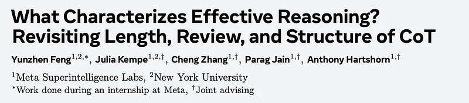
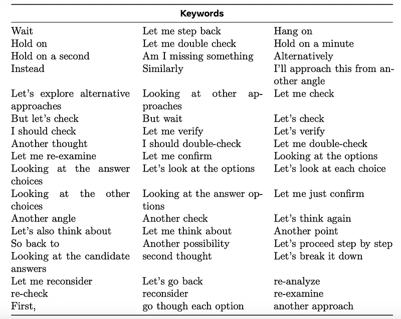
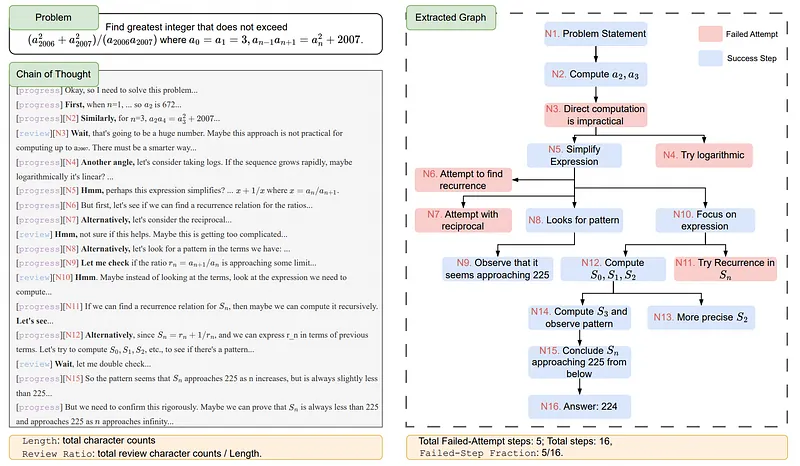
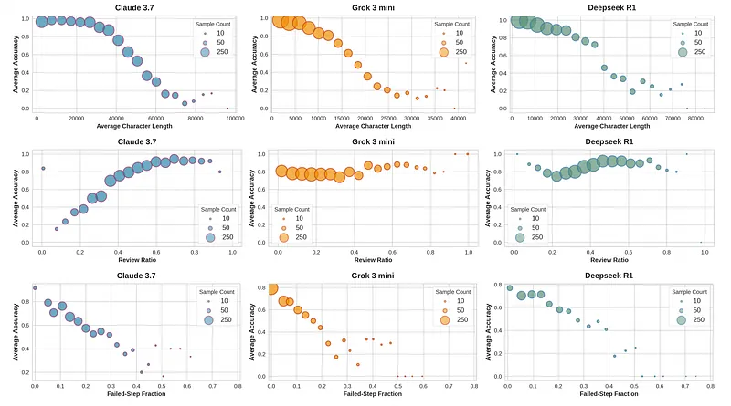
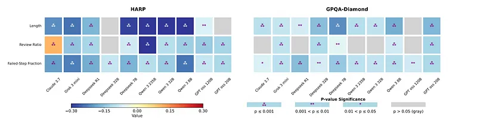
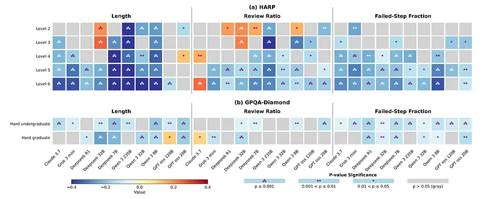
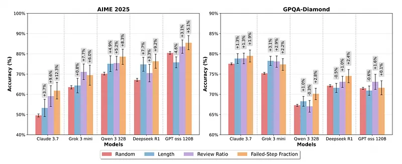
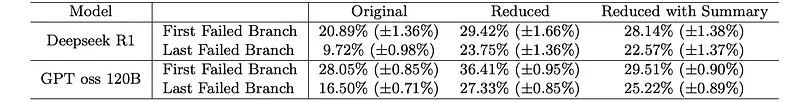

# Papers Explained 495 - What Characterizes Effective Reasoning

This study investigates the characteristics of effective chain-of-thought (CoT) reasoning in large reasoning models. It challenges the notion that longer CoTs and increased review behaviors (via appended wait tokens) necessarily lead to better accuracy.

This page ingests the source article into the wiki and connects it to [[Papers Explained Corpus]], [[Reasoning Models]], [[Evaluation and Benchmarks]].

## Source Metadata

- Source file: `raw/2025-11-19_Papers-Explained-495--What-Characterizes-Effective-Reasoning-8cf140bdb4e1.md`
- Source title: Papers Explained 495: What Characterizes Effective Reasoning
- Published: 2025-11-19
- Canonical: [https://medium.com/@ritvik19/papers-explained-495-what-characterizes-effective-reasoning-8cf140bdb4e1](https://medium.com/@ritvik19/papers-explained-495-what-characterizes-effective-reasoning-8cf140bdb4e1)

## Key Ideas

- Through a systematic evaluation of ten LRMs on math and scientific reasoning tasks, the authors find that both naive CoT lengthening and increased review are associated with lower accuracy.
- They introduce a graph view of CoT to extract structure and identify the Failed-Step Fraction (FSF) — the fraction of steps in abandoned branches — as a strong predictor of correctness across models, outperforming length and review ratio.
- Two experiments confirmed this finding. First, ranking CoTs by FSF at test time significantly improved performance. Second, removing failed branches from CoTs greatly increased accuracy, showing that these failures negatively impact reasoning.
- The study concludes that effective CoTs have fewer failures. It suggests focusing on structured, test-time scaling rather than simply generating longer CoTs.
- The study poses three research questions:

## Notes

This study investigates the characteristics of effective chain-of-thought (CoT) reasoning in large reasoning models. It challenges the notion that longer CoTs and increased review behaviors (via appended wait tokens) necessarily lead to better accuracy.

Through a systematic evaluation of ten LRMs on math and scientific reasoning tasks, the authors find that both naive CoT lengthening and increased review are associated with lower accuracy.

They introduce a graph view of CoT to extract structure and identify the Failed-Step Fraction (FSF) — the fraction of steps in abandoned branches — as a strong predictor of correctness across models, outperforming length and review ratio.

Two experiments confirmed this finding. First, ranking CoTs by FSF at test time significantly improved performance. Second, removing failed branches from CoTs greatly increased accuracy, showing that these failures negatively impact reasoning.

The study concludes that effective CoTs have fewer failures. It suggests focusing on structured, test-time scaling rather than simply generating longer CoTs.

## Framework

The study poses three research questions:

- Does increasing CoT length improve reasoning accuracy?

- Does increasing Review improve reasoning accuracy?

- What structural properties underlie the effects of length and Review?

Dataset

The research leverages the HARP dataset, which is centered on mathematical reasoning, and the GPQA-Diamond dataset, which covers scientific reasoning. Both datasets have human-labeled difficulty levels, allowing for the examination of patterns across different difficulty strata. The HARP dataset comprises 5,409 math questions sourced from U.S. national math competitions. To reduce computational load, 50 questions are subsampled from each of the 6 difficulty levels. All 198 questions from GPQA-Diamond are taken.

Models

Different model families and different model sizes are analyzed, including both dense models and mixture of expert models.

- Proprietary models with CoT access include Claude 3.7 Sonnet Thinking, Grok 3 mini.

- Open Sourced Families include Deepseek R1 (20250120), Deepseek Distill Qwen 32B (Deepseek 32B), Deepseek Distill Qwen 7B (Deepseek 7B), Qwen 3 235B, Qwen 3 32B, Qwen 3 8B, GPT oss 120B, GPT oss 20B.

For each question, 16 reasoning traces are generated to ensure that there are enough observations.

### Metrics

Length

The CoT Length is defined in characters.

Review

Review behaviors are measured with an LLM-as-a-judge procedure. Each reasoning trace is segmented into chunks using keyword-based heuristics.

The Llama 4 Maverick model is then prompted to label each chunk as progress or review. The model receives the current chunk together with the preceding five and the subsequent five chunks to provide activity context. The following semantics are used:

- progress: advances the active reasoning frontier, producing information that later steps rely on.

- review: reads, checks, restates, deletes, or rewinds existing material without advancing the frontier.

With the annotation, the character-level Review Ratio for each reasoning trace is calculated. Let st,j denote the j-th character in trace t and Nt its total number of characters:

Reasoning Graph

Reasoning graphs are extracted for each Chain-of-Thought (CoT) to probe structural properties. Claude 3.7 sonnet with thinking disabled is prompted to convert each CoT into Graphviz format. During extraction, the model is asked to color-code nodes as successful or failed attempts. This labeling enables a direct computation of the failed-step fraction.

```text
Parse the reasoning trace into a Graphviz diagram. Focus on these essentials:
Node Rules:
- One node per distinct reasoning step
- ‘fillcolor=lightblue’: Successful reasoning steps
- ‘fillcolor=lightpink’: Failed attempts
Edge Rules:
- Connect node A → node B if the information or insight from A is actually used to construct the
reasoning in B; branch new attempts from their starting ancestor, not from dead ends.
Requirements:
- Use ‘rankdir=TB’
- Include ALL attempts (including failures), do not miss any steps in the reasoning.
- ALWAYS start with a "problem statement" node
- ALWAYS end with a "final answer" node
- Do NOT reorder or reorganize the reasoning flow
Generate complete Graphviz DOT code in dot blocks.
```

Failed-Step Fraction, the fraction of reasoning nodes in the graph that are marked as failed/abandoned:

## Correlation Analysis

### Metric Distributions

*Figure: Distribution of the three metrics — Length, Review Ratio, and Failed-Step Fraction and their correlation with accuracy.*

- Shorter CoTs are generally associated with higher accuracy across all three models.

- Claude 3.7 shows a positive trend between Review Ratio and accuracy, while the other two models show mixed results.

- Lower FSF is correlated with higher accuracy, showing an approximately linear relationship.

- Conditional correlation analysis and GLMM results align closely, providing consistent evidence.

### Conditional Correlation Analysis

*Figure: Conditional correlations computed on the full dataset.*

- Shorter CoTs generally correlate with higher accuracy.

- Lower Review Ratio generally correlates with higher accuracy (except for Claude 3.7 on math reasoning).

- Lower Failed-Step Fraction (FSF) consistently correlates with higher accuracy across all models and datasets.

- When stratifying by question difficulty, correlations are most consistently significant on harder items (levels 4, 5, and 6) on HARP.

*Figure: Conditional correlation by human-labeled difficulty level for generated CoTs.*

- Within GPQA, Length remains a prominent predictor, while Review Ratio shows less consistent significance within difficulty bands.

- Claude 3.7 exhibits correlation within the Hard Graduate split, demonstrating that difficulty-specific patterns can be masked in aggregate analyses.

- FSF demonstrates the strongest and most consistent performance across all models and difficulty levels.

> Across CoTs for the same question, shorter Length, lower Review Ratio, and lower FSF all generally correlate with higher accuracy, with more pronounced effects on harder math questions. Failed-Step Fraction stands out as the strongest and most consistent predictor.

## From Correlation to Causality

### Test-time selection

The study evaluates on AIME 2025 (30 problems) and GPQA-Diamond datasets. For each problem and model, 64 independent generations are sampled. Four selectors are compared: FSF, Length, Review Ratio, and random selection. Pass@1 is used as the evaluation metric, and uncertainty is estimated via bootstrap resampling.

*Figure: Pass@1 with test-time selection by length, Review Ratio, and FSF.*

- FSF is the strongest selector across models and datasets, leading to significant accuracy gains.

- On AIME 2025, FSF improves accuracy by 5–13% over random selection.

- Review Ratio and Length also improve accuracy for most models.

- FSF produces significant gains for every model on GPQA-Diamond.

- Even when estimated by a weaker model (Claude 3.7) without ground truth access, FSF yields consistent accuracy gains.

- When Claude 3.7 generates, estimates FSF, and selects by it, accuracy improves by up to 12% for math.

> In conclusion, Failed-Step Fraction is the strongest metric that holds causally.

### Modifying the CoT

*Figure: Visualization of the continuation generation setup.*

To investigate why a higher Failed-Step Fraction negatively impacts performance in Chain-of-Thought (CoT) reasoning, the correlation between the depth of the first failed step and correctness is analyzed. A controlled edit is developed to remove failed exploration branches from incorrect CoT traces. The accuracy of three CoT variants are compared: original (with failed branch), reduced (failed branch removed), and summary (failed branch replaced with a summary). Each variant is evaluated by generating eight continuations from the partial CoT.

*Figure: Accuracy reported as mean ± standard deviation (in %).*

- There is little to no correlation between the depth of the first failed step and correctness, suggesting the presence and extent of failed attempts are more detrimental than when they occur.

- Removing the failed branch significantly increases accuracy (by 8–14%) for both Deepseek R1 and GPT oss 120B models.

- Providing a short summary of the failed branch also improves accuracy, but not as much as removing it entirely.

- Failed branches bias subsequent exploration, even after backtracking, indicating that models don’t fully “unsee” past mistakes.

- The findings support quality-aware test-time scaling, favoring structure-aware selection and context management with targeted branch pruning/summarization over indiscriminately generating longer CoTs.

> In conclusion, failed branches harm performance by biasing subsequent exploration; removing them improves accuracy.

## Paper

What Characterizes Effective Reasoning? Revisiting Length, Review, and Structure of CoT [2509.19284](https://arxiv.org/abs/2509.19284)

## Figures

Figures from the Medium HTML export (`raw/2025-11-19_Papers-Explained-495--What-Characterizes-Effective-Reasoning-8cf140bdb4e1.md`); local copies under `wiki/assets/papers-explained-495-what-characterizes-effective-reasoning/` when download succeeded.

| Figure | Caption |
|--------|---------|
|  | Title card: What Characterizes Effective Reasoning. |
|  | Review behaviors are measured with an LLM-as-a-judge procedure. |
|  | With the annotation, the character-level Review Ratio for each reasoning trace is calculated. |
|  | Failed-Step Fraction, the fraction of reasoning nodes in the graph that are marked as failed/abandoned. |
|  | Failed-Step Fraction, the fraction of reasoning nodes in the graph that are marked as failed/abandoned. |
|  | Distribution of the three metrics — Length, Review Ratio, and Failed-Step Fraction and their correlation with accuracy. |
|  | Conditional correlations computed on the full dataset. |
|  | Conditional correlation by human-labeled difficulty level for generated CoTs. |
|  | Pass@1 with test-time selection by length, Review Ratio, and FSF. |
|  | Visualization of the continuation generation setup. |
|  | Accuracy reported as mean ± standard deviation (in %). |
## Related

- [[Papers Explained Corpus]]
- [[Reasoning Models]]
- [[Evaluation and Benchmarks]]
- [[Papers Explained 494 - Model Interpolation for Efficient Reasoning]]
- [[Papers Explained 496 - Treasure Hunt]]

#summary #topic
