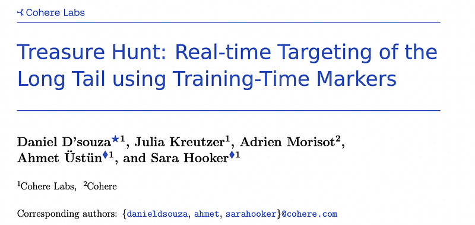
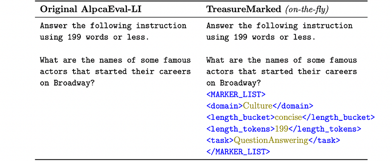
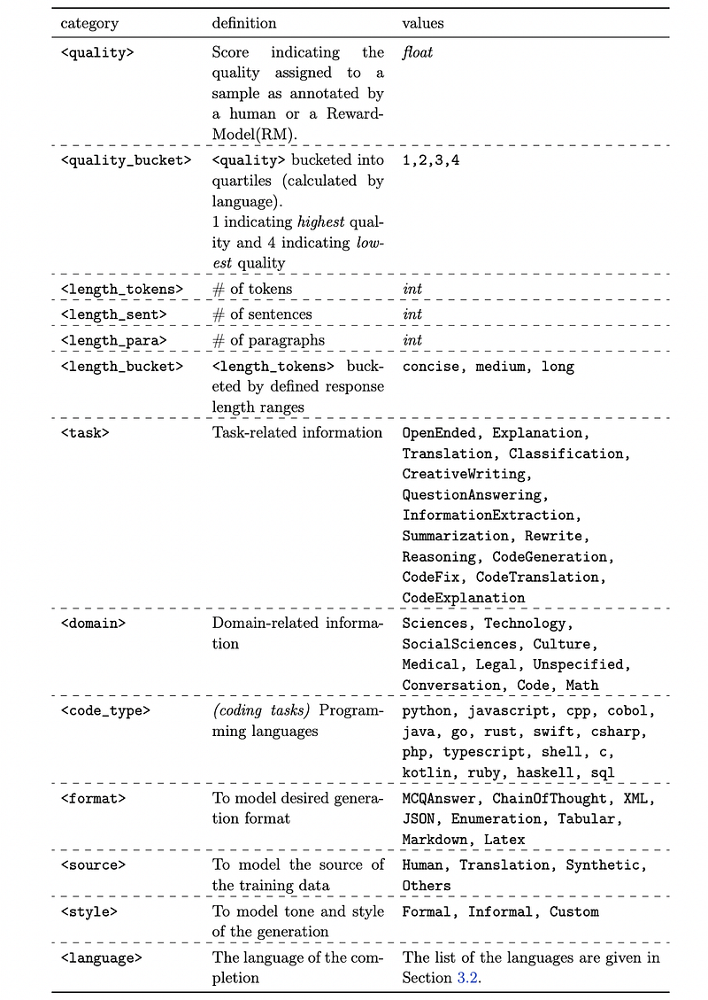
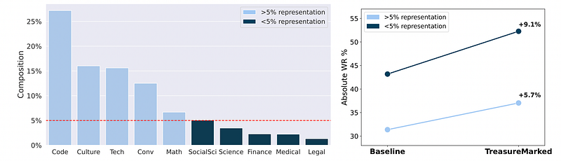
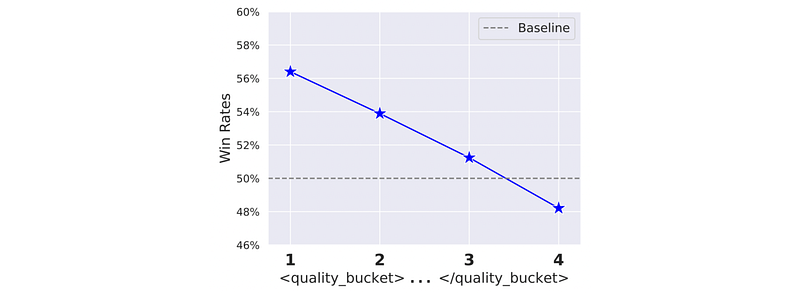
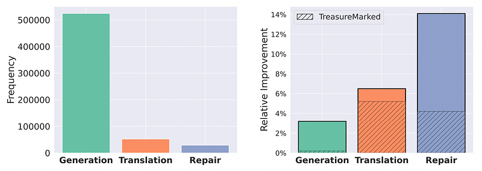
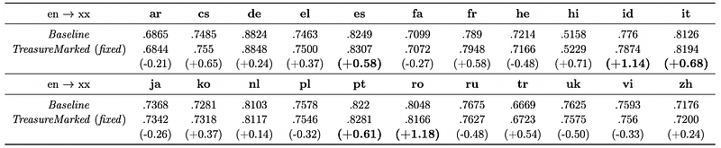
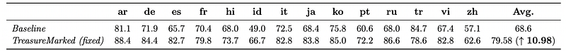

# Papers Explained 496 - Treasure Hunt

Large general-purpose models are trained for many tasks, but work best on high-frequency use cases. After training, it is hard to adapt a model to perform well on specific use cases underrepresented in the training corpus.

This page ingests the source article into the wiki and connects it to [[Papers Explained Corpus]], [[Multilingual Models]], [[Agentic AI]], [[Supervised Fine-Tuning]].

## Source Metadata

- Source file: `raw/2025-11-20_Papers-Explained-496--Treasure-Hunt-be83ba0d6e1c.html`
- Source title: Papers Explained 496: Treasure Hunt
- Published: 2025-11-20
- Canonical: [https://medium.com/@ritvik19/papers-explained-496-treasure-hunt-be83ba0d6e1c](https://medium.com/@ritvik19/papers-explained-496-treasure-hunt-be83ba0d6e1c)

## Key Ideas

- The authors propose a novel approach to optimize training protocols to simultaneously improve controllability for users and enhance performance on rare use cases at inference time.
- The output sequence y is conditioned given an instruction x with added training markers m:
- These markers encompass several different attributes of the data, including estimated quality scores, domains, and languages, which are stored as a list of markers associated with a given data point.
- Markers are included in both the input (appended to the prompt) and output space (prepended to the completion) to induce the model to associate the properties of the generations with these characteristics.
- The finetuning objective becomes to minimize the negative log likelihood of the target generations including the template, given a prompt with an optional input template:

## Notes

Large general-purpose models are trained for many tasks, but work best on high-frequency use cases. After training, it is hard to adapt a model to perform well on specific use cases underrepresented in the training corpus. Relying on prompt engineering or few-shot examples to maximize the output quality on a particular test case can be frustrating, as models can be highly sensitive to small changes, react in unpredicted ways or rely on a fixed system prompt for maintaining performance.

The authors propose a novel approach to optimize training protocols to simultaneously improve controllability for users and enhance performance on rare use cases at inference time. Their method involves building a “treasure map” of hyper-detailed, task-specific markers introduced during training. These “Treasure Markers” allow for real-time, automatic targeting of long-tail features during inference.

## Methodology

The output sequence y is conditioned given an instruction x with added training markers m:

These markers encompass several different attributes of the data, including estimated quality scores, domains, and languages, which are stored as a list of markers associated with a given data point.

Markers are included in both the input (appended to the prompt) and output space (prepended to the completion) to induce the model to associate the properties of the generations with these characteristics. This reduces the burden on the practitioner or researcher at inference time, as the model learns to infer the correct markers.

The finetuning objective becomes to minimize the negative log likelihood of the target generations including the template, given a prompt with an optional input template:

To avoid the model from becoming overly reliant on markers for completion or learning to trivially replicate the markers, dual dropout strategies (dataset-level, sample-level) are employed on the prompt space. In dataset-level dropout, training markers are completely removed from the prompt for a random selection (defined as a percentage of the dataset). In sample-level dropout, a random subset of training markers is completely removed from each example (defined as a percentage of all markers associated with a given example). To ensure the model consistently produces markers at inference time, dropout is not introduced on the generation side.

### Taxonomy of Training Markers

*Figure: Comprehensive taxonomy for training time markers.*

Experiments cover 23 languages: Arabic, Chinese (simplified & traditional), Czech, Dutch, English, French, German, Greek, Hebrew, Hindi, Indonesian, Italian, Japanese, Korean, Persian, Polish, Portuguese, Romanian, Russian, Spanish, Turkish, Ukrainian and Vietnamese.

## Experiment Setup

A 7-billion parameters proprietary base model is used, pretrained using a data mixture consisting of texts from 23 languages. The base model is trained on a training corpus containing 2.7M examples made up of a mixture of instruction-style data sources.

At inference time, performance gains are evaluated under two different settings. In the default setting, referred to as “TreasureMarked”, none of the markers are fixed at inference. This setting asks: Has the model learnt to infer the right markers without any intervention? In the second setting, referred to as “TreasureMarked (fixed)”, some of the markers are explicitly hardcoded at inference. This setting asks: if we manually set the value of some markers, can we drive gains in performance? This is very reasonable for cases like quality, where we always want to steer model behavior towards higher quality generations.

## Evaluation

### Impact of Treasure Markers on Open-Ended Generation

*Figure: Long tail domains benefit more from training markers*

- Treasure markers included only during training (TreasureMarked variant) led to an absolute increase of 5.7% in win rates across all tasks, indicating a positive impact even when markers are inferred by the model itself.

- Treasure markers were particularly helpful in preserving or unearthing gains on the long-tail (underrepresented domains), with a more pronounced gain of +9.1% compared to the +5.7% improvement in higher-represented domains.

*Figure: Levers for Controlling Quality.*

- Fixed treasure markers related to quality allowed for control over generation quality, with win rates under the reward model increasing from 48.21% to 56.5% by changing <quality> and <quality_bucket> at inference time.

- The framework demonstrates the potential to use markers representing a desired quality metric during training to leverage generations that tap into that quality metric at inference time.

### Impact of Treasure Markers on Targeted Performance of Specific Sub-tasks

*Figure: Improvement on the Long Tail for Code tasks.*

- The model shows the largest performance gains on the less frequent (long-tail) code tasks (CodeTranslation and CodeRepair).

- Providing treasure markers (TreasureMarked (fixed)) or allowing the model to infer them both lead to significant improvements in CodeTranslation (up to 6.5% relative gain) and CodeRepair (up to 14.1% relative gain).

- The more frequent task, CodeGeneration, shows smaller improvements (up to 3.2% relative gain).

- The framework benefits all parts of the distribution, but has disproportionate success enabling large lifts to highly infrequent features during training.

### Length Control in Inference Time

*Figure: Length Instruction Following.*

- The “TreasureMarked” model with fixed treasure markers achieved up to 35.3% improvement in length violation rates, resulting in only 1.25% remaining violations.

- Even without explicit treasure markers, the model showed up to 11.8% absolute decrease in violation rates.

- Improvements in length control led to win-rate gains of up to 6.86%, indicating that quality was not compromised.

### Machine Translation

*Figure: X-CometXL scores on WMT’24++ test sets.*

- Training with markers and using them at inference time significantly improves performance on 5 languages (es, id, it, pt, ro) with up to 1.18 point gains.

- Performance is retained on all other languages.

### Language Control in Inference Time

*Figure: Line-level pass rate on Complex Prompts from the Language Confusion Benchmark.*

- The model with training markers significantly improved language control performance in 13 out of 14 languages.

- There was an average absolute gain of 10.98% across the 14 languages, demonstrating improved controllability.

- The largest gains were observed for Russian (+18.6%), and the lowest gains for Chinese (+5.5%).

## Paper

Treasure Hunt: Real-time Targeting of the Long Tail using Training-Time Markers [2506.14702](https://arxiv.org/abs/2506.14702)

## Figures

Figures from the Medium HTML export (`raw/2025-11-20_Papers-Explained-496--Treasure-Hunt-be83ba0d6e1c.html`); local copies under `wiki/assets/papers-explained-496-treasure-hunt/` when download succeeded.

| Figure | Caption |
|--------|---------|
|  | Title card: Treasure Hunt. |
|  | The output sequence y is conditioned given an instruction x with added training markers m. |
|  | To avoid the model from becoming overly reliant on markers for completion or learning to trivially replicate the markers, dual dropout... |
|  | Methodology. |
|  | Comprehensive taxonomy for training time markers. |
|  | Long tail domains benefit more from training markers. |
|  | Levers for Controlling Quality. |
|  | Improvement on the Long Tail for Code tasks. |
|  | Length Instruction Following. |
|  | X-CometXL scores on WMT’24++ test sets. |
|  | Line-level pass rate on Complex Prompts from the Language Confusion Benchmark. |
## Related

- [[Papers Explained Corpus]]
- [[Multilingual Models]]
- [[Agentic AI]]
- [[Supervised Fine-Tuning]]
- [[Papers Explained 495 - What Characterizes Effective Reasoning]]
- [[Papers Explained 497 - AI-Augmented Textbook (Learn Your Way)]]

#summary #topic
