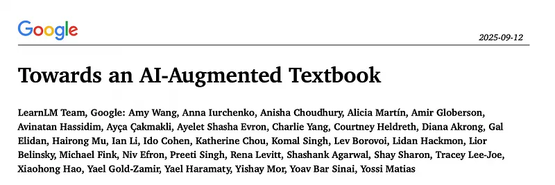
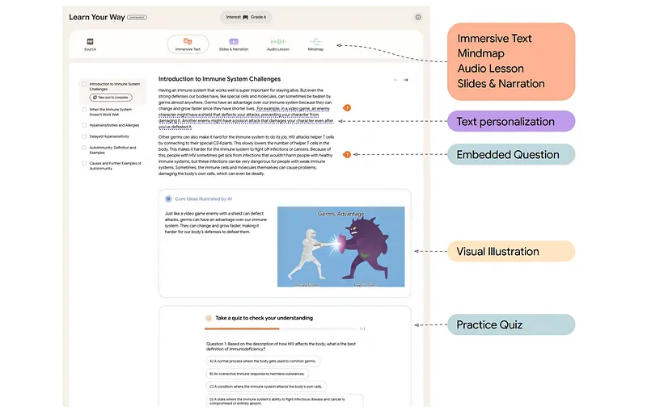
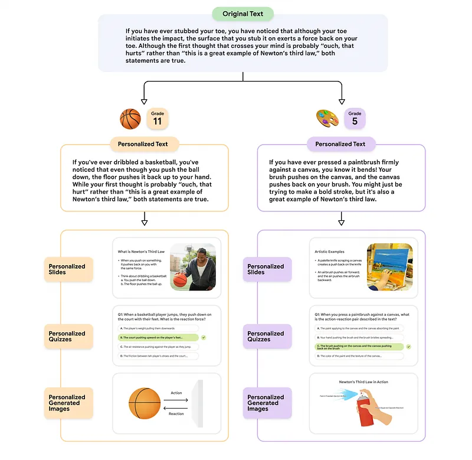
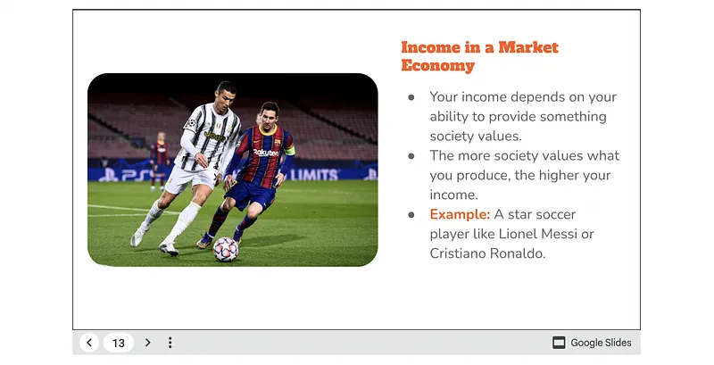
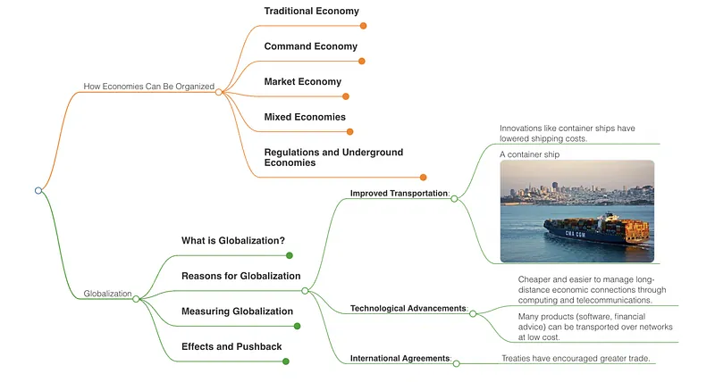
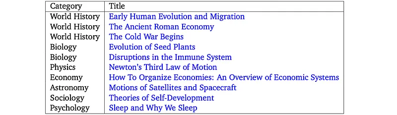
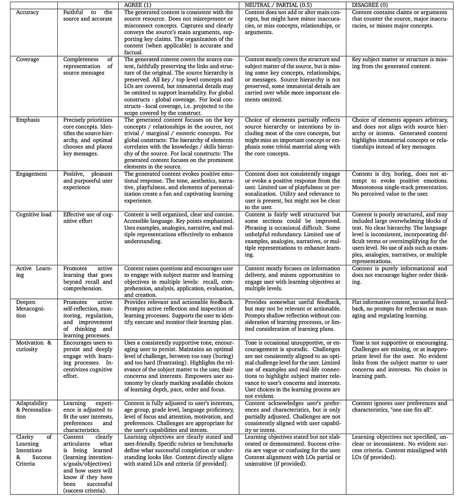
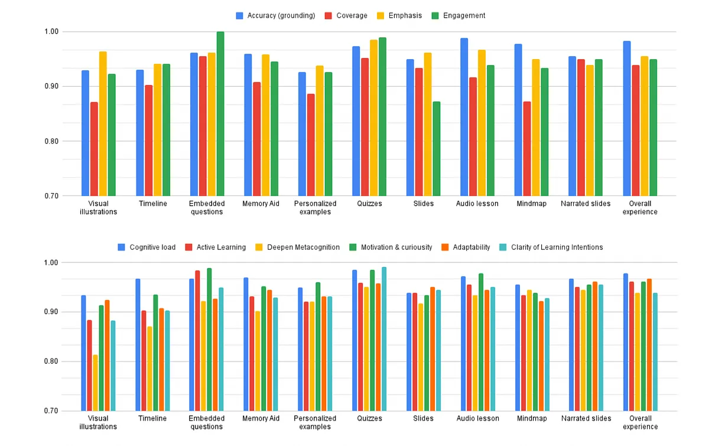

# Papers Explained 497 - AI-Augmented Textbook (Learn Your Way)

Textbooks are a cornerstone of education, but they have a fundamental limitation: they are a one-size-fits-all medium. This work presents an approach for transforming and augmenting textbooks using generative AI, adding layers of multiple representations and personalization while maintaining content integrity and quality.

This page ingests the source article into the wiki and connects it to [[Papers Explained Corpus]], [[Synthetic Data]], [[Evaluation and Benchmarks]], [[Audio Models]].

## Source Metadata

- Source file: `raw/2025-11-21_Papers-Explained-497--AI-Augmented-Textbook--Learn-Your-Way--97e47252096e.md`
- Source title: Papers Explained 497: AI-Augmented Textbook (Learn Your Way)
- Published: 2025-11-21
- Canonical: [https://medium.com/@ritvik19/papers-explained-497-ai-augmented-textbook-learn-your-way-97e47252096e](https://medium.com/@ritvik19/papers-explained-497-ai-augmented-textbook-learn-your-way-97e47252096e)

## Key Ideas

- Textbooks are a cornerstone of education, but they have a fundamental limitation: they are a one-size-fits-all medium.
- The goal is to explore how transforming source material can increase content engagement and efficacy. Gen-AI offers four key opportunities in this context.
- It can generate content for any material the learner is interested in.
- It can do so while adapting to the specific attributes and needs of the learner.
- AI can be used to generate different representations of the material, including visualizations and audio-based formats, which are known to further enhance the efficacy of learning.

## Notes

Textbooks are a cornerstone of education, but they have a fundamental limitation: they are a one-size-fits-all medium. This work presents an approach for transforming and augmenting textbooks using generative AI, adding layers of multiple representations and personalization while maintaining content integrity and quality.

*Figure: An example of the Learn Your Way learning experience.*

## Textbook Augmentation via Personalization and Multiple-Views

The goal is to explore how transforming source material can increase content engagement and efficacy. Gen-AI offers four key opportunities in this context.

- It can generate content for any material the learner is interested in.

- It can do so while adapting to the specific attributes and needs of the learner.

- AI can be used to generate different representations of the material, including visualizations and audio-based formats, which are known to further enhance the efficacy of learning.

- AI can generate formative assessment elements tailored to the learner, allowing them to monitor and regulate progress.

Textbook transformation and augmentation follows a two step approach.

- In the “Text Personalization” stage, material is rewritten to match specific personal attributes of the learner.

- Then in the “Content Transformations” stage, multiple views of the rewritten material are created.

These allow the user to choose their own learning path, interleaving complementary representations of the same conceptual structures.

*Figure: An illustration of the two step generation procedure used in Learn Your Way.*

### Text Personalization

The focus is on two key attributes:

Personalization to Grade Level: The text is generatively adapted, with the goal of matching the Flesch-Kincaid Grade (a readability test that estimates the US academic grade level needed to comprehend a piece of text) for that level, while maintaining factuality and coverage of the material.

Personalization to Interests: Currently, the learner is asked to select one of several common interests (e.g., sports, music, food). This information is then used to rewrite the original text, making it more relatable. This also serves the purpose of mapping new knowledge to existing conceptual networks used by the learners, thus making learning more effective.

It is known that “individuals’ existing knowledge serves as a base for subsequent learning and performance” and “prior knowledge guides readers’ comprehension of written language”.

Gen-AI rewriting is done in a focused manner, by first selecting parts of the text that are particularly amenable to personalization, and then replacing only these parts with an AI-rewritten personalized version. This has the added advantage of highlighting the personalized text, thus informing the learner that it has been specialized to their interests.

### Content Transformations

The rewriting phase results in text that is adapted to the learner. This text serves as the basis for multiple content transformations, each providing a different view of the material.

Slides and Narration

*Figure: Example slide in the deck generated for OpenStax’s How To Organize Economies source and adapted to the learner interest in ‘soccer’.*

Learners often benefit from a class-like slide sequence that covers the core material in brief, while also suggesting interest-capturing questions that precede the material, and activities aimed at engagement. The Learn Your Way experience also provides an additional optional generated narration for the slides. The narration is meant to resemble a recorded lesson, and the narrated text is not restricted to the text in the slides, but is rather designed to be natural and complementary to the slides.

Audio-Graphic

This transformation aims at a comprehensive and detailed coverage of the material, delivered in an audio-graphic form that simulates a conversation between a teacher and a student about the material. To allow for a realistic experience, the teacher and student turns are generated iteratively using independent Gemini “personas”. This allows for a realistic experience where the (virtual) student does not see the material before it is presented and may, for example, respond to questions with answers that are not part of the original material and uncover common learner misconceptions. In addition to the audio conversation, the lesson contains a graphical representation of the key concepts and the relationships between them, which is dynamically presented to the learner. This combination of audio and visual components is motivated by dual coding theory, which suggests that multiple representations of concepts serve to strengthen the corresponding mental conceptual structures.

Mind Maps

*Figure: An example mind map created for OpenStax’s How to Organize Economies source material.*

This common graphical representation organizes information hierarchically, and allows for a broad view of the material at different levels of granularity. It is often useful as a mechanism for organizing the material following a detailed learning session, or as an organizational reminder of the entire source material. The map nodes are annotated with illustrative texts and images derived from the source.

### Immersive Text

After every section of the text, several added components are optionally included that are meant to enhance the learning experience:

Timeline

Source material often contains sequences, such as a series of events in history or the stages of an experiment or algorithmic approach. “Timelines” can convey these sequences visually, reducing cognitive load and making it easier for the learner to follow the details. To generate these, the source material is first scanned to identify candidate sequences, followed by the generation of the timeline and appropriate placement within the material.

Memory Aid

Learning new material often involves memorizing facts. The common strategy of mnemonics is used, a memorization approach where each item to remember is associated with a word that begins with the same first letter, and the sequence of words forms a sentence. With on-the-fly generation, the coverage of commonly used mnemonics is no longer a restriction. Instead, given the input material, Gemini is used to first identify elements in the material that are hard to memorize. Then a mnemonic is generated with two requirements in addition to the constraint of being a valid mnemonic: form a coherent and easy to remember sentence, and form a sentence that has close semantic association with the material to be remembered.

Visual Illustrations

Visual learning is broadly recognized as a powerful medium, and many textbooks include explanatory diagrams and drawings. It is natural to use AI image generation tools to produce such visuals. However, initial exploration found that even the most advanced AI image generation models struggle to produce these types of images. This can be explained by the fact that such models are trained to produce realistic images that are high on detail. To overcome this, a model was fine-tuned specifically for this task. This model is applied to parts of the material that Gemini identifies as worthy of illustration.

### Practice and Assessment

Formative assessment is arguably one of the primary drivers of learning. Therefore, Learn Your Way is augmented with two assessment components:

Embedded Questions

Embedded questions are dynamically generated questions that are grounded and associated with specific segments of the source material. These questions serve to convert the reading experience from passive to active and to keep the learner engaged by providing immediate feedback. They also reinforce the concept being learned. In LearnYourWay they are presented as multiple-choice questions.

Quizzes

Section-level quizzes aim at deeper understanding once a section has been read and assimilated. The quizzes are dynamically generated and grounded to all of the material in the section. They consist of 5–10 multiple choice questions of various difficulties and types. At the end of the quiz, an overall assessment is provided that includes both a numerical score as well as targeted feedback that highlights strengths (or Glows) and areas for improvement (or Grows).

## Pedagogical Evaluations

In order to assess the quality of the different augmentation and transformation components used in Learn Your Way, ten source-of-truth PDFs, ranging in topics from sociology to physics from OpenStax, were used.

*Figure: The PDFs used as the souce-of-truth for the pedagogical evaluations.*

For grade level personalization, three grade levels (7th grade, 10th grade and undergraduate level) and three personal interests (basketball, music and food) were considered. Each PDF was assigned three random combinations of grade level and personal interests (out of the nine possible combinations). Each of the configurations above was then provided as input to Learn Your Way, which generated the transformations and assessments. Pedagogical experts were asked to evaluate the quality of each component with respect to several basic criteria such as coverage, as well as criteria that capture key learning science principles.

*Figure: Pedagogical rubrics used by experts to rate the various components of Learn Your Way.*

*Figure: Rating of the various components that make up Learn Your Way, as rated by pedagogy experts.*

- All components have relatively high pedagogy values and the overall experience is rated over 0.90 across all axes.

- The component with the lowest scores is that of Visual Illustration. This is to be expected given the difficulty of generating high quality pedagogical images.

- The slides format received the lowest ‘engagement’ score of all capabilities.

- On the other hand, these same slides but with generative narration received a significantly higher score. This is in line with the fact that slides are often presented alongside narration, and thus this combination is more engaging for learners.

## Paper

[Towards an AI-Augmented Textbook](https://services.google.com/fh/files/misc/ai_augmented_textbook.pdf)

## Figures

Figures from the Medium HTML export (`raw/2025-11-21_Papers-Explained-497--AI-Augmented-Textbook--Learn-Your-Way--97e47252096e.md`); local copies under `wiki/assets/papers-explained-497-ai-augmented-textbook-learn-your-way/` when download succeeded.

| Figure | Caption |
|--------|---------|
|  | Title card: AI-Augmented Textbook (Learn Your Way). |
|  | An example of the Learn Your Way learning experience. |
|  | An illustration of the two step generation procedure used in Learn Your Way. |
|  | Example slide in the deck generated for OpenStax’s How To Organize Economies source and adapted to the learner interest in ‘soccer’. |
|  | An example mind map created for OpenStax’s How to Organize Economies source material. |
|  | The PDFs used as the souce-of-truth for the pedagogical evaluations. |
|  | Pedagogical rubrics used by experts to rate the various components of Learn Your Way. |
|  | Rating of the various components that make up Learn Your Way, as rated by pedagogy experts. |
## Related

- [[Papers Explained Corpus]]
- [[Synthetic Data]]
- [[Evaluation and Benchmarks]]
- [[Audio Models]]
- [[Papers Explained 496 - Treasure Hunt]]
- [[Papers Explained 498 - Command A Translate]]

#summary #topic
