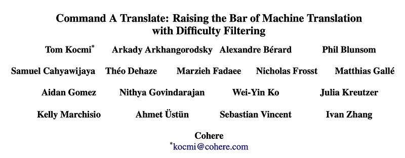
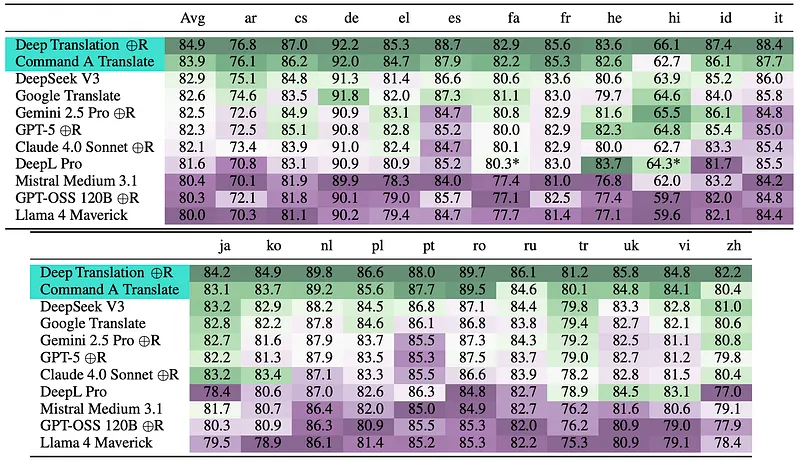
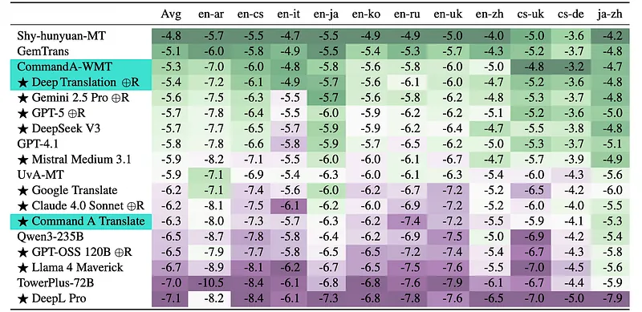
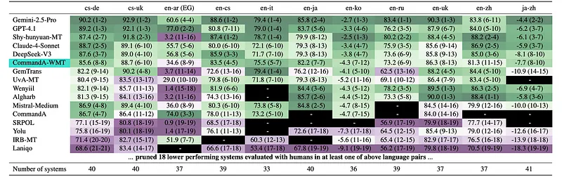
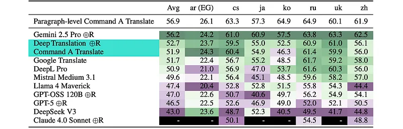
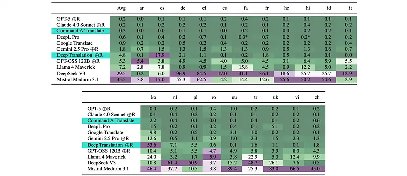

# Papers Explained 498 - Command A Translate

Command A Translate is a machine translation model built off Cohere’s Command A trained via direct preference optimization. The model is extended and participates at WMT with a system (CommandA-WMT) that uses two models and post-editing steps of step-by-step reasoning and limited Minimum Bayes Risk decoding.

This page ingests the source article into the wiki and connects it to [[Papers Explained Corpus]], [[Reinforcement Learning Topic]], [[Multilingual Models]], [[Reasoning Models]], [[Mixture of Experts]], [[Large Language Models]].

## Source Metadata

- Source file: `raw/2025-11-24_Papers-Explained-498--Command-A-Translate-bb9d0e0151e7.md`
- Source title: Papers Explained 498: Command A Translate
- Published: 2025-11-24
- Canonical: [https://medium.com/@ritvik19/papers-explained-498-command-a-translate-bb9d0e0151e7](https://medium.com/@ritvik19/papers-explained-498-command-a-translate-bb9d0e0151e7)

## Key Ideas

- Command A Translate is a machine translation model built off Cohere’s Command A trained via direct preference optimization.
- The model is available on [HuggingFace](https://huggingface.co/CohereLabs/command-a-translate-08-2025).
- Two model setups form the submission to the WMT 2025 Shared Tasks:
- Command A Translate: Cohere’s officially released MT model with open weights.
- CommandA-WMT: A system incorporating model routing and additional post-editing techniques (MBR decoding and step-by-step reasoning).

## Notes

Command A Translate is a machine translation model built off Cohere’s Command A trained via direct preference optimization. The model is extended and participates at WMT with a system (CommandA-WMT) that uses two models and post-editing steps of step-by-step reasoning and limited Minimum Bayes Risk decoding.

The model is available on [HuggingFace](https://huggingface.co/CohereLabs/command-a-translate-08-2025).

## Training Details

### Model Architecture

Two model setups form the submission to the WMT 2025 Shared Tasks:

- Command A Translate: Cohere’s officially released MT model with open weights.

- CommandA-WMT: A system incorporating model routing and additional post-editing techniques (MBR decoding and step-by-step reasoning).

The models are built on top of Command A, a 111B-parameter dense decoder-only Transformer model supporting 23 languages.

### Data Preparation

Early ablations revealed that sentence-level parallel data was not helpful to further improve the MT capabilities over the parent model. Accordingly, focus only on document-level and longer context data.

Several steps of filtering are used to obtain the highest quality and most challenging examples for training. These steps are applied one after another as listed below.

- Rule-based filtering: Boilerplate and non-textual documents, such as ones containing primarily numbers or special symbols, are removed.

- Language identification filtering using Fast-Text.

- Quality Estimation (QE) filtering: For each corpora, the bottom 25% of documents with the lowest document-level QE score obtained by averaging sentence-level scores are removed.

- Difficulty filtering: Documents that are most challenging to translate are selected.

- Capability filtering and language coverage: As the final step, the training dataset is assured to have an uniform distribution across languages; i.e., more training examples are given to languages where Command A under-performs, while limiting coverage of languages where it already performs very well.

The final training dataset contains 126,000 unique documents with an average of 951 tokens per document.

### Difficulty Filtering

Standard approaches to boosting machine translation performance (such as quality filtering) were not very helpful, making only minor improvements. When diving deep, only 8.2% documents out of a random sample of 100k documents had human translations whose quality was deemed higher than translations from Command A. This finding underlines the fact that Command A is already a high-performing translation model. The failure to boost the performance is hypothesized to be due to a large quantity of easy or badly translated examples. Following this hypothesis, Sentinel-25-src, which is designed to score source segments on how challenging the translation will be to modern systems, is used. The metric was originally designed to build stronger MT test sets.

Sentinel-25-src is applied on the segment-level of potential training documents, averaging scores to obtain a single document-level difficulty score. When taking a sample of the 100,000 most difficult documents, the ratio where the original human translation is better than Command A’s translation increases to 20.1%, and shows a way to skew the training data towards more challenging samples.

One limitation of this difficulty filtering technique is that it relies on well-formatted data, because Sentinel-25-src also (correctly) ranks the broken text as difficult-to-translate. Accordingly, difficulty filtering is applied to remove the easiest 25% of all remaining data at this step.

### Capability Filtering and Language Balancing

Direct preference optimization leverages pairs of completions (translations), one of which is deemed better than the other. To prepare the preference data, the Command A translation is used as “worse completion” while using the original human translation as a better completion. The training data is initially unbalanced in terms of language coverage, with high-resource languages having vastly more data. The goal is a more uniform distribution across languages paired with English while also having high coverage of non-English pairs.

### Training Algorithm

When fine-tuning Command A, two setups were experimented with: one using supervised fine-tuning (SFT) and the other using direct preference optimization (DPO).

While SFT improves a 7B model in ablations, improvements did not transfer to the large 111B model. On the other hand, DPO showed significant gains even for the 111B. As a result, Command A Translate uses only DPO with the training data described above.

For CommandA-WMT, SFT is used to improve language coverage. SFT is run on only languages not supported by Command A, then followed with DPO as done for Command A Translate.

## CommandA-WMT Submission

CommandA-WMT is a routed machine translation system built of two models, with additional post-editing techniques: document-level translation, MBR decoding and step-by-step reasoning.

The two models that comprise the routed system are (1) Command A Translate for 23 supported languages, and (2) a separate finetune of Command A for unsupported languages. (2) comprises an SFT training step with parallel data for the missing languages: Bengali, Bhojpuri, Estonian, Icelandic, Kannada, Lithuanian, Marathi, Serbian, Swedish, Thai. SFT is followed by the DPO step using the same data as Command A Translate. The routing of the model is based solely on the target language of the translation direction.

Data is translated at a document-level rather than segment-level to keep the context. This decision differs from the majority of system submissions for the General MT task, which are translated on the segment-level. Note that automatic evaluation can only be run on the paragraph level, which may penalize this setup.

For MBR, 20 translations were sampled for each document by increasing temperature from 0.1 to 0.3 with a step 0.01, selecting the best translation as MBR with MetricX-XL metric. The 20 translations is too little for MBR to be effective, as the original study uses 1000 samples, so this step did not significantly affect the performance, as in contrast, greedy decoding leads usually to the best translation results.

Finally, step-by-step reasoning is utilized. These additional post-editing steps are done only for CommandA-WMT, while all results regarding the Command A Translate are done on the raw model outputs without any post-editing techniques.

## Evaluation

All systems, including theirs, were evaluated in an identical, clean zero-shot setup with fixed temperature (0) and no post-editing, except for CommandA-WMT which used post-editing as submitted to WMT General MT shared tasks.

Benchmark models included DeepSeek V3, GPT-5, Gemini-2.5-Pro, Mistral Medium 3.1, GPT-OSS 120B, LLama 4 Maverick, Claude 4 Sonnet, Google Translate, and DeepL Pro.

Applicable models were run with reasoning enabled (8096 thinking budget or high effort), marked with ⊕R.

- Performance Across 23 Languages: Evaluated on the WMT24++ test set (English to 55 languages/dialects, 4 domains) using xComet-XL, a state-of-the-art metric with high correlation to human judgment.

- WMT25 Blind Evaluation: Validated performance on the WMT25 blind test set (English, Czech, Japanese source languages, 4 domains) using MetricX-24-XL, a neural metric, to diversify results and reduce metric bias. For controlled comparisons, benchmark systems were run in an identical setup.

- Human Evaluation: Aggregated results from WMT25 human evaluations using Error Span Annotation (ESA) and Multi-dimensional Quality Metrics (MQM) for the top 18 systems per language pair.

- Long Context Translation: Tested capabilities on the literary domain of the WMT25 test set (two ~5000-word stories translated in a single request). Overcame xComet-XL’s context window limitation by paragraph-level evaluation and introduced a special paragraph-break character ‘||’ in source text to ensure alignment across models.

- Prompt Injection Robustness: Employed an adversarial MT prompt injection test set using a “question mark” heuristic to check if models translated a question instead of answering it.

*Figure: Results of all languages over WMT24++ test set evaluated with xComet-XL metric.*

- Performance Across 23 Languages: Command A Translate outperforms all systems except on Hebrew and Hindi. Deep Translation ⊕R outperforms all systems across all languages, achieving +2 xComet-XL over the best competitor (DeepSeek V3), an effect size noticeable by human annotators.

*Figure: MetricX-XL results for the WMT25 test set.*

- Systems marked with ⋆ are collected in controlled and identical setup, and are therefore directly comparable.

- WMT25 Blind Evaluation: Deep Translation ⊕R ranks at the top among controlled systems.

*Figure: Human evaluation sourced from WMT25.*

- Human Evaluation: CommandA-WMT achieved a strong rank of 4th to 11th place out of 40 participating systems across languages. Its performance on Egyptian Arabic was lower due to fine-tuning on Modern Standard Arabic, suggesting potential for improvement with specific fine-tuning.

*Figure: Results of long context translation, evaluated on a paragraph-level with xComet-XL metric.*

- Long Context Translation: Command A Translate achieved the second-best performance, right after Gemini 2.5 Pro ⊕R.

- There is a significant performance gap between long-context (single request) and paragraph-level translation in modern MT systems (e.g., quality degrades from 56.9 to 51.9 xComet-XL for Command A Translate when translated paragraph-by-paragraph).

- Claude-4-Sonnet was unable to follow instructions for long-context document translation with paragraph breaks.

*Figure: Adversarial prompt injection testing of systems. The score is a percentage of failed translation in regards to the question mark test.*

- Prompt Injection Robustness: Most systems demonstrated robustness to prompt injection attacks.

- DeepSeek V3 and Mistral Medium 3.1 struggled significantly with resisting instruction following.

- Command A Translate was robust across the board, while Deep Translation ⊕R showed vulnerabilities in Czech and Korean, possibly due to its complex prompt instruction structure.

## Paper

[Command A Translate: Raising the Bar of Machine Translation with Difficulty Filtering](https://aclanthology.org/2025.wmt-1.55.pdf)

## Figures

Figures from the Medium HTML export (`raw/2025-11-24_Papers-Explained-498--Command-A-Translate-bb9d0e0151e7.md`); local copies under `wiki/assets/papers-explained-498-command-a-translate/` when download succeeded.

| Figure | Caption |
|--------|---------|
|  | Title card: Command A Translate. |
|  | Results of all languages over WMT24++ test set evaluated with xComet-XL metric. |
|  | MetricX-XL results for the WMT25 test set. |
|  | Human evaluation sourced from WMT25. |
|  | Results of long context translation, evaluated on a paragraph-level with xComet-XL metric. |
|  | Adversarial prompt injection testing of systems. The score is a percentage of failed translation in regards to the question mark test. |
## Related

- [[Papers Explained Corpus]]
- [[Reinforcement Learning Topic]]
- [[Multilingual Models]]
- [[Reasoning Models]]
- [[Mixture of Experts]]
- [[Large Language Models]]
- [[Papers Explained 497 - AI-Augmented Textbook (Learn Your Way)]]
- [[Papers Explained 499 - Souper Model (Soup Of Category Experts)]]
- [[Command A Translate: Secure Translation for Global Enterprises]] — official Cohere product announcement (`raw/command-a-translate/`).

#summary #topic
