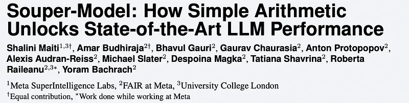
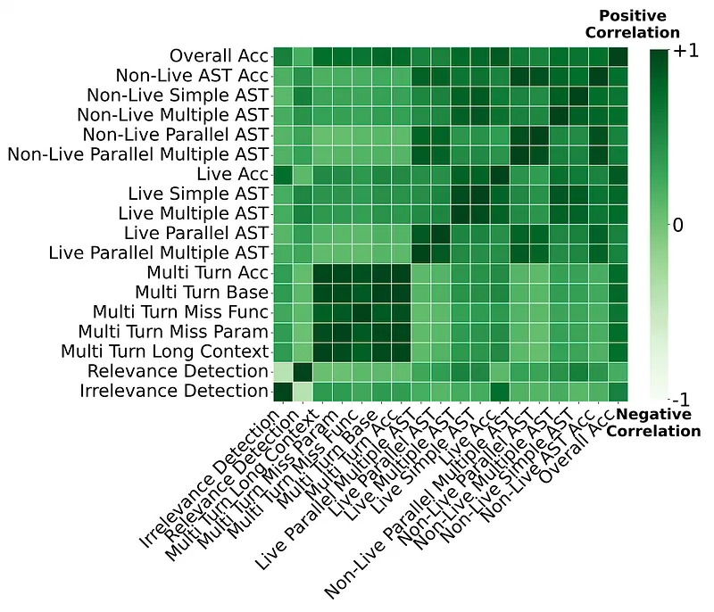
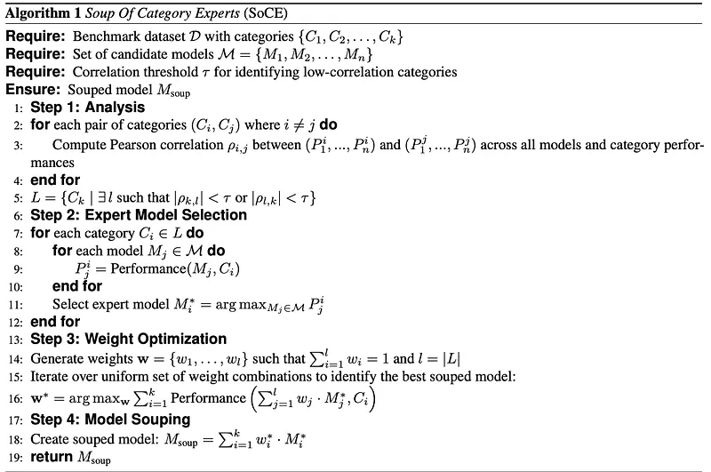
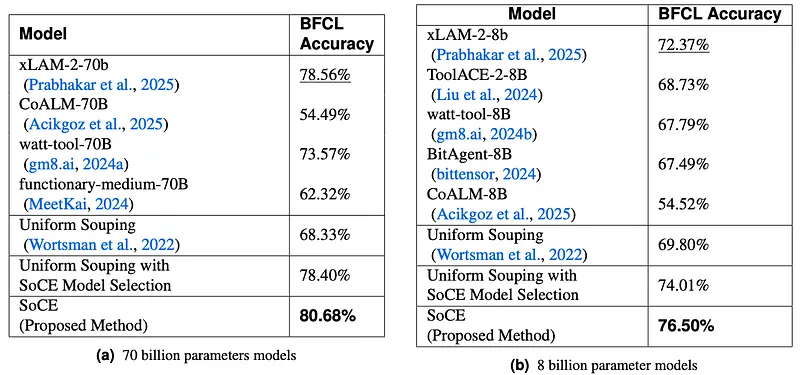
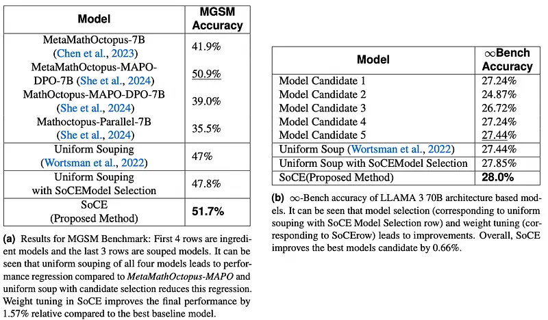

# Papers Explained 499 - Souper Model (Soup Of Category Experts)

Soup Of Category Experts (SoCE) is a principled approach for model souping that utilizes benchmark composition to identify optimal model candidates and applies non-uniform weighted averaging to maximize performance. The method leverages the observation that benchmark categories often exhibit low inter-correlations in model performance.

This page ingests the source article into the wiki and connects it to [[Papers Explained Corpus]], [[Evaluation and Benchmarks]], [[Mixture of Experts]], [[Agentic AI]].

## Source Metadata

- Source file: `raw/2025-11-25_Papers-Explained-499--Souper-Model--Soup-Of-Category-Experts--998a8b33a3e0.md`
- Source title: Papers Explained 499: Souper Model (Soup Of Category Experts)
- Published: 2025-11-25
- Canonical: [https://medium.com/@ritvik19/papers-explained-499-souper-model-soup-of-category-experts-998a8b33a3e0](https://medium.com/@ritvik19/papers-explained-499-souper-model-soup-of-category-experts-998a8b33a3e0)

## Key Ideas

- Soup Of Category Experts (SoCE) is a principled approach for model souping that utilizes benchmark composition to identify optimal model candidates and applies non-uniform weighted averaging to maximize performance.
- The core principle of SoCE is to identify expert models for each weakly-correlated category cluster and aggregate them using optimized weighted averaging to combine complementary expertise. It comprises four key steps:
- correlation analysis to identify weakly-correlated category pairs
- expert model selection for each category based on performance rankings
- weight optimization to maximize aggregate performance

## Notes

Soup Of Category Experts (SoCE) is a principled approach for model souping that utilizes benchmark composition to identify optimal model candidates and applies non-uniform weighted averaging to maximize performance. The method leverages the observation that benchmark categories often exhibit low inter-correlations in model performance. SoCE identifies “expert” models for each weakly-correlated category cluster and combines them using optimized weighted averaging rather than uniform weights.

## Methodology: Soup Of Category Experts

The fundamental insight underlying this approach is that benchmark performance across categories exhibits heterogeneous correlation patterns. Different models demonstrate varying expertise across benchmark categories, with some categories being strongly correlated while others remain weakly correlated or even negatively correlated in terms of cross-model performance. To illustrate this phenomenon, the Berkeley Function Calling Leaderboard (BFCL) is analyzed. The BFCL comprises multiple categories, including multi-turn function calling, irrelevance detection, and function calling across different programming languages (Java, Javascript, etc.).

*Figure: Pearson Correlation of model performance from BFCL leaderboard.*

The heatmap reveals strong positive correlations (dark green regions) between related categories and weak to negative correlations (light green regions) between unrelated categories. Multi-turn categories exhibit high inter-correlation (0.96–0.98), indicating that models proficient in one multi-turn task typically excel across all multi-turn scenarios. A weak correlation (0.07) exists between Multi-turn-base (where the model is evaluated on Multi-turn function calling aspect) and Live Accuracy (where the model is evaluated on real-world function-calling prompts collected by users) categories, suggesting these represent distinct competency Domains.

The core principle of SoCE is to identify expert models for each weakly-correlated category cluster and aggregate them using optimized weighted averaging to combine complementary expertise. It comprises four key steps:

- correlation analysis to identify weakly-correlated category pairs

- expert model selection for each category based on performance rankings

- weight optimization to maximize aggregate performance

- weighted model souping to produce the final combined model.

For weight optimization, a search is performed over a uniform set of weights. Iterations are performed over all combinations in the weight space with the highest weight 0.9 and lowest of 0.1 for each model with a step size of 0.1. A special case of equal weighing of the candidates is also added to compare uniform souping.

## Experiments

Benchmarks:

- Berkeley Function Calling Leaderboard (BFCL): evaluates tool calling and function invocation capabilities of LLMs across multiple categories including multi-turn interactions, irrelevance detection, and cross-language function calling.

- Multilingual Grade School Math Benchmark (MGSM): assesses mathematical reasoning abilities across multiple languages, testing both computational skills and cross-lingual generalization.

- ∞-Bench: evaluates long-context processing capabilities, testing models’ ability to maintain coherence and extract information from extended sequences. a subset containing 3 categories is used.

- FLORES-101: Measures translation quality and multilingual understanding across a diverse set of language pairs. A subset containing translations in 18 languages to and from English is used and referred to as FLORES-36.

Baselines:

- Uniform Souping (All Candidate Models): Baseline approach uniformly averaging all candidate models.

- Uniform Souping with SoCE Model Selection: Uniform weighting applied to strategically selected models based on anti-correlated categories.

- SoCE (Weighted Souping with Model Selection) : Complete proposed methodology with both strategic model candidate selection and optimized weighting.

*Figure: BFCL Performance.*

- For 70B models, SoCE achieved 80.68% accuracy, a 2.7% improvement over the previous best individual model, xLAM-2–70b-fc-r (78.56%). The optimal configuration involved specific weights for xLAM-2–70b-fc-r (0.5), CoALM-70B (0.2), and watt-tool-70B (0.3).

- For 8B models, SoCE achieved 76.50% accuracy, a 5.7% relative improvement over the previous SOTA, xLAM-2–8b-fc-r. Optimal weights were 0.7, 0.2, and 0.1 for xLAM-2–8b-fc-r, ToolACE-2–8B, and watt-tool-8B, respectively.

- On the MGSM Benchmark, SoCE (51.7%) performed better than candidate models and uniform souping, achieving a 1.57% relative improvement compared to the best baseline model (MetaMathOctopus-MAPO-DPO-7B, 50.9%).

- On the ∞-Bench Benchmark, SoCE improved the best candidate model by 0.66% and showed a 2.05% lift compared to the best model candidate, demonstrating the utility of souping even for models trained on similar data mixes.

## Paper

Souper-Model: How Simple Arithmetic Unlocks State-of-the-Art LLM Performance [2511.13254](https://arxiv.org/abs/2511.13254)

## Figures

Figures from the Medium HTML export (`raw/2025-11-25_Papers-Explained-499--Souper-Model--Soup-Of-Category-Experts--998a8b33a3e0.md`); local copies under `wiki/assets/papers-explained-499-souper-model-soup-of-category-experts/` when download succeeded.

| Figure | Caption |
|--------|---------|
|  | Title card: Souper Model (Soup Of Category Experts). |
|  | Pearson Correlation of model performance from BFCL leaderboard. |
|  | For weight optimization, a search is performed over a uniform set of weights. |
|  | BFCL Performance. |
|  | Baselines. |
## Related

- [[Papers Explained Corpus]]
- [[Evaluation and Benchmarks]]
- [[Mixture of Experts]]
- [[Agentic AI]]
- [[Papers Explained 498 - Command A Translate]]
- [[Papers Explained 500 - P1]]

#summary #topic
