# Papers Explained 50 - PaLM

Pathways Language Model (PaLM) is a 540-billion parameter, densely activated, Transformer language model. It is trained on 6144 TPU v4 chips using Pathways, a new ML system that enables highly efficient training across multiple TPU Pods.

This page ingests the source article into the wiki and connects it to [[Papers Explained Corpus]], [[Large Language Models]], [[Model Compression and Efficiency]], [[Reasoning Models]], [[Multilingual Models]], [[Evaluation and Benchmarks]].

## Source Metadata

- Source file: `raw/2023-08-07_Papers-Explained-50--PaLM-480e72fa3fd5.html`
- Source title: Papers Explained 50: PaLM
- Published: 2023-08-07
- Canonical: [https://medium.com/@ritvik19/papers-explained-50-palm-480e72fa3fd5](https://medium.com/@ritvik19/papers-explained-50-palm-480e72fa3fd5)

## Key Ideas

- PaLM 540B achieves breakthrough performance, outperforming the finetuned state of the art on a suite of multi-step reasoning tasks, and outperforming average human performance on the recently released BIG-bench benchmark.
- PaLM uses a standard Transformer model architecture in a decoder-only setup with the following modifications:
- SwiGLU activations (Swish(xW) · xV) are used for the MLP intermediate activations because it has been shown that they significantly increase quality compared to standard ReLU, GeLU, or Swish activations.
- A “parallel” formulation is used in each Transformer block rather than the standard “serialized” formulation. Specifically, the standard formulation can be written as:
- y = x + MLP(LayerNorm(x + Attention(LayerNorm(x)))

## Notes

Pathways Language Model (PaLM) is a 540-billion parameter, densely activated, Transformer language model. It is trained on 6144 TPU v4 chips using Pathways, a new ML system that enables highly efficient training across multiple TPU Pods.

PaLM 540B achieves breakthrough performance, outperforming the finetuned state of the art on a suite of multi-step reasoning tasks, and outperforming average human performance on the recently released BIG-bench benchmark. A significant number of BIG-bench tasks showed discontinuous improvements from model scale, meaning that performance steeply increased as they scaled to their largest model. PaLM also has strong capabilities in multilingual tasks and source code generation.

## Model Architecture

PaLM uses a standard Transformer model architecture in a decoder-only setup with the following modifications:

### SwiGLU Activation

SwiGLU activations (Swish(xW) · xV) are used for the MLP intermediate activations because it has been shown that they significantly increase quality compared to standard ReLU, GeLU, or Swish activations.

### Parallel Layers

A “parallel” formulation is used in each Transformer block rather than the standard “serialized” formulation. Specifically, the standard formulation can be written as:

> y = x + MLP(LayerNorm(x + Attention(LayerNorm(x)))

Whereas the parallel formulation can be written as:

> y = x + MLP(LayerNorm(x)) + Attention(LayerNorm(x))

The parallel formulation results in roughly 15% faster training speed at large scales, since the MLP and Attention input matrix multiplications can be fused. Ablation experiments showed a small quality degradation at 8B scale but no quality degradation at 62B scale, leading to extrapolation that the effect of parallel layers should be quality neutral at the 540B scale.

### Multi-Query Attention

The standard Transformer formulation uses k attention heads, where the input vector for each timestep is linearly projected into “query”, “key”, and “value” tensors of shape [k, h], where h is the attention head size. Here, the key/value projections are shared for each head, i.e. “key” and “value” are projected to [1, h], but “query” is still projected to shape [k, h]. This has a neutral effect on model quality and training speed but results in significant cost savings at autoregressive decoding time. This is because standard multi-headed attention has low efficiency on accelerator hardware during auto-regressive decoding, the key/value tensors are not shared between examples, and only a single token is decoded at a time.

### RoPE Embeddings

RoPE embeddings are used rather than absolute or relative position embeddings since RoPE embeddings have been shown to have better performance on long sequence lengths.

### Shared Input-Output Embeddings

The input and output embedding matrices are shared, which is done frequently (but not universally) in past work.

### No Biases

No biases were used in any of the dense kernels or layer norms. It was found that this resulted in increased training stability for large models.

### Vocabulary

A SentencePiece vocabulary with 256k tokens is used, which was chosen to support a large number of languages in the training corpus without excessive tokenization. The vocabulary is completely lossless and reversible, meaning that whitespace is entirely preserved in the vocabulary (especially important for code), and out-of-vocabulary Unicode characters are split into UTF-8 bytes, with a vocabulary token for each byte. Numbers are always split into individual digit tokens.

### Model Scale Hyperparameters

*Figure: “Model architecture details. We list the number of layers, dmodel, the number of attention heads, and attention head size. The feed-forward size dff is always 4 × dmodel and the attention head size is always 256.”*

## Training Dataset

The PaLM pretraining dataset is comprised of a high-quality corpus of 780 billion tokens, representing a wide range of natural language use cases. The dataset is a mixture of filtered webpages, books, Wikipedia articles, news articles, source code, and social media conversations. This dataset is based on the datasets used to train LaMDA and GLaM.

All three models are trained on exactly one epoch of the data (shuffled identically for all models), and the mixing proportions are chosen to avoid repeating data in any subcomponent.

In addition to natural language data, code is included in the pretraining dataset. The source code in the pretraining dataset is obtained from open-source repositories on GitHub. The files are filtered by the license included in the repository, excluding copyleft licenses. The files are also filtered by filename extension to restrict them to one of 24 common programming languages, including Java, HTML, JavaScript, Python, PHP, C#, XML, C++, and C, resulting in 196GB of source code. Furthermore, duplicates are removed based on the Levenshtein distance between the files since duplicate files are known to be common in source code repositories.

*Figure: “The proportion of data from each source in the training dataset. The multilingual corpus contains text from over 100 languages.”*

## Training Infrastructure

The model is trained using JAX and T5X frameworks on TPU v4 Pods, which consist of TPU chips connected over a data center network. The system used in this case includes 3072 TPU v4 chips attached to 768 hosts, allowing for efficient scaling without pipeline parallelism.

Previous reports on large-scale training used different approaches. Some models were trained on a single TPU system without pipeline parallelism or data center network utilization, while others used a combination of model, data, and pipeline parallelism or pipelining between pods.

There are certain drawbacks of pipelining, such as idle time and higher memory bandwidth requirements. To overcome these limitations PaLM employed a strategy without pipeline parallelism. Each TPU v4 Pod contains a complete copy of the model parameters, partitioned over multiple chips using model parallelism and fully sharded data parallelism. During the forward pass, weights are gathered over the data parallel axis, and selected activation tensors are saved. During the backward pass, the remaining activations are rematerialized, resulting in higher training throughput at larger batch sizes.

To scale training beyond a single TPU v4 Pod, the Pathways system is used. It utilizes a client-server architecture to achieve two-way data parallelism at the pod level. A Python client dispatches half of the training batch to each pod, where forward and backward computations are performed in parallel using within-pod data and model parallelism. The gradients computed on each pod are then transferred to the other pod, and parameter updates are applied in parallel to obtain identical parameters for the next time step.

*Figure: “The Pathways system scales training across two TPU v4 pods using two-way data parallelism at the pod level.”*

The Python client constructs a sharded dataflow program that launches JAX/XLA work on remote servers comprising TPU pods. The program includes components for within-pod computation, cross-pod gradient transfer, and optimizer update. Latency is masked through asynchronous gang-scheduling, and the cost of managing data transfers is amortized through a sharded-dataflow execution model.

There are certain challenges in achieving high training throughput for cross-pod gradient transfers at the scale of 6144 TPU v4 chips. To address this, the Pathways networking stack is carefully designed, breaking down gradient transfers into smaller chunks and routing them through multiple smaller flows over diverse data center network links. With these optimizations, the training throughput is approximately 1.95 times higher compared to a single pod during training, with some performance gaps due to the lack of overlap between the backward pass and cross-pod gradient reduction.

### Training Efficiency

The Hardware FLOPs utilization (HFU) is system-dependent, can vary based on implementation and design choices, and does not consider the ultimate goal of achieving high throughput in tokens per second. Hence a new metric called Model FLOPs Utilization (MFU), is used, which is implementation-independent and allows for a fairer comparison of efficiency between different systems.

*Figure: “Model FLOPs utilization of PaLM and prior large models. PaLM achieves a notably high MFU because of several optimizations across the model, compiler, and parallelism strategy. The corresponding hardware FLOPs utilization of PaLM is 57.8%.”*

## Training Setup

### Weight initialization

> The kernel weights (i.e., everything but the embeddings and layer norm scales) are initialized with “fan-in variance scaling”, i.e., W ∼ N (0, 1/ √ nin), where nin is the input dimension of the kernel. The input embeddings are initialized to E ∼ N (0, 1), since layer normalization is not applied to the embeddings. Because the input and output embedding layers are shared, we scale the pre-softmax output logits by 1/ √ n, where n is the embedding size.

### Optimizer

> The model was trained with the Adafactor optimizer, without factorization. This is effectively equivalent to Adam with “parameter scaling,” which scales the learning rate by the root-mean-square of the parameter matrix. Because the weight initialization is proportional to 1/ √ n, the effect of this is similar to the manual scaling down of Adam learning rate.

### Optimization hyperparameters

> An Adafactor learning rate of 10−2 is used for the first 10,000 steps, which is then decayed at a rate of 1/√k, where k is the step number. β1 = 0.9 and β2 = 1.0 − k − 0.8 are used for training. This has been found to be more stable than the standard β2 = 0.99 when training large language models because poorly estimated second moments over shorter windows can be caused by rare embedding tokens. Global norm gradient clipping with a value of 1.0 is used for all models. During training, a dynamic weight decay of lr² is used, where lr is the current learning rate.

### Loss function

> The model is trained with the standard language modeling loss function, which is the average log probability of all tokens without label smoothing. An auxiliary loss of z loss = 10^−4 · log2 Z is additionally used to encourage the softmax normalizer log(Z) to be close to 0, as it is found to increase the stability of training.

### Sequence length

> A sequence length of 2048 was used for all models. Input examples are concatenated together and then split into sequences of exactly 2048 tokens so that there are no padding tokens, but examples may be split in the middle. Input examples are differentiated from one another with a special [eod] token.

### Batch size

> For all models, the batch size is increased during training. For the largest model, batch size 512 (1M tokens) is used until step 50k, then it is doubled to 1024 (2M tokens) until step 115k, and finally doubled again to 2048 (4M tokens) until training is complete at step 255k. Similar schedules were followed for the smaller models. The reason for using such a batch size schedule is twofold: (1) smaller batch sizes are more sample efficient (i.e., better loss as a function of tokens seen) earlier in training, while larger batch sizes are beneficial later in training due to better gradient estimates, and (2) larger batch sizes result in larger matrix multiplication dimensions, which increases TPU efficiency.

### Bitwise determinism

> The model is fully bitwise reproducible from any checkpoint. In other words, if the model has been trained up to step 17,000 in a single run, and we restart from checkpoint 15,000, then the training framework is guaranteed to produce identical results in both runs from checkpoint 15,000 to 17,000. This is achieved in two ways: (1) a bitwise-deterministic modeling framework provided by JAX+XLA+T5X, and (2) a deterministic dataset pipeline where the shuffled data is written out in a random-access format so the contents of a given training batch is only a function of the step number.

### Dropout

> The model was trained without dropout, although a dropout of 0.1 is used for finetuning in most cases.

### Training Instability

During the training of the largest model, there were frequent spikes in the loss function, even though gradient clipping was implemented. These spikes occurred at irregular intervals, sometimes late in the training process, and were not observed in smaller models. Due to the high cost of training the largest model, a well-defined approach to address these spikes could not be determined.

However, a simple strategy was found to effectively mitigate the issue. The training was restarted from a checkpoint approximately 100 steps before the spike occurred, and around 200–500 data batches were skipped, encompassing the batches seen before and during the spike. By employing this mitigation method, the loss did not spike again at the same point.

The spikes were not believed to be caused by faulty data because experiments were conducted using the surrounding data batches, training from a different checkpoint, and no spikes were observed in those cases. This suggests that spikes only arise due to specific combinations of data batches and the model’s parameter state.

## Evaluation

### English NLP tasks

*Figure: “Results obtained by the PaLM 540B model across 29 NLP benchmarks. For the few-shot results, the number of shots for each task are mentioned in parenthesis.”*

PaLM 540B excels over prior SOTA models, outperforming them in 24 of 29 1-shot tasks and 28 of 29 few-shot tasks. Notably, it achieves a remarkable 10+ point improvement in few-shot Reading Comprehension and NLI tasks. Not confined to size, PaLM 540B even surpasses a comparable model (Megatron-Turing NLG 530B) across all benchmarks, emphasizing the importance of pretraining data, training strategy, and token count.

*Figure: “Average (Avg) Natural Language Generation (NLG) and Natural Language Understanding (NLU) results across 29 benchmarks using 1-shot evaluation. NLG benchmarks include eight tasks — TriviaQA, NQS, WebQS, SQuADv2, LAMBADA, DROP, QuAC and CoQA — while the remaining are NLU benchmarks.”*

### Massive Multitask Language Understanding

*Figure: “Results (5-shot) of Chinchilla and PaLM models on the MMLU benchmark.”*

PaLM 540B improves the average score of MMLU benchmark by ≈ 2 points. and outperforms the Chinchilla on all but one category.

### Finetuning

Fine-tuning experiments for the PaLM model were conducted on the SuperGLUE benchmark. PaLM was fine-tuned using the Adafactor optimizer with a learning rate of 5 × 10−5 and a batch size of 32. Typically, convergence is achieved by PaLM in less than 15K steps of fine-tuning.

*Figure: “Results on SuperGLUE dev set. We compare with T5–11B and ST-MoE-32B. The scores reported are the peak validation scores per task.”*

PaLM obtains competitive close-to-SOTA performance, even against encoder-decoder models which are shown to perform better than decoder only models.

*Figure: “Results on SuperGLUE dev set comparing PaLM-540B few-shot and finetuned.”*

There is a significant gap between few-shot and finetuned results.

*Figure: “Results on SuperGLUE test set (leaderboard). We compare with state-of-the-art span corruption based Encoder-Decoder and the best decoder-only language model.”*

PaLM is competitive with state-of-the-art (encoder-decoder models) and outperforms the decoder-only models by a wide margin.

### BIG-bench

*Figure: “BIG-bench evaluation of PaLM. (left) Evaluation of PaLM, GPT-3, Gopher, and Chinchilla. Previous models have only evaluated on a subset of tasks, so this graph shows aggregate results on the 58 tasks which all three models have evaluated on. (right) Evaluation of PaLM on a larger set of 150 BIG-bench tasks. For each task, the results of its preferred metric are used. The results are normalized by setting the maximum score to 100 and the random chance score to 0 for multiple-choice tasks, so that they are negative valued if the model performs worse than random chance. The normalized results are averaged over all tasks.”*

PaLM significantly outperforms both GPT-3, Gopher, and Chinchilla, and 5-shot PaLM 540B achieves a higher score than the average score of the humans asked to solve the same tasks.

*Figure: “Distribution of score difference in “normalized preferred metric” between PaLM 540B 5-shot and the prior SOTA across a common subset of 58 BIG-bench text tasks. Positive numbers (blue) indicate that PaLM 540B achieves higher than the prior SOTA, while negative numbers (orange) indicate that the prior SOTA is higher than that of PaLM 540B. Prior SOTA includes GPT-3 175B 1-shot, Gopher 5-shot and Chinchilla 5-shot.”*

PaLM 540B 5-shot outperforms the prior SOTA on 44 out of the 58 common tasks.

*Figure: “Distribution of score difference in “normalized preferred metric” between PaLM 540B and the average human performance across all 150 BIG-bench text tasks. Positive numbers (blue) indicate that PaLM 540B achieves higher than the average human performance, while negative numbers (orange) indicate that the average human performance is higher than that of PaLM 540B.”*

PaLM 540B outperforms the average human performance on aggregate, it is still higher than PaLM 540B on 35% of the individual tasks.

### Reasoning

*Figure: “8-shot evaluation of PaLM on GSM8K with chain-of-thought in comparison to prior SOTA.”*

Using 8-shot chain-of-thought prompting in combination with an external calculator, PaLM 540B achieves a performance of 58%, outperforming the prior SOTA of 55% from GPT-3.

*Figure: “We analyzed 150 random GSM8K examples, and found that PaLM 62B makes reasoning errors on 45 of them. These were manually categorized into three general error types. Errors in the “Other” category included hallucinations, repetitive outputs, and symbol mapping errors. This figure shows the proportion of errors for each type that were fixed by scaling to PaLM 540B, which were substantial for all categories.”*

*Figure: “Via chain of thought prompting, PaLM achieves strong performance on a range of arithmetic and commonsense reasoning tasks. PaLM achieves new SOTA on GSM8K, MAWPS, SVAMP, and StrategyQA.”*

Across the 7 reasoning datasets, 8-shot prediction with PaLM 540B+chain-of-thought achieved SOTA accuracy on 4 tasks and close to SOTA on the remaining 3 tasks.

### Code Tasks

*Figure: “Results obtained by the PaLM 540B and PaLM-Coder 540B models across code synthesis and software engineering tasks.”*

PaLM model achieves comparable performance in few-shot evaluations to previously-published results from 50 times less Python code. This could be due to a combination of transfer from other programming languages and from natural language data and that larger models can be more sample efficient than smaller models.

*Figure: “DeepFix success rates as percentages, where “success” means the predicted code compiles and the prediction involves a small edit, under various ways of defining “small” edits. In parentheses, we show the percentage of predictions representing small edits. “Normalized Edit Distance” is computed as LevenshteinDistance(x, y)/ max{len(x), len(y)} for strings x and y. “Lines Changed” counts the total number of line insertions, deletions, and edits. In both cases, we ignore all indentation changes.”*

*Figure: “Translation BLEU scores on traditional WMT language pairs.”*

*Figure: “Translation BLEU scores on non-English centric and extremely-low resource language pairs.”*

### Multilingual Natural Language Generation

*Figure: “ROUGE-2 results in GEM data-to-text and summarization datasets.”*

The 540B finetuned PaLM matches or improves the best SOTA on all English generation tasks, achieving a new finetuning state-of-the art result for 4 out of 6 non english summarization tasks.

### Multilingual Question Answering

*Figure: “Comparison against SOTA on TyDiQA-GoldP validation set (exact match metric)”*

PaLM 540B achieves competitive results despite not training on as much non-English data.

## Paper

PaLM: Scaling Language Modeling with Pathways [2204.02311](https://arxiv.org/abs/2204.02311)

## Figures

Figures from the Medium HTML export (`raw/2023-08-07_Papers-Explained-50--PaLM-480e72fa3fd5.html`); local copies under `wiki/assets/papers-explained-50-palm/` when download succeeded.

| Figure | Caption |
|--------|---------|
| 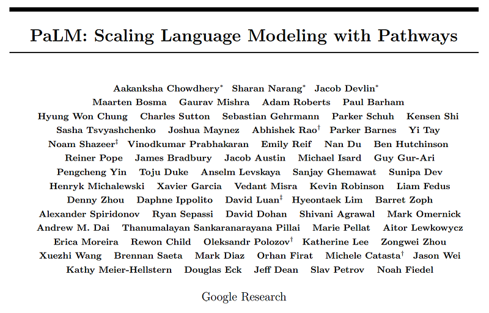 | Title card: PaLM. |
| 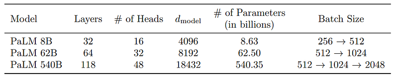 | “Model architecture details. We list the number of layers, dmodel, the number of attention heads, and attention head size. The feed-forward size dff is always 4 × dmodel and the attention head size is always 256.”. |
| 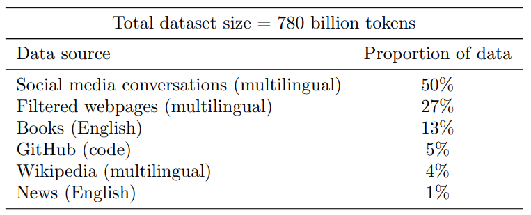 | “The proportion of data from each source in the training dataset. The multilingual corpus contains text from over 100 languages.”. |
| 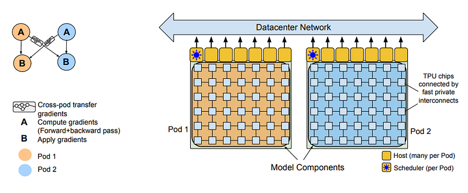 | “The Pathways system scales training across two TPU v4 pods using two-way data parallelism at the pod level.”. |
| 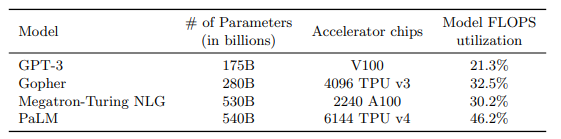 | “Model FLOPs utilization of PaLM and prior large models. PaLM achieves a notably high MFU because of several optimizations across the model, compiler, and parallelism strategy. The corresponding hardware FLOPs utilization of PaLM is 57.8%.”. |
| 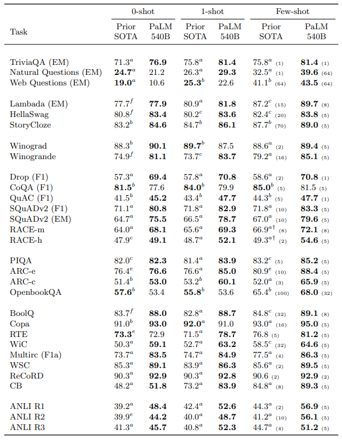 | “Results obtained by the PaLM 540B model across 29 NLP benchmarks. For the few-shot results, the number of shots for each task are mentioned in parenthesis.”. |
| 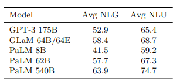 | “Average (Avg) Natural Language Generation (NLG) and Natural Language Understanding (NLU) results across 29 benchmarks using 1-shot evaluation. NLG benchmarks include eight tasks — TriviaQA, NQS, WebQS, SQuADv2, LAMBADA, DROP, QuAC and CoQA — while the remaining are NLU benchmarks.”. |
| 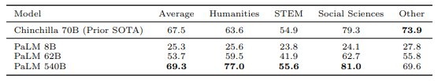 | “Results (5-shot) of Chinchilla and PaLM models on the MMLU benchmark.”. |
| 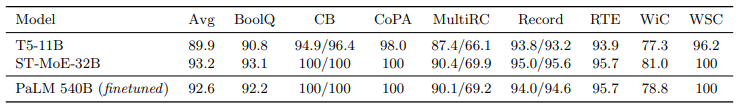 | “Results on SuperGLUE dev set. We compare with T5–11B and ST-MoE-32B. The scores reported are the peak validation scores per task.”. |
| 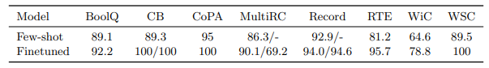 | “Results on SuperGLUE dev set comparing PaLM-540B few-shot and finetuned.”. |
| 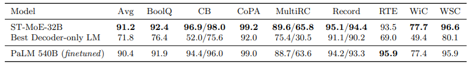 | “Results on SuperGLUE test set (leaderboard). We compare with state-of-the-art span corruption based Encoder-Decoder and the best decoder-only language model.”. |
| 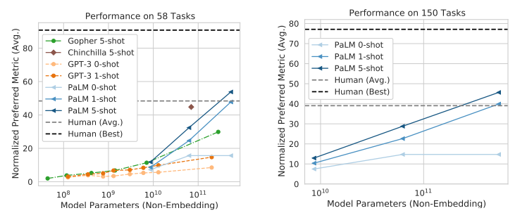 | “BIG-bench evaluation of PaLM. (left) Evaluation of PaLM, GPT-3, Gopher, and Chinchilla. Previous models have only evaluated on a subset of tasks, so this graph shows aggregate results on the 58 tasks which all three models have evaluated on. (right) Evaluation of PaLM on a larger set of 150 BIG-bench tasks. For each task, the results of its preferred metric are used. The results are normalized by setting the maximum score to 100 and the random chance score to 0 for multiple-choice tasks, so that they are negative valued if the model performs worse than random chance. The normalized results are averaged over all tasks.”. |
| 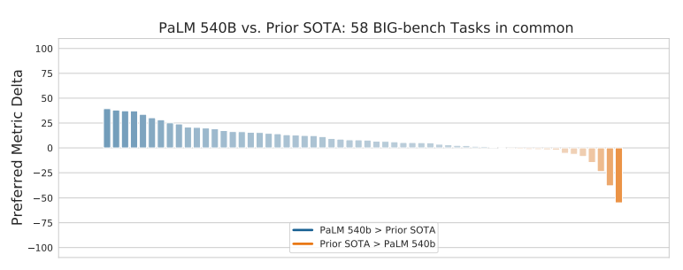 | “Distribution of score difference in “normalized preferred metric” between PaLM 540B 5-shot and the prior SOTA across a common subset of 58 BIG-bench text tasks. Positive numbers (blue) indicate that PaLM 540B achieves higher than the prior SOTA, while negative numbers (orange) indicate that the prior SOTA is higher than that of PaLM 540B. Prior SOTA includes GPT-3 175B 1-shot, Gopher 5-shot and Chinchilla 5-shot.”. |
| 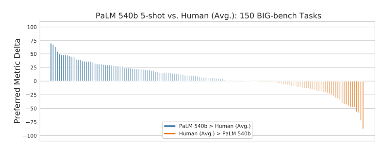 | “Distribution of score difference in “normalized preferred metric” between PaLM 540B and the average human performance across all 150 BIG-bench text tasks. Positive numbers (blue) indicate that PaLM 540B achieves higher than the average human performance, while negative numbers (orange) indicate that the average human performance is higher than that of PaLM 540B.”. |
| 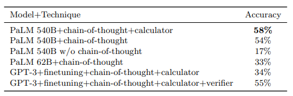 | “8-shot evaluation of PaLM on GSM8K with chain-of-thought in comparison to prior SOTA.”. |
| 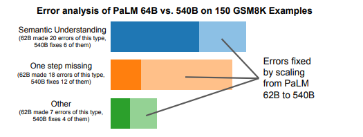 | “We analyzed 150 random GSM8K examples, and found that PaLM 62B makes reasoning errors on 45 of them. These were manually categorized into three general error types. Errors in the “Other” category included hallucinations, repetitive outputs, and symbol mapping errors. This figure shows the proportion of errors for each type that were fixed by scaling to PaLM 540B, which were substantial for all categories.”. |
| 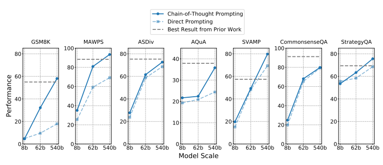 | “Via chain of thought prompting, PaLM achieves strong performance on a range of arithmetic and commonsense reasoning tasks. PaLM achieves new SOTA on GSM8K, MAWPS, SVAMP, and StrategyQA.”. |
| 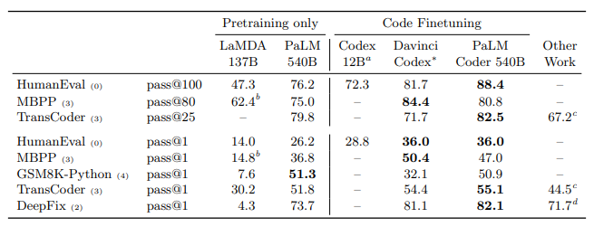 | “Results obtained by the PaLM 540B and PaLM-Coder 540B models across code synthesis and software engineering tasks.”. |
| 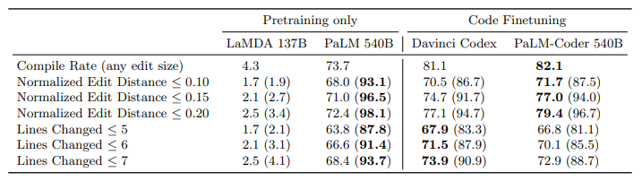 | “DeepFix success rates as percentages, where “success” means the predicted code compiles and the prediction involves a small edit, under various ways of defining “small” edits. In parentheses, we show the percentage of predictions representing small edits. “Normalized Edit Distance” is computed as LevenshteinDistance(x, y)/ max{len(x), len(y)} for strings x and y. “Lines Changed” counts the total number of line insertions, deletions, and edits. In both cases, we ignore all indentation changes.”. |
| 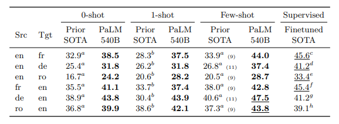 | “Translation BLEU scores on traditional WMT language pairs.”. |
| 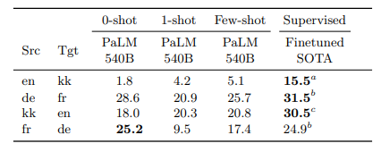 | “Translation BLEU scores on non-English centric and extremely-low resource language pairs.”. |
| 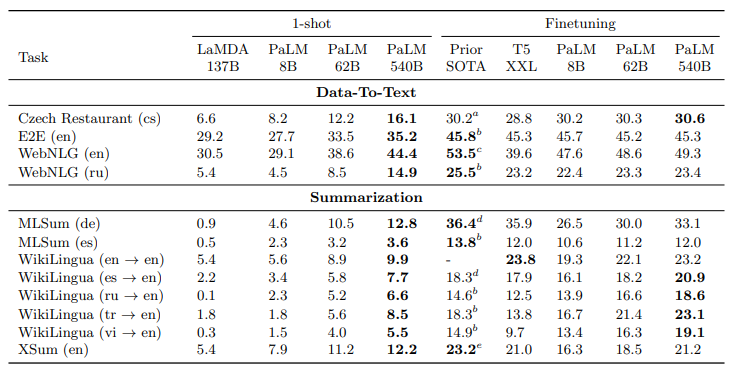 | “ROUGE-2 results in GEM data-to-text and summarization datasets.”. |
| 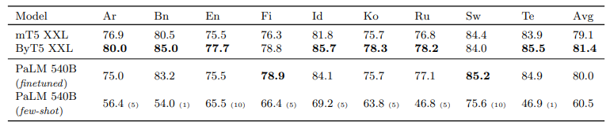 | “Comparison against SOTA on TyDiQA-GoldP validation set (exact match metric)”. |
## Related

- [[Papers Explained Corpus]]
- [[Large Language Models]]
- [[Model Compression and Efficiency]]
- [[Reasoning Models]]
- [[Multilingual Models]]
- [[Evaluation and Benchmarks]]
- [[Papers Explained 49 - Chinchilla]]
- [[Papers Explained 51 - OPT]]

#summary #topic
