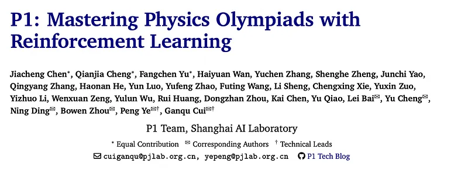
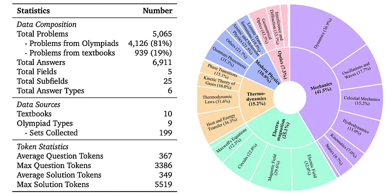
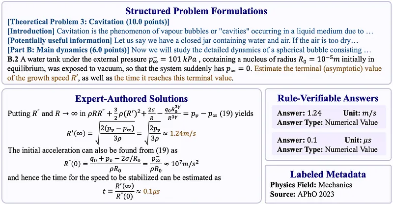
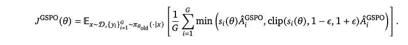
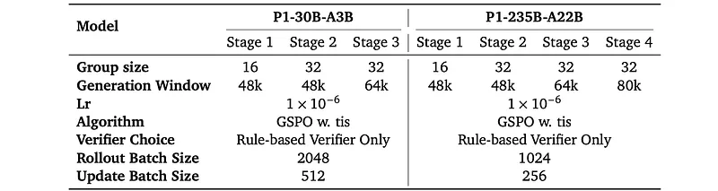
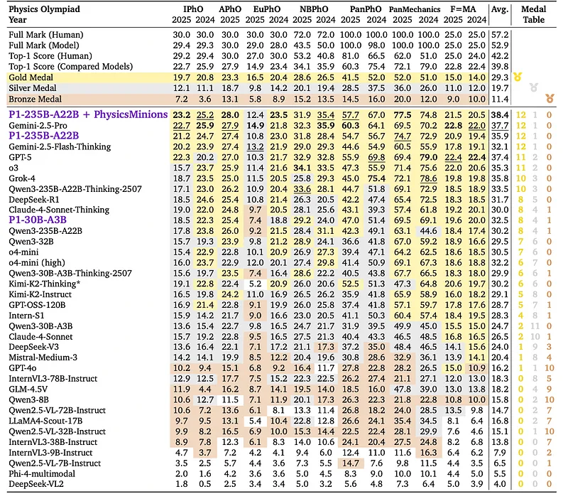

# Papers Explained 500 - P1

P1 is a family of open-source physics reasoning models developed to advance physics research by creating LLMs with exceptional physics reasoning capabilities, particularly in solving Olympiad-level physics problems. These models are trained entirely through reinforcement learning.

This page ingests the source article into the wiki and connects it to [[Papers Explained Corpus]], [[Reasoning Models]], [[Reinforcement Learning Topic]], [[Synthetic Data]], [[Mixture of Experts]], [[Reinforcement Learning]], [[Verifier-Bounded Learning]].

## Source Metadata

- Source file: `raw/2025-11-26_Papers-Explained-500--P1-15520a79edd3.md`
- Source title: Papers Explained 500: P1
- Published: 2025-11-26
- Canonical: [https://medium.com/@ritvik19/papers-explained-500-p1-15520a79edd3](https://medium.com/@ritvik19/papers-explained-500-p1-15520a79edd3)

## Key Ideas

- P1 is a family of open-source physics reasoning models developed to advance physics research by creating LLMs with exceptional physics reasoning capabilities, particularly in solving Olympiad-level physics problems.
- The models are available on [HuggingFace](https://huggingface.co/PRIME-RL).
- A systematically curated dataset of 5,065 Olympiad-level, text-based physics problems is introduced, designed to advance LLMs toward genuine scientific reasoning.
- Each instance in the dataset follows a structured Question–Solution–Answer schema, enriched with metadata, providing a well-organized format to support diverse avenues of research.
- Structured Problem Formulations. Physical problem statements are preserved in their original form whenever possible. For excessively long problems, subdivisions are introduced to respect model context limits while retaining the logical integrity of the task.

## Notes

P1 is a family of open-source physics reasoning models developed to advance physics research by creating LLMs with exceptional physics reasoning capabilities, particularly in solving Olympiad-level physics problems. These models are trained entirely through reinforcement learning.

The models are available on [HuggingFace](https://huggingface.co/PRIME-RL).

## Physics Dataset

A systematically curated dataset of 5,065 Olympiad-level, text-based physics problems is introduced, designed to advance LLMs toward genuine scientific reasoning. The dataset combines 4,126 problems from physics Olympiads with 939 from competition textbooks, spanning 5 fields and 25 subfields. Following PHYSICS and HiPhO, the data construction pipeline is further refined by integrating the strengths of human and model annotation, achieving finer-grained extraction and higher data quality.

Each instance in the dataset follows a structured Question–Solution–Answer schema, enriched with metadata, providing a well-organized format to support diverse avenues of research.

- Structured Problem Formulations. Physical problem statements are preserved in their original form whenever possible. For excessively long problems, subdivisions are introduced to respect model context limits while retaining the logical integrity of the task.

- Expert-Authored Solutions. Solution processes are authored by human physics experts, providing authentic reasoning trajectories.

- Rule-Verifiable Answers. Verifiable final answers supply the unambiguous correctness criteria required for RLVR. Annotations on type, unit, and scoring points support reliable validation and mirror the weighted criteria of human grading.

- Labeled Metadata. Each instance is tagged with physics field and source, enabling analysis of domain coverage, guiding data selection strategies, and providing a basis for studying the impact of provenance on training dynamics.

Two complementary sources are assembled. The first comprises ten major physics Olympiads (up to 2023) including APhO, IPhO and others spanning regional to international tiers and capturing a naturally graded difficulty spectrum. The second consists of ten authoritative competition textbooks, offering systematically organized examples and exercises with expert-authored solutions.

- PDF-to-Markdown Conversion. Source materials in PDF format are parsed into Markdown using OCR.

- Questions and Solutions Parsing. Extraction strategies are tailored to the two source types. For textbooks, model-assisted parsing leverages structural cues (e.g., chapter boundaries and numbering) to align exercises with their solutions. Olympiad problems, characterized by lengthy statements and multiple sub-questions, are manually restructured by experts to separate shared background from sub-questions, preserving both readability and fidelity.

- Answer Annotation. Answers are automatically extracted by models and decomposed into structured lists, allowing each sub-answer to be individually validated against model outputs. Units are separated into explicit fields to support standardized, rule-based scoring.

- LanguageNormalization. Problems originating in Chinese (e.g., CPhO) are translated into English with Claude to maintain a consistent monolingual corpus.

## Approach

GSPO is used as it elevates optimization from the token level to the sequence level, employing length-normalized sequence likelihood importance ratios:

where |𝑦𝑖|denotes the sequence length, and the 1/|𝑦𝑖|term implements length normalization to reduce variance. The corresponding advantage function is computed at the sequence level:

with the objective function:

Following the Correct-or-Not design in RLVR methods, a binary reward scheme based on answer correctness is employed. However, physics problems often involve multiple sub-questions or require multiple final results (e.g., solving for both 𝑎 and 𝑏). To account for this structure, a test-case-style reward aggregation similar to program evaluation is adopted, defining the final reward as:

where 𝑁 is the number of required sub-answers in the problem, and 𝑟𝑖 denotes the correctness indicator for the 𝑖-th sub-answer.

Prompts are designed to enforce a multi-box output format. The model is required to place each sub-answer sequentially inside separate $\boxed{ }$ environments in order to simplify the answer extraction.

```text
Please answer the problem adhering to the following rules:
1. Please use LaTeX format to represent the variables and formulas used in the solution process and results.
2. Please put the final answer(s) in \boxed{}, note that the unit of the answer should not be included in \boxed{}.
3. If the problem requires multiple answers, list them in order, each in a separate \boxed{}.
```

A hybrid verification framework integrates both rule-based and model-based components.

- The rule-based verifier combines symbolic computation with rule-based checks using SymPy and math-verify heuristics. This allows robust equivalence testing of algebraic expressions, including commutativity, factorization, and simplification.

- Complementing the rule-based system, the model-based verifier follows the XVerify paradigm and employs a large language model (Qwen3–30B-A3B-Instruct-2507) as an answer-level verifier. Given the problem statement, the extracted model prediction, and the ground truth, the verifier outputs a binary judgment (correct or incorrect), improving robustness against cases that are challenging for purely symbolic methods.

### Adaptive Learnability Adjustment

To ensure continuous learnability throughout the training process, two complementary strategies are used:

- Preliminary Pass Rate Filtering: Rollouts are performed on the training dataset using the Qwen3–30B-A3B-Thinking model under a pass@88 setting. Tasks that are either too easy (pass rate > 0.7) or too difficult (pass rate= 0) are excluded.

- Adaptive Exploration Space Expansion: The exploration space is dynamically expanded in line with the model’s evolving capability, thereby sustaining learnability:

- Group size expansion

- Generation window expansion

*Figure: Configuration of different phrases in P1 training.*

### Training Stabilization Mechanism

Recent studies have noticed that the train-inference engine difference is a key cause of instability in training.

where 𝜋𝑟𝑜𝑙𝑙𝑜𝑢𝑡𝜃 denote the policy used to generate trajectories during rollout, and 𝜋𝑡𝑟𝑎𝑖𝑛𝜃 denote the policy evaluated during gradient computation.

To mitigate this mismatch and stabilize training, Truncated Importance Sampling (TIS) is used which applies importance weighting to rebalance gradients computed under the training policy 𝜋𝑡𝑟𝑎𝑖𝑛𝜃 using trajectories sampled from the rollout policy 𝜋𝑟𝑜𝑙𝑙𝑜𝑢𝑡𝜃.

where 𝐶 is a truncation hyperparameter that controls the variance of the importance weights. The truncation operator min(·,𝐶)prevents excessively large weights that could destabilize training, while still correcting for the distributional shift.

### Agentic Augmentation

During inference, the test-time effort is scaled up by using a multi-agent framework called PhysicsMinions, which is designed for complex physics reasoning. PhysicsMinions includes three coevolutionary studios: the Visual Studio, the Logic Studio, and the Review Studio. For multimodal problems with diagrams or plots, the Visual Studio extracts structured information from the input and passes it to the Logic Studio. In the Logic Studio, a solver generates an initial solution, which is refined by an introspector. The Review Studio then performs dual-stage verification: the Physics-Verifier checks physical consistency, and the General-Verifier inspects logic, reasoning, and calculations. If verification fails, a bug report is sent back to the Logic Studio for revision. This cycle continues until the solution passes a predefined number of consecutive verifications (CV), set to 2 by default. If the solution fails CV times consecutively, a new candidate solution is generated. Because P1 models are text-only LLMs, the Visual Studio is disabled, and P1 models are used for the solver in the Logic Studio and the dual verifiers in the Review Studio.

## Evaluation

A new benchmark, HiPhO, is constructed, covering 13 recent high school physics Olympiads (2024–2025) from international to regional levels, spanning 7 major types (IPhO, APhO, EuPhO, NBPhO, PanPhO, PanMechanics, F=MA).

*Figure: Evaluation results on the HiPhO benchmark.*

Excellent Single Model Performance (P1–235B-A22B):

- P1–235B-A22B ranked at the top of the medal table on the HiPhO benchmark, earning 12 gold and 1 silver medal, performing comparably to leading closed-source models like Gemini-2.5-Pro and Gemini-2.5-Flash-Thinking. (Refer to Table 3: Evaluation results on the HiPhO benchmark).

- It surpassed major closed-source models such as GPT-5 (11 gold), Grok-4 (10 gold), and Claude-4-Sonnet-Thinking (8 gold).

- P1–235B-A22B scored 21.2 / 30 at the latest International Physics Olympiad (IPhO 2025), ranking Top 3 globally, and became the first and only open-source model to achieve gold-medal performance on IPhO 2025.

Strong Performance-to-Scale Efficiency (P1–30B-A3B):

- The smaller P1–30B-A3B model earned 8 gold, 4 silver, and 1 bronze medal, ranking third among existing open-source models and surpassing comparable models like Qwen3–32B and Qwen3–30B-A3B-Thinking-2507, demonstrating strong performance relative to its scale.

Significant Agentic Boost with PhysicsMinions:

- The combination of P1–235B-A22B with the PhysicsMinions system improved P1’s average performance from 35.9 to 38.4, achieving the overall Top-1 position across all models and outperforming leading closed-source models such as Gemini-2.5-Pro (37.7) and GPT-5 (37.4).

- This joint configuration achieved new state-of-the-art results across four physics Olympiads: IPhO 2025 (23.2 vs. 22.7), APhO 2025 (28.0 vs. 27.9), EuPhO 2024 (23.5 vs. 23.4), and PanMechanics 2025 (77.5 vs. 72.1).

*Figure: Performance comparison between P1–235B-A22B and top-1 human medalist on CPhO 2025.*

Gold-Level Performance on CPhO 2025, Exceeding Human Elite:

- P1–235B-A22B obtained a score of 227 / 320 on the theoretical exam of the 2025 Chinese Physics Olympiad (CPhO 2025), assessed by human experts, which substantially exceeded the top-1 human medalist’s score of 199.

## Paper

P1: Mastering Physics Olympiads with Reinforcement Learning [2511.13612](https://arxiv.org/abs/2511.13612)

## Figures

Figures from the Medium HTML export (`raw/2025-11-26_Papers-Explained-500--P1-15520a79edd3.md`); local copies under `wiki/assets/papers-explained-500-p1/` when download succeeded.

| Figure | Caption |
|--------|---------|
|  | Title card: P1. |
|  | Each instance in the dataset follows a structured Question–Solution–Answer schema, enriched with metadata, providing a well-organized... |
|  | Two complementary sources are assembled. |
|  | GSPO is used as it elevates optimization from the token level to the sequence level, employing length-normalized sequence likelihood importance ratios. |
|  | GSPO is used as it elevates optimization from the token level to the sequence level, employing length-normalized sequence likelihood importance ratios. |
|  | with the objective function. |
|  | with the objective function. |
|  | Following the Correct-or-Not design in RLVR methods, a binary reward scheme based on answer correctness is employed. |
|  | Configuration of different phrases in P1 training. |
|  | Recent studies have noticed that the train-inference engine difference is a key cause of instability in training. |
|  | with the objective function:: where 𝐶 is a truncation hyperparameter that controls the variance of the importance weights. |
|  | Evaluation results on the HiPhO benchmark. |
|  | Performance comparison between P1–235B-A22B and top-1 human medalist on CPhO 2025. |
## Related

- [[Papers Explained Corpus]]
- [[Reasoning Models]]
- [[Reinforcement Learning Topic]]
- [[Synthetic Data]]
- [[Mixture of Experts]]
- [[Reinforcement Learning]]
- [[Verifier-Bounded Learning]]
- [[Papers Explained 499 - Souper Model (Soup Of Category Experts)]]
- [[Papers Explained 501 - Reasoning Gym]]

#summary #topic
