# Papers Explained 501 - Reasoning Gym

Reasoning Gym (RG) is a library of reasoning environments for reinforcement learning with verifiable rewards. It provides over 100 data generators and verifiers spanning multiple domains including algebra, arithmetic, computation, cognition, geometry, graph theory, logic, and various common games.

This page ingests the source article into the wiki and connects it to [[Papers Explained Corpus]], [[Reasoning Models]], [[Reinforcement Learning Topic]], [[Synthetic Data]], [[Evaluation and Benchmarks]], [[Reinforcement Learning]], [[Verifier-Bounded Learning]].

## Source Metadata

- Source file: `raw/2025-12-15_Papers-Explained-501--Reasoning-Gym-3202ebfddeec.html`
- Source title: Papers Explained 501: Reasoning Gym
- Published: 2025-12-15
- Canonical: [https://medium.com/@ritvik19/papers-explained-501-reasoning-gym-3202ebfddeec](https://medium.com/@ritvik19/papers-explained-501-reasoning-gym-3202ebfddeec)

## Key Ideas

- Reasoning Gym (RG) is a library of reasoning environments for reinforcement learning with verifiable rewards.
- It eliminates memorization concerns by ensuring that no two generated instances are identical.
- It enables dynamic curriculum learning, where task difficulty can be adjusted based on model performance.
- It provides unlimited training data, removing the bottleneck imposed by fixed dataset sizes.
- It offers precise experimental control, allowing researchers to isolate specific reasoning capabilities and study their development systematically.

## Notes

Reasoning Gym (RG) is a library of reasoning environments for reinforcement learning with verifiable rewards. It provides over 100 data generators and verifiers spanning multiple domains including algebra, arithmetic, computation, cognition, geometry, graph theory, logic, and various common games. The procedural nature of RG addresses several critical limitations of existing approaches:

- It eliminates memorization concerns by ensuring that no two generated instances are identical.

- It enables dynamic curriculum learning, where task difficulty can be adjusted based on model performance.

- It provides unlimited training data, removing the bottleneck imposed by fixed dataset sizes.

- It offers precise experimental control, allowing researchers to isolate specific reasoning capabilities and study their development systematically.

The project is available at [GitHub](https://github.com/open-thought/reasoning-gym/).

The core design principles that underpin RG are:

- (P1) Algorithmic Verifiability. Every task admits automatic verification and requires no human judgment. This enables reliable RLVR training while eliminating subjective evaluation.

- (P2) Large Solution Spaces. Tasks are designed with expansive solution spaces, rewarding generalizable strategies above overfitting and mitigating reward hacking.

- (P3) Parametric Difficulty Control. Configurable parameters systematically control problem characteristics, enabling dynamic curricula via precise difficulty adjustment.

To probe reasoning competence across a broad spectrum of skills, RG’s generators are partitioned into several high-level categories that mirror the abstractions humans rely on when solving problems:

- Mathematical domains: algebra, arithmetic, geometry

- Algorithmic thinking: search, optimization, procedures

- Logical reasoning: formal proofs, inference rules

- Pattern recognition: sequences, visual analogies

- Constraint satisfaction: games, puzzles, planning

*Figure: Overview of Reasoning Gym Datasets by Category.*

Within each category, tasks are instantiated not as fixed question-answer pairs, but as generative algorithms whose parameters continuously modulate problem characteristics:

- Difficulty Parameters directly control complexity (node counts for graphs, polynomial degrees for algebra, word lengths for language tasks).

- Structural Parameters determine fundamental problem properties (dimensionality, constraint types, proof depth).

- Stylistic Parameters vary presentation without affecting difficulty (variable names, number formats, problem framing).

## Zero-shot performance of LLMs

A comprehensive evaluation of state-of-the-art language models on RG tasks reveals challenges that persist even for frontier models.

*Figure: Per task accuracy ion easy and hard settings.*

- Top reasoning models (e.g., o3-mini, DeepSeek-R1) achieve consistently high accuracy across the majority of easy tasks, whereas leading non-reasoning baselines (e.g., Llama 4 Maverick, Claude 3.5 Sonnet) still underperform on a substantial fraction of the benchmark.

- Performance quickly drops beyond basic skills, and even the top model (o3-mini) falters on long-horizon puzzles such as rush_hour, rubiks_cube and rotten_oranges, underscoring the benchmark’s value for probing advanced reasoning.

- There is a clear hierarchy among different model classes, with reasoning-optimized systems demonstrating substantial advantages over general-purpose alternatives.

*Figure: Frontier models struggle with challenging RG configurations.*

*Figure: Model and task difficulty comparison.*

- Models explicitly trained for reasoning, including o3-mini (63.5%), DeepSeek-R1 (59.5%), and Grok 3 Mini (55.1%), form a distinct leading group. In contrast, strong general-purpose systems like Llama 4 Maverick (41.5%), Claude 3.5 Sonnet (40.3%), and Gemma 3 27B (20.3%) achieve substantially lower performance.

- Performance degradation is commonly observed uniformly across domains and model families. For o3-mini, the steepest declines occur in code (−71.9%), graphs (−33.8%), geometry (−33.1%), and algorithms (−25.6%).

- DeepSeek-R1 shows a similar pattern, with drops of−61.8%,−29.6%, −11.8%, and−27.9% on the same categories, respectively.

- Overall, most model–task pairs exhibit notable performance declines as difficulty increases.

## Skill Transfer and Generalization

### Intra-Domain Transfer

To investigate whether RLVR training on a subset of tasks within a reasoning domain improves performance on held-out tasks from the same domain, for each major reasoning category in RG, Qwen2.5–3B-Instruct was trained using GRPO on a composite of tasks from that category. Then, performance was evaluated on a held-out task from the same domain. Each experiment involved three independent runs on identical evaluation sets of 50 problems.

*Figure: Rewards of Intra-Domain Generalization RL.*

- Most categories exhibit rapid initial improvement, reflecting both format learning and genuine skill acquisition.

- The exception is arithmetic, where the base model already demonstrates strong competency, likely due to extensive mathematical training in its supervised fine-tuning phase.

*Figure: Intra-Domain Generalization.*

- There is a consistent intra-domain transfer across all reasoning categories.

- The improvements range from modest gains in domains where the base model already shows competency (arithmetic: +6.3%, cognition +2.0%) to larger improvements in challenging domains (algebra: +11.7%, algorithmic +7.4%).

- Particularly striking is the Games category, where the base model achieves zero accuracy but develops measurable capability (3.3%) after RLVR training.

### Cross-Domain Transfer

More surprising than intra-domain transfer is the possibility that reasoning skills learned in one domain might benefit performance in entirely different domains. This would suggest that RLVR instills general reasoning capabilities that transcend specific problem types. Separate instances of Qwen2.5–3B-Instruct are trained on individual RG categories, then evaluated on held-out tasks from different domains.

*Figure: Rewards of Cross-Domain Generalization RL.*

- While most categories show sustained improvement throughout training, the Games category plateaus early, suggesting fundamental challenges in learning visual-spatial reasoning from text representations.

*Figure: Cross-Domain Generalization.*

- Algorithmic training transfers broadly: Models trained on algorithmic tasks show substantial improvements in algebra (+29.1%) and geometry (+22.3%), suggesting that procedural reasoning skills generalize across mathematical domains.

- Logic training enhances pattern recognition: Training on logic tasks improves performance in cognition (+13.3%) and graph reasoning (+9.1%), indicating shared underlying reasoning mechanisms.

- Games training shows selective transfer: Despite poor in-domain performance, games-trained models improve on algebra (+21.8%) and cognition (+13.1%), suggesting that constraint satisfaction skills transfer to other domains.

### Transfer to External Benchmarks

To investigate whether skills developed through training on procedurally generated tasks transfer to established reasoning benchmarks models are trained on algorithmic and mathematical RG categories, and then evaluated on GSM8K, MATH and Big-Bench Hard for evaluating mathematical and logical reasoning; and MMLU-Pro for advanced knowledge across academic and professional domains.

The RG-Math model is Qwen2.5–3B-Instruct trained for 800 GRPO steps on a composite of algebra, arithmetic, and geometry tasks from RG. The RG-Algorithmic model is the same checkpoint from previous section.

*Figure: External Generalization on GSM8K, MATH, and Big-Bench Hard.*

- The RG-Math model achieves substantial gains on MATH (+9.7%) and Big-Bench Hard (+7.7%), and more marginal gains on GSM8K (+0.5%).

*Figure: External generalization on tasks from MMLU-Pro.*

- Both the RG-Math and RG-Algorithmic models significantly outperform their respective baselines over several tasks from MMLU-Pro

## Curriculum RLVR

Qwen2.5–3B-Instruct is trained using GRPO under two conditions:

- curriculum learning, starting with the easiest level and progressively increasing the difficulty when performance exceeds 70% over 20 training steps

- fixed difficulty, sampling uniformly from all difficulty levels.

Both models are trained for a single epoch. For each environment, the curriculum and non curriculum models are evaluated on 50 holdout examples from each difficulty level.

*Figure: Rewards for the Curriculum Learning experiments.*

- For the Spell Backward environment, increases in difficulty level are followed by a sharp drop in reward. The curriculum model’s lower terminal reward reflects its exclusive exposure to maximum difficulty examples, while the non-curriculum model samples across the full difficulty distribution.

- In the Mini Sudoku experiment the performance rises rapidly at the beginning and the model accelerates through the difficulty levels, reaching the highest level by step 72.

- Despite not surpassing the first difficulty level, in the Count Primes environment the curriculum approach decisively outperforms its counterpart.

*Figure: Curriculum learning.*

- The curriculum-trained models achieve superior performance to their non-curriculum equivalents in all environments and difficulty levels.

- There are instances in each environment where the curriculum model outperforms the non-curriculum model by significant margins e.g. +40.67% for word length of 4 on Spell Backwards, +13.33% for 8−10 empty cells on Mini Sudoku and +26.27% for number range 100−500 in Count Primes.

## Paper

REASONING GYM: Reasoning Environments for Reinforcement Learning with Verifiable Rewards [2505.24760](https://arxiv.org/abs/2505.24760)

## Figures

Figures from the Medium HTML export (`raw/2025-12-15_Papers-Explained-501--Reasoning-Gym-3202ebfddeec.html`); local copies under `wiki/assets/papers-explained-501-reasoning-gym/` when download succeeded.

| Figure | Caption |
|--------|---------|
| 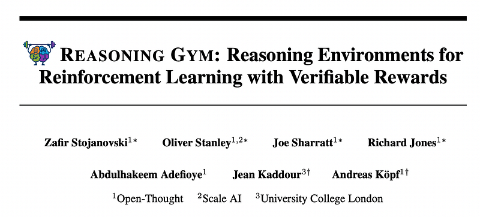 | Title card: Reasoning Gym. |
| 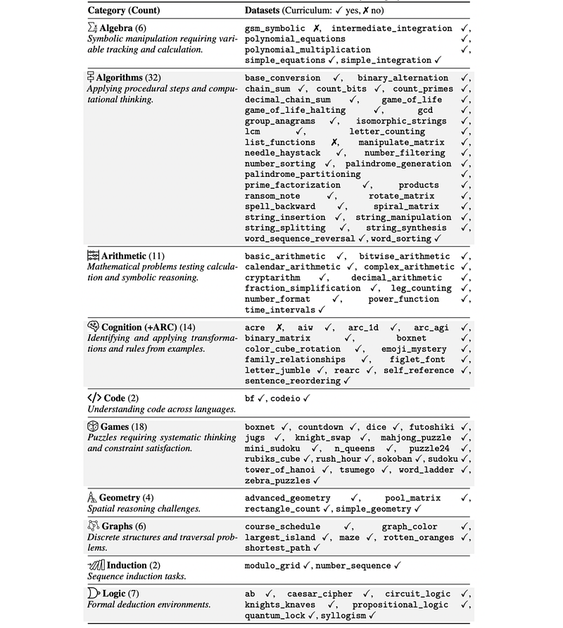 | Overview of Reasoning Gym Datasets by Category. |
| 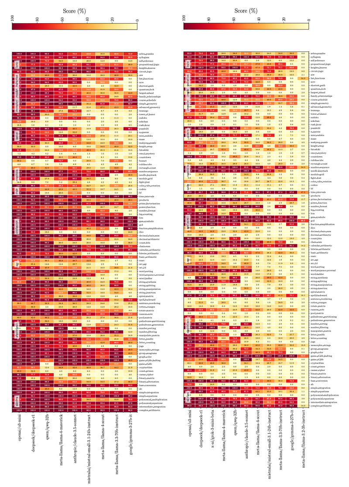 | Per task accuracy ion easy and hard settings. |
| 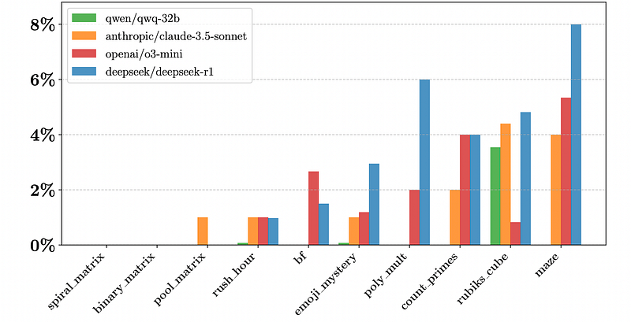 | Frontier models struggle with challenging RG configurations. |
| 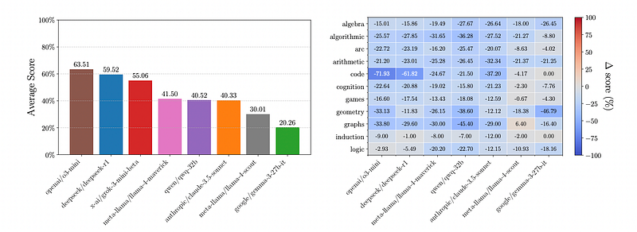 | Model and task difficulty comparison. |
| 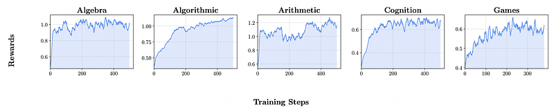 | Rewards of Intra-Domain Generalization RL. |
|  | Intra-Domain Generalization. |
| 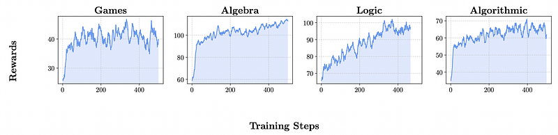 | Rewards of Cross-Domain Generalization RL. |
| 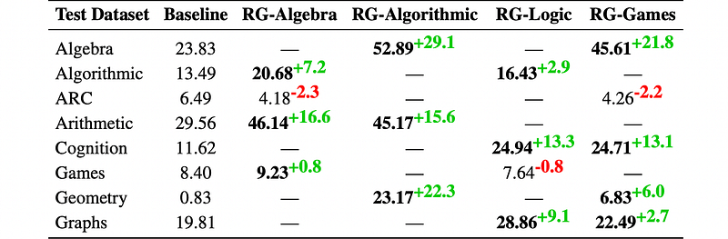 | Cross-Domain Generalization. |
| 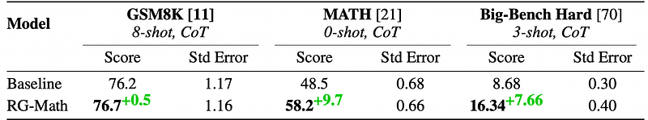 | External Generalization on GSM8K, MATH, and Big-Bench Hard. |
| 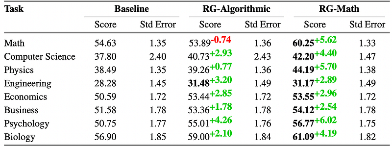 | External generalization on tasks from MMLU-Pro. |
| 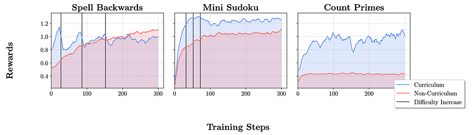 | Rewards for the Curriculum Learning experiments. |
| 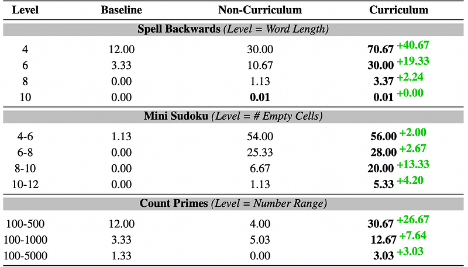 | Curriculum learning. |
## Related

- [[Papers Explained Corpus]]
- [[Reasoning Models]]
- [[Reinforcement Learning Topic]]
- [[Synthetic Data]]
- [[Evaluation and Benchmarks]]
- [[Reinforcement Learning]]
- [[Verifier-Bounded Learning]]
- [[Papers Explained 500 - P1]]
- [[Papers Explained - EvolLM]]

#summary #topic
