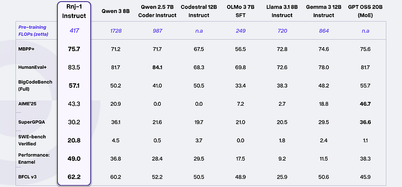
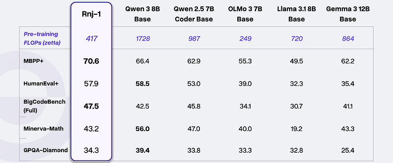
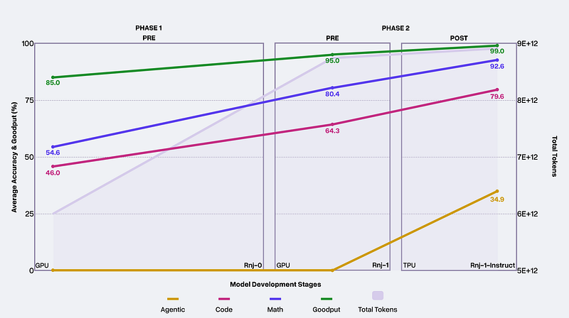

# Papers Explained 505 - Rnj-1

Rnj-1, named in homage to Ramanujan and pronounced “range-1,” is a pair of base and instruction-tuned large language models developed by Essential. These models are part of the open-source AI movement and aim to advance AI technologies equitably.

This page ingests the source article into the wiki and connects it to [[Papers Explained Corpus]], [[Large Language Models]].

## Source Metadata

- Source file: `raw/2025-12-19_Papers-Explained-505--Rnj-1-43be78ab4b40.html`
- Source title: Papers Explained 505: Rnj-1
- Published: 2025-12-19
- Canonical: [https://medium.com/@ritvik19/papers-explained-505-rnj-1-43be78ab4b40](https://medium.com/@ritvik19/papers-explained-505-rnj-1-43be78ab4b40)

## Key Ideas

- Architecture: Follows the open-source Gemma 3 architecture
- Context Extension: Uses global self-attention and YaRN to extend the context to 32k
- Focus: Chose pre-training over post-training, believing in the importance of strong pre-training for downstream success
- Goals: Set four higher-level goals by the end of 2025:
- Uncover signs of life or failure on research bets

## Notes

Rnj-1, named in homage to Ramanujan and pronounced “range-1,” is a pair of base and instruction-tuned large language models developed by Essential. These models are part of the open-source AI movement and aim to advance AI technologies equitably.

### Model Architecture

- Size: 8B parameters

- Architecture: Follows the open-source Gemma 3 architecture

- Context Extension: Uses global self-attention and YaRN to extend the context to 32k

### Initial Decisions

Focus: Chose pre-training over post-training, believing in the importance of strong pre-training for downstream success

Goals: Set four higher-level goals by the end of 2025:

- Uncover signs of life or failure on research bets

- Set an unimpeachable standard for experimental rigor and engineering

- Build a model useful for their own work

- Contribute substantially to the open-source AI ecosystem

Methods: Developed new approaches for clustering and mixing data distributions, improved token efficiency with Muon optimizer, and modeled program execution at scale

Pre-training: Focused on latent mathematical and programming abilities and scientific knowledge

Post-training: Inspired by long context mid-training with YaRN, Nemotron, and simple agentic environments

### Code Generation

- Tasks: HumanEval+, MBPP+, BigCodeBench

- Performance: Competes with the strongest open weight models of similar size, sometimes outperforming larger models like GPT OSS 20B

### Agentic and Tool Use

- Agentic Coding: Dominates on SWE-bench, indicating strong software engineering capabilities

- Tool Use: Surpasses comparable models in tool use performance as measured by the Berkeley Function Calling Leaderboard (BFCL)

- Code Efficiency: Can use a profiler to iteratively improve code efficiency, outperforming strong baselines on Enamel

### Mathematical Problem Solving and Scientific Reasoning

- Mathematical Abilities: On par with the strongest open weight models on AIME’25 and Minerva-MATH

- Scientific Reasoning: Performs well on GPQA-Diamond, a task with questions in biology, physics, and chemistry

### Quantization & Inference Performance

- Robustness: Retains model quality from BF16 to FP8 to NVFP4

- Token Throughput: Boosts significantly in prompt-heavy workloads, computed on NVIDIA B200 GPUs with KV Cache dtype set to FP8 and a batch size of 128

## Paper

[Announcing Rnj-1: Building Instruments of Intelligence](https://www.essential.ai/research/rnj-1)

## Figures

Figures from the Medium HTML export (`raw/2025-12-19_Papers-Explained-505--Rnj-1-43be78ab4b40.html`); local copies under `wiki/assets/papers-explained-505-rnj-1/` when download succeeded.

| Figure | Caption |
|--------|---------|
|  | Title card: Rnj-1. |
|  | Post-training: Inspired by long context mid-training with YaRN, Nemotron, and simple agentic environments. |
|  | Post-training: Inspired by long context mid-training with YaRN, Nemotron, and simple agentic environments. |
|  | Post-training: Inspired by long context mid-training with YaRN, Nemotron, and simple agentic environments. |
## Related

- [[Papers Explained Corpus]]
- [[Large Language Models]]
- [[Papers Explained 504 - Who Reasons in LLMs]]
- [[Papers Explained 506 - Nemotron 3 Nano]]

#summary #topic
