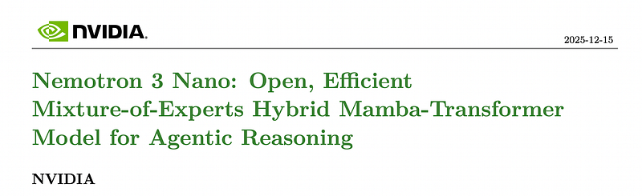
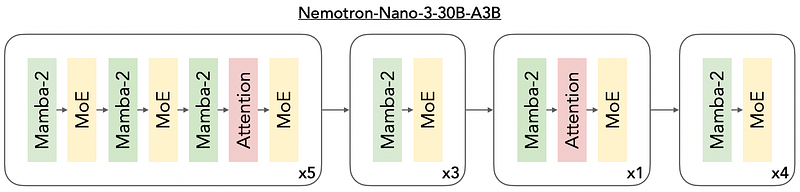
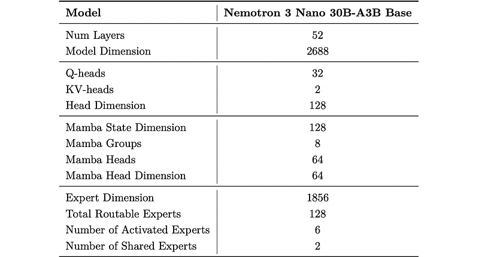
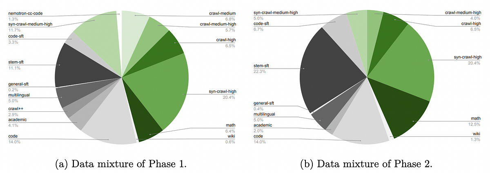
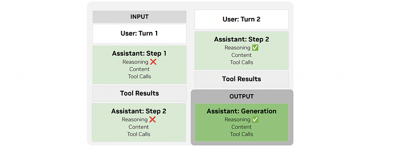
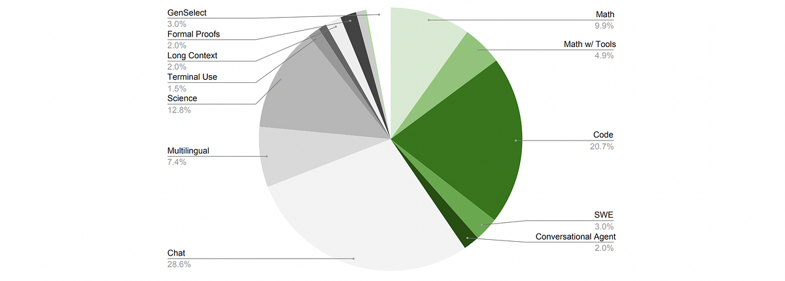
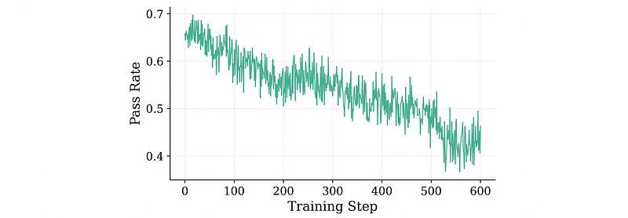
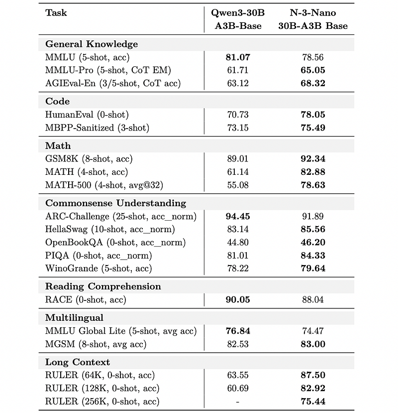
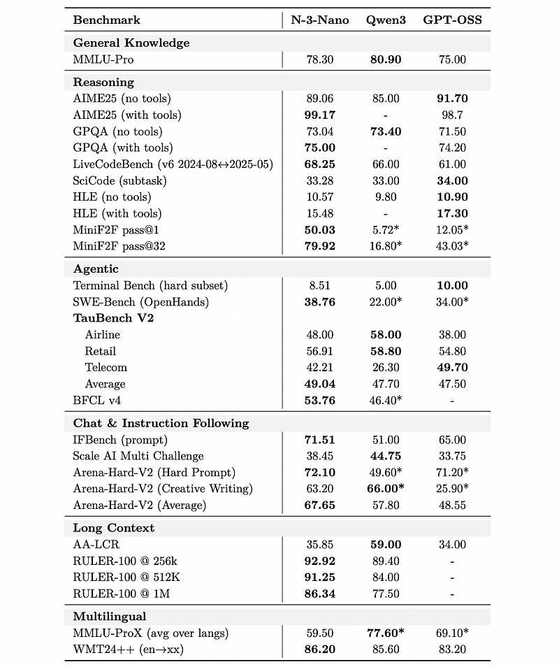

# Papers Explained 506 - Nemotron 3 Nano

Nemotron 3 Nano 30B-A3B is a Mixture-of-Experts hybrid Mamba-Transformer language model, pretrained on 25 trillion text tokens, including more than 3 trillion new unique tokens over Nemotron 2, followed by supervised fine tuning and large-scale RL on diverse environments.

This page ingests the source article into the wiki and connects it to [[Papers Explained Corpus]], [[Large Language Models]], [[Code Models]], [[Model Compression and Efficiency]], [[Mixture of Experts]], [[Document AI]].

## Source Metadata

- Source file: `raw/2025-12-22_Papers-Explained-506--Nemotron-3-Nano-8c95d44b0540.html`
- Source title: Papers Explained 506: Nemotron 3 Nano
- Published: 2025-12-22
- Canonical: [https://medium.com/@ritvik19/papers-explained-506-nemotron-3-nano-8c95d44b0540](https://medium.com/@ritvik19/papers-explained-506-nemotron-3-nano-8c95d44b0540)

## Key Ideas

- Nemotron 3 Nano 30B-A3B is a Mixture-of-Experts hybrid Mamba-Transformer language model, pretrained on 25 trillion text tokens, including more than 3 trillion new unique tokens over Nemotron 2, followed by supervised fine tuning and large-scale RL on diverse...
- The models and their training data are available on [HuggingFace](https://huggingface.co/collections/nvidia/nvidia-nemotron-v3).
- Webpages containing code were identified using a fast pattern matching code classifier.
- The identified pages were rendered using Lynx, a web browser that accurately preserves code layout, indentation, and technical elements.
- The rendered text was processed by the Phi-4 model, an LLM that removed boilerplate while retaining code snippets, configuration blocks, API references, and mathematical expressions.

## Notes

Nemotron 3 Nano 30B-A3B is a Mixture-of-Experts hybrid Mamba-Transformer language model, pretrained on 25 trillion text tokens, including more than 3 trillion new unique tokens over Nemotron 2, followed by supervised fine tuning and large-scale RL on diverse environments.

The models and their training data are available on [HuggingFace](https://huggingface.co/collections/nvidia/nvidia-nemotron-v3).

## Model Architecture

Nemotron 3 Nano 30B-A3B Base builds upon the hybrid Mamba-Transformer architecture of Nemotron-H and Nemotron 2 Nano models by replacing the standard FFN layers with sparse Mixture-of-Experts (MoE) layers. Nemotron 3 Nano 30B-A3B Base contains 31.6B total parameters out of which 3.2B are active (3.6B including embeddings) per forward pass. To achieve the best accuracy, a granular MoE architecture along with shared experts is used. For the MoE layers, squared ReLU activation and a standard learnt MLP router with sigmoid gating are used. No positional embeddings, dropout, or bias on linear layers are used. RMSNorm is used for normalization and embedding and projection weights are un-tied.

*Figure: Nemotron 3 Nano Architecture.*

## Pretraining

### Nemotron-CC-Code-v1

Starting from common crawl:

- Webpages containing code were identified using a fast pattern matching code classifier.

- The identified pages were rendered using Lynx, a web browser that accurately preserves code layout, indentation, and technical elements.

- The rendered text was processed by the Phi-4 model, an LLM that removed boilerplate while retaining code snippets, configuration blocks, API references, and mathematical expressions.

- A lightweight code-quality relevance classifier filtered out non-technical pages, ensuring only documents with substantial or complete code content were included.

- Equations were standardized to LaTeX, code blocks were preserved with structural fidelity, and noise was minimized.

This pipeline resulted in a 427.92B-token corpus suitable for code pretraining.

### Nemotron-Pretraining-Code-v2

Additional code was sourced from GitHub for repositories identified as missing from the existing corpus, in addition to collecting recent data with a cut-off date of April 15, 2025.

Qwen3 32B was used to generate synthetic data:

- Question-Answer Pairs: Using new source-code data as seeds, the model generated question-answer pairs.

- Dialogue Generation: Student-teacher (Python only) and code-review (Python/C++) style dialogues grounded in code snippets and full source files.

- Rephrasing: All raw Python source code was rephrased with prompts like Style-Guided Code Rewriting (SGCR), Self-Contained Optimization Rewriting (SCOR), and a custom prompt.

- Quality Assurance: Post-processing involved syntax error checking and code-quality assessment using the Pylint Python linter for each rewritten file.

- Python to C++:Python source code is transpiled into C++ tokens. This improved downstream C++ code-generation accuracy.

- Corpus Application: This transpilation procedure was applied to all Python source files in the corpus.

### Nemotron-CC-v2.1

Three more recent Common Crawl snapshots were added on top of Nemotron-CC-v2 (CC-MAIN-2025–18, CC-MAIN-2025–21, CC-MAIN-2025–26), prepared with the same Nemotron-CC recipe. For all of the synthetic rephrasing, Qwen3–30B-A3B was used. Just as for Nemotron Nano 2, training was conducted only on the Medium-Quality, Medium-High-Quality, and High-Quality buckets.

To further expand the corpus of unique high-quality tokens, five prompts were applied to the Medium-High-Quality data from 110 Common Crawl snapshots (CC-MAIN-2013–20 — CC-MAIN-2025–26), resulting in 2.1T new tokens.

Documents from the latest three Common Crawl snapshots in nine languages (Chinese, French, German, Italian, Japanese, Polish, Portuguese, Russian, Spanish) were translated to English using Qwen3–30B-A3B. Nemotron-CC quality classifiers then selected High-Quality and Medium-High-Quality English translations.

Four Nemotron-CC rephrasing prompts were applied to the high-quality translated data. An additional LLM-based quality filtering step removed approximately 10.6% of tokens to address uninformative translations.

Overall, over 2.5T new tokens from Common Crawl data were curated or generated.

### Nemotron-Pretraining-Specialized-v1

Synthetic Wikipedia Data:

English Wikipedia articles were revised using Qwen3–30B-A3B-Instruct-2507 to improve clarity and formatting. Disambiguation and redirect pages were discarded, and References, See also, Notes, and External Links sections were removed. The model was also instructed to remove any irrelevant content such as uncleaned HTML elements.

Synthetic Math Textbook Data:

Well-structured educational textbook-style sections were generated from Nemotron-CC-Math. Documents containing mathematical content at the undergraduate level and above were kept.

Synthetic Scientific Coding Data:

Using STEM-related documents retrieved from Nemotron-CC as the seed data, two types of documents were synthesized:

- Code-embedded article: A comprehensive, in-depth, and well-formatted article that explores and implements a non-trivial, graduate- or research-level scientific or mathematical algorithm in Python

- Computational coding problem: An advanced, computational, graduate- or research-level coding problem with Python solution. The main problem is decomposed into 5 to 15 logically ordered non-trivial substeps, each solved by an individual function. The main problem, dependencies, substep descriptions, and each function’s signature, docstring, body, and return statement were extracted, excluding examples where any of these components are missing.

Synthetic Cross-Domain Code Data:

A novel approach called InfiniByte is developed that cross-breeds multiple datasets together. Starting with a curated list of competitive coding problems from the OpenCodeReasoning dataset, concepts from datasets across mathematics (OpenMathReasoning), physics (Physics Big), chemistry (IChO), and other sciences are systematically injected. Multiple problem candidates are generated per (problem, concept) combination, and the best problem candidate is selected based on a LLM-as-critic rubric that tests for clarity, difficulty, and adherence to the employed cross-breeding strategy. Solutions to each new coding problem are then generated using Qwen3–235B-A22B-Thinking-2507. Two different strategies are employed in the cross-breeding process:

- Obfuscate without really changing the original problem, which is common in competitive coding problems and other competitions.

- Complicate by actually making the new problem much more complex, resulting in a more challenging problem that requires reasoning across multiple concepts to solve it.

Synthetic STEM Reasoning

To reinforce complex reasoning capabilities within STEM domains, the Reasoning Question-Answer (RQA) dataset was built.

First, diverse and advanced scientific texts were targeted as seed data. Starting from the STEM subset of the Essential-Web web-scale dataset, the dataset was filtered using the Essential-Web taxonomy to documents that met the following criteria:

- Undergraduate or graduate education level.

- No extraction artifacts, no missing content.

- Advanced reasoning depth.

- High or exceptional technical correctness.

- Leverages one of the Bloom cognitive processes: Analyze, Evaluate or Create.

- Leverages one of the Bloom knowledge domains: Conceptual, Procedural or Metacognitive.

- In the English language and over 1000 characters.

This filtering resulted in approximately 14 million documents.

Hierarchically stratified sampling was used to balance document volume and diversity. The first 4.5 million documents were selected for training, with document length limited to 4096 characters by extracting random chunks.

Each seed document was presented to the Qwen3–235B-A22B-Thinking-2507 model, instructed to generate a difficult, answerable graduate-level scientific reasoning question based on the document. The question had to not require access to the original passage and be produced within 8192 reasoning tokens.

The generated question was presented to the Qwen3 model for answering without the seed document context. The reasoning trace and answer were filtered for model-specific idiosyncrasies, limiting the output to 8192 characters. The question, reasoning trace, and answer were concatenated to create a single RQA example.

SFT-style data

New and refreshed SFT datasets were included in pretraining for code, math, and STEM. A set of additional math and code SFT samples from AceReason-Nemotron-1.1 was also incorporated. This collection encompasses a wide range of prompt sources, including NuminaMath, OrcaMathWordProblems, MathInstruct, and MetaMathQA for math tasks, as well as TACO, APPs, OpenCoder-Stage2, and OpenCodeReasoning for coding tasks. The responses for these prompts are generated by DeepSeek-R1.

### Data Mixture and Ordering

*Figure: Data mixtures for each phase of pre-training.*

The pretraining corpus spans fifteen data categories. The largest component is web crawl data, which is subdivided into five quality-based groups: crawl-medium, crawl-medium-high, syn-crawl-medium-high, crawl-high, and syn-crawl-high.

Beyond web crawl, the mixture also includes math, Wikipedia, code, nemotron-cc-code, academic text, Crawl++, multilingual data, and synthetic SFT-style datasets, the latter further grouped into general-sft, stem-sft, and code-sft categories.

Crawl++ comprises the OpenWebText, BigScience and Reddit datasets.

Multilingual data has nineteen languages: Arabic, Chinese, Czech, Danish, Dutch, Finnish, French, German, Hebrew, Hindi, Italian, Japanese, Korean, Portuguese, Polish, Russian, Spanish, Swedish, and Thai.

A curriculum based on two phases was used to pre-train Nemotron 3 Nano 30B-A3B Base. In the first phase, a data mixture that promotes diversity in data was used; in the second phase, high-quality datasets (e.g., Wikipedia) were primarily used. The switch to the second phase occurred at the 94% point of training.

### Hyperparameters

Nemotron 3 Nano 30B-A3B Base was pretrained using the Warmup-Stable-Decay learning rate (LR) schedule for a total of 25 trillion tokens. The LR was warmed up over 8.4 billion tokens to a maximum of 10−3. The maximum LR was maintained for 20 trillion tokens and then decayed to a minimum of 10−5 during the last 5 trillion tokens.

The model was pretrained with a sequence length of 8192 and a batch size of 3072, resulting in roughly 25 million tokens per batch.

For the MoE layers, DeepSeek’s aux-loss-free load balancing Strategy with an update rate of 10−3 in conjunction with the standard load balancing loss was used. A load balancing loss coefficient of 10−4 was used.

### Long-Context Extension

Similar to Nemotron 2 Nano, a long-context phase (LC-Phase) was added at the end of pretraining. A constant learning rate of 10−5 and global batch size of 48 were used. The long-context document QA dataset from Nemotron Nano 2 was reused, but scaled to make it 3×larger. A small amount of synthetic retrieval-focused data, with a maximum sequence length of 256k tokens, was also added to the CPT data blend. The document QA and synthetic retrieval-focused data were allocated to 20% and 1% in the Phase LC data blend, with the remaining 79% being downscaled Phase 2 data. The LC-Phase used a total of 121 billion tokens.

## Supervised Fine Tuning

Nemotron 3 Nano can be used in reasoning or non-reasoning mode through the chat template. In reasoning mode, the reasoning flow is altered for the following conversation scenarios:

- Multi-Step: In a series of assistant model calls, the existing reasoning tokens are preserved to allow the model to re-use existing reasoning for subsequent steps.

- Multi-Turn: When a user message is introduced, any reasoning from previous turns are dropped.

For tool calling, XML-style special tags are used to reduce character escaping.

*Figure: Example prompt materialization using the Nemotron 3 Nano chat template for a 2-turn conversation.*

Competition Math: For math, a similar strategy to Nemotron Nano 2 is used. Responses are refreshed with GPT-OSS 120B. In addition, tool-integrated reasoning traces are created using Python tools.

Competition Code: For code, the same data from Nemotron Nano 2 is used, which is made up of the prompts from OpenCodeReasoning complemented with responses from DeepSeek-R1–0528.

Conversational Tool Use: Synthetic multi-turn trajectories are generated to demonstrate conversational tool use evaluated using LLM as a judge. Qwen3–235B-A22B-Thinking-2507, Qwen3–32B, GPT-OSS-120b, and Qwen3–235B-A22B-Instruct-2507 are used to generate data in this synthetic tool use trajectory generation pipeline.

Long Context: Synthetic data is generated with a mean token length of 128k tokens and a maximum of 256k tokens to improve long-context performance, validated against a subset of RULER tasks.

Formal Proofs: For Lean theorem proving, SFT data was curated by first autoformalizating 580k natural language theorems from online mathematics communities (AoPS, Math StackExchange, MathOverflow) into 550k Lean 4 statements using an iterative refinement pipeline based on GPT-OSS-120B with backtranslation-based semantic verification. Large-scale proof generation was then run using Goedel-Prover-V2–32B with up to 4 independent attempts and 8 self-correction rounds per statement, yielding 920k proof traces with compiler-verified solutions. After filtering, the final dataset contains 300k examples pairing formal theorem statements with successful reasoning traces and proofs.

Multilingual: Similar to Nemotron Nano 2, Qwen2.5-Instruct was used to translate existing English post-training data into 5 target languages: French, Spanish, Italian, German, and Japanese. The pipeline translates inputs line-by-line and skips non-translatable content like code, XML tags, URLs, etc. langdetect was utilized to filter out samples that did not predominantly consist of target language tokens. The multilingual corpus was further comprised of 1.62 million text translation samples, aggregated from a combination of news-commentary datasets and proprietary sources.

Terminal Use: To teach Nemotron 3 Nano to complete autonomous terminal-based tasks, data from competitive coding, competitive math, and long context datasets is adapted to terminal bench problems. Synthetic tasks requiring data analysis and file creation and operations are also constructed. Additionally, data from SWE-Smith, which provides real-world software engineering tasks, is incorporated. Qwen3-Coder-480B-A35B-Instruct and Kimi-K2-Instruct-0905 are used to generate action trajectories for each task using the Terminus-1 and Terminus-2 agents.

General Chat: Data is generated by creating responses to the LMSYS and WildChat datasets using GPT-OSS-120B, Qwen3–235B-A22B-Thinking-2507, and Qwen3–235B-A22B-Instruct-2507. The data is extended to multi-turn by having the same language model simulate the user and further continue the conversation.

Instruction Following: Targeted instruction following data is created using the methodology from Tülu 3. Users are simulated in a conversation using language models seeded with a user persona from Nemotron-Personas-USA and instructions from IFeval and IFBench train splits. The user language model is prompted to generate precise instruction following queries for one or more turns. GPT-OSS-120B, Qwen3–235B-A22B-Thinking-2507, and Qwen3–235B-A22B-Instruct-2507 are then used to generate responses to the user queries. The generated data is first filtered to only keep samples where all turns pass the respective instruction verifier implementations in IFEval and IFBench. Further filtering is done with a language model judge to remove samples where the responses only trivially or superficially follow instructions.

Software Engineering: A dataset of coding tasks is curated, derived from real-world GitHub issues. The issue description and containerized execution environments from SWE-Gym and R2E-Gym datasets are used. Trajectories are distilled from three open-source agent harnesses: OpenHands, SWE-Agent, and Mini-SWE-Agent using Qwen3-Coder-480B-A35B-Instruct as the teacher model.

GenSelect: The model’s capability as a generative reward model is improved by training it to identify the best solution among multiple candidates. This is achieved by adapting the problems in the math and coding SFT data. Synthetic solutions are generated and selection reasoning traces including their final verdicts are used. These traces are generated using GPT-OSS 120B and DeepSeek-R1–0528.

CUDA: 21k (PyTorch, Cuda C) pairs are collected and synthesized with seeds from HuggingFace Transformers and KernelBook. PyTorch code is first parsed from Transformers and KernelBook, and then DeepSeek-R1–0528 is used to generate corresponding Cuda C code. Only PyTorch, Cuda C pairs with Cuda C code that is successfully compiled and numerically verified against PyTorch reference code are included.

Science: A set of challenging seed questions was curated from Nemotron Nano v2 and scientific articles contained in the pre-training corpus. Focusing on the graduate-level subset, these documents were indexed in a vector database and used with a diverse set of science-oriented query prompts to retrieve thousands of highly relevant passages. These retrieved segments served as the foundation for generating multiple-choice question (MCQ) data, which were subsequently converted into an open-ended question-answering (OpenQA) format.

Safety: A diverse set of unsafe prompts sourced from the Nemotron Content Safety v2 and the Gretel Safety Alignment v1 datasets are compiled to target content safety risks. Harmful Tasks and Red-Team-2K datasets are also used to target common jailbreak techniques. This collection is further balanced with safe prompts derived from Nemotron Content Safety v2. Safe prompt wrappers are applied to unsafe prompts, enabling the models to learn appropriate refusal behaviors while preserving user engagement.

*Figure: SFT data blend for Nemotron 3 Nano.*

A unified data filtering pipeline is applied to ensure that only high-quality, license-compliant, and verifiable samples are used for training.

- Malformed examples are first discarded using structural checks (e.g., missing tool definitions when tool calls are present).

- Reasoning traces exhibiting pathological repetition, such as repeated n-grams within a sliding window or across the entire trajectory, are then aggressively filtered. This repetition was found to be a strong indicator of malformed or low-quality reasoning.

- Based on internal audits of synthetically generated datasets, some teacher models occasionally produce reasoning traces and final responses that implicitly align with specific political entities or promote nationalistic narratives. To mitigate this, targeted keyword- and regex-based filters (e.g., patterns such as “our nation/party […]”, “our values”) are applied and all trajectories matching such behavior are removed.

As the size of different datasets varies significantly, a dynamic sampling approach is employed where smaller datasets may be trained over for many epochs and larger datasets are trained for only a few epochs.

To enable reasoning on/off control, reasoning traces are stripped from a random 10% of samples. To enable budget control, 3% of reasoning traces are randomly truncated to different reasoning budgets, before continuing with the original post-reasoning response.

Training is conducted for 13,000 steps using a batch size of 64 and sequence packing to a sequence length of 256K. A learning rate of 5·10−5 is employed, with 800 steps of learning rate warmup. A sequence-level MoE load balancing regularizer is used, with the loss coefficient set to 10−4.

## Multi environment Reinforcement Learning from Verifiable Rewards

A unified RLVR stage is employed, training on all environments simultaneously. This results in stable gains across all benchmarks throughout training, while single environment training often results in un-recoverable degradation of other benchmarks. Two stages of such RLVR are conducted: one immediately after SFT and one after RLHF.

Competition Math: Trained on DAPO (17K tasks) and SkyWorks (104K tasks) datasets.

Competition Coding: Uses 22K coding problems from OpenCodeReasoning, limited to 50 unit tests each for faster verification.

Question Answering: Employs multiple choice datasets focusing on STEM subjects, with questions and answers derived from reference documents (135K tasks).

Structured Outputs: Utilizes Qwen3–235B-A22B-Instruct-2507 to create (JSON schema, document) pairs. The RL pipeline trains the model to summarize documents according to the schema (9K tasks).

Instruction Following: Two environments are used:

- A refreshed version of the IFEval style environment from Llama-Nemotron, based on IFBench (46K tasks).

- An environment using an LLM judge to evaluate complex multi-turn instructions inspired by the Multi-Challenge benchmark (3K tasks).

Long Context: Generates challenging long-context QA pairs requiring at least five documents per question (limited to 32k tokens total) using Qwen3–235B-A22B-Thinking-2507 and evaluated by Qwen3–235B-A22B-Instruct-2507 (12K tasks).

Agentic Tool Use: Two environments are used to improve tool use capabilities.

- Workplace Assistant: A multi-step tool-calling environment adapted from Styles and Nemotron 2 Nano, simulating business tasks with databases, tools, and 690 tasks.

- Multi-turn Conversational Agent: Tests tool-calling and proactive asking in banking scenarios (1K tasks).

To focus training on challenging cases, samples where the SFT checkpoint already achieves a 100% pass rate are filtered out. In each batch, a fixed ratio of samples across different domains is maintained. For each domain, the target pass-rate distribution is modeled as a Gaussian function, shifting from high pass-rate (easier) samples early in training to low pass-rate (harder) samples later.

*Figure: Batch-wise pass rates across the RL curriculum.*

Once training progress plateaus, the tasks are re-profiled using the best RL checkpoint and a new curriculum is constructed to further refine performance. Curriculum sampling ensures stable learning across multiple domains throughout training. In contrast, random sampling biases the model toward easier tasks, preventing it from effectively learning more challenging ones.

Nemotron 3 Nano is trained using synchronous GRPO with masked importance sampling to mitigate training-inference misalignment. 128 prompts per step are used, with 16 generations per prompt. A batch size of 2048 is employed, making updates on-policy. To further stabilize training, the MoE router weights are frozen. The aux-loss-free load balancing approach is used, and expert bias is kept updated. The entire training run has a maximum generation length of 49K. Overlong filtering is used, which is found to boost performance on reasoning intensive benchmarks.

## Reinforcement Learning from Human Feedback

Generative reward models (GenRMs) generalize better than traditional Bradley-Terry models, reducing the risk of reward hacking during RLHF. Qwen3–235B-A22B-Thinking-2507. is trained as a GenRM with GRPO algorithm. Given the conversation history, a new user request, and two candidate assistant responses, the GenRM first reasons through the strength and weakness of both responses, then produces an individual helpfulness score for each response as well as a ranking score. The reward is defined as:

where 𝑃𝑟, 𝐺𝑟 denote the predicted and ground-truth preference rankings; 𝑃ℎ1, 𝐺ℎ1, 𝑃ℎ2, 𝐺ℎ2 denote the predicted and ground-truth helpfulness scores for responses 1 and 2, respectively; 𝐼𝑓 𝑜𝑟𝑚𝑎𝑡 indicates whether the prediction violates the format requirement; 𝐶1 and 𝐶2 are hyper-parameters controlling the weights. 𝐶1 = 10 and 𝐶2 = 1.

Data is leveraged from HelpSteer3, a commercially-friendly subset of lmarena-ai/arena-human-preference-140k, and a synthetic safety blend for model training. Individual helpfulness scores in the dataset range from 1 to 5, where higher means more helpful. Ranking score ranges from 1 to 6, in which 1 denotes that response 1 is far superior to response 2 and 6 denotes that response 2 is far superior to response 1. Each sample is augmented by switching positions of two responses to prevent positional bias.

With a trained GenRM, RLHF is conducted on the same set of prompts. Naively comparing all pairs of 𝑁 responses would require (𝑁 2) GenRM calls per prompt. Instead, a circular comparison strategy is adopted where each response is compared only with its successor: (𝑟1,𝑟2),(𝑟2,𝑟3),…,(𝑟𝑁−1,𝑟𝑁 ),(𝑟𝑁 ,𝑟1), yielding exactly 𝑁 comparisons. For each pairwise comparison (𝑟𝑖,𝑟𝑗 ), the GenRM produces individual helpfulness scores 𝑠𝑖,𝑠𝑗 ∈[1,5] and a ranking score 𝑠𝑟 ∈[1,6]. In the case where 𝑠𝑖 = 𝑠𝑗 , a simple tiebreaker mechanism is employed.

The base reward for response 𝑟𝑖 is then computed by averaging its scores from two matches. When training with base reward, we find that the length of response can rapidly increase as RLHF training proceeds. In order to reduce redundant thinking, we propose a Group Relative Length Control mechanism during RLHF. Each response 𝑟𝑖 is decomposed into a reasoning component 𝑟(think) 𝑖 and an answer component 𝑟(answer) 𝑖 , with corresponding lengths ℓ(think) 𝑖 and ℓ(answer) 𝑖.

A zero-mean, group-relative length bonus is computed to encourage shorter responses within a group. For the reasoning component, lengths within the group are first normalized.

To ensure the adjustment is zero-sum across the group (preserving the overall reward scale), the weights are centered.

The same procedure is applied to answer lengths to obtain˜𝑤(answer) 𝑖 . The final reward for response 𝑟𝑖 is then:

where 𝜆(think),𝜆(answer) are coefficients controlling the strength of the length penalty. We set 𝜆(think) = 0.5, 𝜆(answer) = 0.5.

To further encourage concise responses without sacrificing quality, optional bonuses are introduced for the shortest responses that achieve top-tier quality scores. Let 𝜏𝑝 denote the 𝑝-th percentile threshold of scores within the group. For the response 𝑟𝑘 with minimum reasoning length:

where 𝛽(think) and 𝛽(answer) are the reasoning and answer conciseness bonuses respectively, and ⊮[·] is the indicator function. 𝛽(think) = 0.5, 𝛽(answer) = 0.5, and 𝜏𝑝 = 80.

## Evaluation

### Base Model Evaluation

*Figure: Comparison of Qwen3–30B-A3B-Base and Nemotron 3 Nano 30B-A3B Base.*

### Post-trained Model Evaluation

*Figure: Nemotron 3 Nano compared to Qwen3–30B-A3B-Thinking-2507, and GPT-OSS 20B.*

## Paper

[Nemotron 3 Nano: Open, Efficient Mixture-of-Experts Hybrid Mamba-Transformer Model for Agentic Reasoning](https://research.nvidia.com/labs/nemotron/files/NVIDIA-Nemotron-3-Nano-Technical-Report.pdf)

## Figures

Figures from the Medium HTML export (`raw/2025-12-22_Papers-Explained-506--Nemotron-3-Nano-8c95d44b0540.html`); local copies under `wiki/assets/papers-explained-506-nemotron-3-nano/` when download succeeded.

| Figure | Caption |
|--------|---------|
|  | Title card: Nemotron 3 Nano. |
|  | The models and their training data are available on HuggingFace. |
|  | Nemotron 3 Nano Architecture. |
|  | Data mixtures for each phase of pre-training. |
|  | Example prompt materialization using the Nemotron 3 Nano chat template for a 2-turn conversation. |
|  | SFT data blend for Nemotron 3 Nano. |
|  | Batch-wise pass rates across the RL curriculum. |
|  | Generative reward models (GenRMs) generalize better than traditional Bradley-Terry models, reducing the risk of reward hacking during RLHF. |
|  | With a trained GenRM, RLHF is conducted on the same set of prompts. |
|  | A zero-mean, group-relative length bonus is computed to encourage shorter responses within a group. |
|  | The same procedure is applied to answer lengths to obtain˜𝑤(answer) 𝑖. The final reward for response 𝑟𝑖 is then. |
|  | The same procedure is applied to answer lengths to obtain˜𝑤(answer) 𝑖. The final reward for response 𝑟𝑖 is then. |
|  | Instruction Following: Two environments are used. |
|  | Instruction Following: Two environments are used. |
|  | Comparison of Qwen3–30B-A3B-Base and Nemotron 3 Nano 30B-A3B Base. |
|  | Nemotron 3 Nano compared to Qwen3–30B-A3B-Thinking-2507, and GPT-OSS 20B. |
## Related

- [[Papers Explained Corpus]]
- [[Large Language Models]]
- [[Code Models]]
- [[Model Compression and Efficiency]]
- [[Mixture of Experts]]
- [[Document AI]]
- [[Papers Explained 505 - Rnj-1]]
- [[Papers Explained 507 - T5Gemma 2]]

#summary #topic
