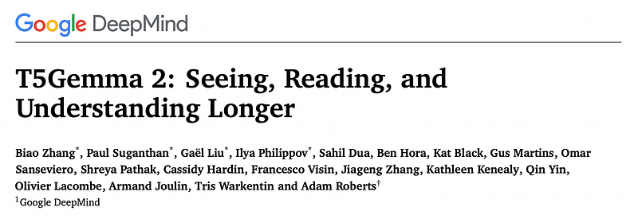
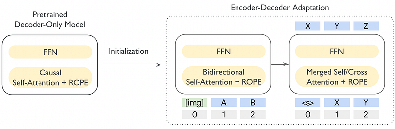
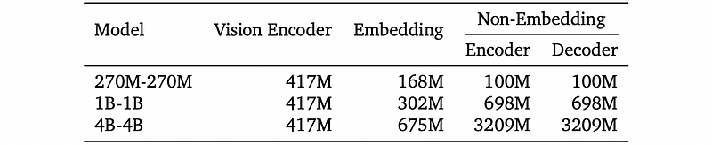
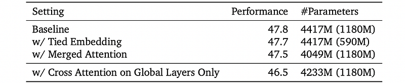
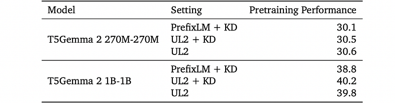
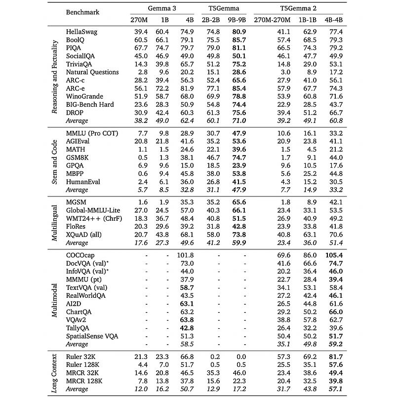
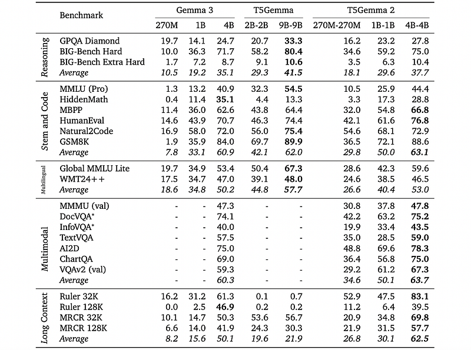

# Papers Explained 507 - T5Gemma 2

T5Gemma 2 basic building block follows Gemma 3: grouped-query attention with QK-norm, pre- and post-norm with RMSNorm, RoPE for positional encoding, and interleaved local and global attention layers with a ratio of 5:1.

This page ingests the source article into the wiki and connects it to [[Papers Explained Corpus]], [[Embedding and Retrieval]], [[Large Language Models]], [[Vision Language Models]], [[Model Compression and Efficiency]], [[Long Context]], [[Model Distillation]], [[Supervised Fine-Tuning]].

## Source Metadata

- Source file: `raw/2025-12-23_Papers-Explained-507--T5Gemma-2-c406dbdd3839.html`
- Source title: Papers Explained 507: T5Gemma 2
- Published: 2025-12-23
- Canonical: [https://medium.com/@ritvik19/papers-explained-507-t5gemma-2-c406dbdd3839](https://medium.com/@ritvik19/papers-explained-507-t5gemma-2-c406dbdd3839)

## Key Ideas

- In T5Gemma 2, all word embeddings (encoder input embedding, decoder input embedding and decoder output/softmax embedding) are tied following T5.
- In the encoder-decoder architecture, cross-attention is often represented as a separated sub-layer in the decoder block, inserted in between the self-attention and feed-forward sub-layers.
- Concretely, given the encoder output H and the decoder self-attention input X the merged attention operates as below:
- where 𝑛/𝑚 represents the encoder/decoder input length and 𝑑/𝑑ℎ is model/head dimension
- T5Gemma 2 parameters are initialized from the corresponding Gemma 3 pretraining checkpoint. All models are trained with a batch size of 4.2M tokens, and with the standard cross-entropy loss.

## Notes

T5Gemma 2 is the next generation of the T5Gemma family, featuring strong multilingual, multimodal and long-context capabilities. T5Gemma 2 follows the adaptation recipe, adapting a pretrained decoder-only model into an encoder-decoder model, and extends it from a text-only regime to multimodal on the Gemma 3 models. Two methods are proposed to improve efficiency: tied word embedding that shares all embeddings across encoder and decoder, and merged attention that unifies decoder self- and cross-attention into a single joint module.

## Model Architecture

*Figure: Overview of T5Gemma 2.*

T5Gemma 2 basic building block follows Gemma 3: grouped-query attention with QK-norm, pre- and post-norm with RMSNorm, RoPE for positional encoding, and interleaved local and global attention layers with a ratio of 5:1. To improve long-context modeling, the RoPE base frequency is set to 10k and 1M for local and global attention layers, respectively. The 400M SigLIP encoder is adopted as the vision encoder, which transforms an image to 256 embedding tokens and is frozen during training.

*Figure: Number of parameters for T5Gemma 2 models.*

*Figure: Architectural ablations for T5Gemma 2B-2B based on Gemma 2 2B.*

Tied Embedding:

In T5Gemma 2, all word embeddings (encoder input embedding, decoder input embedding and decoder output/softmax embedding) are tied following T5. Tying embeddings leads to nearly no quality change but reduces the parameters by 10.5%, suggesting the high redundancy of embedding parameters.

Merged Attention:

In the encoder-decoder architecture, cross-attention is often represented as a separated sub-layer in the decoder block, inserted in between the self-attention and feed-forward sub-layers. However, the functionality of the self- and cross-attention shares high similarity: gathering relevant information from the past. These two types of attentions are merged into a single module with shared attention parameters.

Concretely, given the encoder output H and the decoder self-attention input X the merged attention operates as below:

where 𝑛/𝑚 represents the encoder/decoder input length and 𝑑/𝑑ℎ is model/head dimension

## Training

Pretraining

Pretraining data follows Gemma 3, which is a mixture of multilingual web documents, code, mathematical corpus and images. The data is preprocessed with UL2 into ≤16K input sequences paired with ≤16K target outputs. For text data, five denoising tasks are applied: (𝜇= 3,𝑟 = 0.15,𝑛),(𝜇= 12,𝑟 = 0.5,𝑛),(𝜇= 32,𝑟 = 0.15,𝑛),(𝜇= 32,𝑟 = 0.5,𝑛)and (𝜇= 3/4𝐿,𝑟= 0.75,1)with a mixing ratio of 1:1:1:1:4, where 𝜇 is the mean span length, 𝑟 is the corruption rate, 𝑛 is the number of corrupted spans, and 𝐿 is the input sequence length. For vision data, only prefix language modeling is used: all input tokens until the end of the final image are used as prefix, and the remaining text tokens are used as targets. Distillation is not used. The final pretraining data includes∼2T tokens.

T5Gemma 2 parameters are initialized from the corresponding Gemma 3 pretraining checkpoint. All models are trained with a batch size of 4.2M tokens, and with the standard cross-entropy loss. The final pretraining checkpoint is created by averaging over the last 5 checkpoints (saved with an interval of 10K steps).

Post Training

Slight instruction tuning using distillation learning is performed to showcase the strengths of encoder-decoder LLMs on downstream finetuning.

## Evaluation

To assess how different pretraining objectives and the use of knowledge distillation (KD) affect performance. T5Gemma 2 is trained under three regimes: PrefixLM+KD, UL2, and UL2+KD.

*Figure: Data ablations for T5Gemma 2.*

- PrefixLM+KD generally yields the worst performance.

- UL2 (with or without KD) consistently outperforms PrefixLM+KD for models up to 1B–1B.

- UL2+KD gives a small additional gain (~0.4 points on average) over UL2 at 1B–1B scale.

- The benefit of distillation is argued to depend strongly on teacher–student capacity alignment.

- Due to limited gains and high data-loading cost, distillation is dropped and plain UL2 is adopted for T5Gemma 2.

Adapting text-only LLMs to multimodal and long-context encoder–decoder models

*Figure: Detailed pretraining results for Gemma 3, T5Gemma, and T5Gemma 2.*

- The adaptation successfully yields non-trivial multimodal and long-context performance for T5Gemma 2 models.

- T5Gemma 2 1B–1B achieves average scores of 49.8 (multimodal) and 43.8 (long-context), only 8.7 and 6.9 points behind Gemma 3 4B, despite being much smaller.

- This supports the view that encoder-decoder architectures are particularly effective for input/vision understanding and long-context via their dedicated encoder and cross-attention.

Comparing overall pretraining and post-training performance vs. Gemma 3

*Figure: Detailed post-training results for Gemma 3, T5Gemma, and T5Gemma 2.*

- T5Gemma 2 270M–270M and 1B–1B substantially outperform Gemma 3 270M and 1B after pretraining across benchmarks.

- At 4B–4B scale, T5Gemma 2 performs on par with or slightly better than Gemma 3.

- After post-training, T5Gemma 2 generally surpasses Gemma 3, even though T5Gemma 2 uses relatively lightweight finetuning.

## Paper

T5Gemma 2: Seeing, Reading, and Understanding Longer [2512.14856](https://arxiv.org/abs/2512.14856)

## Figures

Figures from the Medium HTML export (`raw/2025-12-23_Papers-Explained-507--T5Gemma-2-c406dbdd3839.html`); local copies under `wiki/assets/papers-explained-507-t5gemma-2/` when download succeeded.

| Figure | Caption |
|--------|---------|
|  | Title card: T5Gemma 2. |
|  | Overview of T5Gemma 2. |
|  | Number of parameters for T5Gemma 2 models. |
|  | Architectural ablations for T5Gemma 2B-2B based on Gemma 2 2B. |
|  | Concretely, given the encoder output H and the decoder self-attention input X the merged attention operates as below. |
|  | Data ablations for T5Gemma 2. |
|  | Detailed pretraining results for Gemma 3, T5Gemma, and T5Gemma 2. |
|  | Detailed post-training results for Gemma 3, T5Gemma, and T5Gemma 2. |
## Related

- [[Papers Explained Corpus]]
- [[Embedding and Retrieval]]
- [[Large Language Models]]
- [[Vision Language Models]]
- [[Model Compression and Efficiency]]
- [[Long Context]]
- [[Model Distillation]]
- [[Supervised Fine-Tuning]]
- [[Papers Explained 506 - Nemotron 3 Nano]]
- [[Papers Explained 508 - On the Interplay of Pre-Training, Mid-Training, and RL on Reasoning Language…]]

#summary #topic
