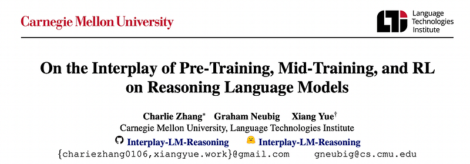
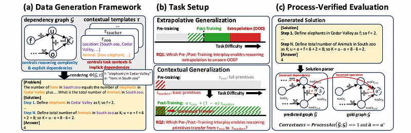
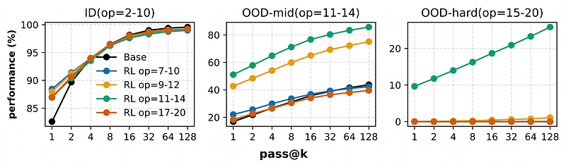
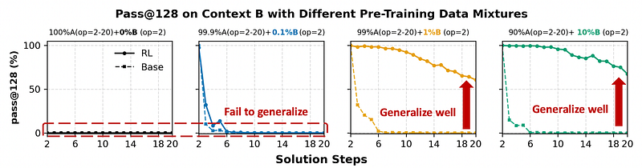
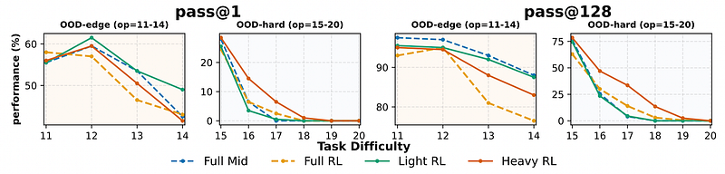
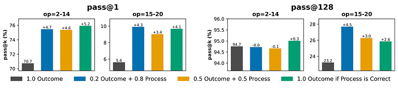

# Papers Explained 508 - On the Interplay of Pre-Training, Mid-Training, and RL on Reasoning Language…

This work develops a fully controlled experimental framework that isolates the causal contributions of pre-training, mid-training, and RL-based post-training. The approach employs synthetic reasoning tasks with explicit atomic operations, parseable step-by-step reasoning traces, and systematic manipulation of training distributions.

This page ingests the source article into the wiki and connects it to [[Papers Explained Corpus]], [[Reasoning Models]], [[Synthetic Data]], [[Model Compression and Efficiency]].

## Source Metadata

- Source file: `raw/2025-12-24_Papers-Explained-508--On-the-Interplay-of-Pre-Training--Mid-Training--and-RL-on-Reasoning-Language--28ea687d27ae.html`
- Source title: Papers Explained 508: On the Interplay of Pre-Training, Mid-Training, and RL on Reasoning Language…
- Published: 2025-12-24
- Canonical: [https://medium.com/@ritvik19/papers-explained-508-on-the-interplay-of-pre-training-mid-training-and-rl-on-reasoning-language-28ea687d27ae](https://medium.com/@ritvik19/papers-explained-508-on-the-interplay-of-pre-training-mid-training-and-rl-on-reasoning-language-28ea687d27ae)

## Key Ideas

- This work develops a fully controlled experimental framework that isolates the causal contributions of pre-training, mid-training, and RL-based post-training.
- RL produces true capability gains (pass@128) only when pre-training leaves sufficient headroom and when RL data target the model’s edge of competence, tasks at the boundary that are difficult but not yet out of reach.
- Contextual generalization requires minimal yet sufficient pre-training exposure, after which RL can reliably transfer.
- Mid-training significantly enhances performance under fixed compute compared with RL only, demonstrating its central but underexplored role in training pipelines.
- Process-level rewards reduce reward hacking and improve reasoning fidelity.

## Notes

## Papers Explained 508: On the Interplay of Pre-Training, Mid-Training, and RL on Reasoning Language Models

This work develops a fully controlled experimental framework that isolates the causal contributions of pre-training, mid-training, and RL-based post-training. The approach employs synthetic reasoning tasks with explicit atomic operations, parseable step-by-step reasoning traces, and systematic manipulation of training distributions. Models are evaluated along two axes: extrapolative generalization to more complex compositions and contextual generalization across surface contexts.

The work shows that:

- RL produces true capability gains (pass@128) only when pre-training leaves sufficient headroom and when RL data target the model’s edge of competence, tasks at the boundary that are difficult but not yet out of reach.

- Contextual generalization requires minimal yet sufficient pre-training exposure, after which RL can reliably transfer.

- Mid-training significantly enhances performance under fixed compute compared with RL only, demonstrating its central but underexplored role in training pipelines.

- Process-level rewards reduce reward hacking and improve reasoning fidelity.

## Experiment Settings

*Figure: Overview of the data generation framework, task setup, and process-verified evaluation.*

A testbed with precise control over reasoning structure, complexity, and context is created by building on the GSM-Infinite data generation framework. The pipeline involves three key components:

- Dependency Graphs. Each reasoning problem is represented by a direct graph G = (V,E), where nodes v ∈V correspond to variables, and directed edges e∈Edenote dependencies between them. The graph culminates in a designated answer node v∗, which yields the final answer a∗.

- Reasoning Complexity Control. The complexity of a graph is quantified by the number of arithmetic operations: op(G) = |E|, which controls task difficulty from basic arithmetic to complex multi-step reasoning.

- Contextual Rendering. Given a pre-defined contextual template τ (e.g., animals–zoo, teachers–school) with natural language descriptions, the dependency graph G is rendered to produce a complete math problem. Finally, diverse math problems are generated by sampling different graphs G and templates τ, and rendering them into text.

The controlled experiments expose two complementary axes: extrapolative (depth-wise) and contextual (breadth-wise) generalization, enabling a precise examination of how pre-training, mid-training, and post-training influence each type of generalization.

- Extrapolative (Depth) Generalization evaluates a model’s ability to maintain correctness as reasoning depth op(G) increases.

- Contextual (Breadth) Generalization measures whether a model can transfer its reasoning primitives to novel domains that differ in surface forms but share similar underlying reasoning structure.

For each instance with a ground-truth dependency graph, the model produces a free-form solution, which is parsed into a predicted dependency graph and final answer. The process is evaluated at the step level for each gold node by comparing the predicted and ground-truth nodes, their dependencies, and their numeric values. The process accuracy is computed as the average step-level accuracy across all gold nodes. A prediction is considered fully correct only when both the reasoning steps and the final answer match.

Decoder-only Qwen2.5-style models with 100M parameters are trained on a large-scale synthetic reasoning dataset generated using the GSM-Infinite framework. The full corpus contains 30B tokens spanning multiple operation ranges and contextual templates, and is partitioned into disjoint splits for pre-training, mid-training, and post-training to avoid distribution contamination.

- Pre-training: The model is pre-trained on 10B tokens (100× parameters). The dataset consists of op=2–10 operations across templates, allowing the model to master reasoning while retaining headroom for complex tasks. The model achieves near-saturated pass@128 accuracy, ensuring that improvements in deeper tasks reflect true generalization.

- Mid-training: A streamlined version of mid-training is implemented, maintaining the same pre-training objective but narrowing the data distribution similar to RL, where the model exhibits emerging but incomplete competence. By focusing supervision on this boundary, higher-level reasoning priors that RL can amplify are aimed to be strengthened.

- Post-training: Since the pre-training data is already structured and task-specific, the focus is on RL for post-training. Using GRPO, training is conducted on curated subsets designed to probe generalization in deeper operation ranges and novel templates.

## When Does Post-Training Incentivize Reasoning Beyond the Base Model?

This study focuses on extrapolative generalization, defining three problem categories based on operation counts: In-Distribution (ID) problems within the pre-training range (op=2–10); OOD-edge problems just beyond this range (op=11–14), where the base model retains non-zero pass@128 accuracy; and OOD-hard problems substantially beyond the pre-training distribution (op=15–20), where the base model exhibits near-zero accuracy.

- Pre-training: The base model is pre-trained on 10B tokens consisting of ID problems.

- Post-training: GRPO is applied with a total of 200K samples from four distinct difficulty ranges: op=7–10 (ID), op=9–12 (mixed), op=11–14 (edge), and op=17–20 (hard).

*Figure: pass@k performance on three tasks: ID (op=2–10), OOD-edge (op=11–14), OOD-hard (op=(15- 20)).*

Observation:

- The efficacy of post-training is highly sensitive to the pre-training and post-training data regime

- For ID tasks (op=2–10), there are obvious performance gains on pass@1 but no improvement on pass@128 regardless of the RL data regime, which indicates that RL only sharpens existing capabilities without extending them.

- However, for OOD tasks (op=11–14 and op=15–20), RL always improves pass@128 performance when applied on the edge of competence data (op=11–14), demonstrating genuine capability gains beyond pre-training.

Takeaway:

RL produces true capability gains (pass@128) beyond base models only when two conditions hold:

- The task is not heavily covered during pre-training, leaving sufficient headroom for exploration.

- The RL data is calibrated to the model’s edge of competence, neither too easy (in-distribution) nor too hard (out-of-distribution).

Practical Guidance:

Design RL data around the model’s edge of competence. It is recommended to filter the RL dataset to target tasks where the model fails at pass@1 but succeeds at pass@k. This strategy avoids redundancy on high-pass@1 tasks while preventing reward sparsity on zero-pass@k tasks. This process could also be iterative: periodically re-evaluate the pool of “edge of competence” tasks; as the model gets stronger, previously out-of-distribution tasks will drift into the solvability gap, creating a natural, self-paced curriculum.

## How Does Pre-training Exposure Shape Post-Training Generalization?

This study focus on contextual generalization to long-tailed context B contexts with atomic reasoning primitives (op=2 examples) during pre-training. By manipulating the ratio of long-tailed context B atomic op=2 examples during pre-training, we aim to assess how exposure to these basic primitives shapes the model’s ability to transfer learned skills and extrapolate effectively during post-training.

- Pre-training: The base model is pre-trained on 10B tokens consisting of op=2–20 context A and long-tailed op=2 context B examples, where we vary the ratio of atomic op=2 examples to long-tailed context B exposure.

- Post-training: RL is applied on 200K samples, consisting of 50% context A and 50% context B, spanning op=2–20.

*Figure: pass@128 performance on context B after post-trained with a 50% context A + 50% context B mixture.*

Observation:

- The impact of pre-training exposure to long-tailed contexts on post-training generalization is substantial.

- When pre-training excludes context B or provides no (0%) or very little exposure (0.1%), RL fails to transfer to context B.

- Introducing even 1% of context B data during pre-training significantly enhances post-training generalization even to the hardest tasks of op=20.

- This observation underscores that while RL plays a crucial role in generalization, its effectiveness is heavily dependent on the coverage of the pre-training data, particularly the inclusion of long-tailed contexts.

Takeaway:

- RL incentivizes contextual generalization only when the base model already contains the necessary primitives.

- Without minimal pre-training exposure to a new context, RL cannot induce transfer.

- However, even sparse exposure (e.g., ≥1%) provides a sufficient seed that RL can reinforce during post-training, yielding robust cross-context generalization.

Practical Guidance:

RL cannot synthesize capabilities from a void; it requires latent “seeds” to amplify. However, these seeds need not be complex. Our results show that RL can successfully extrapolate to hard tasks as long as the atomic reasoning primitives are present in pre-training. Practitioners should prioritize broad coverage of basic domain knowledge, rules, and skills (at ≈1% density) rather than striving for complex data samples. Once these fundamental primitives are established, RL effectively acts as a compositor, combining them to solve complex out-of-distribution problems.

## How Does Mid-Training Interact with Post-Training?

This study examines the synergy between mid-training and post-training, seeking to define how their interaction drives reasoning generalization. For fair comparison, both phases are normalized to equivalent training tokens based on flops. For mid-training, the consumption Tmid is the number of supervised tokens processed. For RL, the token-equivalent cost is approximated as:

where N is the number of RL samples, r= 6 the rollout multiplicity, and Ltotal = 2048 the total token length.

The RL allocation ratio β ∈[0,1] is systematically to distribute the total budget T between the two phases:

Full mid-training on 1B supervised tokens from the op=11–14 range, Full RL with 100 steps of batch size 1024 from the same op=11–14 range, and three mixing strategies, Light-RL (β = 0.2), Medium-RL (β = 0.5), and Heavy-RL (β = 0.8), which balance mid-training and RL under an equivalent compute budget.

*Figure: pass@1 and pass@128 performances on extrapolative tasks under varying mid- and post-training mixture ratios.*

Observation:

- Compute allocation induces qualitatively different behaviors across the generalization spectrum.

- On OOD-edge tasks, configurations with full mid-training and light RL outperform those with heavy or full RL, with light RL achieving the best pass@1 performance.

- For OOD-hard tasks, reallocating more budget toward heavy RL substantially improves performance on the hardest instances in both pass@1 and pass@128.

- These trends suggest that RL-driven exploration is indispensable for generalizing to harder tasks, but a substantial mid-training allocation remains critical for instilling the priors that RL can effectively exploit.

Takeaway:

- Introducing a mid-training phase that bridges pre- and post-training distributions substantially strengthens generalization under a fixed compute budget.

- When prioritizing in-distribution performance, allocate more budget to mid-training with only light RL.

- For out-of-distribution generalization, reserve a modest portion of compute for mid-training to establish essential priors, and dedicate the remaining budget to heavier RL exploration.

Practical Guidance:

Balance mid-training and post-training around complementary strengths. Design the training pipeline by treating mid-training as the phase for installing priors and RL as the phase for scaling exploration. For mid-training, curate datasets that lie at the model’s “edge of competence”, which stabilizes the primitives required for RL. Practitioners should adjust the compute budget based on the deployment goal:

- For reliability on similar tasks (OOD-edge), allocate the majority of compute to mid-training and use light RL.

- For exploration on complex tasks (OOD-hard), allocate mid-training to a modest budget (sufficient only to establish priors) and spend heavy compute on RL exploration.

## Mitigating Reward Hacking via Process Supervision in Outcome Rewards

Post-training with outcome-based rewards has proven highly effective in improving reasoning performance, yet it remains vulnerable to reward hacking, a failure mode where models achieve high final accuracy by exploiting spurious shortcuts or producing correct answers through invalid reasoning chains. To encourage models to generate not only correct final answers but also valid intermediate reasoning steps, a composite reward function is defined:

A stricter formulation is also considered:

Under this reward setup, post-training is conducted on op=11–14 using different reward compositions to assess how varying degrees of process supervision affect reasoning generalization.

*Figure: pass@k performance under different reward compositions.*

Observation:

- Integrating process verification notably improves pass@1 by 4–5% across extrapolative (op=15–20) settings.

- Moderate reward mixes (0.2,Rout + 0.8,Rpv) achieve the best balance between outcome accuracy and reasoning consistency, while the strict reward (Rout only if Rpv=1) further enhances substantial improvements.

- These results confirm that process-level supervision effectively mitigates reward hacking and encourages faithful reasoning behavior.

Takeaway:

- Process-aware rewards mitigate reward hacking and enhance reasoning fidelity.

- Incorporating process verification into the reward function aligns reinforcement signals with valid reasoning behavior, leading to measurable improvements in both accuracy and generalization under complex, compositional settings.

Practical Guidance:

Blending sparse final-outcome signals with richer, dense process-level information is beneficial in practice. Provided that the process supervision is of high quality, incorporating process-level information into the outcome reward is recommended. This helps mitigate reward-hacking and consistently improves performance.

## Paper

On the Interplay of Pre-Training, Mid-Training, and RL on Reasoning Language Models [2512.07783](https://www.arxiv.org/abs/2512.07783)

## Figures

Figures from the Medium HTML export (`raw/2025-12-24_Papers-Explained-508--On-the-Interplay-of-Pre-Training--Mid-Training--and-RL-on-Reasoning-Language--28ea687d27ae.html`); local copies under `wiki/assets/papers-explained-508-on-the-interplay-of-pre-training-mid-training-and-rl-on-reasoning-language/` when download succeeded.

| Figure | Caption |
|--------|---------|
|  | Title card: On the Interplay of Pre-Training, Mid-Training, and RL on Reasoning Language…. |
|  | Overview of the data generation framework, task setup, and process-verified evaluation. |
|  | pass@k performance on three tasks: ID (op=2–10), OOD-edge (op=11–14), OOD-hard (op=(15- 20)). |
|  | pass@128 performance on context B after post-trained with a 50% context A + 50% context B mixture. |
|  | This study examines the synergy between mid-training and post-training, seeking to define how their interaction drives reasoning... |
|  | The RL allocation ratio β ∈[0,1] is systematically to distribute the total budget T between the two phases. |
|  | pass@1 and pass@128 performances on extrapolative tasks under varying mid- and post-training mixture ratios. |
|  | A stricter formulation is also considered. |
|  | A stricter formulation is also considered. |
|  | pass@k performance under different reward compositions. |
## Related

- [[Papers Explained Corpus]]
- [[Reasoning Models]]
- [[Synthetic Data]]
- [[Model Compression and Efficiency]]
- [[Papers Explained 507 - T5Gemma 2]]
- [[Papers Explained 509 - FACTS Leaderboard]]

#summary #topic
