# Papers Explained 51 - OPT

Open Pre-trained Transformers (OPT) comprise a suite of decoder-only pre-trained transformers with parameter ranges from 125M to 175B, intended to be fully and responsibly shared with interested researchers. It is demonstrated that OPT-175B is comparable to GPT-3, while only 1/7th of the carbon footprint is required for its development.

This page ingests the source article into the wiki and connects it to [[Papers Explained Corpus]], [[Large Language Models]], [[Embedding and Retrieval]].

## Source Metadata

- Source file: `raw/2023-08-14_Papers-Explained-51--OPT-dacd9406e2bd.html`
- Source title: Papers Explained 51: OPT
- Published: 2023-08-14
- Canonical: [https://medium.com/@ritvik19/papers-explained-51-opt-dacd9406e2bd](https://medium.com/@ritvik19/papers-explained-51-opt-dacd9406e2bd)

## Key Ideas

- Open Pre-trained Transformers (OPT) comprise a suite of decoder-only pre-trained transformers with parameter ranges from 125M to 175B, intended to be fully and responsibly shared with interested researchers.
- OPT are eight Transformer language models ranging from 125 million to 175 billion parameters.
- For weight initialization, we use a normal distribution with zero mean and a standard deviation of 0.006. The standard deviation for output layers is scaled by a 1.0/ √ 2L term where L is the total number of layers.
- An AdamW optimizer is used with (β1, β2) being set to (0.9, 0.95), and a weight decay of 0.1 is applied.
- A dropout of 0.1 is used throughout, but no dropout is applied to embeddings. Gradient norms are clipped at 1.0. Additionally, a gradient pre-divide factor is included to reduce the risk of over/underflows when computing the gradient across all ranks.

## Notes

Open Pre-trained Transformers (OPT) comprise a suite of decoder-only pre-trained transformers with parameter ranges from 125M to 175B, intended to be fully and responsibly shared with interested researchers. It is demonstrated that OPT-175B is comparable to GPT-3, while only 1/7th of the carbon footprint is required for its development.

## Models

OPT are eight Transformer language models ranging from 125 million to 175 billion parameters.

*Figure: Model architecture details*

For weight initialization, we use a normal distribution with zero mean and a standard deviation of 0.006. The standard deviation for output layers is scaled by a 1.0/ √ 2L term where L is the total number of layers. All bias terms are initialized as 0, and all models are trained with ReLU activation and a sequence length of 2048.

An AdamW optimizer is used with (β1, β2) being set to (0.9, 0.95), and a weight decay of 0.1 is applied. A linear learning rate schedule is followed, with a warm-up from 0 to the maximum learning rate over the first 2000 steps in OPT-175B, or over 375M tokens in our smaller baselines, and decay down to 10% of the maximum LR over 300B tokens.

A dropout of 0.1 is used throughout, but no dropout is applied to embeddings. Gradient norms are clipped at 1.0. Additionally, a gradient pre-divide factor is included to reduce the risk of over/underflows when computing the gradient across all ranks.

## Pre Training Corpus

The pre-training corpus contains a concatenation of datasets used in RoBERTa, the Pile, and PushShift.io Reddit. All corpora were previously collected or filtered to contain predominantly English text, but a small amount of non-English data is still present within the corpus via CommonCrawl.Duplicated documents across all datasets were removed by filtering out documents using MinhashLSH with a Jaccard similarity of ≥ .95.

Tokenization of all corpora was done using the GPT-2 byte-level BPE tokenizer. Our final corpus contains approximately 180 billion tokens.

## Evaluation

The OPT model is evaluated on 16 standard NLP tasks utilized in the literature: HellaSwag, StoryCloze, PIQA, ARC Easy and Challenge, OpenBookQA, WinoGrad, WinoGrande, and SuperGLUE.

The approach of GPT-3 is followed using their prompts and overall experimental setup. The primary comparison is made with GPT-3, with the aim of re-implementing their evaluation settings. Additionally, the reported performance of other LLMs on a per-task basis is included when available.

Average zero-shot performance across 14 NLP tasks

(omitting MultiRC and ReCoRD for consistency in evaluation metrics)

*Figure: Zero-shot NLP Evaluation Averages. Across a variety of tasks and model sizes.*

OPT largely matches the reported averages of GPT-3

Average multi-shot in context performance

(omitting MultiRC and ReCoRD for consistency in evaluation metrics)

*Figure: Multi-shot performance.*

OPT performance for one- and few-shot lags behind GPT-3 models

Zero-shot performance across all 16 NLP tasks

*Figure: Zero-shot NLP Evaluations. Full evaluations on all 16 NLP tasks, with comparisons where available.*

Across most tasks, GPT-3 models and OPT models perform similarly, but some tasks display highly erratic behavior.

Multi-shot performance across all 16 NLP tasks

*Figure: Multishot-shot NLP Evaluations. Full evaluations on all 16 NLP tasks, with comparisons to the GPT-3 reported performance.*

As with zero-shot, performance is roughly similar for most tasks, with some tasks demonstrating erratic behavior.

Dialog

Evaluated on ConvAI2, Wizard of Wikipedia, Empathetic Dialogues, Blended Skill Talk and Wizard of Internet datasets.

*Figure: Dialogue Evaluations*

OPT-175B, in a fully unsupervised setting, performs competitively against fully supervised models.

Hate Speech Detection

Evaluated on ETHOS dataset

*Figure: Hate speech detection. F1 scores of detecting hate speech between Davinci and OPT-175B.*

OPT175B considerably outperforms Davinci in all settings.

CrowS-Pairs

CrowSPairs is a crowdsourced benchmark aiming to measure intra-sentence level biases in gender, religion, race/color, sexual orientation, age, nationality, disability, physical appearance, and socioeconomic status.

*Figure: CrowS-Pairs evaluation. Lower is better for all categories, indicating more fairness.*

The OPT-175B model performs worse than Davinci in most categories.

StereoSet

StereoSet measured stereotypical bias across professions, gender, religion, and race.

*Figure: StereoSet Evaluations.*

Davinci and OPT175B perform similarly across all evaluations.

RealToxicityPrompts

RealToxicityPrompts evaluates the tendency to respond with toxic language

*Figure: RealToxicityPompts.*

OPT-175B is more likely to generate toxic responses than either Davinci or PaLM. Consistent with prior work, toxicity rates increase as prompt toxicity increases.

Dialogue Safety Evaluations

Evaluated on:

- SaferDialogues to measures the ability to recover from explicit safety failures, usually in the form of apologizing or recognizing its mistake.

- Safety Bench Unit Tests to measure how unsafe a model’s response is, across Safe, Realistic, Unsafe, and Adversarial levels of topic sensitivity.

*Figure: Dialogue Responsible AI evaluations.*

OPT175B is roughly on par with the Reddit 2.7B model but performs worse in the Unsafe setting.

## Paper

OPT: Open Pre-trained Transformer Language Models [2205.01068](https://arxiv.org/abs/2205.01068)

## Figures

Figures from the Medium HTML export (`raw/2023-08-14_Papers-Explained-51--OPT-dacd9406e2bd.html`); local copies under `wiki/assets/papers-explained-51-opt/` when download succeeded.

| Figure | Caption |
|--------|---------|
| 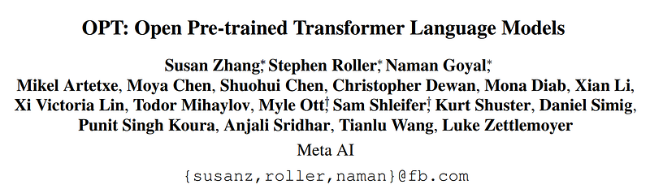 | Title card: OPT. |
| 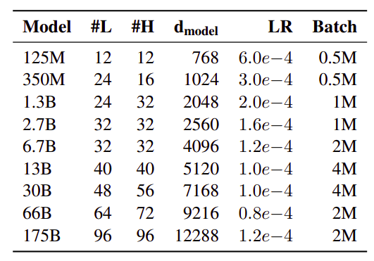 | Model architecture details. |
| 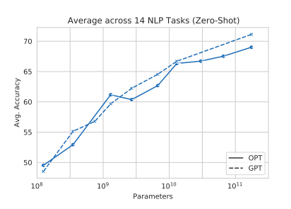 | Zero-shot NLP Evaluation Averages. Across a variety of tasks and model sizes. |
| 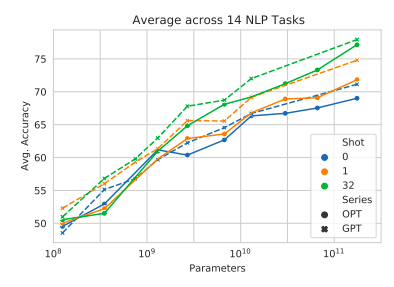 | Multi-shot performance. |
| 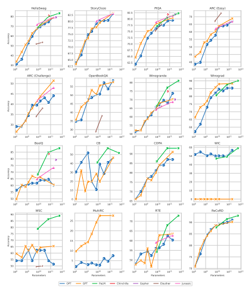 | Zero-shot NLP Evaluations. Full evaluations on all 16 NLP tasks, with comparisons where available. |
| 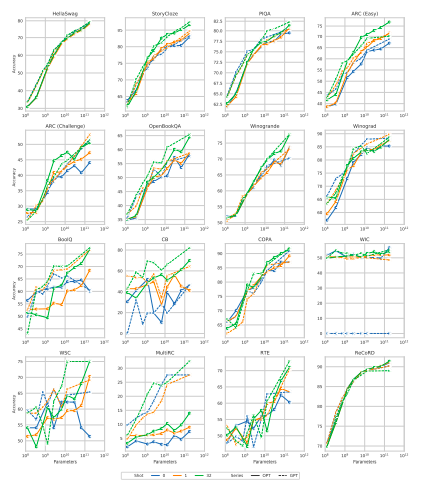 | Multishot-shot NLP Evaluations. Full evaluations on all 16 NLP tasks, with comparisons to the GPT-3 reported performance. |
| 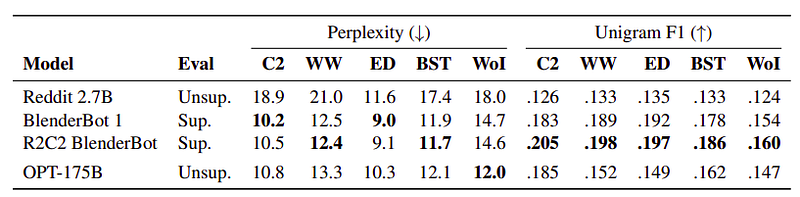 | Dialogue Evaluations. |
| 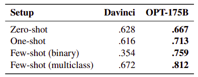 | Hate speech detection. F1 scores of detecting hate speech between Davinci and OPT-175B. |
| 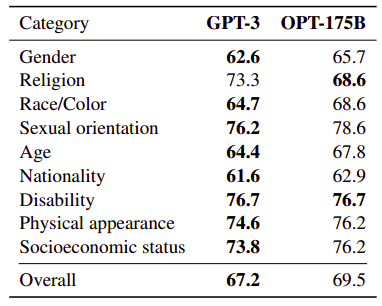 | CrowS-Pairs evaluation. Lower is better for all categories, indicating more fairness. |
| 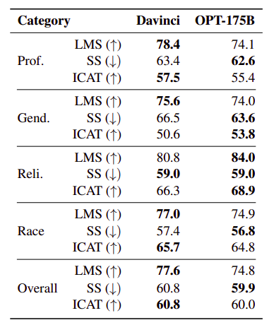 | StereoSet Evaluations. |
| 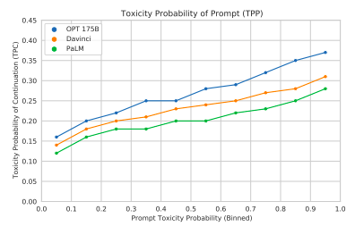 | RealToxicityPompts. |
| 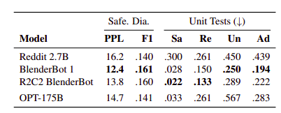 | Dialogue Responsible AI evaluations. |
## Related

- [[Papers Explained Corpus]]
- [[Large Language Models]]
- [[Embedding and Retrieval]]
- [[Papers Explained 50 - PaLM]]
- [[Papers Explained 52 - BLOOM]]

#summary #topic
