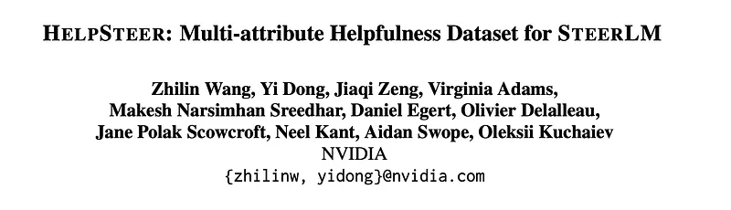
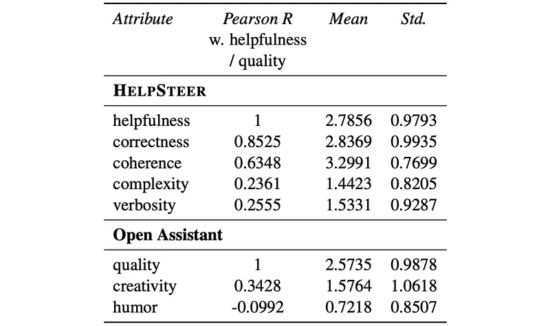
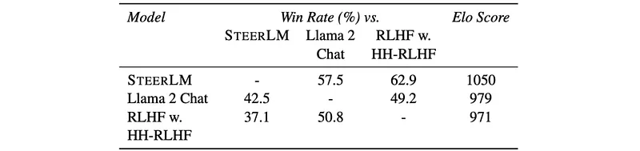

# Papers Explained 511 - HelpSteer

HelpSteer is a multi-attribute help-fulness dataset annotated for the various aspects that make responses helpful like correctness, coherence, complexity, and verbosity in addition to overall helpfulness of responses.

This page ingests the source article into the wiki and connects it to [[Papers Explained Corpus]], [[Synthetic Data]], [[Reinforcement Learning Topic]], [[Reinforcement Learning]].

## Source Metadata

- Source file: `raw/2025-12-29_Papers-Explained-511--HelpSteer-8653a643a462.md`
- Source title: Papers Explained 511: HelpSteer
- Published: 2025-12-29
- Canonical: [https://medium.com/@ritvik19/papers-explained-511-helpsteer-8653a643a462](https://medium.com/@ritvik19/papers-explained-511-helpsteer-8653a643a462)

## Key Ideas

- The dataset was created to address limitations encountered when using the Open Assistant dataset with the SteerLM technique.
- Prompt Selection: 10,459 single-turn prompts were collected, with half sourced from Scale AI and the other half generated synthetically.
- Response Generation: A 43 billion parameter in-house model generated four distinct responses for each prompt, within a maximum context length of 4,096 tokens.
- Annotation Process: Each response was rated on five attributes: Helpfulness, Correctness, Coherence, Complexity, and Verbosity, using a Likert-5 scale. Unlike RLHF annotations, each response was evaluated independently, making the process more scalable.
- Attribute Correlations: In HelpSteer, Correctness and Coherence strongly correlate with Helpfulness (Pearson’s R > 0.6), while Complexity and Verbosity exhibit a weaker correlation (Pearson’s R > 0.2).

## Notes

HelpSteer is a multi-attribute help-fulness dataset annotated for the various aspects that make responses helpful like correctness, coherence, complexity, and verbosity in addition to overall helpfulness of responses.

## Dataset

The dataset was created to address limitations encountered when using the Open Assistant dataset with the SteerLM technique. While Open Assistant responses were generally helpful, they sometimes exhibited issues like factual inaccuracies, incoherence, oversimplification, or excessive verbosity. Additionally, tasks requiring reference texts, such as Summarization, Rewrite, and Extraction, were underrepresented in Open Assistant, leading to suboptimal performance.

- Prompt Selection: 10,459 single-turn prompts were collected, with half sourced from Scale AI and the other half generated synthetically. Prompts covered various categories, including Open Question Answering, Generation, Brainstorming, and the underrepresented tasks mentioned above.

- Response Generation: A 43 billion parameter in-house model generated four distinct responses for each prompt, within a maximum context length of 4,096 tokens.

- Annotation Process: Each response was rated on five attributes: Helpfulness, Correctness, Coherence, Complexity, and Verbosity, using a Likert-5 scale. Unlike RLHF annotations, each response was evaluated independently, making the process more scalable. Approximately 200 U.S.-based human annotators participated, undergoing rigorous training and quality assurance procedures.

*Figure: Descriptive statistics for helpfulness-relevant attributes in HelpSteer and Open Assistant.*

- Attribute Correlations: In HelpSteer, Correctness and Coherence strongly correlate with Helpfulness (Pearson’s R > 0.6), while Complexity and Verbosity exhibit a weaker correlation (Pearson’s R > 0.2). This suggests that accuracy and clarity are crucial for perceived helpfulness.

- Attribute Distribution: HelpSteer responses generally exhibit high Coherence (average 3.30), moderate Correctness (average 2.84), and are relatively low in Complexity (average 1.44) and Verbosity (average 1.53), resulting in moderately helpful responses (average 2.78).

- Regression Analysis: An OLS regression analysis revealed significant contributions of all four attributes to overall Helpfulness (p < 0.05), collectively accounting for 73.0% of the variance in helpfulness.

## Experiments

### Automatic Evaluation

- Helpfulness: MT Bench is used, consisting of 80 multi-turn questions across diverse categories. Responses are evaluated by GPT-4, and a higher MT Bench score indicates greater helpfulness.

- Correctness: TruthfulQA (Lin et al., 2022) is used to evaluate factuality. TruthfulQA MC2 represents the normalized probability assigned to true answers out of 4–5 options per question. A higher score indicates greater factual correctness.

- Coherence: Base Language Model Perplexity is used, calculated using the Llama 2 13B Foundation model perplexity. Lower perplexity implies higher coherence.

- Complexity: Flesch-Kincaid Grade Level (FGKL) is used as a metric for text complexity. Higher FGKL means higher text complexity.

- Verbosity: The mean number of characters in MT Bench responses is used as a measure for verbosity.

### Human Evaluation:

- 12 volunteers with computer science backgrounds evaluated the quality of model responses to 80 open-ended prompts from MT Bench.

- Annotators ranked model responses in order of helpfulness.

- Win rates and Elo scores are calculated to compare model performance.

### Models

Llama 2 Foundation models are used: 70B variant for the main language model and 13B variant for the Attribute Prediction Model and Reward Model in SteerLM and RLHF baselines.

SteerLM is a model alignment method that uses four key steps:

- Attribute Prediction Model: Predicts scores for semantic attributes capturing dimensions of response helpfulness.

- Dataset Annotation: Prompt-response pairs are annotated with attributes using the Attribute Prediction Model.

- Attribute-Conditioned Supervised Fine-Tuning (AC-SFT): Foundation model is trained on annotated datasets to generate responses conditioned on specified attribute values.

- Bootstrapping: Additional training data is generated by sampling the AC-SFT model to obtain diverse, high-quality responses.

Modifications made in this study:

- Only the Open Assistant (OASST) dataset is used for AC-SFT training.

- Attribute labels are scaled to a 0–4 range.

- Bootstrapping step is excluded.

- A regression model is used for attribute prediction instead of a language model.

### Baseline Models

- SFT: Model trained using only Open Assistant prompts and responses, identical to SteerLM minus the attribute labels.

- RLHF on Open Source Dataset: Starting from the SFT model, RLHF is conducted on HH-RLHF dataset.

- DPO on Open Source Datasets: Direct Preference Optimization is implemented using both HH-RLHF and Open Assistant datasets.

- Llama 2 70B Chat: A popular RLHF model trained with closed-source data.

## Results

*Figure: Automatic evaluation of SteerLM against baseline models.*

- SteerLM is most helpful among comparable models (MT Bench)

- Strong truthfulness, coherence, and complexity support SteerLM’s gains

- SteerLM’s responses have a mean length of 1192.7 characters, providing sufficient detail.

*Figure: Human Evaluation.*

- In pairwise comparisons, SteerLM achieves:

- 57.5% win rate vs. Llama 2 Chat

- 62.9% win rate vs. RLHF w. HH-RLHF baseline

- SteerLM obtains the highest Elo rating (1050), compared to 979 (Llama 2 Chat) and 971 (RLHF w. HH-RLHF).

## Paper

HelpSteer: Multi-attribute Helpfulness Dataset for SteerLM [2311.09528](https://arxiv.org/abs/2311.09528)

## Figures

Figures from the Medium HTML export (`raw/2025-12-29_Papers-Explained-511--HelpSteer-8653a643a462.md`); local copies under `wiki/assets/papers-explained-511-helpsteer/` when download succeeded.

| Figure | Caption |
|--------|---------|
|  | Title card: HelpSteer. |
|  | Descriptive statistics for helpfulness-relevant attributes in HelpSteer and Open Assistant. |
|  | Automatic evaluation of SteerLM against baseline models. |
|  | Human Evaluation. |
## Related

- [[Papers Explained Corpus]]
- [[Synthetic Data]]
- [[Reinforcement Learning Topic]]
- [[Reinforcement Learning]]
- [[Papers Explained 510 - OEIS Sequence Benchmark]]
- [[Papers Explained 512 - HelpSteer2]]

#summary #topic
