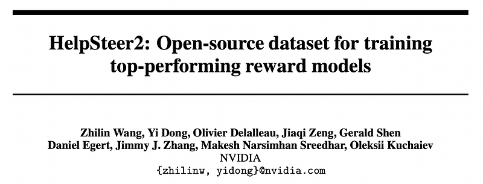
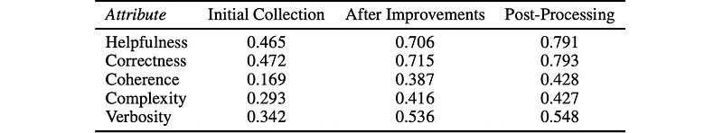
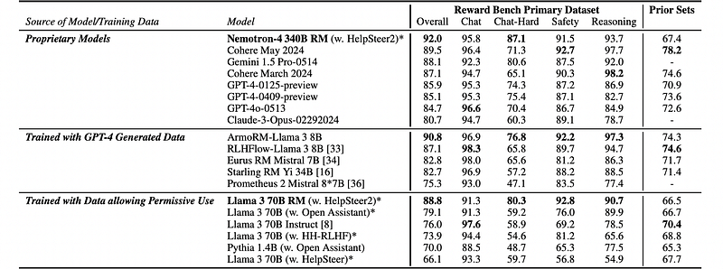
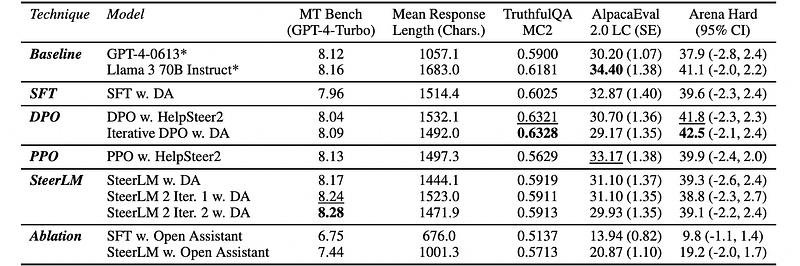

# Papers Explained 512 - HelpSteer2

HelpSteer2 is an open-source helpfulness preference dataset of about 10k response pairs, designed for training reward models that align LLMs with human preferences, despite being an order of magnitude smaller than older datasets like HH-RLHF.

This page ingests the source article into the wiki and connects it to [[Papers Explained Corpus]], [[Reinforcement Learning Topic]], [[Synthetic Data]], [[Large Language Models]], [[Code Models]], [[Reasoning Models]], [[Reinforcement Learning]].

## Source Metadata

- Source file: `raw/2025-12-30_Papers-Explained-512--HelpSteer2-041ceb1b6749.html`
- Source title: Papers Explained 512: HelpSteer2
- Published: 2025-12-30
- Canonical: [https://medium.com/@ritvik19/papers-explained-512-helpsteer2-041ceb1b6749](https://medium.com/@ritvik19/papers-explained-512-helpsteer2-041ceb1b6749)

## Key Ideas

- The dataset was primarily sourced from ShareGPT, a platform where ChatGPT users share conversations. A smaller proportion of prompts come from proprietary sources focusing on summarization, closed question answering, and extraction.
- Removed non-English prompts and those containing programming code snippets.
- Clustered similar prompts into topics and sampled uniformly from each cluster.
- Assessed prompt complexity using Nemotron-2–43B and sampled across complexity levels.
- Approximately 29% of the dataset included multi-turn prompts, with Assistant responses generated by a 22B in-house model trained on Open Assistant and HH-RLHF conversations.

## Notes

HelpSteer2 is an open-source helpfulness preference dataset of about 10k response pairs, designed for training reward models that align LLMs with human preferences, despite being an order of magnitude smaller than older datasets like HH-RLHF.

## Dataset

The dataset was primarily sourced from ShareGPT, a platform where ChatGPT users share conversations. A smaller proportion of prompts come from proprietary sources focusing on summarization, closed question answering, and extraction.

Filtering:

- Removed non-English prompts and those containing programming code snippets.

- Clustered similar prompts into topics and sampled uniformly from each cluster.

- Assessed prompt complexity using Nemotron-2–43B and sampled across complexity levels.

Approximately 29% of the dataset included multi-turn prompts, with Assistant responses generated by a 22B in-house model trained on Open Assistant and HH-RLHF conversations.

Two responses per prompt generated from:

- Internal LLMs from three generations (Nemotron-2, Nemotron-3, Nemotron-4).

- Mixtral-8x7B-Instruct-v0.1.

- Human annotators from Scale AI.

Diverse response styles achieved through SteerLM’s controllable generation capabilities.

Five attributes were annotated (helpfulness, correctness, coherence, complexity, verbosity) on a Likert-5 scale. At least three annotators per response annotated the data, with additional annotators for high disagreement. Quality assurance involved multiple human reviews and automated checks. Samples with high disagreement or unsafe content were removed. The final dataset contains 21,362 high-quality annotated samples.

*Figure: Inter-annotator Agreement (quadratic weighted Cohen’s κ) for HelpSteer2 attributes.*

## Reward Model

Reward models consist of a base model and a linear layer that converts the final layer representation of the end-of-response token into five scalar values, each corresponding to a HelpSteer2 attribute. The reward models are trained on top of the open-source Llama 3 70B base model and an in-house Nemotron-4 340B base model. For each model, training occurs for two epochs using HelpSteer2 data. The top checkpoints with the lowest validation loss are selected for evaluation. Training utilizes a MSE loss function and a constant learning rate on each model. For comparison, a Llama 3 70B base model is also trained separately using 1 epoch of HH-RLHF; 1 epoch of Open Assistant or 2 epochs of HelpSteer (to approximately match for difference in dataset size) using the same hyper-parameters.

*Figure: Performance of Models on Reward Bench.*

- Llama 3 70B RM trained on HelpSteer2 achieves 88.8% overall on Reward Bench, outperforming all other models trained on permissively usable data by >9.7%, including the same base model trained on Open Assistant, HH-RLHF, or HelpSteer.

- Nemotron-4 340B RM trained on the same HelpSteer2 dataset achieves 92.0% overall, topping the Reward Bench primary leaderboard among proprietary and permissive-use models.

- Implication: As base models become more capable, training them with HelpSteer2 yields increasingly powerful reward models.

## Aligned Models

Three approaches for using the Llama 3 70B Reward Model to align LLMs are demonstrated:

### SFT

Following HelpSteer, a Llama 3 70B Base model is trained using only Open Assistant with 56k conversations for close to 4 epochs using a constant learning rate. A SFT model trained with only Open Assistant is weak compared to the Llama 3 70B Instruct, likely due to the inconsistent quality of the responses it contains. Another model is trained using an SFT dataset (named ‘Daring Anteater’) consisting of 100k conversations, each averaging 2.88 model turns. Approximately 93% of the data are synthetically generated while the rest comes from ARB, SciBench, tigerbot-leetcode, PRM800K, FinQA, and wikitablequestions. This model is trained close to 2 epochs. All models on DPO and PPO are trained starting from this model.

### DPO

The HelpSteer2 train set was converted into a preference dataset by taking the response with the higher helpfulness score as the chosen response, with the remaining response being the rejected response. Pairs with identical helpfulness scores were discarded. This became the HelpSteer2 DPO dataset, which contains 7,221 training samples. DPO training was then performed on this data for 7 epochs using a constant LR.

Iterative DPO was performed on this model by utilizing 20k prompts from the Daring Anteater SFT dataset and generating 10 responses per prompt (temperature=0.7, top-p=0.9). These responses were then scored by the Llama 3 70B Reward Model and a pairwise preference dataset generated by taking the highest and lowest goodness score for the chosen and rejected, respectively. The goodness score is a scalar based on 0.65*helpfulness + 0.8*correctness + 0.45*coherence, which is found to give best differentiation between chosen and rejected responses in RewardBench prompts. DPO training was then performed on this data for 3 epochs.

### PPO

PPO was performed using HelpSteer2 prompts as well as the Llama 3 70B Reward Model. The reward was calculated using goodness score, followed by taking away the mean of the HelpSteer2 responses and dividing it by its standard deviation.

### SteerLM

SteerLM aligns language models by steering them towards generating outputs with desired attribute values by conditioning on various attributes during training. The Llama 3 70B Reward Model was used to annotate the Daring Anteater SFT dataset, followed by attribute-conditioned supervised fine-tuning of a language model on the annotated dataset to generate responses conditioned on target attribute scores. However, the original SteerLM method does not explicitly enforce the generated responses to follow the desired attribute distribution conditioned on during training. SteerLM 2.0 is proposed, which iteratively trains the model to approximate the optimal SteerLM policy constructed by the reward model. This is achieved using the original SteerLM trained model to generate multiple sampled responses and then using a KL divergence loss between current policy and optimal SteerLM policy to guide the model towards generating a response that is more reflective of the desired attribute values. SteerLM 2.0 can be conducted in iterations (n=2) using the optimized policy after each iteration to sample responses and train an improved policy. In each iteration, multiple diverse responses (n=10, temperature=0.7, top-p=0.9) are sampled from 20,000 different prompts from the Daring Anteater SFT dataset. SteerLM 2.0 is trained for 2 epochs.

### Evaluation

*Figure: Evaluation of Aligned Models.*

Overall performance vs. baselines

- At least one model trained with the Llama 3 70B Reward Model matches or exceeds Llama 3 70B Instruct on each metric (within standard error), despite using only ~10k preference pairs and 100k SFT samples (~1% of Llama 3 70B Instruct’s 10M alignment samples).

- The aligned models also exceed GPT‑4‑0613 across all reported metrics, indicating that a transparent, data‑efficient alignment pipeline can reach or surpass a prior frontier model.

DPO and Iterative DPO

- DPO models are strongest on TruthfulQA MC2 and Arena Hard, indicating improved correctness and performance on knowledge‑intensive coding tasks.

- Most of this gain comes from DPO on HelpSteer2; Iterative DPO provides an additional boost.

PPO

- PPO models achieve the best performance on AlpacaEval 2.0 Length‑Controlled, indicating strong control over response style (detailed but not overly verbose) for simple, single‑requirement prompts.

- However, PPO shows severe degradation on TruthfulQA, likely because HelpSteer2 prompts contain few multiple‑choice questions, causing the policy to drift in a direction that harms MCQ performance.

## Paper

HelpSteer2: Open-source dataset for training top-performing reward models [2406.08673](https://arxiv.org/abs/2406.08673)

## Figures

Figures from the Medium HTML export (`raw/2025-12-30_Papers-Explained-512--HelpSteer2-041ceb1b6749.html`); local copies under `wiki/assets/papers-explained-512-helpsteer2/` when download succeeded.

| Figure | Caption |
|--------|---------|
|  | Title card: HelpSteer2. |
|  | Inter-annotator Agreement (quadratic weighted Cohen’s κ) for HelpSteer2 attributes. |
|  | Performance of Models on Reward Bench. |
|  | Evaluation of Aligned Models. |
## Related

- [[Papers Explained Corpus]]
- [[Reinforcement Learning Topic]]
- [[Synthetic Data]]
- [[Large Language Models]]
- [[Code Models]]
- [[Reasoning Models]]
- [[Reinforcement Learning]]
- [[Papers Explained 511 - HelpSteer]]
- [[Papers Explained 513 - Help Steer 2 Preference]]

#summary #topic
