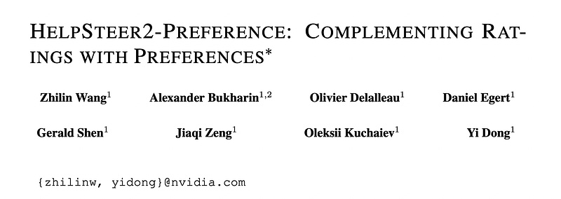
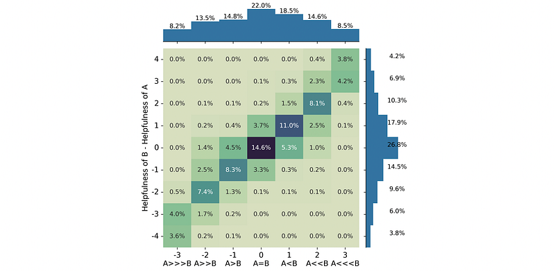
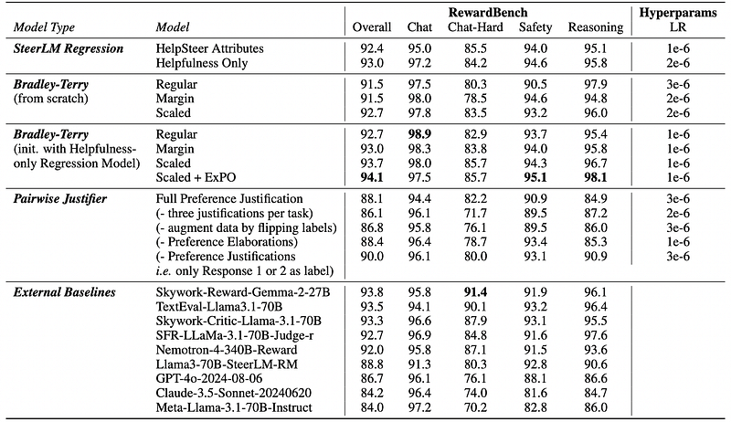
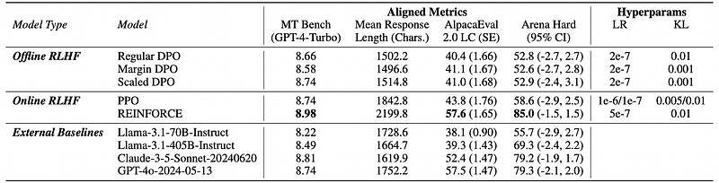

# Papers Explained 513 - Help Steer 2 Preference

For each task, annotators are provided a prompt and two responses. They first annotate each response on a Likert-5 scale along several dimensions (helpfulness, correctness and coherence, complexity and verbosity).

This page ingests the source article into the wiki and connects it to [[Papers Explained Corpus]], [[Reinforcement Learning Topic]].

## Source Metadata

- Source file: `raw/2025-12-31_Papers-Explained-513--Help-Steer-2-Preference-9e95fd369850.html`
- Source title: Papers Explained 513: Help Steer 2 Preference
- Published: 2025-12-31
- Canonical: [https://medium.com/@ritvik19/papers-explained-513-help-steer-2-preference-9e95fd369850](https://medium.com/@ritvik19/papers-explained-513-help-steer-2-preference-9e95fd369850)

## Key Ideas

- -3. Response 1 is much better than Response 2
- -2. Response 1 is better than Response 2
- -1. Response 1 is slightly better than Response 2
- 1. Response 2 is slightly better than Response 1
- 3. Response 2 is much better than Response 1

## Notes

There is a lack of evidence that either Bradley-Terry style or Regression style is better than the other, when adequately matched for data. This is primarily because these approaches require data collected in different (but incompatible) formats, meaning that adequately matched data is not available in existing public datasets. To tackle this problem, preference annotations (designed for Bradley-Terry training) are released to complement existing ratings (designed for Regression style training) in the HelpSteer2 dataset.

## Dataset

For each task, annotators are provided a prompt and two responses. They first annotate each response on a Likert-5 scale along several dimensions (helpfulness, correctness and coherence, complexity and verbosity). Then, they choose between 7 preference options, each associated with a preference score as well as a justification for their preference:

- -3. Response 1 is much better than Response 2

- -2. Response 1 is better than Response 2

- -1. Response 1 is slightly better than Response 2

- 1. Response 2 is slightly better than Response 1

- 2. Response 2 is better than Response 1

- 3. Response 2 is much better than Response 1

- -100. Neither response is valid

To minimize the impact of outliers, the three most similar preference annotations per task were identified, their mean was calculated, and rounded to the nearest integer. Tasks with a preference spread of more than two among the three most similar annotations were excluded. Samples with an overall preference of zero were also excluded, as they indicated low-confidence preferences.

*Figure: Distribution of preferences between responses in HelpSteer2-Preference against the difference in helpfulness scores between them from HelpSteer2.*

- The distribution of preferences is centered around zero, with a slight bias towards preferring Response 2.

- This bias is similar in extent to the difference in helpfulness scores between the responses in the original HelpSteer2 dataset.

- The distribution of preferences is highly correlated with the difference in helpfulness scores (Pearson’s R = 0.9024).

- Slight preferences are most commonly associated with a difference in helpfulness scores of one, while strong preferences are frequently associated with a difference of three or four.

## Reward Models

SteerLM Regression

SteerLM Regression Reward Models are trained, consisting of a base model and a linear layer projecting the final layer dense representation of the end-of-response token into five scalars, one for each HelpSteer2 attribute. Such models are optimized using a MSE loss function, which seeks to minimize the squared error between the predicted attribute value and the ground truth attribute value. In addition, a separate model is trained only on the Helpfulness attribute.

Bradley-Terry

Bradley-Terry style Reward Models are trained, consisting of a base model and a linear layer projecting the final layer dense representation of the end-of-response token into a scalar reward. Models are trained to maximize the directional distance between the reward for the chosen response (yc) and the rejected response (yr).

Given that HelpSteer2-Preference contains not only the direction of preference between two responses but the magnitude (m) of this preference (1 — slightly better, 2 — better, 3 — much better), experiments are conducted with a Bradley-Terry with Margin loss.

A new loss function named Scaled Bradley-Terry is introduced. Similar to Margin BT, its motivation lies in utilizing the preference magnitude information. However, the margin term is used outside of the log-sigmoid function rather than inside.

Finally, BT models are also trained initialized on the Helpfulness-Only SteerLM Regression Model. The Regression model is trained to predict helpfulness between 0 and 4, which can potentially initialize the model better than the base model, which otherwise has high loss at the start of training.

Pairwise Justifier

To explore training reward models using preference justifications rather than preference scores, Pairwise Justifier reward models are trained. In these settings, the LLM is prompted to generate a detailed comparison of the two responses before finally generating a statement such as “Response 1 is better than Response 2”. To train such models, preference justification is sought to be generated conditioned on {prompt} @Response 1:\n{response_1}\n@Response 2:\n{response_2}\nBetween @Response 1 and @Response 2, which is better?. This model is then optimized using a Cross-Entropy loss. In this setting, the preference justification is formatted by concatenating preference elaboration followed by a preference statement, which is always in the format @Response 1/2 … better.

### Training

In experiments, Llama-3.1–70B-Instruct is used as the base model. Initial exploration of training reward models showed that Llama-3.1–70B-Instruct performs better as an initial model than Llama-3.1–70B, Nemotron 4 340B, and Llama-3–70B.

### Results

*Figure: Performance of Models on RewardBench.*

Helpfulness-only SteerLM Regression is strong and simpler

- Training SteerLM Regression on only the “helpfulness” attribute slightly outperforms training on all five HelpSteer attributes on RewardBench overall (93.0 vs 92.4), while simplifying training and inference and avoiding conflicts between multiple objectives.

- This single-attribute setup yields a scalar reward directly, without needing a weighted combination of multiple attribute scores.

Scaled Bradley–Terry best among BT variants

- Scaled Bradley–Terry (BT) substantially outperforms Regular and Margin BT on RewardBench overall (92.7 vs 91.5), likely because it best leverages preference magnitude information.

SteerLM Regression vs Bradley–Terry: similar top accuracy

- The best SteerLM Regression (Helpfulness-only) and the best BT variant (Scaled BT) achieve very similar RewardBench overall scores (93.0 vs 92.7), indicating that data format and training objective matter less than correctly modeling the information in annotations (e.g., preference strength).

Combining SteerLM Regression and Scaled BT + ExPO yields the best model

- Initializing Scaled BT from the Helpfulness-only SteerLM Regression model improves RewardBench overall to 93.7, suggesting complementary information between HelpSteer2 (regression) and HelpSteer2‑Preference (pairwise) datasets.

- Applying ExPO extrapolation between the weak (Helpfulness-only Regression) and strong (initialized Scaled BT) models further improves performance; the optimal extrapolation factor is 1.52, producing the best overall model (Scaled BT + ExPO).

- Regular and Margin BT do not improve over their initialization and are not further enhanced with ExPO.

Pairwise Justifier models underperform but are more interpretable

- Pairwise Justifier models (which choose the better of two responses and can generate explanations) achieve lower RewardBench overall scores (≤ 90.0) than SteerLM Regression and BT models.

- The task is harder because it implicitly requires scoring both responses and then comparing them.

- Strong external baselines using a similar pairwise-justification format (e.g., GPT‑4o‑2024‑08‑06, Meta‑Llama‑3.1‑70B‑Instruct) also score relatively low (86.7 and 84.0), consistent with this difficulty.

## Aligned Models

The Llama-3.1–70B-Instruct model is used to initialize the policy model for all experiments. Scaled BT + ExPO (94.1% RewardBench) serves as the reward model for PPO and REINFORCE.

Direct Preference Optimization (DPO)

Three variants of Bradley-Terry are transformed into corresponding DPO objectives: Regular DPO corresponds (BT), Margin DPO (BT with Margin Loss), and Scaled DPO (Scaled BT). Models are trained using the HelpSteer2-Preference dataset.

Proximal Policy Optimization (PPO)

The policy model is aligned via PPO. The value model is initialized with the reward model. It is useful to run 2 rounds on PPO, where the best checkpoint in round 1 is picked to initialize the policy/reference models for Round 2. The value model is always reinitialized with the reward model at each round.

REINFORCE

The policy model is aligned using REINFORCE. The KL-regularized reward is employed and the leave-one-out baseline is used, sampling four responses per training prompt.

### Results

*Figure: Performance of Aligned Models.*

- Most alignment algorithms (DPO variants, PPO, REINFORCE) outperform the base Llama-3.1–70B-Instruct on MT Bench and AlpacaEval 2.0 LC, showing the strength of the dataset and reward model.

- All three DPO variants consistently improve over the base model on MT Bench and AlpacaEval 2.0 LC.

- Scaled DPO performs best among DPO variants, indicating that explicitly modeling preference strength is beneficial.

- PPO and REINFORCE outperform all DPO variants on all three alignment metrics (MT Bench, AlpacaEval 2.0 LC, Arena Hard).

- This underscores the importance of online training with reward feedback compared to purely offline preference optimization.

- Both PPO and REINFORCE improve performance, but REINFORCE shows a clear advantage, especially in maximizing reward.

- The best aligned model (REINFORCE) achieves competitive performance with frontier models GPT-4o and Claude 3.5 Sonnet on MT Bench, AlpacaEval 2.0 LC, and Arena Hard.

- REINFORCE substantially increases response length, but the high length-controlled AlpacaEval 2.0 LC score suggests the extra tokens are meaningful rather than padding.

## Paper

HelpSteer2-Preference: Complementing Ratings with Preferences [2410.01257](https://arxiv.org/abs/2410.01257)

## Figures

Figures from the Medium HTML export (`raw/2025-12-31_Papers-Explained-513--Help-Steer-2-Preference-9e95fd369850.html`); local copies under `wiki/assets/papers-explained-513-help-steer-2-preference/` when download succeeded.

| Figure | Caption |
|--------|---------|
|  | Title card: Help Steer 2 Preference. |
|  | Distribution of preferences between responses in HelpSteer2-Preference against the difference in helpfulness scores between them from HelpSteer2. |
|  | Bradley-Terry. |
|  | Bradley-Terry: A new loss function named Scaled Bradley-Terry is introduced. |
|  | A new loss function named Scaled Bradley-Terry is introduced. |
|  | Performance of Models on RewardBench. |
|  | Performance of Aligned Models. |
## Related

- [[Papers Explained Corpus]]
- [[Reinforcement Learning Topic]]
- [[Papers Explained 512 - HelpSteer2]]
- [[Papers Explained 514 - HelpSteer 3]]

#summary #topic
