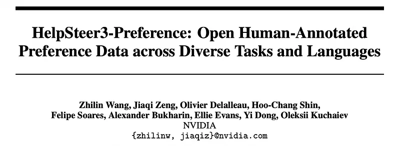
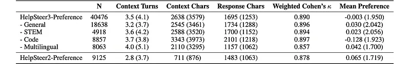
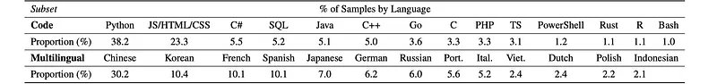
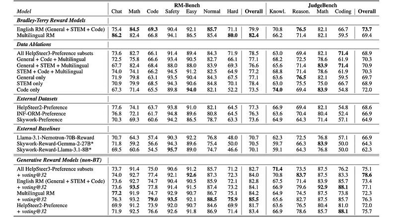
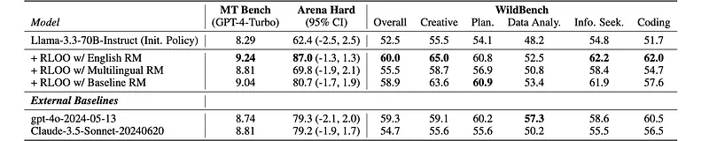

# Papers Explained 515 - Help Steer 3 Preference

HelpSteer3-Preference is a high-quality, human-annotated preference dataset comprising of over 40,000 samples spanning diverse tasks relating to STEM, coding and multilingual scenarios.

This page ingests the source article into the wiki and connects it to [[Papers Explained Corpus]], [[Reinforcement Learning Topic]], [[Synthetic Data]], [[Multilingual Models]], [[Code Models]].

## Source Metadata

- Source file: `raw/2026-01-02_Papers-Explained-515--Help-Steer-3-Preference-2ebd5725a525.md`
- Source title: Papers Explained 515: Help Steer 3 Preference
- Published: 2026-01-02
- Canonical: [https://medium.com/@ritvik19/papers-explained-515-help-steer-3-preference-2ebd5725a525](https://medium.com/@ritvik19/papers-explained-515-help-steer-3-preference-2ebd5725a525)

## Key Ideas

- Prompts and responses from the HelpSteer3 Feedback dataset are used. Following HelpSteer2-Preference, 3–5 independent annotators per sample were required.
- -3. Response 1 is much better than Response 2 (A>>>B)
- -2. Response 1 is better than Response 2 (A>>B)
- -1. Response 1 is slightly better than Response 2 (A>B)
- 1. Response 2 is slightly better than Response 1 (A<B)

## Notes

HelpSteer3-Preference is a high-quality, human-annotated preference dataset comprising of over 40,000 samples spanning diverse tasks relating to STEM, coding and multilingual scenarios.

## Dataset

Prompts and responses from the HelpSteer3 Feedback dataset are used. Following HelpSteer2-Preference, 3–5 independent annotators per sample were required. For each sample, annotators were asked to choose among the following options, alongside a brief justification of their choice within 1 to 2 sentences (i.e. in 10–50 English words).

- -3. Response 1 is much better than Response 2 (A>>>B)

- -2. Response 1 is better than Response 2 (A>>B)

- -1. Response 1 is slightly better than Response 2 (A>B)

- 1. Response 2 is slightly better than Response 1 (A<B)

- 2. Response 2 is better than Response 1 (A<<B)

- 3. Response 2 is much better than Response 1 (A<<<B)

- -100. Neither response is valid

*Figure: Descriptive Statistics for HelpSteer3-Preference compared with HelpSteer2-Preference.*

*Figure: Languages in Code and Multilingual subsets.*

- Size and Characteristics: HelpSteer3-Preference (40476 samples) is more than four times larger than HelpSteer2-Preference (9125 samples). It includes more context turns, characters, and longer responses, particularly in the Code subset.

- Language Coverage: The Code subset contains 14 programming languages, dominated by Python, while the Multilingual subset includes 13 natural languages, with Chinese being the most represented.

- Inter-Rater Reliability: High inter-rater reliability (weighted Cohen’s κ > 0.8) across all subsets, indicating strong agreement among annotators.

- Position Bias: Low mean preference within each subset, suggesting minimal position bias.

- Preference Distributions: General, STEM, and Code subsets show a bimodal distribution with peaks near -2 and +2, while the Multilingual subset exhibits a unimodal distribution with a peak near 0. This difference might be due to annotator training and prompt difficulty.

## Reward Models

Bradley-Terry/Conventional Reward Models were trained using the Scaled Bradley-Terry Loss. Reward Models were initialized from Llama-3.3–70B-Instruct and a feedforward layer that converts the hidden representation of the end-of-response token to a scalar reward. Reward models were also trained with strong baseline datasets including HelpSteer2-Preference, Skywork-Preference (v0.2) and INF-ORM-Preference.

Generative Reward Models have recently emerged as an alternative paradigm to Bradley-Terry models. These models first generate textual critiques of a response and then produce a score based on such critique. A similar reinforcement learning approach as DeepSeek-GRM is adopted. After unsuccessfully trying with Llama-3.3–70B-Instruct as an initial model, the generative RM approach requires models to think/reason before responding, hence Llama-3.3-Nemotron-Super-49B-v1, a related reasoning model, is used.

### Evaluation

RewardBench’s shortcomings:

- Biases: RewardBench contains artifacts that can unfairly influence model performance evaluation. Examples include:

- Using specific formatting for chosen and rejected responses (answers in boxes vs. after “# Answer”).

- Relying on GPT-4 to determine ground truth for some prompts, potentially favoring models trained on GPT-4 data.

- Performance Saturation: Top-performing models on RewardBench already exceed 95% accuracy, leaving little room for improvement and potentially leading to overfitting.

RM-Bench as a replacement:

- Similar Categories: RM-Bench covers the same categories as RewardBench (Chat, Safety, Math, Code).

- Increased Difficulty: Top-performing models on RM-Bench only achieve 70.1% overall accuracy and 56.1% for the harder subset, presenting a greater challenge.

- Bias Mitigation: RM-Bench avoids biases by:

- Using a single strong model (GPT-4o) to generate chosen responses and introducing targeted errors for rejected responses.

- Human verification of chosen and rejected responses for accuracy.

JudgeBench for evaluating judgment capabilities:

- Focus on Judgment: JudgeBench assesses models’ ability to differentiate correct and incorrect responses in various domains (General Knowledge, Logical Reasoning, Math, Coding).

- Relevance to Reward Models: Reward Models can be significantly more compute-efficient than LLMs for judgment tasks, making JudgeBench a valuable benchmark for evaluating their capabilities.

- Challenging Nature: Even top-performing Reward Models only achieve 64.3% accuracy on JudgeBench.

### Results

*Figure: Performance of Reward Models on RM-Bench and JudgeBench.*

- Two BT models stand out:

- Multilingual RM (trained on multilingual subset only): best RM-Bench overall accuracy 82.4%.

- English RM (trained on General + STEM + Code): best JudgeBench accuracy 73.7%, second-best RM-Bench overall 79.9%.

- Models trained on HelpSteer3-Preference outperform those trained on baseline datasets (HelpSteer2-Preference, INF-ORM-Preference, Skywork-Preference) by >5 percentage points on both RM-Bench and JudgeBench.

- A model trained only on the Code subset performs poorly on code sections.

- Hypothesized reason: benchmark code tasks (HumanEvalPack, LiveCodeBench) focus purely on correctness, whereas HelpSteer3 Code annotations emphasize real-world coding style (comments, readability, style) in addition to correctness.

- GenRMs show similar English vs Multilingual trends:

- Multilingual subset helps more on RM-Bench; English subsets help more on JudgeBench. When trained on all HelpSteer3-Preference subsets, GenRMs better integrate diverse subset characteristics and surpass BT RMs

## Aligned Models

The Llama-3.3–70B-Instruct model is aligned using the REINFORCE Leave One Out (RLOO) algorithm. This alignment is performed with the trained reward models and prompts from the training set for each reward model. The Reward Models used are: English RM, Multilingual RM, and the best-performing Baseline RM: Llama-3.1-Nemotron-70B-Reward. These Reward Models were chosen based on performance on RM-Bench and JudgeBench.

*Figure: Performance of Aligned Models.*

- All three RLOO-aligned models (with English, Multilingual, and Baseline RMs) outperform the unaligned Llama-3.3–70B-Instruct on MT Bench, Arena Hard, and WildBench.

- The RLOO-aligned model with English RM performs well compared to gpt-4o-2024–05–13 and Claude-3.5-Sonnet-20240620 on the reported benchmarks, indicating that HelpSteer3-Preference–trained RMs can produce competitive alignment.

## Paper

HelpSteer3-Preference: Open Human-Annotated Preference Data across Diverse Tasks and Languages [2505.11475](https://arxiv.org/abs/2505.11475)

## Figures

Figures from the Medium HTML export (`raw/2026-01-02_Papers-Explained-515--Help-Steer-3-Preference-2ebd5725a525.md`); local copies under `wiki/assets/papers-explained-515-help-steer-3-preference/` when download succeeded.

| Figure | Caption |
|--------|---------|
|  | Title card: Help Steer 3 Preference. |
|  | Descriptive Statistics for HelpSteer3-Preference compared with HelpSteer2-Preference. |
|  | Languages in Code and Multilingual subsets. |
|  | Performance of Reward Models on RM-Bench and JudgeBench. |
|  | Performance of Aligned Models. |
## Related

- [[Papers Explained Corpus]]
- [[Reinforcement Learning Topic]]
- [[Synthetic Data]]
- [[Multilingual Models]]
- [[Code Models]]
- [[Papers Explained 514 - HelpSteer 3]]
- [[Papers Explained 516 - SteerLM]]

#summary #topic
