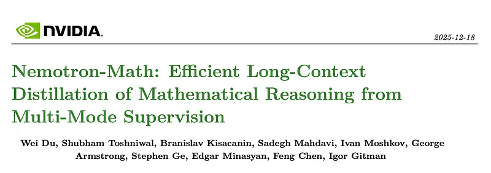
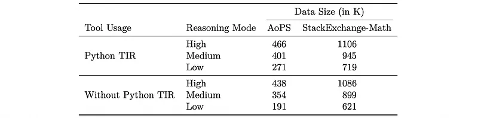
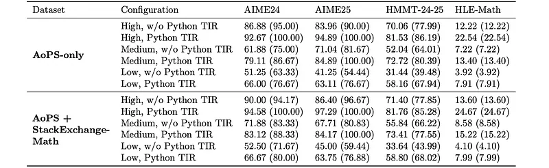
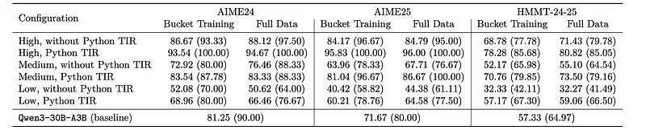
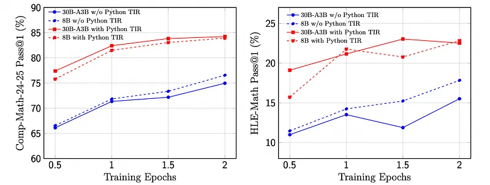

# Papers Explained 517 - Nemotron-Math

Nemotron-Math is a large-scale mathematical reasoning dataset containing 7.5M solution traces across high, medium, and low reasoning modes. Each mode is available both with and without Python tool-integrated reasoning (TIR), leveraging the multi-mode generation ability of gpt-oss-120b.

This page ingests the source article into the wiki and connects it to [[Papers Explained Corpus]], [[Reasoning Models]], [[Large Language Models]], [[Synthetic Data]], [[Agentic AI]], [[Reinforcement Learning Topic]], [[Verifier-Bounded Learning]].

## Source Metadata

- Source file: `raw/2026-01-06_Papers-Explained-517--Nemotron-Math-6a956874571a.md`
- Source title: Papers Explained 517: Nemotron-Math
- Published: 2026-01-06
- Canonical: [https://medium.com/@ritvik19/papers-explained-517-nemotron-math-6a956874571a](https://medium.com/@ritvik19/papers-explained-517-nemotron-math-6a956874571a)

## Key Ideas

- Nemotron-Math is a large-scale mathematical reasoning dataset containing 7.5M solution traces across high, medium, and low reasoning modes.
- The dataset is available on [HuggingFace](https://huggingface.co/datasets/nvidia/Nemotron-Math-v2).
- The problem set of Nemotron-Math is constructed from two complementary sources, designed to balance curated mathematical rigor with real-world diversity.
- The first source is adopted from the OpenMathReasoning dataset, which was constructed from problems collected on the AoPS community forum.
- The second component, StackExchange-MathSource, is constructed from Math Stack Exchange and MathOverflow.

## Notes

Nemotron-Math is a large-scale mathematical reasoning dataset containing 7.5M solution traces across high, medium, and low reasoning modes. Each mode is available both with and without Python tool-integrated reasoning (TIR), leveraging the multi-mode generation ability of gpt-oss-120b. The dataset integrates 85K curated AoPS problems with 262K community-sourced StackExchange-Math problems, combining structured competition tasks with diverse real-world mathematical queries.

The dataset is available on [HuggingFace](https://huggingface.co/datasets/nvidia/Nemotron-Math-v2).

## Nemotron-Math Overview

The problem set of Nemotron-Math is constructed from two complementary sources, designed to balance curated mathematical rigor with real-world diversity.

The first source is adopted from the OpenMathReasoning dataset, which was constructed from problems collected on the AoPS community forum. To ensure that the tasks in our dataset admit verifiable final answers, items whose primary objective is theorem proving are excluded. Only nontrivial, high-quality problems with checkable solutions are retained. The resulting subset contains approximately 175K questions.

The second component, StackExchange-MathSource, is constructed from Math Stack Exchange and MathOverflow. These platforms, similar to AoPS in being user-generated and partially overlapping in audience, tend to feature more college-level and research-oriented problems. The same pre-processing and filtering procedures as in OpenMathReasoning are applied. After all filtering and validation steps, the StackExchange-Math Source yields approximately 651K distinct mathematical problems.

Based on the prepared problem set, the gpt-oss-120b model generates solutions in three reasoning modes, high, medium, and low, under both Python TIR and without Python TIR settings, yielding six configurations in total. For each configuration, eight solutions are generated by varying random seeds with a temperature of 1.0 and top-p of 1.0. To ensure correctness, Qwen2.5–32B-Instruct is used as an LLM-as-a-judge, comparing the expected answers with the final answers extracted from the generated solutions.

16 high reasoning mode solutions (8 Python TIR and 8 without Python TIR) are generated using gpt-oss-120b. When a problem has no extracted answer from the forum, the majority vote among these model solutions is used. When an extracted answer is available, it is retained as long as at least one model solution is judged consistent with it; if all model solutions disagree, the extracted answer is replaced with the majority vote of the model-generated answers.

To further filter out trivial problems, the pass rate of each problem is computed using low-reasoning solutions (8 Python TIR and 8 without Python TIR attempts). Problems with a pass rate above 0.8 are removed.

After applying this filtering, the AoPS portion was reduced from 175K to 85K problems, and the StackExchange-Math portion from 651K to 262K. Finally, any generated solutions that fail to reach the expected answer are discarded.

*Figure: Distribution of the 7.5M generated solutions across tool usage and reasoning modes for the AoPS and StackExchange-Math problem sets.*

*Figure: Distribution of the 7.5M generated solutions by reasoning trace length bucket across AoPS and StackExchange-Math sources.*

## Experiment Setup

The models Qwen3–8B and Qwen3–30B-A3B are optimized with AdamW and a fixed learning rate of 2e-4, without warmup, and a global batch size of 2048. Sequence packing is applied to improve efficiency on long-context reasoning data.

Two complementary benchmark suites are used to evaluate the models:

- Comp-Math-24–25, which includes the HMMT-24–25, AIME24, and AIME25 subsets, covers competition-style mathematical reasoning problems emphasizing symbolic precision and multi-step deduction.

- Text-only Math subset of the recently released HLE (Humanity’s Last Exam) benchmark, a multi-domain evaluation suite featuring both text and multimodal problems.

The final fine-tuned checkpoint of each model is evaluated under six configurations: high, medium, and low reasoning modes, each in both with Python TIR and without Python TIR settings. For the benchmarks AIME24, AIME25, and HMMT-24–25, 16 solutions per problem are generated using temperature 1.0, top-p 1.0, and a maximum generation length of 120K tokens. For HLE-Math, the same decoding setup is used but 4 solutions per problem are generated, reflecting its much larger number of questions (976 in total).

For AIME24, AIME25, and HMMT-24–25, math-verify is used for automatic numeric/symbolic answer checking. For HLE-Math, an LLM-as-a-judge protocol (Qwen2.5–32B-Instruct) is used.

## Results

*Figure: Accuracy of Qwen3–30B-A3B fine-tuned with different datasets on three benchmarks.*

- Models trained on Nemotron-Math consistently outperform those trained on OpenMathReasoning across AIME24, AIME25, and HMMT-24–25.

- The Mixed dataset outperforms OpenMathReasoning but is still weaker than Nemotron-Math alone, implying Nemotron-Math’s reasoning traces are more effective for strengthening reasoning and problem-solving behavior.

*Figure: Accuracy comparison of AoPS-only and AoPS+StackExchange-Math subsets of Nemotron-Math.*

- On competition-style benchmarks (AIME24, AIME25, HMMT-24–25), AoPS+StackExchange-Math achieves accuracy comparable to or slightly higher than AoPS-only across all modes and tool settings, showing no degradation on olympiad-style tasks.

- On HLE-Math, AoPS+StackExchange-Math yields consistent accuracy gains in all configurations, indicating better robustness and generalization to community-style, open-domain math questions whose distribution matches StackExchange-Math more closely.

*Figure: Accuracy comparison between full-length joint training and sequential bucketed training on three benchmarks.*

- Sequential bucketed training yields a 2–3× reduction in end-to-end training cost while preserving nearly the same accuracy as full-length joint training; most configurations match or are within 1–3% of full-data results.

- Deeper reasoning modes consistently outperform shallower ones, and Python TIR models achieve the strongest results across benchmarks.

- Under high reasoning mode, fine-tuning with Nemotron-Math substantially improves over the base Qwen3–30B-A3B; e.g., AIME25 (without Python TIR) improves by 13.1% (71.67% → 84.79%).

- High reasoning + Python TIR reaches 100% maj@16 accuracy on both AIME24 and AIME25, demonstrating the combined benefit of deep reasoning supervision and tool use.

*Figure: Scaling with model size and architecture on Nemotron-Math.*

- Larger Qwen3–30B-A3B consistently outperforms Qwen3–8B on both competition-style (Comp-Math-24–25) and open-domain (HLE-Math) tasks, with similar qualitative trends across reasoning and tool settings.

- Python TIR further boosts performance for both model sizes, reinforcing the value of tool-augmented reasoning when combined with Nemotron-Math.

## Paper

Nemotron-Math: Efficient Long-Context Distillation of Mathematical Reasoning from Multi-Mode Supervision [2512.15489](https://arxiv.org/abs/2512.15489)

## Figures

Figures from the Medium HTML export (`raw/2026-01-06_Papers-Explained-517--Nemotron-Math-6a956874571a.md`); local copies under `wiki/assets/papers-explained-517-nemotron-math/` when download succeeded.

| Figure | Caption |
|--------|---------|
|  | Title card: Nemotron-Math. |
|  | Distribution of the 7.5M generated solutions across tool usage and reasoning modes for the AoPS and StackExchange-Math problem sets. |
|  | Distribution of the 7.5M generated solutions by reasoning trace length bucket across AoPS and StackExchange-Math sources. |
|  | Accuracy of Qwen3–30B-A3B fine-tuned with different datasets on three benchmarks. |
|  | Accuracy comparison of AoPS-only and AoPS+StackExchange-Math subsets of Nemotron-Math. |
|  | Accuracy comparison between full-length joint training and sequential bucketed training on three benchmarks. |
|  | Scaling with model size and architecture on Nemotron-Math. |
## Related

- [[Papers Explained Corpus]]
- [[Reasoning Models]]
- [[Large Language Models]]
- [[Synthetic Data]]
- [[Agentic AI]]
- [[Reinforcement Learning Topic]]
- [[Verifier-Bounded Learning]]
- [[Papers Explained 516 - SteerLM]]
- [[Papers Explained 518 - Nemotron Cascade]]

#summary #topic
