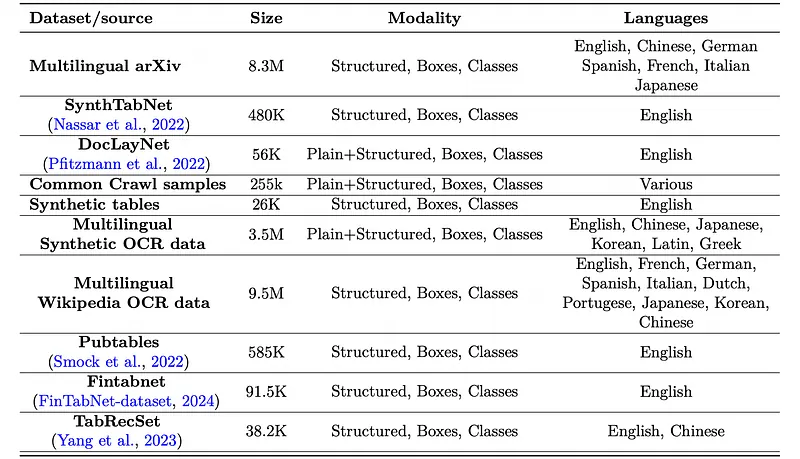
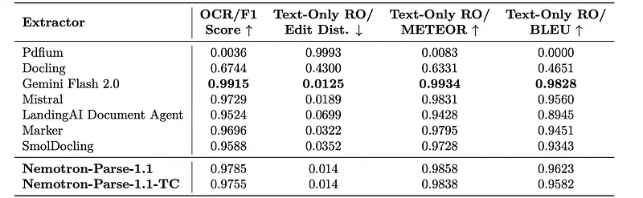
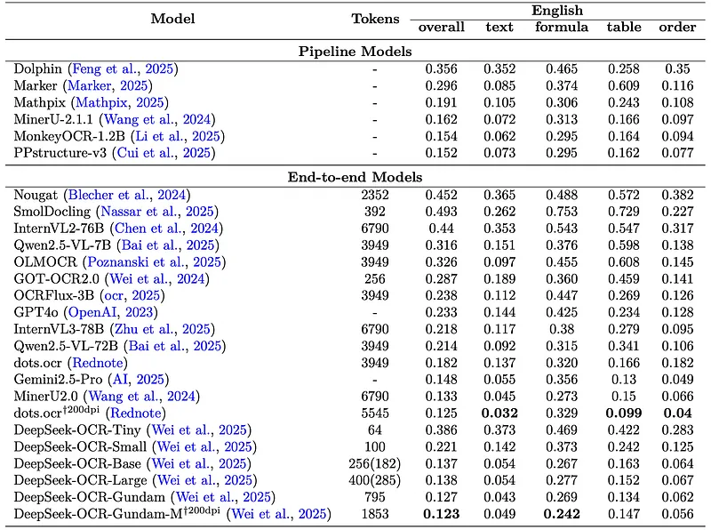
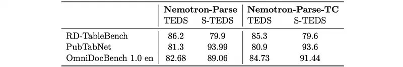
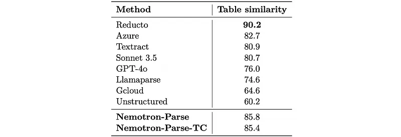

# Papers Explained 519 - Nemotron-Parse 1.1

The vision encoder, denoted as ℰ, is initialized from RADIO which follows a ViT-H/16 architecture (657M parameters), and maps an image I ∈R3×𝐻×𝑊 to a latent representation Z ∈R𝑁 ×𝑑, where 𝑑 is the hidden dimension and 𝑁 is the sequence length.

This page ingests the source article into the wiki and connects it to [[Papers Explained Corpus]], [[Large Language Models]], [[Embedding and Retrieval]], [[Document AI]], [[Computer Vision]], [[Synthetic Data]].

## Source Metadata

- Source file: `raw/2026-01-08_Papers-Explained-519--Nemotron-Parse-1-1-e94225fc944d.md`
- Source title: Papers Explained 519: Nemotron-Parse 1.1
- Published: 2026-01-08
- Canonical: [https://medium.com/@ritvik19/papers-explained-519-nemotron-parse-1-1-e94225fc944d](https://medium.com/@ritvik19/papers-explained-519-nemotron-parse-1-1-e94225fc944d)

## Key Ideas

- The vision neck 𝒩consisting of horizontal convolutional kernels of size 1 ×4 and stride 1 ×4 then reduces the dimensionality of the latent space as well as the sequence length. For an input image of 1648 ×2048 this reduces the sequence length to 3200.
- For Nemotron-Parse-TC, we additionally apply pixel-shuffle on top of the compressed sequence, further reducing the sequence length to 833 tokens, hence achieving a total of ×16 reduction.
- The decoder, denoted as 𝒟, uses mBART architecture reduced to 10 layers and with tied wights, and predicts text tokens T= {𝑡𝑃 +1, 𝑡𝑃 +2, . . .
- To enable large-context inference, the model is trained and evaluated without positional embeddings in the decoder.
- The decision to omit positional embeddings in the LLM decoder is motivated by the ability of decoder-only transformer architectures to implicitly encode position.

## Notes

Nemotron-Parse-1.1 is a lightweight document parsing and OCR model that advances the capabilities of its predecessor across general OCR, markdown formatting, structured table parsing, and text extraction from pictures, charts, and diagrams. It also supports a longer output sequence length for visually dense documents. The model extracts bounding boxes of text segments, as well as corresponding semantic classes. Nemotron-Parse-1.1 follows an encoder-decoder architecture with 885M parameters, including a compact 256M-parameter language decoder. Additionally Nemotron-Parse-1.1-TC operates on a reduced vision token length, offering a 20% speed improvement with minimal quality degradation.

## Model Architecture

The vision encoder, denoted as ℰ, is initialized from RADIO which follows a ViT-H/16 architecture (657M parameters), and maps an image I ∈R3×𝐻×𝑊 to a latent representation Z ∈R𝑁 ×𝑑, where 𝑑 is the hidden dimension and 𝑁 is the sequence length.

The vision neck 𝒩consisting of horizontal convolutional kernels of size 1 ×4 and stride 1 ×4 then reduces the dimensionality of the latent space as well as the sequence length. For an input image of 1648 ×2048 this reduces the sequence length to 3200. We additionally concatenate the summary token of RADIO to the sequence.

For Nemotron-Parse-TC, we additionally apply pixel-shuffle on top of the compressed sequence, further reducing the sequence length to 833 tokens, hence achieving a total of ×16 reduction.

The decoder, denoted as 𝒟, uses mBART architecture reduced to 10 layers and with tied wights, and predicts text tokens T= {𝑡𝑃 +1, 𝑡𝑃 +2, . . . , 𝑡𝐿}by conditioning on the latent encoder representation, 𝒩(Z), and the context 𝑡<𝑖, 𝑃 (𝑡𝑖|𝒩(Z), 𝑡<𝑖), where Z= ℰ(I) and {𝑡1, 𝑡2, . . . , 𝑡𝑃 }are the prompt tokens and where 𝐿 is the prompt-augmented sequence length. The model has 885M parameters in total.

### Positional embeddings

To enable large-context inference, the model is trained and evaluated without positional embeddings in the decoder. The network achieves comparable accuracy to models trained with positional embeddings, while allowing inference with significantly longer context lengths.

The decision to omit positional embeddings in the LLM decoder is motivated by the ability of decoder-only transformer architectures to implicitly encode position. The attention mask already provides positional cues: each token can only attend to preceding elements, which enables the model to infer its location in the sequence.

Without an extra 1D positional signal, the decoder avoids possible interference between sequence-based embeddings and the 2D spatial information already present in the visual features.

### Multi-token inference

The solution is repurposed from Nemotron-Parse for multi-token generation, predicting 𝑛 tokens simultaneously. During training, for predicting 𝑚 tokens, 𝑚−1 ×2 additional linear layers are added. A simple architecture is adopted, where given the context of size 𝑛, the logits for the 𝑛 + 1𝑠𝑡 token are obtained following the standard architecture from h𝑛, i.e., the final hidden state of the 𝑛𝑡ℎ token. For subsequent 𝑛 + 2..𝑚 tokens, these are obtained as lhead (l1 (hn + l2 (en+1))), where en+1 is the embedding of the 𝑛 + 1𝑡ℎ token predicted by the preceding head, l1 and l2 are Linear layers, and lhead refers to the decoder head. During training, teacher forcing is used for token embeddings of additional 𝑛 + 2..𝑚 tokens. At inference, decoding proceeds greedily without token verification.

## Prompts and Output Format

### Input prompts

The model is trained jointly on heterogeneous datasets that provide different supervision signals (plain or formatted text, bounding boxes, and semantic classes). To unify these sources, a fixed prompt interface is used and, for each training sample, the prompt that exactly matches the annotations available in its dataset is assigned. At the core are three independent prompt tokens that define the requested outputs, yielding the eight valid combinations used in training and inference:

Text formatting prompts

- <output_markdown>: text is formatted as Markdown, and formulas and Tables are formatted as LaTeX. Inline formulas that do not require any LaTeX syntax so be represented (e.g., consisting only of characters and subscripts/superscripts) remain in markdown format for versatility.

- <output_plain>: emit unformatted text; inline formulas are plain text.

- <output_no_text>: output no text.

Bounding Box prompts

- <predict_bbox>: return bounding boxes for detected elements.

- <no_bbox>: output no bounding boxes.

Class prompts

- <predict_classes>: return semantic class labels for each box. This option is used only together with <bbox>.

- <no_classes>: suppress class labels.

The inference process utilizes the Maximal-Information Prompt, which requests formatted text, bounding boxes, and semantic class labels: `<output_markdown> <predict_bbox> <predict_classes>`.

### Output format

In the maximal information setting the output is in the following format:

Where

- The first group denotes the coordinates of the top-left corner

- The second group denotes the text contained within the bounding box

- The third group denotes the coordinates of the bottom-right corner

- The final group represents the semantic class.

For example: <x_0.1152><y_0.2586># NVIDIA Nemotron-Parse 1.1<x_0.8799><y_0.2797> <class_Title>.

## Training Data

*Figure: Summary of the datasets used to train Nemotron-Parse.*

- NVpdftex: A large-scale ground-truth corpus generated using a custom pipeline based on the TEX Live toolchain. This pipeline captures accurate bounding boxes, semantic classes, and reading order during LaTeX compilation. The pipeline is open-sourced for community use.

- DocLayNet: A public dataset for layout analysis augmented with additional annotations for reading order, markdown formatting, and table/formula formatting.

- Common Crawl: Diverse data samples annotated with bounding boxes and semantic class labels. Further augmented with auto-labeled text inside images and markdown formatting.

- Synthetic Tables: Generated in HTML, converted to LaTeX, and rendered to images, covering various layouts, text formatting, and sparsity levels.

- Multilingual Dense OCR Data: Synthetically generated dense text in 6 languages to address model challenges with dense OCR.

- Multilingual Wikipedia OCR Data: Wikipedia text in multiple languages converted to LaTeX and augmented with font, background, and color variations.

- Public Table Extraction Datasets: Pubtables, Fintabnet, and TabRecSet are converted to LaTeX format and auto-labeled to align with Nemotron-Parse’s format.

Data Augmentation:

- Machine translation of NVpdftex dataset into 6 languages.

- LaTeX-level augmentations of fonts, color, and layout for NVpdftex.

## Evaluation

*Figure: OCR metrics on GOT benchmark.*

- Nemotron-Parse shows strong OCR performance on the GOT benchmark, being outperformed only by Gemini Flash 2.0 among compared systems.

*Figure: Accuracy of Nemotron-Parse on OmniDocBench.*

- Nemotron-Parse and Nemotron-Parse-TC achieve competitive overall accuracy on OmniDocBench, with particularly strong performance on tables and reading-order metrics.

- Nemotron-Parse-TC’s improved reading order leads to better overall OmniDocBench performance than base Nemotron-Parse, with only minor losses in other sub-categories.

- Markdown output causes some correct simple equations to be penalized in the “formula” metric because they are not wrapped in LaTeX math delimiters.

*Figure: TEDS and S-TEDS of Nemotron-Parse on public table extraction benchmarks.*

- Use TEDS and S-TEDS metrics on public table benchmarks (e.g., PubTabNet, OmniDocBench tables, RD-TableBench).

- Convert Nemotron-Parse’s LaTeX table predictions to HTML or Markdown when required by the benchmark.

*Figure: Table extraction accuracy on RD-TableBench benchmark.*

- Nemotron-Parse and Nemotron-Parse-TC show strong table extraction performance on OmniDocBench and other public table benchmarks, competitive with or better than similarly sized and even larger models.

- On RD-TableBench (diverse in-the-wild tables), Nemotron-Parse is competitive and is outperformed only by Reducto in table similarity.

*Figure: OCR results on multilingual NVpdftex dataset.*

- Nemotron-Parse achieves competitive multilingual OCR performance, with F1 > 0.96 for all evaluated languages and F1 ≈ 0.98 for English.

- Performs well on scientific and standard PDF documents in Chinese, Japanese, and Korean, but has limited support for in-the-wild images/documents in these languages.

## Paper

NVIDIA Nemotron Parse 1.1 [2511.20478](https://arxiv.org/abs/2511.20478)

## Figures

Figures from the Medium HTML export (`raw/2026-01-08_Papers-Explained-519--Nemotron-Parse-1-1-e94225fc944d.md`); local copies under `wiki/assets/papers-explained-519-nemotron-parse-1-1/` when download succeeded.

| Figure | Caption |
|--------|---------|
|  | Title card: Nemotron-Parse 1.1. |
|  | In the maximal information setting the output is in the following format. |
|  | Summary of the datasets used to train Nemotron-Parse. |
|  | OCR metrics on GOT benchmark. |
|  | Accuracy of Nemotron-Parse on OmniDocBench. |
|  | TEDS and S-TEDS of Nemotron-Parse on public table extraction benchmarks. |
|  | Table extraction accuracy on RD-TableBench benchmark. |
|  | OCR results on multilingual NVpdftex dataset. |
## Related

- [[Papers Explained Corpus]]
- [[Large Language Models]]
- [[Embedding and Retrieval]]
- [[Document AI]]
- [[Computer Vision]]
- [[Synthetic Data]]
- [[Papers Explained 518 - Nemotron Cascade]]
- [[Papers Explained 520 - Nemotron 3]]

#summary #topic
