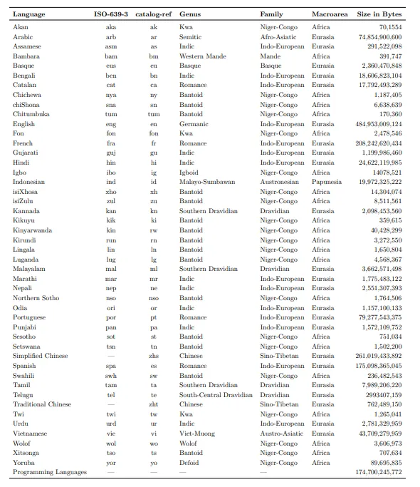
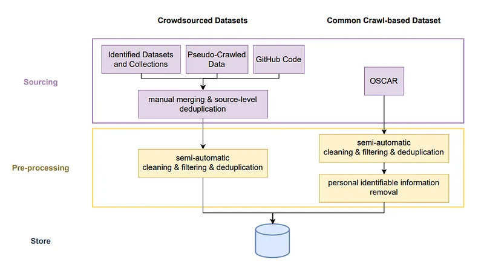
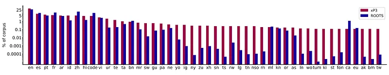
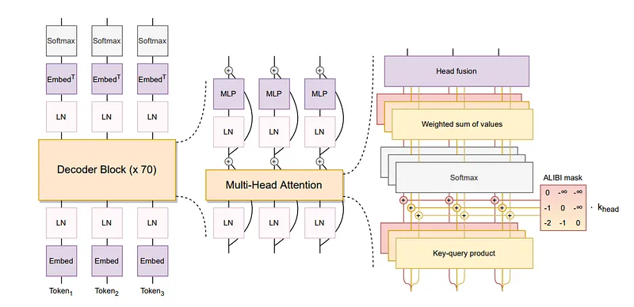
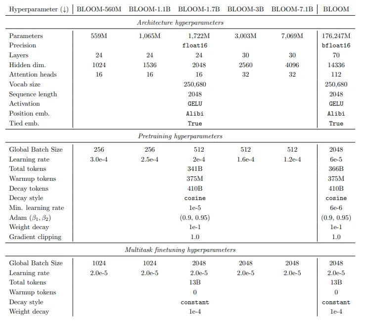
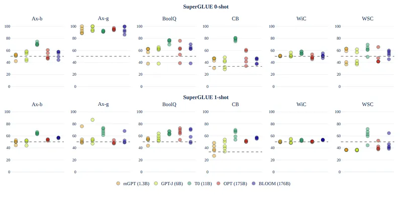
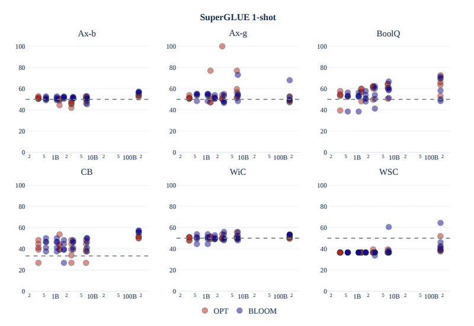

# Papers Explained 52 - BLOOM

BLOOM is a 176B-parameter open-access decoder-only transformer model, collaboratively developed by hundreds of researchers, aiming to democratize advanced LLM technology.

This page ingests the source article into the wiki and connects it to [[Papers Explained Corpus]], [[Large Language Models]], [[Reasoning Models]], [[Code Models]], [[Synthetic Data]], [[Document AI]], [[Supervised Fine-Tuning]].

## Source Metadata

- Source file: `raw/2023-08-20_Papers-Explained-52--BLOOM-9654c56cd2.md`
- Source title: Papers Explained 52: BLOOM
- Published: 2023-08-20
- Canonical: [https://medium.com/@ritvik19/papers-explained-52-bloom-9654c56cd2](https://medium.com/@ritvik19/papers-explained-52-bloom-9654c56cd2)

## Key Ideas

- BLOOM is trained on the ROOTS corpus, a composite collection of 498 Hugging Face datasets amounting to 1.61 terabytes of text that span 46 natural languages and 13 programming languages.
- The majority of the corpus was curated collaboratively by workshop participants and research collectives, resulting in the “BigScience Catalogue” containing 252 sources across various languages, with at least 21 sources per language category, supplemented by...
- The catalog was further complemented with a dataset of programming languages collected from the GitHub data collection on Google’s BigQuery, which was then deduplicated of exact matches.
- Obtaining the source data involves collecting text data from various text sources.
- The data sources included NLP datasets, PDF files, website entries, and Common Crawl WARC files.

## Notes

BLOOM is a 176B-parameter open-access decoder-only transformer model, collaboratively developed by hundreds of researchers, aiming to democratize advanced LLM technology. Trained on the ROOTS corpus encompassing diverse languages, BLOOM demonstrates strong performance across various benchmarks, especially after multitasking prompted finetuning.

## Training Dataset

BLOOM is trained on the ROOTS corpus, a composite collection of 498 Hugging Face datasets amounting to 1.61 terabytes of text that span 46 natural languages and 13 programming languages.

*Figure: Linguistic makeup of ROOTs corpus*

The majority of the corpus was curated collaboratively by workshop participants and research collectives, resulting in the “BigScience Catalogue” containing 252 sources across various languages, with at least 21 sources per language category, supplemented by locally relevant websites and a dataset of programming languages. OSCAR’s Common Crawl snapshot from February 2021 was also included, making up 38% of the corpus, to meet data volume requirements.

The catalog was further complemented with a dataset of programming languages collected from the GitHub data collection on Google’s BigQuery, which was then deduplicated of exact matches.

## Data Preprocessing

*Figure: Creation Pipeline of the ROOTS Corpus*

### Obtaining the Source Data

- Obtaining the source data involves collecting text data from various text sources.

- The data sources included NLP datasets, PDF files, website entries, and Common Crawl WARC files.

- Text was extracted and processed from question-answering, summarization, and dialogue datasets.

- PDF files from archives, such as the French repository of scientific articles, were scraped and processed.

- The text was extracted from 192 website entries from the catalog and 456 geographically diverse websites.

- New tools were developed to extract text from HTML in the Common Crawl WARC files.

- Usable text data was found and extracted from all URLs present in 539 of the websites.

### Quality Filtering

- Text obtained from various sources contained non-natural language elements such as preprocessing errors, SEO pages, and spam (including pornographic spam).

- Quality indicators were defined to filter out non-natural language and determine high-quality text.

- High-quality text is defined as “written by humans for humans,” without considering content or grammaticality.

- The indicators were tailored to the specific needs of each language by fluent speakers, adjusting parameters and supporting term lists.

- Each individual source was manually reviewed to identify which indicators were most effective in detecting non-natural language.

- Visualization tools were used to aid in the assessment of the indicators’ impact.

### Deduplication and Privacy Reduction

- Two deduplication steps were taken to remove near-duplicate documents.

- Personal Identifiable Information (PII), such as social security numbers, was identified from the OSCAR version of the corpus.

- The OSCAR version was considered the highest privacy risk source.

- Regex-based redaction was applied to the identified PII, even if there were some false positives.

## Prompted Datasets

*Figure: Language distribution of the prompted dataset xP3 closely follows ROOTS*

Multitask-prompted finetuning involves training a language model with a mixture of tasks using natural language prompts, as demonstrated by T0 (a part of BigScience), which showed strong zero-shot task performance after finetuning. T0 used prompts from the Public Pool of Prompts (P3), a collection of 2000+ prompts covering 170+ datasets across various tasks, excluding harmful content. An open-source toolkit called promptsource facilitated prompt creation. BLOOMZ, derived from BLOOM through multitask finetuning, gained multilingual zero-shot capabilities using xP3, an extended dataset covering 46 languages and 16 tasks, with both cross-lingual and monolingual prompts, including machine-translated ones (xP3mt) and added metadata.

## Model Architecture

*Figure: The BLOOM architecture. The khead slope parameters for ALIBI are taken as 2 ^(−8i/n) with n the number of heads and i ∈ 1, 2, …, n.*

Several modifications have been suggested for the original Transformer architecture, such as alternative positional embeddings and novel activation functions. Thus after a series of experiments to evaluate the benefit of each of these modifications, BLOOM adopts two architectural deviations:

ALiBi Positional Embeddings Instead of adding positional information to the embedding layer, ALiBi directly attenuates the attention scores based on how far away the keys and queries are. Although ALiBi was initially motivated by its ability to extrapolate to longer sequences, it also led to smoother training and better downstream performance even at the original sequence length — outperforming both learned and rotary embeddings.

Embedding LayerNorm In preliminary experiments training a 104B parameters model, adding an additional layer normalization immediately after the embedding layer significantly improved training stability. Even though it penalizes zero-shot generalization, BLOOM is trained with an embedding layer normalization.

### Tokenization

The design decisions when training a tokenizer are often neglected in favor of “default” settings. However, the diverse nature of BLOOM’s training data requires careful design choices to ensure that the tokenizer encodes sentences in a lossless manner.

Validation The tokenizer’s efficacy is validated by comparing its fertility to existing monolingual tokenizers, with high fertility potentially indicating downstream multilingual performance degradation.

Vocabulary Size A large vocabulary size mitigates over-segmentation risks, especially for low-resource languages. The chosen vocabulary size of 250,680 tokens also aligns with GPU efficiency and Tensor Parallelism requirements.

Byte-level BPE The tokenizer is a learned subword tokenizer trained using the Byte Pair Encoding (BPE) algorithm.

Normalization Unicode normalization, while not greatly affecting fertility (0.8%), compromises model generality, for example, causing ²² and 22 to be encoded in the same way.

Pre-tokenizer Pre-tokenization has two goals: producing a first division of the text (usually using whitespaces and punctuation) and restricting the maximum length of sequences of tokens produced by the BPE algorithm. The pre-tokenization rule used was the following regex:

which splits words apart while preserving all the characters and in particular the sequences of spaces and line breaks that are crucial for programming languages. English-centric splits common in other tokenizers (e.g. splitting around ’nt or ’ll) and on numbers and digits are avoided.

## Training

*Figure: BLOOM & BLOOMZ Training Hyperparameters*

### Pre Training

Six variants of BLOOM were trained using specific hyperparameters, determined through experimental results and prior research on large language models.

### MultiTask Fine Tuning

Finetuned BLOOMZ models retain BLOOM’s architecture and adjust hyperparameters, drawing inspiration from T0 and FLAN. Learning rates are calculated by doubling the minimum rate of the pretrained model and adjusting globally. Smaller variants use a fourfold increase in batch sizes for improved throughput during the finetuning of 13 billion tokens, with performance stabilization occurring between 1 to 6 billion tokens.

### Contrastive Fine Tuning

Contrastive finetuning using the SGPT Bi-Encoder recipe led to the development of two high-quality text embedding models: SGPT-BLOOM-7.1 Bmsmarco24 for multilingual information retrieval, and SGPT-BLOOM-1.7B-nli25 for multilingual semantic textual similarity (STS). Additionally, benchmarking demonstrated the versatility of these models for bitext mining, reranking, and feature extraction in downstream classification tasks.

## Evaluation

Evaluations focus on zero-shot and few-shot settings. The goal is to compare BLOOM to existing LLMs in realistic usage scenarios. Results reported on SuperGLUE, machine translation, summarization, code generation, and representation tasks.

Prompts were developed by humans prior to BLOOM’s release, without refinement using models. Designed to simulate realistic zero-shot or one-shot results for new users. Multiple prompts per task are generated using promptsource, with substantial variety in length and style. Peer reviews were conducted on each prompt to improve quality and consistency.

For brevity, this article will focus only on the SuperGLUE benchmark.

*Figure: Performance of various LLMs on a subset of tasks from SuperGLUE benchmark in zero- and one-shot prompt-based setting*

- Entailment tasks (BoolQ and CB) show consistent above-random-chance performance for certain models (BLOOM, T0, OPT, GPT-J).

- Average performance across prompts in other tasks is close to random chance, indicating that the success of individual prompts is primarily due to statistical variation.

- The T0 model stands out with strong performance, but it is not directly comparable to other models due to its unique finetuning.

- The transition from zero-shot to one-shot reduces variability across prompts and models, leading to a slight and inconsistent increase in performance.

*Figure: Comparison of the scaling of BLOOM versus OPT on each SuperGLUE one-shot task. Each point represents the average accuracy of a model within the BLOOM or OPT family of models on one of the five task prompts. The number of parameters on the x-axis is presented in log-scale.*

- BLOOM demonstrates greater performance improvement compared to other models (like OPT) when transitioning from a zero-shot to a one-shot setting.

- BLOOM, even with partial training in English, matches or surpasses OPT in a one-shot setting on specific tasks.

- Larger model sizes (over 2 billion parameters) show minimal improvement in performance for both OPT and BLOOM model families.

- Multilinguality does not hinder BLOOM’s performance on English-only tasks in the zero-shot setting, as demonstrated by its competitiveness with OPT-175B on various tasks.

### Paper

BLOOM: A 176B-Parameter Open-Access Multilingual Language Model [2211.05100](https://arxiv.org/abs/2211.05100)

## Figures

Figures from the Medium HTML export (`raw/2023-08-20_Papers-Explained-52--BLOOM-9654c56cd2.md`); local copies under `wiki/assets/papers-explained-52-bloom/` when download succeeded.

| Figure | Caption |
|--------|---------|
|  | Title card: BLOOM. |
|  | Linguistic makeup of ROOTs corpus. |
|  | Creation Pipeline of the ROOTS Corpus. |
|  | Language distribution of the prompted dataset xP3 closely follows ROOTS. |
|  | The BLOOM architecture. The khead slope parameters for ALIBI are taken as 2 ^(−8i/n) with n the number of heads and i ∈ 1, 2, …, n. |
|  | which splits words apart while preserving all the characters and in particular the sequences of spaces and line breaks that are crucial for... |
|  | BLOOM & BLOOMZ Training Hyperparameters. |
|  | Performance of various LLMs on a subset of tasks from SuperGLUE benchmark in zero- and one-shot prompt-based setting. |
|  | Comparison of the scaling of BLOOM versus OPT on each SuperGLUE one-shot task. Each point represents the average accuracy of a model within the BLOOM or OPT family of models on one of the five task prompts. The number of parameters on the x-axis is presented in log-scale. |
## Related

- [[Papers Explained Corpus]]
- [[Large Language Models]]
- [[Reasoning Models]]
- [[Code Models]]
- [[Synthetic Data]]
- [[Document AI]]
- [[Supervised Fine-Tuning]]
- [[Papers Explained 51 - OPT]]
- [[Papers Explained 53 - Galactica]]

#summary #topic
